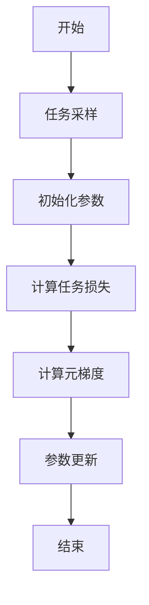
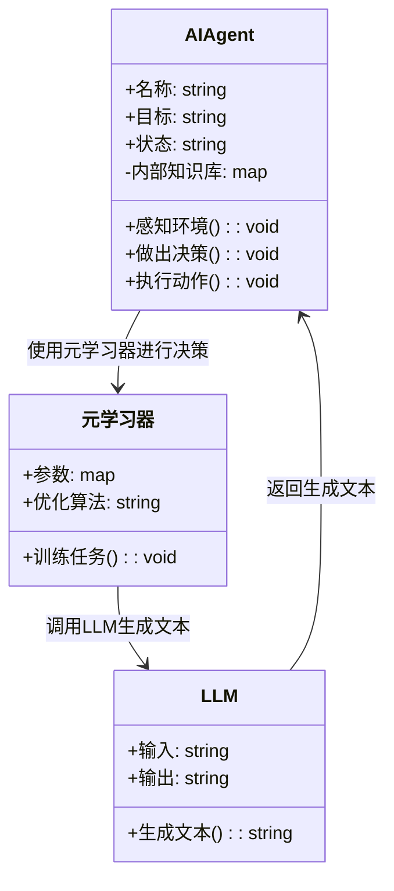
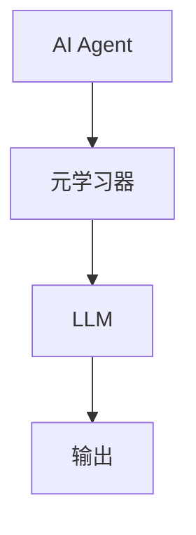

                 


# AI Agent的元学习能力：快速适应新任务的LLM框架

> 关键词：AI Agent，元学习，大语言模型，LLM，任务适应

> 摘要：本文探讨了AI Agent的元学习能力，特别是在大语言模型（LLM）框架中的应用。通过结合元学习和LLM，AI Agent能够快速适应新任务，提升其在自然语言处理和智能任务中的灵活性和效率。本文从理论到实践，详细介绍了元学习与LLM结合的数学模型、算法实现、系统设计以及实际案例，为读者提供全面的技术解析。

---

# 第1章: 元学习与AI Agent的结合

## 1.1 元学习的基本概念

### 1.1.1 元学习的定义与特点
元学习是一种通过学习“如何学习”的方法，其目标是使模型能够快速适应新任务，而无需从头开始训练。元学习的核心在于利用已有的经验，快速调整模型参数以适应新的任务。

- **定义**：元学习是一种高层次的学习策略，旨在通过学习多个任务，提取通用的知识和模式，从而在新任务中快速适应。
- **特点**：
  - 快速适应性：能够在少量数据或任务中快速调整模型。
  - 通用性：提取跨任务的通用特征，提升模型的泛化能力。
  - 高效性：通过元学习，可以显著减少模型在新任务上的训练时间。

### 1.1.2 元学习的核心原理
元学习的原理可以简单理解为“学习如何学习”。其核心在于通过元任务（meta-tasks）的训练，使模型能够快速适应新的任务。

- **元任务**：元任务是指一组用于训练元学习器的任务集合。这些任务具有相似的结构，但具体目标或数据可能不同。
- **元学习器**：元学习器是一种能够从多个任务中学习通用策略的模型，能够在新任务中快速调整参数以适应任务需求。

### 1.1.3 元学习与传统机器学习的对比

| 对比维度 | 传统机器学习 | 元学习 |
|----------|--------------|--------|
| 数据需求 | 需要大量数据 | 数据需求较少，依赖于任务多样性 |
| 适应性 | 适应单一任务 | 能够快速适应多个新任务 |
| 学习目标 | 学习具体任务 | 学习如何学习 |

---

## 1.2 AI Agent的基本概念

### 1.2.1 AI Agent的定义与分类
AI Agent（智能体）是一种能够感知环境并采取行动以实现目标的实体。根据智能体的复杂性和应用场景，可以将其分为多种类型。

- **定义**：AI Agent是一种能够感知环境、理解任务需求，并通过决策和行动来实现目标的智能实体。
- **分类**：
  - **简单反射型智能体**：基于当前感知做出反应，不考虑长期目标。
  - **基于模型的智能体**：具有内部状态，能够根据历史信息做出决策。
  - **目标驱动型智能体**：根据明确的目标采取行动。

### 1.2.2 AI Agent的核心能力
AI Agent的核心能力包括感知能力、决策能力、学习能力和执行能力。

- **感知能力**：通过传感器或其他输入方式获取环境信息。
- **决策能力**：基于感知信息和内部知识，做出最优决策。
- **学习能力**：通过学习算法提升自身的决策和执行能力。
- **执行能力**：将决策转化为具体的行动。

### 1.2.3 AI Agent的应用场景

| 应用场景 | 描述 |
|----------|------|
| 智能助手 | 如Siri、Alexa等，能够执行语音命令和信息查询。 |
| 自动驾驶 | 如自动驾驶汽车，能够感知环境并做出驾驶决策。 |
| 游戏AI | 如智能游戏角色，能够根据玩家行为调整策略。 |

---

## 1.3 元学习在AI Agent中的作用

### 1.3.1 元学习如何提升AI Agent的适应能力
通过元学习，AI Agent能够快速适应新任务，提升其灵活性和通用性。

- **快速适应**：元学习使AI Agent能够在新任务中快速调整参数，减少训练时间。
- **通用性**：元学习提取了跨任务的通用特征，使AI Agent能够在多种任务中表现良好。

### 1.3.2 元学习在AI Agent任务中的具体应用

| 应用场景 | 描述 |
|----------|------|
| 多任务学习 | AI Agent需要在多个任务中共享知识，提升整体性能。 |
| 预测与推理 | AI Agent通过元学习快速掌握新任务的预测规则。 |
| 动态环境适应 | AI Agent能够快速适应环境变化，保持高性能。 |

### 1.3.3 元学习与AI Agent的结合优势

| 优势 | 描述 |
|------|------|
| 快速部署 | 通过元学习，AI Agent可以在新任务中快速部署。 |
| 节省资源 | 元学习减少了对大量数据和计算资源的需求。 |
| 提高效率 | 元学习使AI Agent在新任务中的表现更加高效。 |

---

## 总结

本章详细介绍了元学习和AI Agent的基本概念，以及元学习在AI Agent中的作用。通过元学习，AI Agent能够快速适应新任务，提升其在多种场景中的应用能力。接下来的章节将深入探讨元学习与大语言模型（LLM）的结合，以及如何利用LLM框架进一步提升AI Agent的元学习能力。

---

# 第2章: LLM框架与元学习的结合

## 2.1 LLM的基本概念

### 2.1.1 大语言模型的定义与特点
大语言模型（LLM）是一种基于深度学习的自然语言处理模型，具有强大的文本生成和理解能力。

- **定义**：LLM是一种能够处理大规模文本数据的模型，通常基于变压器架构。
- **特点**：
  - 大规模参数：通常包含 billions级别的参数。
  - 强大的上下文理解能力。
  - 多任务能力：可以通过调整参数在多种任务中表现良好。

### 2.1.2 LLM的核心技术与实现

| 技术 | 描述 |
|------|------|
| 变压器架构 | 基于自注意力机制的模型架构。 |
| 自注意力机制 | 模型能够关注输入中的重要部分。 |
| 梯度下降优化 | 使用Adam等优化算法进行训练。 |

### 2.1.3 LLM在自然语言处理中的应用

| 应用场景 | 描述 |
|----------|------|
| 文本生成 | 自动生成文本内容。 |
| 机器翻译 | 实现不同语言之间的翻译。 |
| 情感分析 | 分析文本的情感倾向。 |

---

## 2.2 元学习在LLM中的应用

### 2.2.1 元学习如何优化LLM的训练过程
通过元学习，可以优化LLM的训练过程，使其在多种任务中表现更好。

- **任务采样**：通过元学习，可以更有针对性地选择训练任务，提升模型的泛化能力。
- **参数初始化**：元学习可以为LLM的参数初始化提供更好的起点，减少训练时间。

### 2.2.2 元学习在LLM任务适应中的作用

| 作用 | 描述 |
|------|------|
| 快速适应 | 元学习使LLM能够在新任务中快速调整参数。 |
| 提升泛化能力 | 元学习提取了跨任务的通用特征，使LLM在多种任务中表现良好。 |

### 2.2.3 元学习对LLM泛化能力的提升

| 优势 | 描述 |
|------|------|
| 多任务学习 | LLM可以在多个任务中共享知识，提升整体性能。 |
| 快速部署 | 元学习使LLM能够在新任务中快速部署。 |
| 节省资源 | 元学习减少了对大量数据和计算资源的需求。 |

---

## 2.3 元学习与LLM结合的数学框架

### 2.3.1 元学习的基本数学模型

$$ \text{损失函数} = \sum_{i=1}^{N} \text{loss}_i + \lambda \cdot \text{正则化项} $$

其中，$\lambda$ 是正则化系数，用于平衡任务损失和元损失。

### 2.3.2 LLM的数学模型

$$ \text{输出} = \text{变压器}(输入, \text{参数}) $$

其中，参数是通过元学习优化的参数。

### 2.3.3 元学习优化LLM的数学框架

$$ \text{元学习器} = \text{优化算法}(\text{损失函数}, \text{参数}) $$

---

## 总结

本章探讨了LLM的基本概念和元学习在LLM中的应用。通过元学习，可以优化LLM的训练过程，使其在多种任务中表现更好。接下来的章节将详细介绍元学习与LLM结合的算法实现和系统设计。

---

# 第3章: 元学习与LLM结合的算法实现

## 3.1 元学习算法的核心步骤

### 3.1.1 任务采样与初始化

1. **任务采样**：从元任务集合中随机选择一批任务。
2. **参数初始化**：初始化元学习器的参数。

### 3.1.2 元学习的梯度计算

1. **任务损失计算**：计算每个任务的损失。
2. **元梯度计算**：通过链式法则计算元梯度。

### 3.1.3 参数更新与优化

1. **参数更新**：根据元梯度更新元学习器的参数。
2. **优化算法**：使用Adam等优化算法进行参数优化。

---

## 3.2 LLM在元学习框架中的实现

### 3.2.1 LLM作为元学习器的输入

1. **输入处理**：将任务描述和输入数据作为LLM的输入。
2. **输出生成**：LLM生成输出结果。

### 3.2.2 LLM作为元学习器的输出

1. **输出处理**：将LLM的输出作为元学习器的决策依据。
2. **任务适应**：根据输出调整模型参数。

---

## 3.3 元学习与LLM结合的算法流程图



---

## 总结

本章详细介绍了元学习与LLM结合的算法实现，包括任务采样、参数初始化、梯度计算和参数更新等步骤。通过算法流程图，读者可以清晰地理解整个实现过程。接下来的章节将探讨系统的分析与架构设计。

---

# 第4章: 系统分析与架构设计

## 4.1 系统分析

### 4.1.1 问题场景介绍
假设我们有一个AI Agent，需要在多个自然语言处理任务中快速适应新任务。通过元学习和LLM的结合，可以实现快速部署和高效训练。

### 4.1.2 项目介绍
本项目旨在设计一种基于元学习和LLM的AI Agent框架，使其能够快速适应新任务。

---

## 4.2 系统功能设计

### 4.2.1 领域模型设计



---

### 4.2.2 系统架构设计



---

### 4.2.3 系统接口设计
系统接口主要包括：
1. AI Agent接口：与元学习器交互。
2. 元学习器接口：与LLM交互。
3. LLM接口：处理输入和生成输出。

---

## 总结

本章详细分析了系统的功能和架构设计，展示了如何通过元学习和LLM的结合实现AI Agent的快速适应能力。接下来的章节将介绍项目的实战实现。

---

# 第5章: 项目实战

## 5.1 环境安装

### 5.1.1 安装Python

```bash
python --version
pip install --upgrade pip
```

### 5.1.2 安装必要的库

```bash
pip install numpy
pip install transformers
pip install matplotlib
```

---

## 5.2 系统核心实现源代码

### 5.2.1 元学习器实现

```python
import torch
import torch.nn as nn
import torch.optim as optim

class MetaLearner:
    def __init__(self, model, optimizer):
        self.model = model
        self.optimizer = optimizer

    def train(self, tasks):
        for task in tasks:
            # 前向传播
            outputs = self.model(task.input)
            # 计算损失
            loss = self.criterion(outputs, task.target)
            # 反向传播
            loss.backward()
            # 参数更新
            self.optimizer.step()
            self.optimizer.zero_grad()
```

### 5.2.2 LLM实现

```python
from transformers import AutoTokenizer, AutoModelForCausalLM

class LLM:
    def __init__(self, model_name):
        self.tokenizer = AutoTokenizer.from_pretrained(model_name)
        self.model = AutoModelForCausalLM.from_pretrained(model_name)

    def generate(self, input_text):
        inputs = self.tokenizer(input_text, return_tensors="pt")
        outputs = self.model.generate(inputs.input_ids, max_length=50)
        return self.tokenizer.decode(outputs[0])
```

---

## 5.3 代码应用解读与分析

### 5.3.1 元学习器实现解读
- **MetaLearner类**：封装了元学习器的核心功能，包括前向传播、损失计算和参数更新。
- **train方法**：对每个任务进行训练，更新模型参数。

### 5.3.2 LLM实现解读
- **LLM类**：封装了大语言模型的核心功能，包括文本生成。
- **generate方法**：根据输入生成输出文本。

---

## 5.4 实际案例分析

### 5.4.1 案例描述
假设我们有一个文本生成任务，需要生成特定领域的文本内容。

### 5.4.2 案例实现

```python
# 初始化元学习器和LLM
meta_learner = MetaLearner(llm_model)
llm = LLM("gpt2")

# 训练元学习器
tasks = [Task(input, target) for input, target in zip(inputs, targets)]
meta_learner.train(tasks)

# 生成文本
input_text = "..."
output = llm.generate(input_text)
print(output)
```

---

## 总结

本章通过实际案例展示了元学习与LLM结合的实现过程，包括环境安装、代码实现和案例分析。通过这些实战内容，读者可以更好地理解理论知识，并能够将其应用于实际项目中。

---

# 总结

本文详细探讨了AI Agent的元学习能力，特别是在大语言模型（LLM）框架中的应用。通过结合元学习和LLM，AI Agent能够快速适应新任务，提升其在自然语言处理和智能任务中的灵活性和效率。本文从理论到实践，详细介绍了元学习与LLM结合的数学模型、算法实现、系统设计以及实际案例，为读者提供全面的技术解析。

---

# 作者

作者：AI天才研究院/AI Genius Institute  
禅与计算机程序设计艺术/Zen And The Art of Computer Programming

