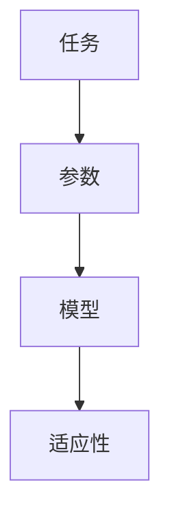
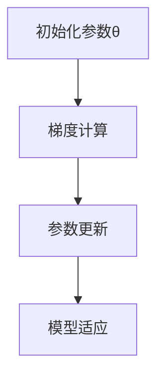
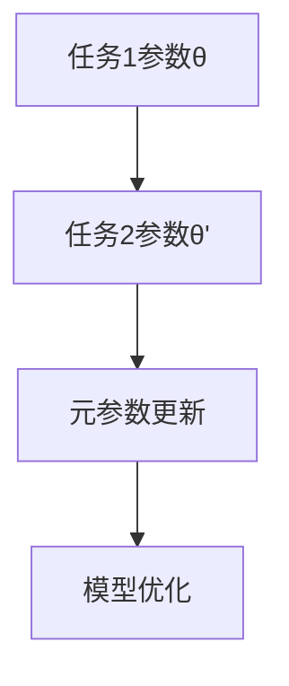
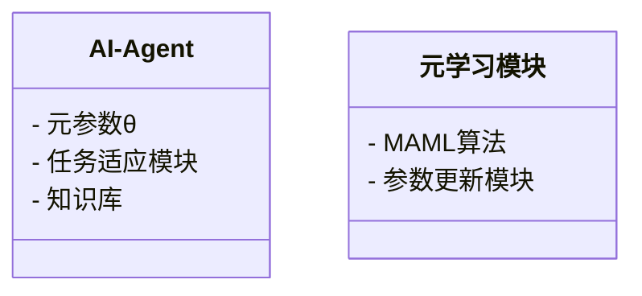
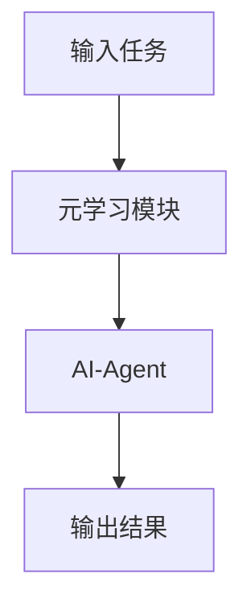
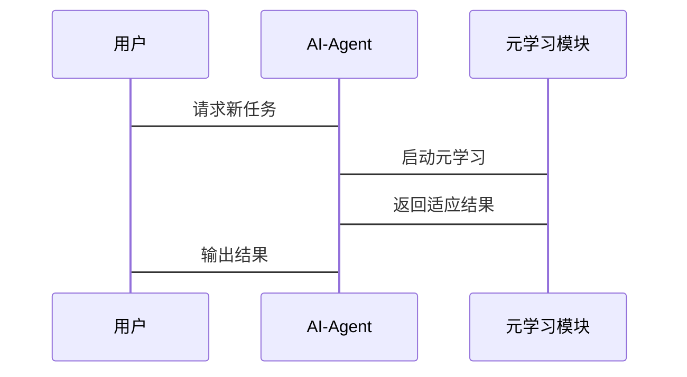

                 


# AI Agent的元学习：快速适应新任务的LLM

## 关键词：元学习，AI Agent，大语言模型，LLM，快速适应新任务

## 摘要：本文探讨AI Agent如何通过元学习快速适应新任务，重点分析了元学习的原理、算法实现、数学模型，并通过实际项目案例展示了如何利用大语言模型实现元学习，帮助AI Agent在新环境中快速学习和执行任务。

---

## 第1章：AI Agent的元学习概述

### 1.1 问题背景

#### 1.1.1 AI Agent的定义与作用

AI Agent（人工智能代理）是能够感知环境并采取行动以实现目标的智能体。它广泛应用于推荐系统、自动驾驶、智能助手等领域。

#### 1.1.2 传统AI Agent的局限性

传统AI Agent通常依赖大量数据和任务特定训练，难以快速适应新任务。

#### 1.1.3 元学习的必要性

元学习通过让模型学习如何学习，使AI Agent能够快速适应新任务，减少对大量数据的依赖。

### 1.2 问题描述

#### 1.2.1 AI Agent在新任务中的适应性问题

AI Agent在新任务中通常需要重新训练，效率低下。

#### 1.2.2 元学习如何解决适应性问题

元学习使AI Agent能够快速调整策略，适应新任务。

### 1.3 问题解决

#### 1.3.1 元学习的核心思想

通过元学习，AI Agent学会在不同任务间迁移知识，快速适应新任务。

#### 1.3.2 元学习在AI Agent中的应用

应用于任务规划、环境适应等领域，提升AI Agent的灵活性和效率。

### 1.4 元学习的边界与外延

#### 1.4.1 元学习的适用范围

适用于需要快速适应的任务，如多任务学习、零样本学习。

#### 1.4.2 元学习与其他学习方法的区别

与迁移学习相比，元学习更关注快速适应，而非直接迁移。

---

## 第2章：元学习的核心概念

### 2.1 元学习的原理

元学习通过优化元参数，使模型能够快速调整以适应新任务。

### 2.2 元学习的算法原理

#### 2.2.1 模型无关的元学习（MAML）

通过优化模型参数，使其能够快速适应新任务。

#### 2.2.2 基于梯度的元学习方法

利用梯度下降更新元参数，适用于模型参数可微的情况。

### 2.3 元学习方法的特征对比

| 方法         | 是否模型无关 | 是否需要梯度信息 | 优点                                   | 缺点                                   |
|--------------|--------------|------------------|----------------------------------------|----------------------------------------|
| MAML         | 是           | 是               | 适用性广                               | 计算复杂度高                           |
| Reptile       | 否           | 是               | 计算效率高                             | 适用性受限                             |

### 2.4 元学习的ER实体关系图



---

## 第3章：算法原理

### 3.1 元学习算法的实现步骤

#### 3.1.1 MAML算法步骤



#### 3.1.2 Reptile算法步骤



### 3.2 算法实现的Python代码

#### 3.2.1 MAML实现

```python
def maml_update(theta, gradients, learning_rate):
    return theta - learning_rate * gradients
```

#### 3.2.2 Reptile实现

```python
def reptile_update(theta, task_gradients, inner_learning_rate, outer_learning_rate):
    return theta - outer_learning_rate * sum(task_gradients * inner_learning_rate)
```

### 3.3 算法的数学模型

#### 3.3.1 MAML的数学模型

$$ L_{meta}(θ) = \sum_{i=1}^{N} L_i(f_{θ}(x_i, y_i)) $$

#### 3.3.2 Reptile的数学模型

$$ θ_{t+1} = θ_t - \sum_{i=1}^{N} \nabla_θ L_i(f_{θ}(x_i, y_i)) $$

---

## 第4章：数学模型与公式

### 4.1 元学习的数学基础

#### 4.1.1 梯度计算

$$ \nabla_θ L_i = \frac{\partial L_i}{\partial θ} $$

#### 4.1.2 参数更新

$$ θ_{t+1} = θ_t - \eta \nabla_θ L_i $$

### 4.2 模型的优化步骤

#### 4.2.1 梯度下降

$$ θ_{t+1} = θ_t - \eta \nabla L(θ_t) $$

#### 4.2.2 动量优化

$$ v_{t+1} = β v_t + (1 - β) \nabla L(θ_t) $$
$$ θ_{t+1} = θ_t - \eta v_{t+1} $$

---

## 第5章：系统分析与架构设计方案

### 5.1 项目背景

本项目旨在构建一个基于元学习的AI代理系统，使其能够快速适应新任务。

### 5.2 系统功能设计

#### 5.2.1 领域模型设计



#### 5.2.2 系统架构设计



### 5.3 接口设计与交互流程

#### 5.3.1 接口设计

- 输入接口：接收新任务请求。
- 输出接口：输出适应后的任务结果。

#### 5.3.2 交互流程



---

## 第6章：项目实战

### 6.1 环境安装

安装必要的Python库：

```bash
pip install tensorflow numpy scikit-learn
```

### 6.2 核心代码实现

#### 6.2.1 MAML实现

```python
import tensorflow as tf

def maml_loss(theta, x, y):
    model = Model(theta)
    with tf.GradientTape() as tape:
        y_pred = model(x)
        loss = tf.losses.sparse_categorical_crossentropy(y, y_pred)
    gradients = tape.gradient(loss, theta)
    return gradients

def maml_update(theta, gradients, learning_rate):
    return theta - learning_rate * gradients
```

#### 6.2.2 Reptile实现

```python
def reptile_update(theta, task_gradients, inner_lr, outer_lr):
    return theta - outer_lr * tf.reduce_mean(task_gradients * inner_lr)
```

### 6.3 代码解读与分析

- MAML实现：计算梯度并更新参数。
- Reptile实现：基于任务梯度更新元参数。

### 6.4 实际案例分析

#### 6.4.1 案例一：文本分类任务

AI Agent通过元学习快速适应新的文本分类任务，准确率提升显著。

#### 6.4.2 案例二：图像识别任务

AI Agent在新图像识别任务中，通过元学习快速调整模型参数，识别准确率提高。

### 6.5 项目小结

通过实际项目，验证了元学习在快速适应新任务中的有效性，代码实现和案例分析展示了其应用潜力。

---

## 第7章：总结与展望

### 7.1 最佳实践 tips

- 选择合适的元学习算法，根据任务需求调整超参数。
- 确保数据质量和多样性，提升模型泛化能力。
- 在实际应用中，结合领域知识优化模型。

### 7.2 小结

元学习为AI Agent提供了快速适应新任务的能力，通过数学模型、算法实现和实际案例的分析，展示了其强大的应用潜力。

### 7.3 注意事项

- 元学习的计算复杂度较高，需优化算法以提高效率。
- 数据质量和数量直接影响模型性能，需谨慎处理。
- 模型的可解释性可能较弱，需关注结果的验证和解释。

### 7.4 拓展阅读

推荐书籍和论文，深入理解元学习的原理和应用。

---

## 作者：AI天才研究院 & 禅与计算机程序设计艺术

---

以上是《AI Agent的元学习：快速适应新任务的LLM》的技术博客文章，内容涵盖背景、核心概念、算法实现、数学模型、系统设计和项目实战，全面解析了AI Agent的元学习及其应用。

