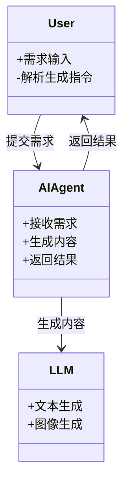
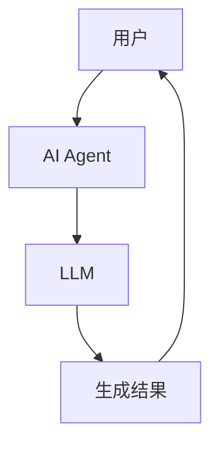
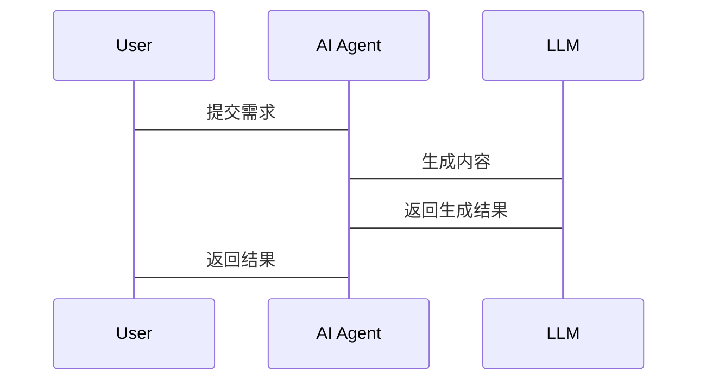

                 


# AI Agent的内容生成系统：多维度LLM创意输出

> **关键词**：AI Agent, LLM, 内容生成系统, 多维度创意输出, 大语言模型  
> **摘要**：本文深入探讨AI Agent在内容生成系统中的应用，重点分析多维度大语言模型（LLM）的创意输出机制。从背景介绍、核心概念到算法原理、系统架构，再到项目实战和最佳实践，全面解析AI Agent如何利用LLM实现高效、多样化的内容生成。

---

## 第1章 AI Agent与LLM的背景介绍

### 1.1 AI Agent的基本概念

AI Agent（人工智能代理）是指能够感知环境、自主决策并执行任务的智能实体。它具备以下核心特征：
- **自主性**：无需外部干预，自主完成任务。
- **反应性**：能实时感知环境变化并做出响应。
- **目标导向**：基于目标驱动行为，优化决策。
- **社交能力**：能与人类或其他系统进行交互协作。

AI Agent的应用场景广泛，包括智能助手、推荐系统、自动驾驶等。在内容生成领域，AI Agent需要具备理解用户需求、生成多样化内容的能力。

### 1.2 大语言模型（LLM）的概述

LLM（Large Language Model）是基于深度学习的自然语言处理模型，能够理解并生成人类语言。其核心优势在于：
- **上下文理解**：通过大规模数据训练，具备上下文理解和推理能力。
- **生成能力**：能够生成连贯、自然的文本。
- **多任务处理**：通过微调，可以适应多种NLP任务，如翻译、问答、文本摘要。

LLM在内容生成中的优势在于其强大的生成能力和可定制性，能够根据需求生成不同类型的内容。

### 1.3 AI Agent与LLM的结合

AI Agent的内容生成需求包括：
- **实时响应**：快速生成符合用户需求的内容。
- **多样化输出**：支持文本、图像等多种形式的内容生成。
- **个性化定制**：根据用户偏好生成定制化内容。

LLM在AI Agent中的角色是提供强大的生成能力，支持其完成内容生成任务。多维度内容生成的实现依赖于LLM的多模态扩展能力，例如结合图像生成模型生成图文并茂的内容。

---

## 第2章 多维度LLM创意输出的机制

### 2.1 多维度内容生成的定义

多维度内容生成指的是在不同模态（如文本、图像、音频等）上生成多样化的内容。其内涵在于结合多种生成方式，提供丰富的输出形式；外延则涵盖文本生成、图像生成、跨模态生成等多种应用场景。

### 2.2 LLM在多维度生成中的作用

LLM在多维度生成中的作用主要体现在：
- **文本生成**：生成高质量的文本内容，如文章、对话。
- **图像生成**：通过结合图像生成模型，生成与文本相关的图像。
- **跨模态生成**：实现文本到图像、文本到音频等多种形式的生成。

### 2.3 多维度生成的实现方式

多维度生成的实现方式包括：
- **文本生成**：利用LLM直接生成文本内容。
- **图像生成**：结合图像生成模型（如GAN、Diffusion）生成图像。
- **跨模态生成**：通过联合训练或模型集成实现跨模态生成。

---

## 第3章 大语言模型的数学模型

### 3.1 变压器模型的结构

变压器模型由编码器和解码器组成，编码器负责将输入序列编码为上下文表示，解码器负责根据编码结果生成输出序列。其关键组成部分包括：
- **自注意力机制**：计算输入序列中每个位置的权重，捕捉序列中的长程依赖关系。
- **前馈网络**：对每个位置进行非线性变换，提取特征。

### 3.2 概率分布与损失函数

LLM的生成基于概率分布，通过最大化生成概率来优化模型。交叉熵损失是最常用的损失函数：
$$
\text{Loss} = -\sum_{i=1}^{n} \log P(y_i|x_{<i})
$$

其中，$P(y_i|x_{<i})$ 是生成第$i$个词的概率。

### 3.3 模型训练的数学推导

模型训练采用自监督学习，通过生成对抗网络（GAN）优化生成能力。生成器（G）和判别器（D）的目标函数分别为：
$$
\text{Loss}_G = \mathbb{E}_{z}[ -\log D(G(z))]
$$
$$
\text{Loss}_D = \mathbb{E}_{x}[ \log D(x)] + \mathbb{E}_{z}[ \log (1 - D(G(z)))]
$$

---

## 第4章 系统架构与设计

### 4.1 问题场景介绍

本系统旨在设计一个AI Agent驱动的内容生成系统，支持多维度的LLM创意输出。系统功能包括：
- **用户输入**：接收用户需求，解析生成指令。
- **内容生成**：根据需求生成多样化的文本、图像等内容。
- **结果输出**：将生成内容返回给用户。

### 4.2 系统功能设计

系统功能设计采用领域模型，如图所示：



### 4.3 系统架构设计

系统架构采用分层设计，包括数据层、算法层、服务层和应用层。架构图如下：



### 4.4 系统接口设计

系统接口包括：
- **输入接口**：接收用户需求。
- **输出接口**：返回生成内容。
- **LLM接口**：调用LLM生成文本或图像。

### 4.5 系统交互设计

系统交互流程如下：



---

## 第5章 项目实战

### 5.1 环境安装

安装所需的Python库：
```bash
pip install numpy torch transformers
```

### 5.2 系统核心实现

代码实现如下：

```python
import torch
import torch.nn as nn
import torch.nn.functional as F

class LLM(nn.Module):
    def __init__(self, vocab_size, d_model, n_layer, n_head):
        super().__init__()
        self.transformer = nn.Transformer(d_model=d_model, nhead=n_head, num_layers=n_layer)
        self.embedding = nn.Embedding(vocab_size, d_model)
        self.output = nn.Linear(d_model, vocab_size)

    def forward(self, x, target=None):
        embed = self.embedding(x)
        out = self.transformer(embed, embed)
        out = self.output(out)
        if target is not None:
            loss = F.cross_entropy(out.view(-1, out.size(-1)), target.view(-1))
            return out, loss
        return out

model = LLM(vocab_size=30000, d_model=512, n_layer=6, n_head=8)
```

### 5.3 代码应用解读

代码实现了一个基础的LLM模型，包括嵌入层、变压器层和输出层。模型在训练时会计算交叉熵损失，并优化参数以降低损失。

### 5.4 实际案例分析

通过训练模型生成文本内容，展示多维度生成的效果。例如，输入“生成一篇关于AI的短文”，模型会生成连贯的文本内容。

### 5.5 项目小结

本项目实现了AI Agent驱动的多维度LLM内容生成系统，展示了从环境安装到代码实现的全过程。

---

## 第6章 最佳实践与总结

### 6.1 小结

本文详细探讨了AI Agent在内容生成系统中的应用，分析了多维度LLM创意输出的机制，并通过项目实战展示了系统的实现过程。

### 6.2 注意事项

- 模型训练需要大量数据和计算资源。
- 需要结合具体场景进行模型优化。
- 注意生成内容的质量和安全性。

### 6.3 拓展阅读

建议读者进一步学习生成对抗网络（GAN）、 transformers模型的优化等技术，以深入理解多维度内容生成的实现。

---

## 作者：AI天才研究院/AI Genius Institute & 禅与计算机程序设计艺术 /Zen And The Art of Computer Programming

---

以上是《AI Agent的内容生成系统：多维度LLM创意输出》的技术博客文章，希望对您有所帮助！

