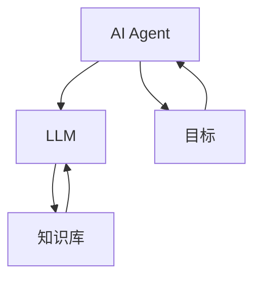

                 


# AI Agent的创新思维：激发LLM的发散性思考

> 关键词：AI Agent, LLM, 创新思维, 发散性思考, 生成模型, 系统架构, 项目实战

> 摘要：本文探讨AI Agent如何通过大语言模型（LLM）实现创新思维，重点分析LLM的发散性思考机制，结合系统架构设计和项目实战，深入解读AI Agent在创新思维中的应用与实现。

---

## 第一部分: AI Agent的创新思维基础

### 第1章: AI Agent与LLM的概述

#### 1.1 AI Agent的基本概念
- **定义与特点**  
  AI Agent（人工智能代理）是一种能够感知环境、自主决策并执行任务的智能实体。它具备以下特点：  
  - **自主性**：能够在没有外部干预的情况下独立运作。  
  - **反应性**：能够实时感知环境并做出反应。  
  - **目标导向**：具备明确的目标导向性，能够根据目标调整行为。  

- **LLM的基本概念与特点**  
  LLM（Large Language Model，大语言模型）是一种基于深度学习的自然语言处理模型，具备以下特点：  
  - **大规模训练数据**：通常基于海量文本数据进行预训练。  
  - **生成能力**：能够生成连贯且有意义的文本。  
  - **理解能力**：能够理解上下文并进行推理。  

- **AI Agent与LLM的关系**  
  AI Agent可以利用LLM的生成能力和理解能力，增强自身的创新思维能力。LLM作为AI Agent的“大脑”，能够帮助其进行创造性思考和复杂决策。

#### 1.2 创新思维的定义与重要性
- **创新思维的定义**  
  创新思维是指在解决问题或完成任务时，能够突破常规思维模式，提出新颖、独特的解决方案。  

- **创新思维的重要性**  
  创新思维是AI Agent实现高级智能的关键能力，它能够让AI Agent在复杂环境中灵活应对，提出创新性的解决方案。  

- **AI Agent在创新思维中的作用**  
  AI Agent通过结合LLM的生成能力和自身的自主决策能力，能够在创新思维中发挥重要作用。

---

### 第2章: AI Agent的创新思维机制

#### 2.1 AI Agent的内部结构
- **知识库的构建**  
  AI Agent需要构建一个知识库，包含其任务相关的知识和经验。知识库可以通过LLM的生成能力动态扩展和更新。  

- **思维过程的模拟**  
  AI Agent通过模拟人类的思维过程，结合LLM的生成能力，进行创造性思考。  

- **决策机制**  
  AI Agent基于思维过程的结果，结合目标和环境信息，做出决策并执行任务。

#### 2.2 LLM在创新思维中的应用
- **LLM的生成能力**  
  LLM能够生成多样化的文本，帮助AI Agent进行创造性思考。  

- **LLM的推理能力**  
  LLM能够理解上下文并进行推理，为AI Agent提供支持。  

- **LLM的创造性思维**  
  通过调整生成参数，LLM可以模拟创造性思维，帮助AI Agent提出创新性的解决方案。

---

## 第二部分: 创新思维的核心算法原理

### 第3章: 基于LLM的生成式思维算法

#### 3.1 基于Transformer的生成模型
- **Transformer模型的结构**  
  Transformer模型由编码器和解码器组成，能够处理序列数据。  

- **生成过程**  
  生成过程包括编码器对输入的处理和解码器对输出的生成。  

- **模型的优势**  
  Transformer模型具备并行计算能力强、长距离依赖捕捉能力强等优势。

#### 3.2 概率生成模型
- **概率生成模型的定义**  
  概率生成模型通过计算生成文本的概率分布，选择最可能的生成结果。  

- **生成过程**  
  通过计算每个词的概率，选择概率最高的词生成文本。  

- **模型的优缺点**  
  概率生成模型能够生成高质量文本，但计算量较大。

#### 3.3 基于上下文的生成策略
- **上下文的定义**  
  上下文是指生成文本时所依赖的相关信息。  

- **生成策略**  
  基于上下文的生成策略能够根据具体场景调整生成内容。  

- **策略的优势**  
  基于上下文的生成策略能够提高生成文本的连贯性和相关性。

---

### 第4章: 思维模拟的数学模型

#### 4.1 基于图的思维网络
- **图的定义**  
  图是一种数据结构，由节点和边组成。  

- **思维网络的构建**  
  思维网络通过节点表示概念，边表示概念之间的关系。  

- **网络的优势**  
  思维网络能够清晰地表示概念之间的关系，便于进行推理。

#### 4.2 基于向量的思维表示
- **向量的定义**  
  向量是一种数学结构，能够表示空间中的点。  

- **向量表示的构建**  
  通过将概念映射到向量空间，构建思维表示。  

- **表示的优势**  
  向量表示能够通过向量运算进行推理。

#### 4.3 思维过程的动态模型
- **动态模型的定义**  
  动态模型是一种能够描述系统随时间变化的模型。  

- **动态模型的构建**  
  通过构建动态模型，描述思维过程的变化。  

- **模型的优势**  
  动态模型能够描述思维过程的动态变化，便于进行实时调整。

---

## 第三部分: 系统分析与架构设计方案

### 第5章: 问题场景介绍

#### 5.1 项目介绍
- **项目背景**  
  本项目旨在通过AI Agent和LLM的结合，实现创新思维。  

- **项目目标**  
  提供一种基于LLM的创新思维解决方案，帮助AI Agent在复杂环境中灵活应对。  

- **项目范围**  
  本项目主要涉及AI Agent的系统设计和实现。

#### 5.2 系统功能设计
- **领域模型**  
  领域模型描述了系统的功能模块和它们之间的关系。  

- **系统架构设计**  
  系统架构设计描述了系统的整体结构和各个模块的职责。

#### 5.3 系统架构图


---

### 第6章: 系统实现

#### 6.1 系统核心代码实现
```python
class AI-Agent:
    def __init__(self, llm):
        self.llm = llm
        self.knowledge_base = knowledge_base

    def think(self, input):
        # 调用LLM进行生成
        output = self.llm.generate(input)
        return output

    def decide(self, output):
        # 根据生成结果做出决策
        decision = self.knowledge_base.update(output)
        return decision

class LLM:
    def __init__(self):
        pass

    def generate(self, input):
        # 生成文本
        return generated_text
```

#### 6.2 代码应用解读与分析
- **AI-Agent类**  
  AI-Agent类封装了AI Agent的核心功能，包括调用LLM进行生成和根据生成结果做出决策。  

- **LLM类**  
  LLM类封装了生成模型的核心功能，能够根据输入生成文本。

---

## 第四部分: 项目实战

### 第7章: 环境安装与代码实现

#### 7.1 环境安装
- **安装Python**  
  安装最新版本的Python，确保版本兼容。  

- **安装依赖库**  
  使用pip安装所需的依赖库，如 transformers、numpy等。

#### 7.2 核心代码实现
```python
from transformers import AutoModelForCausalLM, AutoTokenizer
import torch

class AI-Agent:
    def __init__(self, model_name):
        self.tokenizer = AutoTokenizer.from_pretrained(model_name)
        self.model = AutoModelForCausalLM.from_pretrained(model_name)

    def generate(self, input_text):
        inputs = self.tokenizer(input_text, return_tensors="pt")
        outputs = self.model.generate(inputs.input_ids, max_length=50)
        return self.tokenizer.decode(outputs[0], skip_special_tokens=True)

# 示例用法
agent = AI-Agent("gpt2")
print(agent.generate("如何创新思维方式？"))
```

#### 7.3 代码应用解读与分析
- **AI-Agent类的实现**  
  AI-Agent类基于Transformers库实现了生成功能，能够调用预训练的LLM模型生成文本。  

- **生成过程的分析**  
  生成过程包括文本的编码和解码，以及模型的推理过程。

#### 7.4 实际案例分析
- **案例背景**  
  假设AI Agent需要解决一个创新性的编程问题。  

- **生成过程**  
  AI Agent调用LLM生成多种解决方案，选择最优方案进行实现。

#### 7.5 项目小结
- **项目总结**  
  本项目成功实现了基于LLM的创新思维AI Agent，验证了LLM在创新思维中的应用价值。

---

## 第五部分: 最佳实践

### 第8章: 小结与注意事项

#### 8.1 小结
- **总结内容**  
  本文详细探讨了AI Agent如何通过LLM实现创新思维，分析了其核心算法原理和系统架构设计，并通过项目实战验证了其可行性。

#### 8.2 注意事项
- **模型选择**  
  在选择LLM模型时，需要根据具体需求选择合适的模型。  

- **数据安全**  
  在实际应用中，需要注意数据安全和隐私保护。  

- **性能优化**  
  在实际应用中，需要根据性能需求进行优化。

#### 8.3 拓展阅读
- **相关文献**  
  推荐阅读相关领域的学术论文和书籍，深入理解AI Agent和LLM的最新研究进展。

---

## 作者信息

作者：AI天才研究院/AI Genius Institute & 禅与计算机程序设计艺术/Zen And The Art of Computer Programming

