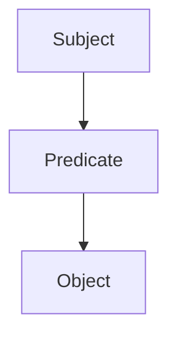
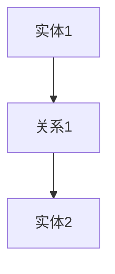
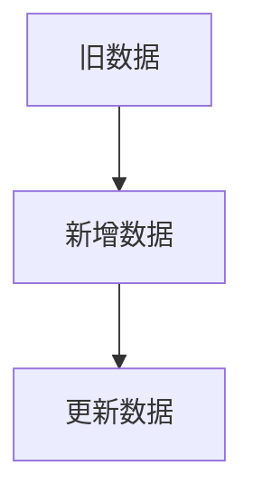
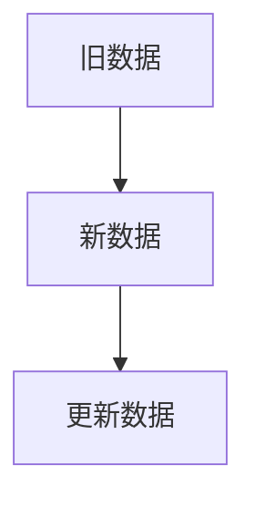
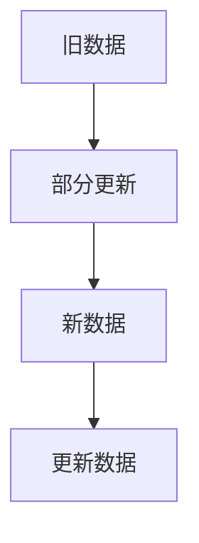
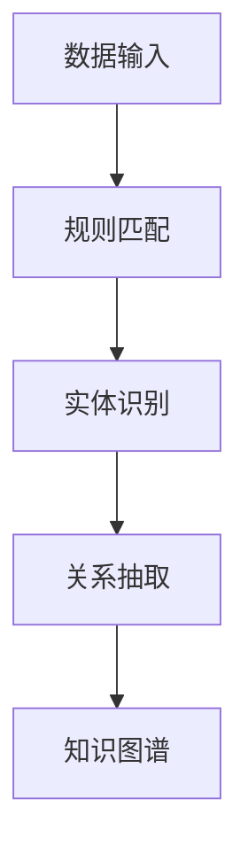
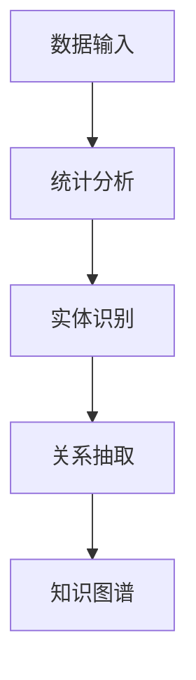
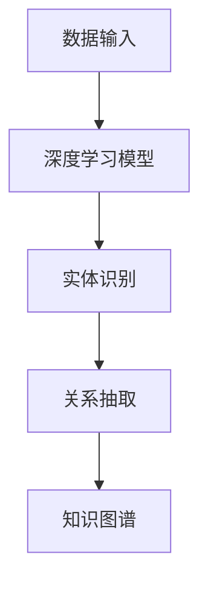
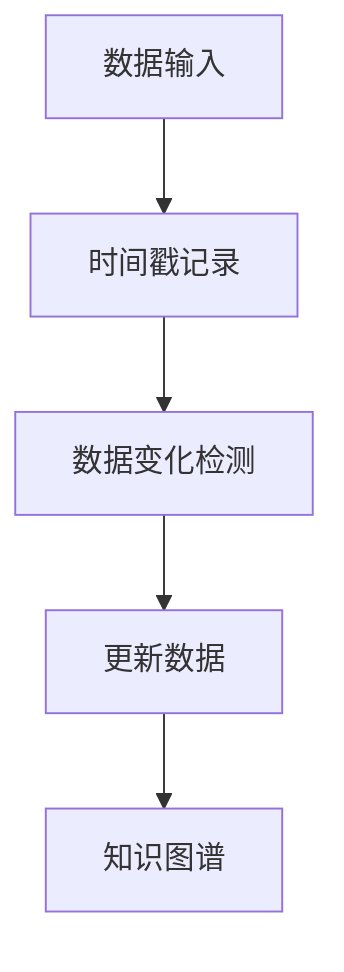
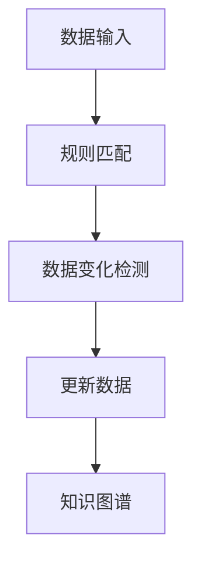

                 


# AI Agent的动态知识图谱构建与更新

> 关键词：AI Agent，知识图谱，动态更新，构建算法，系统架构

> 摘要：本文详细探讨了AI Agent的动态知识图谱构建与更新的技术细节，从核心概念到算法原理，再到系统架构与项目实战，全面解析了动态知识图谱的构建与更新方法。文章首先介绍了AI Agent和知识图谱的基本概念，分析了动态知识图谱的背景与意义。接着，详细讲解了知识图谱的构建流程、表示方法以及动态更新机制。然后，深入探讨了知识图谱构建与更新的算法原理，包括基于规则、统计和深度学习的构建方法，以及增量式、全量式和混合式的更新算法。最后，通过项目实战与案例分析，展示了动态知识图谱的实际应用，并总结了最佳实践与未来展望。

---

## 第1章: AI Agent与知识图谱概述

### 1.1 AI Agent的基本概念
AI Agent（智能体）是指能够感知环境并采取行动以实现目标的实体。AI Agent可以是软件程序、机器人或其他智能系统。AI Agent的核心特征包括自主性、反应性、目标导向性和社交能力。

#### 1.1.1 AI Agent的定义与特点
- **自主性**：AI Agent能够在没有外部干预的情况下独立运行。
- **反应性**：AI Agent能够感知环境并实时调整行为。
- **目标导向性**：AI Agent的行为旨在实现特定目标。
- **社交能力**：AI Agent能够与其他Agent或人类进行交互。

### 1.2 知识图谱的基本概念与作用
知识图谱是一种以图结构表示知识的数据库，其中包含实体和关系。知识图谱通过将分散的数据连接起来，形成一个庞大的知识网络。

#### 1.2.1 知识图谱的背景与意义
知识图谱的核心目标是将现实世界中的实体及其关系表示为结构化的数据。通过知识图谱，AI Agent可以更好地理解和推理复杂的信息。

---

## 第2章: 知识图谱的构建与表示

### 2.1 知识图谱的构建流程
知识图谱的构建需要经过数据收集、预处理、实体识别、关系抽取等多个步骤。

#### 2.1.1 数据收集与预处理
- 数据收集：从多种数据源（如数据库、文本、图像等）收集数据。
- 数据清洗：去除噪声数据，确保数据质量。
- 数据标准化：统一数据格式，便于后续处理。

#### 2.1.2 实体识别与抽取
- 实体识别：通过自然语言处理技术从文本中提取实体。
- 实体消歧：解决同一实体在不同上下文中的歧义问题。
- 实体链接：将实体映射到知识图谱中的唯一标识符。

#### 2.1.3 关系抽取与构建
- 关系抽取：从文本中提取实体之间的关系。
- 关系表示：将关系表示为三元组（头实体、关系、尾实体）。
- 关系推理：通过推理算法发现隐式关系。

### 2.2 知识图谱的表示方法
知识图谱可以通过多种方式表示，常见的包括RDF（资源描述框架）、图结构表示和嵌入式表示。

#### 2.2.1 RDF与三元组表示
RDF是一种用于表示网络资源及其关系的语义模型。知识图谱可以通过RDF三元组（subject, predicate, object）的形式进行表示。



#### 2.2.2 图结构表示方法
知识图谱可以表示为一个图，其中节点表示实体，边表示关系。



#### 2.2.3 知识图谱的存储与管理
知识图谱的存储与管理需要考虑数据的规模、查询效率和扩展性。常见的存储方式包括RDF三元组存储、图数据库和关系型数据库。

---

## 第3章: 动态知识图谱的更新机制

### 3.1 动态知识图谱的更新方法
动态知识图谱需要实时更新以反映最新信息。常见的更新方法包括增量式更新、全量式更新和混合式更新。

#### 3.1.1 增量式更新
增量式更新仅处理新增或修改的部分数据，适用于数据变化较小的场景。



#### 3.1.2 全量式更新
全量式更新将所有数据重新构建，适用于数据变化较大的场景。



#### 3.1.3 混合式更新
混合式更新结合了增量式和全量式更新的优势，适用于复杂的数据变化场景。



### 3.2 动态知识图谱的同步与一致性
动态知识图谱的同步与一致性是确保数据准确性和完整性的关键。

#### 3.2.1 知识图谱同步的挑战
- 数据冲突：同一实体在不同数据源中有不同的表示。
- 并发控制：多个用户或系统同时修改同一数据。
- 数据一致性：确保数据在不同副本之间保持一致。

#### 3.2.2 一致性检查与修复
通过一致性检查算法（如基于时间戳的检查、基于版本的检查）来检测数据冲突，并通过冲突解决策略（如投票机制、优先级规则）进行修复。

#### 3.2.3 并发控制与版本管理
使用版本控制技术（如Git）来管理知识图谱的修改历史，并通过并发控制技术（如锁机制）来防止数据冲突。

---

## 第4章: 知识图谱构建与更新的算法原理

### 4.1 知识图谱构建算法
知识图谱的构建算法包括基于规则的构建、基于统计的构建和基于深度学习的构建。

#### 4.1.1 基于规则的构建算法
基于规则的构建算法通过预定义的规则从数据中提取实体和关系。



#### 4.1.2 基于统计的构建算法
基于统计的构建算法通过统计方法（如聚类、分类）从数据中发现实体和关系。



#### 4.1.3 基于深度学习的构建算法
基于深度学习的构建算法通过神经网络模型（如BERT、Graph Neural Network）从数据中学习实体和关系。



### 4.2 动态知识图谱更新算法
动态知识图谱的更新算法包括基于时间戳的更新、基于事件驱动的更新和基于规则匹配的更新。

#### 4.2.1 基于时间戳的更新算法
基于时间戳的更新算法通过记录数据的修改时间来确定是否需要更新。



#### 4.2.2 基于事件驱动的更新算法
基于事件驱动的更新算法通过检测数据变化的事件来触发更新。


#### 4.2.3 基于规则匹配的更新算法
基于规则匹配的更新算法通过预定义的规则匹配数据变化并触发更新。



---

## 第5章: 系统架构与设计

### 5.1 系统架构设计
知识图谱构建与更新系统的架构设计需要考虑模块划分、功能设计和性能优化。

#### 5.1.1 系统模块划分
- 数据采集模块：负责从各种数据源采集数据。
- 数据处理模块：负责数据的清洗、转换和预处理。
- 知识抽取模块：负责从数据中抽取实体和关系。
- 知识构建模块：负责将抽取的实体和关系构建为知识图谱。
- 知识更新模块：负责动态更新知识图谱。

#### 5.1.2 系统功能设计
- 数据采集与预处理：从多种数据源采集数据，并进行清洗和转换。
- 知识抽取：通过自然语言处理技术从文本中抽取实体和关系。
- 知识构建：将抽取的实体和关系构建为知识图谱。
- 知识更新：实时更新知识图谱以反映最新信息。

#### 5.1.3 系统性能优化
- 数据存储优化：使用高效的存储结构和索引技术。
- 查询优化：通过优化查询算法提高查询效率。
- 并行计算：利用多线程或分布式计算提高处理速度。

### 5.2 系统接口设计
知识图谱构建与更新系统的接口设计需要考虑数据接口、API接口和交互接口。

#### 5.2.1 数据接口设计
- 数据输入接口：支持多种数据格式的输入，如CSV、JSON。
- 数据输出接口：支持将知识图谱导出为多种格式，如RDF、OWL。

#### 5.2.2 API接口设计
- 查询接口：支持通过API查询知识图谱中的实体和关系。
- 更新接口：支持通过API更新知识图谱中的实体和关系。

#### 5.2.3 交互接口设计
- 用户界面：提供直观的图形界面供用户操作。
- 命令行接口：支持通过命令行进行操作。

---

## 第6章: 项目实战与案例分析

### 6.1 环境搭建与工具安装
知识图谱构建与更新项目需要安装必要的工具和库。

#### 6.1.1 开发环境配置
- 操作系统：Windows、Linux或macOS。
- 开发工具：IntelliJ IDEA、PyCharm、VS Code。

#### 6.1.2 工具链安装
- 数据处理工具：Python、Pandas。
- 知识抽取工具：spaCy、NLTK。
- 知识图谱构建工具：Neo4j、RDF4J。

#### 6.1.3 数据集准备
- 数据源：可以从公开数据集（如Wikidata、Freebase）获取。
- 数据格式：支持CSV、JSON、XML等格式。

### 6.2 核心代码实现
知识图谱构建与更新的核心代码实现包括数据处理、知识抽取、知识构建和知识更新。

#### 6.2.1 知识图谱构建代码
以下是使用Python和RDF4J构建知识图谱的示例代码：

```python
from rdflib import Graph, Literal, BNode, Namespace, RDF, URIRef

# 创建命名空间
ns = Namespace("http://example.org/")

# 创建图
g = Graph()

# 添加三元组
g.add((ns.subject, RDF.type, ns.Entity))
g.add((ns.subject, ns.hasName, Literal("Example")))
g.add((ns.subject, ns.hasProperty, Literal("Property")))

# 输出图
for triple in g:
    print(triple)
```

#### 6.2.2 动态更新算法实现
以下是基于时间戳的动态更新算法的示例代码：

```python
def update_knowledge_graph(old_graph, new_data):
    # 创建新图
    new_graph = Graph()

    # 将旧图中的三元组添加到新图中
    for triple in old_graph:
        new_graph.add(triple)

    # 更新新数据
    for triple in new_data:
        new_graph.remove(triple)
        new_graph.add(triple)

    return new_graph
```

---

## 第7章: 最佳实践与未来展望

### 7.1 最佳实践总结
- 数据质量是知识图谱构建的基础，需重视数据清洗和预处理。
- 知识图谱的动态更新需要结合具体场景选择合适的算法。
- 系统设计需考虑扩展性和性能优化。

### 7.2 未来展望
- 随着AI技术的不断发展，知识图谱的构建与更新将更加智能化和自动化。
- 新兴技术（如区块链、边缘计算）将为知识图谱的动态更新提供新的可能性。

---

## 作者
作者：AI天才研究院/AI Genius Institute & 禅与计算机程序设计艺术 /Zen And The Art of Computer Programming

---

以上是《AI Agent的动态知识图谱构建与更新》的完整目录大纲和文章内容，涵盖了从基础概念到实际应用的各个方面，适合技术博客的发布和阅读。

