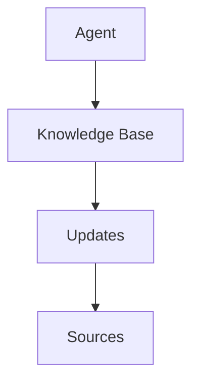
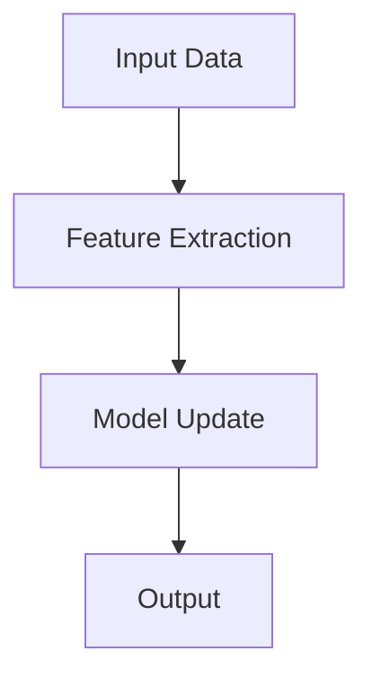
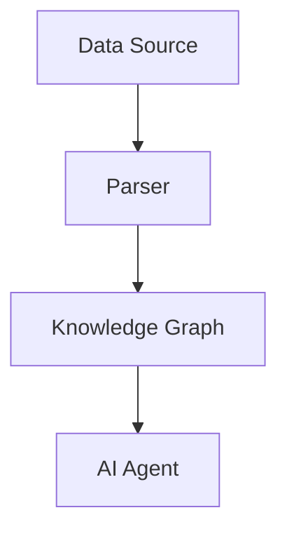
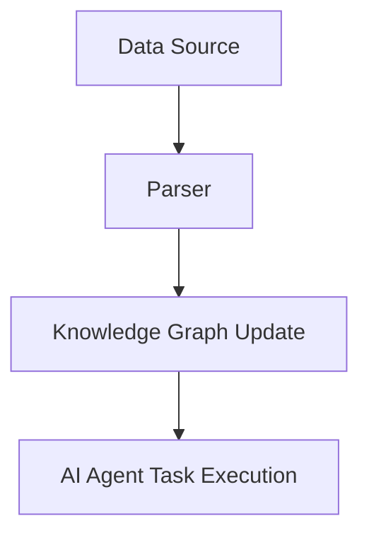

                 


# AI Agent的动态知识更新：保持LLM知识的实时性

> 关键词：AI Agent，动态知识更新，LLM，知识实时性，增量学习，在线更新

> 摘要：AI Agent需要实时更新其知识库以保持对环境变化的适应能力，特别是在大语言模型（LLM）中，知识的实时性至关重要。本文详细探讨了动态知识更新的核心概念、算法原理、系统架构设计以及实际项目实现，帮助读者全面理解如何在AI Agent中实现高效的知识更新。

---

## 第一部分: AI Agent的动态知识更新概述

### 第1章: AI Agent与动态知识更新的背景

#### 1.1 AI Agent的基本概念
AI Agent是一种智能体，能够感知环境、自主决策并执行任务。其核心功能包括感知、推理、学习和规划。AI Agent的应用场景广泛，如自动驾驶、智能客服和推荐系统等。

#### 1.2 动态知识更新的必要性
AI Agent需要实时更新知识以适应环境变化。例如，当新的法律法规出台时，AI Agent必须快速更新其知识库以遵守规定。动态知识更新确保了AI Agent的决策始终基于最新的信息。

#### 1.3 LLM的知识更新挑战
LLM的知识更新需要解决实时性、效率和准确性等问题。传统的批量训练方法无法满足实时更新的需求，因此需要采用增量学习和在线更新等技术。

### 第2章: 动态知识更新的核心概念与联系

#### 2.1 知识表示与更新机制
知识表示是动态更新的基础。常用方法包括符号表示和向量表示。更新机制则包括增量学习和在线更新。

#### 2.2 知识图谱的动态扩展
知识图谱通过节点和边表示实体及其关系。动态更新需要在图谱中添加新的节点和边，同时保持图谱的连通性和一致性。

#### 2.3 实时更新的触发条件
实时更新的触发条件包括时间周期、事件触发和反馈驱动。例如，当用户提出新问题时，触发知识更新。

#### 2.4 对比分析
通过对比表格，展示了不同知识表示方法和更新机制的特点。

| 方法         | 优点                     | 缺点                     |
|--------------|--------------------------|--------------------------|
| 符号表示       | 明确性高                 | 难以处理复杂关系         |
| 向量表示       | 可扩展性好               | 解释性差                 |

#### 2.5 ER实体关系图
展示了知识更新涉及的实体及其关系。



### 第3章: 动态知识更新的算法原理

#### 3.1 增量学习算法
增量学习在新数据到达时逐步更新模型，避免了重新训练的高成本。

##### 3.1.1 算法流程
1. 接收新数据。
2. 提取特征。
3. 更新模型参数。
4. 输出更新后的结果。

流程图如下：



##### 3.1.2 代码示例
```python
def incremental_learning(new_data):
    model.partial_fit(new_data)
    return model.predict(new_data)
```

#### 3.2 在线更新算法
在线更新基于实时反馈不断优化模型，适用于流数据环境。

##### 3.2.1 算法实现
```python
def online_update(new_data, feedback):
    model.fit(new_data, feedback)
    return model.predict(new_data)
```

#### 3.3 数学模型与公式
增量学习的损失函数为：
$$ L = \sum_{i=1}^{n} (y_i - \hat{y_i})^2 $$
其中，$y_i$是真实值，$\hat{y_i}$是预测值。

---

## 第二部分: 系统分析与架构设计

### 第4章: 系统分析与架构设计

#### 4.1 问题场景介绍
动态知识更新系统需要处理实时数据流，并保持高准确性。

#### 4.2 系统功能设计
系统功能包括知识获取、解析、存储和更新。

#### 4.3 系统架构设计
架构包括数据源、解析器、知识图谱和AI Agent。

架构图如下：



#### 4.4 系统接口设计
接口包括数据输入接口、更新接口和查询接口。

#### 4.5 交互流程
1. 数据源提供新数据。
2. 解析器解析数据。
3. 知识图谱更新。
4. AI Agent使用更新后的知识执行任务。

流程图如下：



---

## 第三部分: 项目实战

### 第5章: 项目实战

#### 5.1 环境安装
安装必要的库，如TensorFlow和Keras。

#### 5.2 核心代码实现
```python
def update_knowledge_base(new_data):
    # 数据预处理
    preprocessed_data = preprocess(new_data)
    # 更新知识图谱
    update_graph(preprocessed_data)
    # 返回更新后的知识
    return get_updated_knowledge()
```

#### 5.3 案例分析
以法律合规领域为例，展示知识更新的具体应用。

#### 5.4 项目小结
总结实现过程中的经验和教训。

---

## 第四部分: 最佳实践与拓展

### 第6章: 最佳实践

#### 6.1 小结
动态知识更新是AI Agent保持实时性的关键。

#### 6.2 注意事项
- 定期验证知识准确性。
- 选择合适的更新策略。

#### 6.3 拓展阅读
建议阅读相关论文和书籍。

---

## 作者

作者：AI天才研究院 & 禅与计算机程序设计艺术

---

这篇文章详细探讨了AI Agent的动态知识更新，从理论到实践，帮助读者全面理解如何实现高效的知识更新，确保AI Agent在实时环境中的适应能力。

