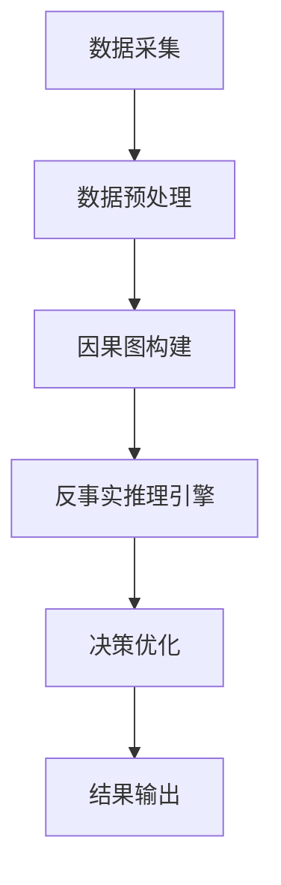

                 


# AI Agent的反事实推理：增强决策的前瞻性

## 关键词：
- 反事实推理
- AI Agent
- 决策优化
- 因果推断
- 人工智能

## 摘要：
AI Agent的反事实推理是一种通过考虑多种假设情境来优化决策的高级推理方法。本文从反事实推理的基本概念出发，探讨其在AI Agent中的应用，结合因果推断的理论基础，详细分析反事实推理的算法实现、系统架构设计及实际应用场景。通过案例分析和代码实现，本文深入揭示了反事实推理在增强AI Agent决策前瞻性中的重要作用，并展望了未来的发展方向。

---

## 第一部分：引言

### 1.1 反事实推理的基本概念
反事实推理是一种基于假设的情境进行推理的方法，它通过分析“如果情况是这样，那么结果会如何”的假设场景，来优化决策过程。与传统的事实推理不同，反事实推理关注的是“可能世界”中的多种可能性，从而帮助AI Agent做出更优的选择。

### 1.2 AI Agent的基本概念
AI Agent是指能够感知环境、自主决策并执行任务的智能实体。AI Agent的核心功能包括感知、推理、规划和执行。在复杂的动态环境中，AI Agent需要通过高效、前瞻性的决策来实现目标。

### 1.3 反事实推理在AI Agent中的重要性
传统的决策方法通常基于当前环境的状态进行局部优化，而反事实推理能够帮助AI Agent预测和评估多种可能的行动结果，从而做出更符合长期目标的决策。这种前瞻性的思维方式使得AI Agent在复杂场景中表现更加智能和高效。

---

## 第二部分：反事实推理的核心概念与原理

### 2.1 反事实推理的数学模型
反事实推理的数学模型基于概率论和因果推断，其核心公式为：
$$P(y|do(x), u)$$
其中，$y$ 是结果变量，$x$ 是处理变量，$u$ 是背景变量。该公式表示在给定处理$x$的情况下，结果$y$的概率分布。

### 2.2 反事实推理与因果关系
因果关系是反事实推理的基础。通过分析变量之间的因果关系，AI Agent能够更好地理解不同行动如何影响结果。例如，在医疗领域，AI Agent可以通过因果推理评估不同治疗方案的效果。

### 2.3 反事实推理的算法实现
反事实推理的算法通常包括以下几个步骤：
1. **构建因果图**：识别变量之间的因果关系。
2. **计算反事实概率**：评估不同假设场景下的结果概率。
3. **优化决策**：基于反事实概率选择最优行动。

---

## 第三部分：AI Agent的反事实推理算法

### 3.1 算法原理
反事实推理算法的核心在于通过因果图构建可能世界模型，并计算每个可能世界中的结果概率。例如，使用潜在结果框架（Potential Outcomes Framework）可以有效地评估不同假设场景下的结果。

### 3.2 算法实现
以下是反事实推理算法的Python实现示例：

```python
def factual_inference(data, treatment, outcome):
    import pandas as pd
    import numpy as np
    from sklearn.linear_model import LinearRegression

    # 分离处理组和对照组
    treated = data[data[treatment] == 1]
    control = data[data[treatment] == 0]

    # 计算平均处理效应（ATE）
    ate = treated[outcome].mean() - control[outcome].mean()

    # 构建因果模型
    model = LinearRegression()
    model.fit(treated.drop(columns=[outcome, treatment]), treated[outcome])

    # 计算反事实概率
    factual_prob = np.mean(treated[treatment])
    counterfactual_prob = 1 - factual_prob

    return ate, factual_prob, counterfactual_prob
```

### 3.3 算法优化
为了提高反事实推理算法的效率，可以采用以下优化方法：
1. **因果图优化**：通过简化因果图的结构，减少计算复杂度。
2. **概率估计优化**：使用贝叶斯网络等方法提高反事实概率的估计精度。
3. **在线更新**：实时更新因果模型，以适应动态环境的变化。

---

## 第四部分：系统架构设计

### 4.1 系统功能模块划分
反事实推理系统主要包括以下几个功能模块：
- 数据采集与预处理模块
- 因果图构建模块
- 反事实推理引擎
- 决策优化模块

### 4.2 系统架构设计
以下是反事实推理系统的架构图：



### 4.3 系统接口设计
系统主要接口包括：
- 数据输入接口：接收原始数据和环境状态。
- 模型训练接口：训练因果模型。
- 推理接口：执行反事实推理并返回结果。

---

## 第五部分：项目实战

### 5.1 案例分析
假设我们正在设计一个AI Agent用于金融投资决策。通过反事实推理，AI Agent可以评估不同投资策略在多种假设场景下的表现，并选择最优的投资组合。

### 5.2 代码实现
以下是反事实推理在金融投资中的实现示例：

```python
def portfolio_optimization(data, assets, scenarios):
    import numpy as np
    from sklearn.covariance import LedoitWolf

    # 计算资产收益和协方差矩阵
    returns = data.pct_change().dropna()
    cov_matrix = LedoitWolf().fit(returns).covariance_

    # 计算每种假设场景下的最优组合
    optimal_weights = np.zeros((len(scenarios), len(assets)))
    for i, scenario in enumerate(scenarios):
        # 基于反事实推理调整协方差矩阵
        adjusted_cov = cov_matrix * scenario.factor
        # 求解最优权重
        optimal_weights[i] = np.linalg.solve(adjusted_cov, np.ones(len(assets))) / np.sum(np.linalg.solve(adjusted_cov, np.ones(len(assets))))

    return optimal_weights
```

### 5.3 实际应用效果
通过反事实推理，AI Agent可以在多种假设场景下评估投资风险，并选择最优的投资策略。例如，在市场波动加剧的情况下，AI Agent可以提前调整投资组合，降低潜在损失。

---

## 第六部分：总结与展望

### 6.1 总结
反事实推理是一种强大的工具，能够帮助AI Agent在复杂环境中做出更优的决策。通过因果推断和数学建模，反事实推理为AI Agent提供了前瞻性的思维方式，使其在动态环境中表现更加智能和高效。

### 6.2 未来展望
随着因果推断理论的发展和计算能力的提升，反事实推理在AI Agent中的应用将更加广泛。未来的研究方向包括：
1. **复杂因果图的构建与优化**：提高反事实推理的效率和准确性。
2. **动态环境中的实时推理**：实现快速适应环境变化的反事实推理。
3. **多Agent协作**：研究反事实推理在多Agent系统中的应用。

---

## 作者：AI天才研究院 & 禅与计算机程序设计艺术

通过本文的详细讲解，我们深入探讨了AI Agent的反事实推理方法及其在决策优化中的应用。希望本文能为读者提供有价值的见解，并为未来的研究和实践提供参考。

