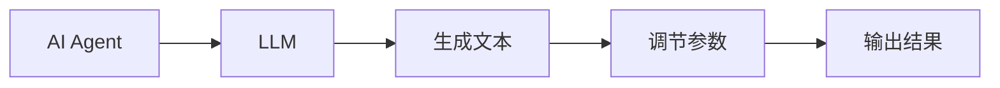
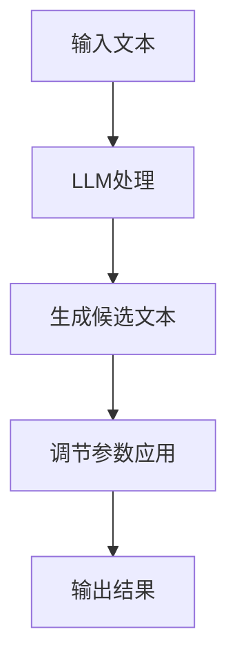
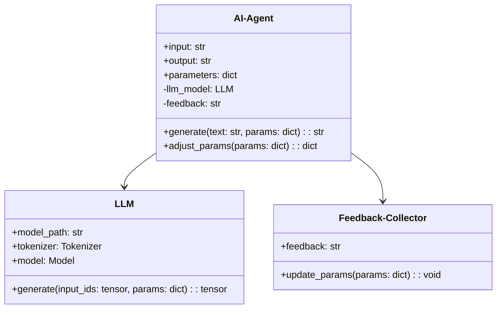
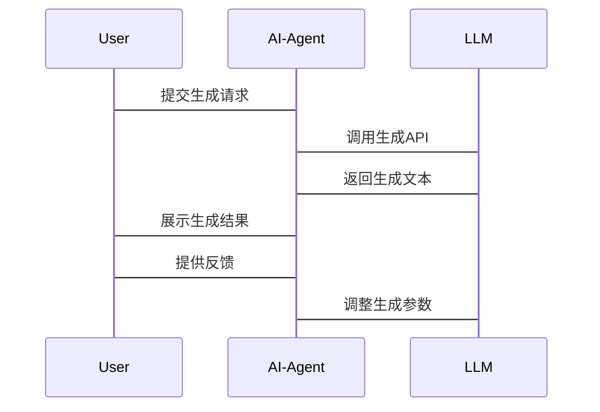

                 


# AI Agent的可控文本生成：精确调节LLM的输出特征

## 关键词：
- AI Agent
- 可控文本生成
- LLM
- 输出特征
- 调节参数

## 摘要：
本文系统探讨了AI Agent在可控文本生成中的应用，重点分析了如何精确调节大型语言模型（LLM）的输出特征。通过深入的技术分析，结合实际案例和系统设计，详细阐述了AI Agent与LLM的关系、可控生成的核心原理、算法实现、系统架构以及项目实战，为读者提供了全面的技术指南。

---

# 第一部分: AI Agent与可控文本生成基础

# 第1章: AI Agent与可控文本生成的背景介绍

## 1.1 问题背景与描述
### 1.1.1 当前AI生成技术的挑战
随着AI技术的快速发展，生成式AI在多个领域展现出巨大潜力，但也带来了不可控性和潜在风险。例如，生成错误信息、偏见或不适当内容等问题，亟需找到有效的方法来精确调节生成结果，确保输出符合预期。

### 1.1.2 可控文本生成的必要性
在实际应用场景中，用户可能需要生成符合特定风格、语气或内容约束的文本。例如，金融领域的报告生成需要严格遵循专业术语和格式，医疗领域的诊断建议需要确保准确性和严谨性。因此，如何实现对LLM输出的精准控制成为关键问题。

### 1.1.3 问题解决的思路与方法
通过分析LLM的生成机制，提出基于调节参数的方法，结合领域知识和用户需求，设计出一套可调节的生成框架。该框架能够根据输入的参数动态调整生成结果的特征，满足不同场景的需求。

## 1.2 核心概念与问题外延
### 1.2.1 AI Agent的基本概念
AI Agent是一种智能代理，能够感知环境、执行任务并做出决策。在文本生成场景中，AI Agent负责接收用户指令，调用LLM生成文本，并根据反馈优化输出结果。

### 1.2.2 可控文本生成的定义与特征
可控文本生成是指通过引入控制参数，使生成的文本在特定维度（如语气、风格、长度）上符合用户需求。其核心特征包括可调节性、适应性和实时反馈。

### 1.2.3 问题的边界与外延分析
本问题主要聚焦于LLM的可控生成，涵盖生成机制、调节参数和输出特征分析。其外延包括文本摘要、对话生成、内容创作等多个应用场景。

## 1.3 核心要素与概念结构
### 1.3.1 AI Agent的核心要素
- **感知模块**：接收用户输入并解析需求。
- **生成模块**：调用LLM生成候选文本。
- **调节模块**：根据参数调整生成结果。
- **反馈模块**：收集用户反馈并优化生成过程。

### 1.3.2 可控文本生成的实现机制
通过引入调节参数，对LLM的输出进行过滤、重排或增强，确保生成文本满足特定特征。

### 1.3.3 概念结构与关系图解


---

# 第2章: AI Agent与LLM的核心概念

## 2.1 AI Agent的基本原理
### 2.1.1 AI Agent的定义与分类
AI Agent可以分为简单反射式、基于模型的和基于效用的三类。在文本生成中，AI Agent通常采用基于模型的方式，结合用户需求和上下文信息生成响应。

### 2.1.2 LLM在AI Agent中的作用
LLM作为生成模块的核心，负责根据输入生成多样化的候选文本。AI Agent通过调节参数影响LLM的输出，确保生成结果符合用户需求。

### 2.1.3 AI Agent与人类用户的交互机制
AI Agent通过自然语言处理技术解析用户输入，生成符合语境的响应。用户反馈用于优化生成过程，形成一个动态调整的闭环系统。

## 2.2 LLM的输出特征分析
### 2.2.1 LLM的生成机制
LLM基于概率分布生成文本，生成结果受到训练数据和模型架构的影响。通过分析生成过程，可以识别关键特征并进行调节。

### 2.2.2 输出特征的分类与描述
输出特征包括语法特征（如句式复杂度）、语义特征（如主题相关性）和风格特征（如语气、用词偏好）。这些特征可以通过参数调节实现优化。

### 2.2.3 调节参数的分类与作用
调节参数包括温度、重复惩罚、长度限制等，分别用于控制生成的多样性和连贯性。每个参数的作用机制需要结合具体场景进行分析。

## 2.3 可控文本生成的核心要素
### 2.3.1 调节参数的选择与影响
不同场景下需要选择合适的调节参数。例如，在生成技术文档时，可能需要较高的准确性和严谨性，此时温度参数应较低。

### 2.3.2 特征调节的实现方式
通过预定义的参数范围和动态调整策略，实现对输出特征的精准控制。例如，结合用户实时反馈动态调整生成结果。

### 2.3.3 调节效果的评估标准
评估标准包括生成文本的准确率、相关性、流畅性和一致性。通过这些指标可以量化调节效果，为优化提供依据。

---

# 第3章: 可控文本生成的算法原理

## 3.1 算法原理概述
### 3.1.1 基于LLM的文本生成流程
生成流程包括输入处理、生成候选文本、调节参数应用和输出结果四个阶段。每个阶段都有特定的处理逻辑和参数影响。

### 3.1.2 调节参数对生成结果的影响
通过分析调节参数对生成概率分布的影响，理解其在控制输出特征中的作用机制。

### 3.1.3 算法优化的方向与目标
优化目标包括提高生成效率、降低计算成本和提升生成质量。优化方向包括参数自动调节、生成结果自适应和反馈机制优化。

## 3.2 算法实现的数学模型
### 3.2.1 LLM的数学模型
LLM通常基于变换器架构，生成概率由解码器端的注意力机制计算。生成过程涉及词表概率分布和上下文依赖。

### 3.2.2 调节参数的数学表达
温度参数T通过调整生成概率分布的平滑程度，重复惩罚系数通过减少重复单词的概率，长度限制通过截断生成序列。

### 3.2.3 生成结果的概率分布模型
生成概率分布受调节参数影响，通过调整参数可以控制生成结果的多样性和相关性。

## 3.3 算法实现的流程图


## 3.4 算法实现的Python代码示例
```python
import torch

def generate_text(model, input_text, temperature=1.0, repetition_penalty=1.0):
    input_ids = tokenizer.encode(input_text, return_tensors='pt')
    with torch.no_grad():
        outputs = model.generate(input_ids, 
                                temperature=temperature, 
                                repetition_penalty=repetition_penalty)
    generated_text = tokenizer.decode(outputs[0], skip_special_tokens=True)
    return generated_text

# 示例调用
input_text = "请描述一下如何实现可控文本生成。"
generated_result = generate_text(model, input_text, temperature=0.7, repetition_penalty=1.2)
print(generated_result)
```

---

# 第4章: 系统分析与架构设计方案

## 4.1 系统分析
### 4.1.1 问题场景介绍
以金融报告生成为例，用户需要生成符合行业规范和格式要求的报告。AI Agent需要根据输入的关键词和参数生成符合要求的文本。

### 4.1.2 系统功能设计
系统功能包括文本生成、参数调节、结果评估和用户反馈。通过领域模型类图可以清晰地看到各模块之间的关系。



## 4.2 系统架构设计
### 4.2.1 系统架构图


### 4.2.2 系统接口设计
系统接口包括输入处理接口、生成接口和反馈接口。每个接口定义了输入输出格式和调用方式。

### 4.2.3 系统交互序列图


---

# 第5章: 项目实战

## 5.1 环境安装
### 5.1.1 安装Python和相关库
```bash
pip install torch transformers
```

### 5.1.2 安装LLM模型
```bash
pip install -r requirements.txt
```

## 5.2 系统核心实现源代码
### 5.2.1 AI Agent实现
```python
class AI-Agent:
    def __init__(self, model_path, tokenizer_path):
        self.llm = LLM(model_path, tokenizer_path)
        self.tokenizer = self.llm.tokenizer
        self.model = self.llm.model

    def generate(self, input_text, temperature=1.0, repetition_penalty=1.0):
        input_ids = self.tokenizer.encode(input_text, return_tensors='pt')
        with torch.no_grad():
            outputs = self.model.generate(input_ids, 
                                        temperature=temperature, 
                                        repetition_penalty=repetition_penalty)
        return self.tokenizer.decode(outputs[0], skip_special_tokens=True)

    def adjust_params(self, params):
        # 根据参数调整生成策略
        pass
```

### 5.2.2 调节参数实现
```python
def adjust_parameters(params):
    # 动态调整参数值
    new_params = {}
    for key in params:
        if key == 'temperature':
            new_params[key] = max(0.1, min(2.0, params[key]))
        elif key == 'repetition_penalty':
            new_params[key] = max(1.0, params[key])
    return new_params
```

## 5.3 实际案例分析
### 5.3.1 案例一：生成技术文档
输入：请描述如何实现可控文本生成。
输出：生成详细的技术文档，调整温度参数为0.5，重复惩罚系数为1.2。

### 5.3.2 案例二：生成创意写作
输入：创作一篇科幻小说开头。
输出：生成富有想象力的开头，调整温度参数为1.5，重复惩罚系数为1.0。

## 5.4 项目总结
通过实际案例分析，展示了AI Agent在不同场景下的应用。调节参数的选择和动态调整策略对生成效果有显著影响。未来可以通过引入更多参数和优化算法进一步提升生成质量。

---

# 第6章: 高级技巧与最佳实践

## 6.1 调节参数的选择与优化
### 6.1.1 参数自动调节策略
通过机器学习方法训练参数调节模型，实现参数的自动优化。

### 6.1.2 动态反馈机制
结合用户实时反馈，动态调整生成参数，提升生成效果。

## 6.2 模型优化与性能提升
### 6.2.1 模型压缩与轻量化
通过模型压缩技术减少模型体积，提升生成效率。

### 6.2.2 多模态生成
结合视觉、听觉等多模态信息，提升生成结果的丰富性和准确性。

## 6.3 伦理与安全注意事项
### 6.3.1 内容安全
防止生成敏感信息、虚假信息，确保生成内容符合法律法规。

### 6.3.2 道德规范
遵循AI伦理准则，避免偏见和歧视，确保生成内容的公正性。

## 6.4 拓展阅读与深入学习
推荐相关论文和书籍，帮助读者深入了解可控文本生成的前沿技术。

---

# 第七章: 总结与展望

## 7.1 全文总结
本文系统探讨了AI Agent在可控文本生成中的应用，提出了基于调节参数的生成框架，并通过实际案例展示了其有效性。

## 7.2 未来展望
未来的研究方向包括引入更复杂的调节参数、优化生成算法、提升生成效率和探索多模态生成技术。这些方向将推动AI Agent在文本生成领域的进一步发展。

---

# 作者：
AI天才研究院/AI Genius Institute  
禅与计算机程序设计艺术 /Zen And The Art of Computer Programming

---

通过以上目录大纲，您可以开始撰写详细的文章内容，确保每个章节都涵盖必要的技术细节和实例分析。希望这为您的写作提供了清晰的指导！

