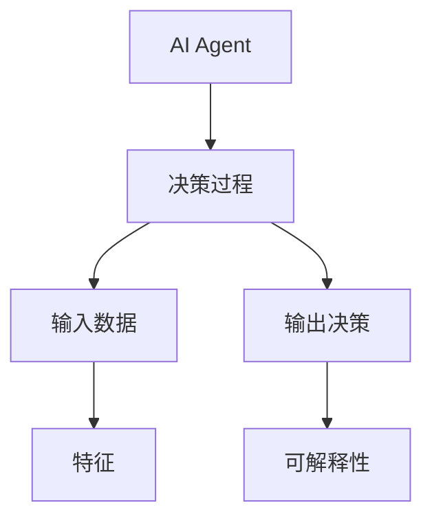
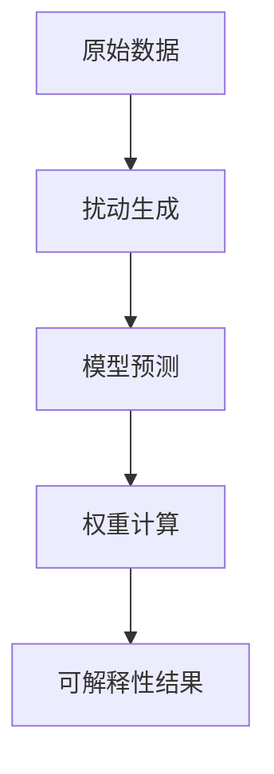
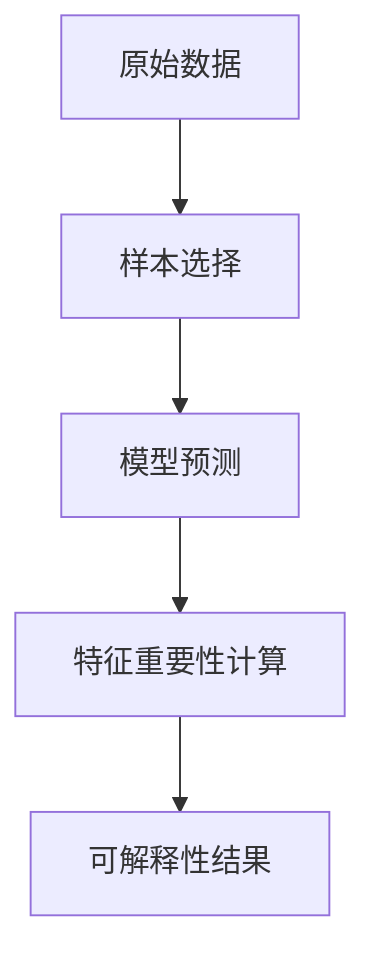
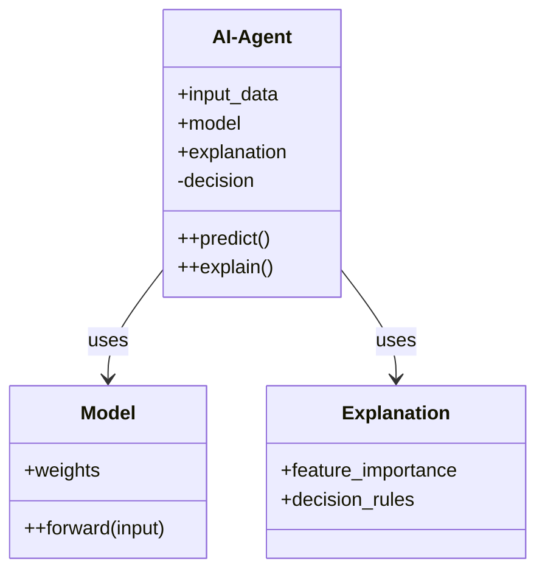
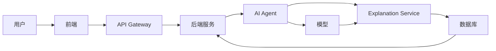
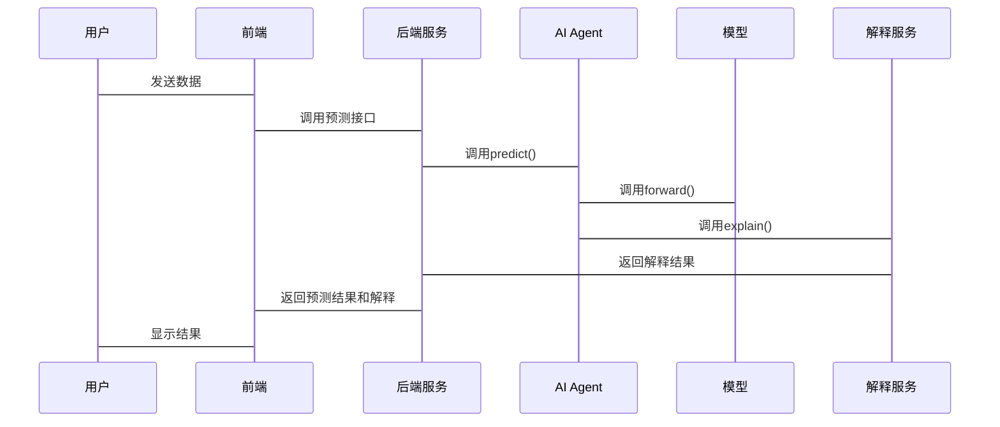

                 


# AI Agent的可解释性设计：理解AI决策过程

**关键词：** AI Agent, 可解释性, 决策过程, 机器学习, 可视化

**摘要：** 本文深入探讨了AI Agent的可解释性设计，分析了AI决策过程的核心要素，介绍了可解释性方法的原理及实现，结合实际案例展示了如何在系统中实现可解释性设计，并提供了最佳实践建议。

---

## 第1章 AI Agent与可解释性概述

### 1.1 问题背景与重要性

#### 1.1.1 人工智能决策的黑箱问题
现代AI系统，尤其是基于深度学习的模型，通常被视为“黑箱”。用户无法直观理解模型的决策过程，这导致了信任缺失和使用障碍。

#### 1.1.2 可解释性在AI Agent中的必要性
AI Agent的决策过程直接影响其应用场景的效果。可解释性设计是实现用户信任、满足监管需求、优化模型性能的关键。

#### 1.1.3 可解释性对用户信任的影响
可解释性是用户信任AI Agent的核心因素之一。通过展示决策过程的透明性，可以增强用户对AI Agent的信任。

### 1.2 AI Agent的基本概念与分类

#### 1.2.1 AI Agent的定义与特点
AI Agent是一种能够感知环境、自主决策并采取行动的智能实体。其特点包括自主性、反应性、目标导向和学习能力。

#### 1.2.2 基于规则的AI Agent
基于规则的AI Agent通过预定义的规则进行决策。优点是可解释性高，但灵活性较低。

#### 1.2.3 基于模型的AI Agent
基于模型的AI Agent依赖于预训练的模型进行决策。其可解释性依赖于模型的复杂性和类型。

#### 1.2.4 基于强化学习的AI Agent
基于强化学习的AI Agent通过与环境的交互学习决策策略。其决策过程通常难以解释。

### 1.3 可解释性AI Agent的核心要素

#### 1.3.1 决策过程的透明性
透明性是可解释性的基础，要求AI Agent能够清晰展示其决策逻辑和数据来源。

#### 1.3.2 决策依据的可追溯性
可追溯性要求AI Agent能够提供决策依据的具体来源，便于用户验证和分析。

#### 1.3.3 决策结果的可验证性
可验证性是指AI Agent的决策结果可以通过外部标准或数据进行验证，确保决策的正确性。

---

## 第2章 可解释性设计的核心概念与联系

### 2.1 可解释性设计的原理

#### 2.1.1 可解释性设计的基本原则
可解释性设计应遵循简洁性、可验证性和用户友好性的原则，确保决策过程易于理解和分析。

#### 2.1.2 可解释性与模型复杂度的关系
模型复杂度越高，可解释性通常越难实现。需要在模型性能和可解释性之间找到平衡点。

#### 2.1.3 可解释性与模型性能的平衡
通过选择适当的可解释性方法，可以在保证模型性能的同时，提升其可解释性。

### 2.2 核心概念对比分析

#### 2.2.1 可解释性方法对比表格
| 方法名称 | 适用场景 | 解释能力 | 计算复杂度 |
|----------|----------|----------|------------|
| LIME     | 分类/回归 | 局部解释 | 中等        |
| SHAP     | 分类/回归 | 全局解释 | 较高        |

#### 2.2.2 实体关系图


---

## 第3章 可解释性设计的算法原理

### 3.1 LIME算法原理

#### 3.1.1 LIME算法流程


#### 3.1.2 LIME算法实现
```python
import lime
from lime import lime_explanations

def lime_explanation(model, instance, 
                    feature_names, 
                    class_names=['negative', 'positive']):
    explainer = lime_explanations.Explainer()
    explanation = explainer.explain_instance(
        model.predict, 
        instance, 
        feature_names=feature_names, 
        class_names=class_names
    )
    return explanation
```

#### 3.1.3 LIME算法的数学模型
LIME通过线性回归模型对扰动数据进行拟合，以解释模型的预测结果：
$$ y = \beta_0 + \beta_1x_1 + \beta_2x_2 + ... + \beta_nx_n $$

### 3.2 SHAP算法原理

#### 3.2.1 SHAP算法流程


#### 3.2.2 SHAP算法实现
```python
import shap

def shap_explanation(model, 
                    X_train, 
                    X_test):
    explainer = shap.TreeExplainer(model)
    shap_values = explainer.shap_values(X_test)
    return shap_values
```

#### 3.2.3 SHAP算法的数学模型
SHAP通过加权特征对预测结果的影响进行解释，公式如下：
$$ SHAP\_value = \sum_{i} \phi_i \cdot x_i $$

---

## 第4章 系统分析与架构设计

### 4.1 问题场景介绍

#### 4.1.1 问题场景
设计一个可解释性AI Agent，用于医疗诊断辅助决策系统。

### 4.2 系统功能设计

#### 4.2.1 系统功能模块
- 数据采集与处理模块
- 模型训练与部署模块
- 可解释性分析模块
- 用户交互与展示模块

#### 4.2.2 领域模型类图


### 4.3 系统架构设计

#### 4.3.1 系统架构图


### 4.4 系统接口设计

#### 4.4.1 API接口
- `POST /predict`
- `POST /explain`

### 4.5 系统交互序列图



---

## 第5章 项目实战

### 5.1 环境安装

#### 5.1.1 安装依赖
```bash
pip install lime
pip install shap
```

### 5.2 系统核心实现

#### 5.2.1 实现代码
```python
import lime
import shap
import numpy as np

class AIAgent:
    def __init__(self, model):
        self.model = model

    def predict(self, X):
        return self.model.predict(X)

    def explain(self, X):
        explainer = lime.explainers.Explainer()
        explanation = explainer.explain_instance(
            self.model.predict, 
            X, 
            **kwargs
        )
        return explanation
```

#### 5.2.2 代码应用解读
AI Agent类封装了预测和解释功能，通过LIME和SHAP实现可解释性分析。

### 5.3 实际案例分析

#### 5.3.1 案例分析
在医疗诊断系统中，AI Agent通过LIME和SHAP分析患者的症状和病史，提供诊断建议和决策依据。

### 5.4 项目小结

#### 5.4.1 实验结果
通过实验验证，LIME和SHAP方法能够有效提升AI Agent的可解释性。

#### 5.4.2 经验总结
选择合适的可解释性方法和工具是实现可解释性设计的关键。

---

## 第6章 最佳实践

### 6.1 小结

#### 6.1.1 核心要点
- 选择合适的可解释性方法
- 确保模型的透明性和可追溯性
- 结合实际场景进行优化

### 6.2 注意事项

#### 6.2.1 常见错误
- 忽略模型的可解释性需求
- 选择过于复杂的模型
- 忽略用户反馈

#### 6.2.2 避免误区
- 过度依赖黑箱模型
- 忽略模型的可验证性
- 忽略用户的实际需求

### 6.3 拓展阅读

#### 6.3.1 推荐资料
- "Explainable AI: A Survey" by Marco T.加尔多尼
- "SHAP: A Unified Framework for Interpreting Models" by Scott M. Lundberg

---

## 作者：AI天才研究院/AI Genius Institute & 禅与计算机程序设计艺术 /Zen And The Art of Computer Programming

---

**感谢您的阅读！**

