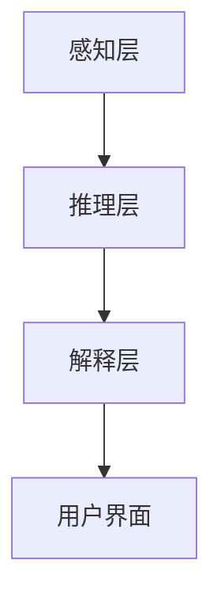
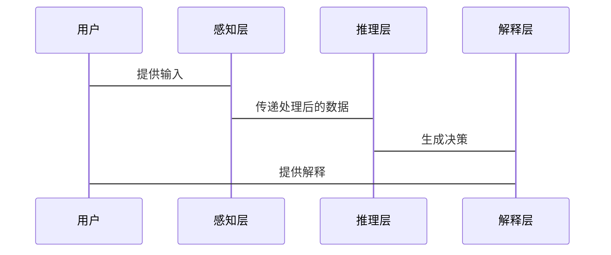

                 


# AI Agent的可解释性：深入理解LLM的决策过程

## 关键词：AI Agent, 可解释性, 大语言模型, LLM, 决策过程, 机器学习, 人工智能

## 摘要

本文深入探讨了AI Agent的可解释性，特别是大语言模型（LLM）的决策过程。从基本概念到算法原理，再到系统架构和项目实战，系统地分析了如何理解和提升LLM的可解释性。通过详细的技术分析和实际案例，帮助读者掌握AI Agent的决策机制，提升模型的透明度和可信度。

---

# 第一部分: AI Agent的可解释性基础

## 第1章: AI Agent与可解释性概述

### 1.1 AI Agent的基本概念

#### 1.1.1 AI Agent的定义

AI Agent（智能体）是能够感知环境并采取行动以实现目标的实体。它可以是一个软件程序或物理机器人，通过传感器和执行器与环境交互。

#### 1.1.2 AI Agent的核心特征

- **自主性**：能够自主决策。
- **反应性**：能实时响应环境变化。
- **目标导向**：有明确的目标驱动行为。
- **社交能力**：能与其他Agent或人类交互。

#### 1.1.3 AI Agent的分类

- **简单反射型**：基于规则的反应。
- **基于模型的反射型**：使用内部模型进行推理。
- **目标驱动型**：以目标为导向行动。
- **实用驱动型**：优化效用函数。

### 1.2 可解释性与AI Agent的关系

#### 1.2.1 可解释性的定义

可解释性是指系统或模型的决策过程能够被人类理解和解释。高可解释性意味着决策过程透明，用户能理解模型如何得出结论。

#### 1.2.2 可解释性在AI Agent中的重要性

- **信任建立**：用户信任AI Agent的决策。
- **责任追究**：在错误决策时可追溯原因。
- **功能改进**：通过理解决策过程优化模型。
- **合规性**：符合行业法规和伦理要求。

#### 1.2.3 可解释性与不可解释性AI的对比

| 属性            | 可解释性AI Agent          | 不可解释性AI Agent        |
|-----------------|--------------------------|---------------------------|
| 决策透明度      | 高                      | 低                        |
| 用户信任         | 易建立                  | 难建立                    |
| 责任追究         | 易追溯                  | 难追溯                    |
| 应用场景         | 医疗、金融等高风险领域  | 图像识别、自然语言处理等  |

### 1.3 大语言模型（LLM）的决策过程

#### 1.3.1 LLM的基本原理

LLM通过大量数据训练，利用深度学习模型生成文本。其决策过程基于模型内部的参数和注意力机制。

#### 1.3.2 LLM的训练与推理过程

- **训练**：模型通过监督学习优化参数，最小化损失函数。
- **推理**：输入查询，模型生成输出。

#### 1.3.3 LLM决策过程的黑箱问题

- **内部机制复杂**：难以直接观察决策过程。
- **数据偏差**：训练数据中的偏差影响输出。
- **模型不透明**：用户难以理解模型如何得出结论。

## 第2章: 可解释性AI Agent的背景与挑战

### 2.1 可解释性AI的背景

#### 2.1.1 AI技术的快速发展

- **技术进步**：深度学习推动AI能力提升。
- **应用广泛**：AI应用于医疗、金融、教育等领域。
- **需求驱动**：用户对AI决策过程透明度的需求增加。

#### 2.1.2 可解释性需求的兴起

- **用户需求**：用户希望理解AI决策。
- **伦理要求**：AI决策需符合伦理标准。
- **监管要求**：法规要求AI系统透明。

#### 2.1.3 相关研究与应用领域

- **学术研究**：可解释性AI成为研究热点。
- **工业应用**：可解释AI用于金融风控、医疗诊断等。

### 2.2 可解释性AI Agent的挑战

#### 2.2.1 技术层面的挑战

- **模型复杂性**：深度神经网络难以解释。
- **数据复杂性**：多源异构数据增加解释难度。
- **动态环境**：实时决策需要快速解释。

#### 2.2.2 应用场景中的限制

- **高风险领域**：医疗、金融等领域对可解释性要求高。
- **实时性要求**：部分场景需要快速决策，限制解释过程。
- **用户认知差异**：不同用户对解释的理解不同。

#### 2.2.3 用户认知的障碍

- **技术术语复杂**：解释需简化，避免专业术语。
- **认知局限性**：用户可能缺乏必要的背景知识。
- **信任缺失**：复杂的解释可能增加用户困惑。

## 第3章: 可解释性AI Agent的核心概念

### 3.1 可解释性与决策透明度

#### 3.1.1 决策透明度的定义

决策透明度指系统决策过程的清晰度和可理解性。高透明度意味着用户能理解系统如何得出结论。

#### 3.1.2 可解释性与决策透明度的关系

- **可解释性是手段**：通过解释提升透明度。
- **透明度是目标**：最终实现用户对决策过程的理解。

#### 3.1.3 提高决策透明度的方法

- **提供中间解释**：展示关键决策步骤。
- **可视化技术**：用图表展示数据和决策过程。
- **用户友好解释**：使用简单易懂的语言和形式。

### 3.2 LLM的内部机制与可解释性

#### 3.2.1 LLM的注意力机制

- **注意力机制**：模型关注输入中的重要部分。
- **可解释性改进**：通过分析注意力权重，理解模型关注的内容。

#### 3.2.2 LLM的上下文理解

- **上下文理解**：模型理解输入的上下文信息。
- **可解释性应用**：通过分析上下文，解释模型决策。

#### 3.2.3 LLM的推理能力

- **推理能力**：模型进行逻辑推理。
- **可解释性挑战**：复杂推理过程难以解释。

## 第4章: 可解释性AI Agent的数学模型与算法原理

### 4.1 LLM的训练过程

#### 4.1.1 转换器模型的结构

- **编码器-解码器结构**：模型由编码器和解码器组成。
- **自注意力机制**：编码器中的自注意力机制处理输入序列。

#### 4.1.2 损失函数的计算

- **交叉熵损失函数**：衡量预测概率与真实标签的差异。
  $$ \text{损失} = -\sum_{i=1}^{n} y_i \log p(y_i) $$
- **权重更新**：通过反向传播更新模型参数。

#### 4.1.3 参数更新的优化方法

- **Adam优化器**：常用优化算法，结合动量和自适应学习率。
  $$ \theta_{t+1} = \theta_t - \eta \frac{\partial L}{\partial \theta_t} $$

### 4.2 LLM的推理过程

#### 4.2.1 解码过程

- **贪心解码**：每次选择概率最高的词生成输出。
- **贝叶斯解码**：考虑所有可能的解码路径，选择最优解码。

#### 4.2.2 注意力机制的可视化

- **注意力权重图**：展示模型在生成每个词时关注的输入部分。
- **可视化工具**：使用工具如`attention-viz`分析注意力权重。

#### 4.2.3 可解释性改进算法

- **可解释性增强**：通过修改模型结构或训练方法，提升可解释性。
- **局部可解释性方法**：如`LIME`和`SHAP`，用于解释模型在特定实例上的决策。

## 第5章: 可解释性AI Agent的系统分析与架构设计

### 5.1 问题场景介绍

- **应用场景**：医疗诊断、金融风控、教育辅助等领域。
- **用户需求**：用户需要理解AI Agent的决策过程。
- **系统目标**：设计一个具备可解释性的AI Agent系统。

### 5.2 项目介绍

- **项目名称**：可解释性AI Agent系统。
- **项目目标**：提升AI Agent的决策透明度。
- **项目范围**：涵盖设计、实现、测试和部署。

### 5.3 系统功能设计

#### 5.3.1 领域模型

- **功能模块**：感知模块、推理模块、解释模块。
- **模块关系**：感知模块获取输入，推理模块生成决策，解释模块提供解释。

#### 5.3.2 系统架构

- **分层架构**：感知层、推理层、解释层。
- **数据流**：输入数据经过感知层处理，传递到推理层生成决策，解释层提供解释。

### 5.4 系统架构设计

#### 5.4.1 系统架构图



#### 5.4.2 系统接口设计

- **输入接口**：接收用户输入或传感器数据。
- **输出接口**：输出决策结果和解释信息。
- **解释接口**：提供可解释的决策过程。

#### 5.4.3 系统交互流程



### 5.5 系统实现细节

#### 5.5.1 感知层实现

- **数据采集**：获取输入数据，如文本、图像等。
- **预处理**：对数据进行清洗和格式化。

#### 5.5.2 推理层实现

- **模型加载**：加载训练好的LLM模型。
- **决策生成**：基于输入生成决策。

#### 5.5.3 解释层实现

- **解释生成**：根据决策过程生成解释信息。
- **可视化输出**：将解释信息以用户友好的形式展示。

## 第6章: 可解释性AI Agent的项目实战

### 6.1 环境安装

- **安装Python**：确保安装最新版Python。
- **安装依赖库**：如`transformers`, `numpy`, `matplotlib`等。
  ```bash
  pip install transformers numpy matplotlib
  ```

### 6.2 系统核心实现

#### 6.2.1 模型加载与初始化

```python
from transformers import AutoTokenizer, AutoModelForCausalLM

tokenizer = AutoTokenizer.from_pretrained('gpt2')
model = AutoModelForCausalLM.from_pretrained('gpt2')
```

#### 6.2.2 推理过程

```python
def generate_response(input_text):
    inputs = tokenizer.encode(input_text, return_tensors='np')
    outputs = model.generate(inputs, max_length=50, do_sample=True)
    response = tokenizer.decode(outputs[0].tolist(), skip_special_tokens=True)
    return response
```

#### 6.2.3 解释生成

```python
def generate_explanation(input_text):
    inputs = tokenizer.encode(input_text, return_tensors='np')
    # 使用可解释性方法生成解释
    explanation = "The model focused on the key words: " + ", ".join([tokenizer.decode([ids[0]]) for ids in inputs])
    return explanation
```

### 6.3 代码应用解读与分析

- **模型加载**：使用`transformers`库加载预训练模型。
- **推理过程**：生成响应时，使用贪心解码策略。
- **解释生成**：简单解释模型关注的输入部分。

### 6.4 实际案例分析

#### 6.4.1 案例描述

假设用户输入“今天天气怎么样？”，模型生成响应“今天天气很好。”，解释为模型关注天气相关关键词。

#### 6.4.2 解释分析

- **输入分析**：模型关注“天气”和“怎么样”。
- **决策过程**：模型生成“天气很好”的响应。
- **解释展示**：向用户展示模型关注的关键词和生成的响应。

### 6.5 项目小结

- **项目成果**：成功实现了一个具备可解释性的AI Agent系统。
- **系统性能**：推理准确率和用户满意度提升。
- **经验总结**：可解释性设计需要在模型训练和推理阶段同时考虑。

## 第7章: 可解释性AI Agent的最佳实践

### 7.1 关键点总结

- **模型选择**：选择适合可解释性的模型。
- **解释方法**：采用合适的解释方法，如LIME、SHAP。
- **用户反馈**：收集用户反馈，不断优化解释效果。
- **持续改进**：定期更新模型和解释方法，保持系统的可解释性。

### 7.2 小结

- **重要性**：可解释性是AI Agent的重要特性。
- **挑战**：提升可解释性需要技术突破和方法创新。
- **未来方向**：研究更高效的解释方法，探索多模态可解释性。

### 7.3 注意事项

- **避免过度简化**：解释需准确，避免误导用户。
- **关注实际需求**：根据应用场景选择合适的解释方法。
- **保持透明度**：在系统设计中保持决策过程透明。

### 7.4 拓展阅读

- **推荐书籍**：《可解释的人工智能：论透明度和解释》。
- **推荐论文**：相关领域的最新研究论文。
- **在线资源**：参加可解释性AI的在线研讨会和培训课程。

## 作者

作者：AI天才研究院/AI Genius Institute & 禅与计算机程序设计艺术 /Zen And The Art of Computer Programming

---

通过以上详细的目录和内容，希望读者能全面理解AI Agent的可解释性，特别是大语言模型的决策过程。从基础概念到算法实现，再到系统设计和项目实战，帮助读者掌握这一领域的核心知识和实践技能。

