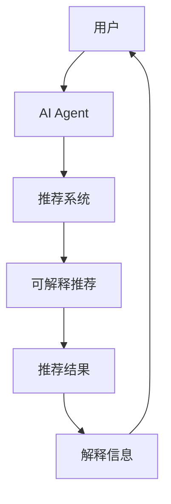
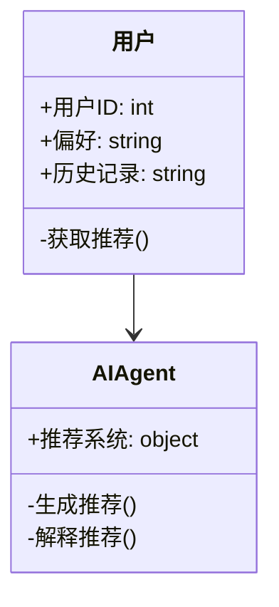
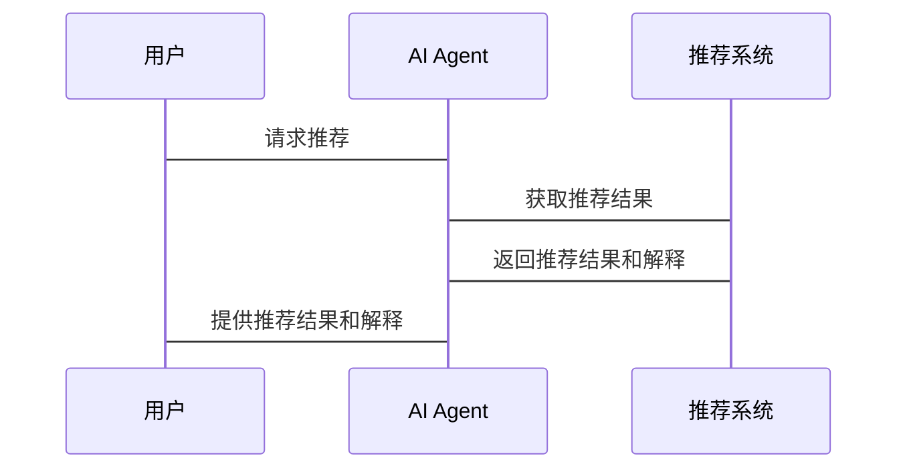

                 


# AI Agent的可解释推荐：提高LLM决策的透明度

**关键词：** AI Agent，可解释推荐，LLM，决策透明度，推荐系统，解释性

**摘要：**  
随着人工智能技术的快速发展，大语言模型（LLM）在决策过程中的应用越来越广泛。然而，其决策过程的不透明性引发了诸多问题。本文旨在探讨如何通过可解释推荐的方法，提升AI Agent的决策透明度。文章从背景、核心概念、算法原理、系统架构到项目实战，全面解析可解释推荐在AI Agent中的应用，帮助读者理解其原理和实际应用场景。

---

## 第1章: 背景与问题背景

### 1.1 可解释推荐系统的重要性
#### 1.1.1 问题背景与问题描述
随着AI技术的普及，推荐系统在各个领域得到广泛应用。然而，推荐系统的“黑箱”特性导致用户难以理解推荐结果的依据，进而影响信任度和使用体验。

#### 1.1.2 为什么需要可解释推荐
可解释推荐能够提高用户对推荐结果的信任，同时有助于发现推荐系统中的潜在问题，如偏见或错误。

#### 1.1.3 可解释推荐的边界与外延
可解释推荐关注的是推荐结果的可理解性，但并不涉及推荐算法的具体实现。

### 1.2 AI Agent与LLM决策透明度
#### 1.2.1 AI Agent的基本概念
AI Agent是一种能够感知环境并执行任务的智能体，具备自主决策的能力。

#### 1.2.2 LLM在决策中的角色
大语言模型通过自然语言处理技术，能够生成多样化的决策建议，但其决策过程往往不够透明。

#### 1.2.3 提高LLM决策透明度的必要性
提高LLM的决策透明度有助于用户更好地理解AI Agent的行为，增强人机信任。

### 1.3 可解释推荐的核心概念与结构
#### 1.3.1 可解释推荐的定义与属性
可解释推荐是一种能够向用户解释推荐结果的推荐方法，具备透明性、可理解性和可验证性。

#### 1.3.2 可解释推荐的核心要素组成
可解释推荐的核心要素包括推荐目标、推荐依据、推荐结果和解释方式。

#### 1.3.3 可解释推荐与AI Agent的关系
可解释推荐是AI Agent与用户交互的重要桥梁，帮助用户理解AI Agent的决策过程。

---

## 第2章: 可解释推荐的核心概念与联系

### 2.1 可解释推荐的理论基础
#### 2.1.1 解释性推荐的原理
解释性推荐通过生成可理解的规则或描述，向用户解释推荐结果。

#### 2.1.2 可解释性与推荐系统的关联
可解释性是推荐系统透明性和可信度的重要指标。

#### 2.1.3 可解释推荐的核心属性对比表
| 属性 | 可解释推荐 | 不可解释推荐 |
|------|------------|--------------|
| 透明度 | 高         | 低           |
| 用户信任 | 高         | 低           |
| 可调试性 | 高         | 低           |

### 2.2 AI Agent的决策过程与可解释性
#### 2.2.1 AI Agent的决策模型
AI Agent通过感知环境、分析目标、制定策略并执行决策。

#### 2.2.2 可解释性在AI Agent中的作用
可解释性是AI Agent与用户交互的重要桥梁，帮助用户理解AI的决策过程。

#### 2.2.3 可解释推荐与AI Agent的实体关系图



---

## 第3章: 可解释推荐的算法原理

### 3.1 基于规则的推荐算法
#### 3.1.1 规则生成方法
通过分析用户行为和偏好，生成基于规则的推荐策略。

#### 3.1.2 规则匹配过程
根据规则与用户特征的匹配度，生成推荐结果。

#### 3.1.3 规则解释性分析
通过规则的可解释性，帮助用户理解推荐结果的原因。

### 3.2 基于模型的可解释推荐算法
#### 3.2.1 模型可解释性的实现方法
通过模型的可解释性技术，如LIME（Local Interpretable Model-agnostic Explanations），解释推荐结果。

#### 3.2.2 模型解释性评估指标
评估指标包括可解释性得分、准确性和用户接受度。

#### 3.2.3 模型解释性与推荐效果的关系
模型的可解释性与推荐效果密切相关，较高的可解释性通常意味着更好的用户体验。

### 3.3 混合推荐方法
#### 3.3.1 混合推荐的定义与特点
混合推荐结合了基于规则和基于模型的推荐方法，兼顾推荐的准确性和可解释性。

#### 3.3.2 混合推荐的实现流程
通过整合多种推荐方法，生成最终的推荐结果。

#### 3.3.3 混合推荐的解释性优势
混合推荐能够通过多种解释方式，提高推荐结果的透明度。

---

## 第4章: 可解释推荐的数学模型与公式

### 4.1 基于规则的推荐模型
#### 4.1.1 规则表示的数学形式
规则可以表示为条件语句，例如：如果用户喜欢电影A，则推荐电影B。

#### 4.1.2 规则匹配的数学公式
$$ \text{推荐度} = \sum (\text{规则权重} \times \text{规则匹配度}) $$

### 4.2 基于模型的推荐模型
#### 4.2.1 模型可解释性的数学表示
使用LIME方法，通过局部线性模型解释推荐结果。

#### 4.2.2 模型解释性评估的数学公式
$$ \text{解释性得分} = \frac{\text{准确推荐数}}{\text{总推荐数}} \times 100\% $$

### 4.3 混合推荐模型
#### 4.3.1 混合推荐的数学公式
$$ \text{最终推荐度} = \alpha \times \text{规则推荐度} + \beta \times \text{模型推荐度} $$

---

## 第5章: AI Agent的可解释推荐系统分析

### 5.1 问题场景分析
AI Agent在医疗、金融、教育等领域的应用中，需要可解释推荐来提高决策透明度。

### 5.2 系统功能设计
#### 5.2.1 用户需求分析
用户需要理解推荐结果的原因和依据。

#### 5.2.2 系统功能模块
包括规则生成模块、模型解释模块和混合推荐模块。

#### 5.2.3 功能模块的类图


### 5.3 系统架构设计
#### 5.3.1 系统架构图


### 5.4 系统交互设计
#### 5.4.1 系统交互流程
用户发起推荐请求，AI Agent生成推荐结果并提供解释。

#### 5.4.2 交互流程图


---

## 第6章: AI Agent可解释推荐的项目实战

### 6.1 环境安装
安装必要的库，如Python的scikit-learn和ipython。

### 6.2 核心代码实现
#### 6.2.1 基于规则的推荐代码
```python
def rule_based_recommendation(user_input):
    if user_input == '喜欢动作片':
        return ['复仇者联盟']
    else:
        return []
```

#### 6.2.2 基于模型的推荐代码
```python
from sklearn.linear_model import LinearRegression
import numpy as np

model = LinearRegression()
model.fit(X, y)
recommendation = model.predict(new_user_input)
```

#### 6.2.3 混合推荐代码
```python
def hybrid_recommendation(rule_recommendation, model_recommendation):
    return rule_recommendation + model_recommendation
```

### 6.3 代码解读与分析
解释代码的实现逻辑和应用场景。

### 6.4 实际案例分析
通过具体案例，展示可解释推荐在实际中的应用。

### 6.5 项目小结
总结项目的实现过程和经验教训。

---

## 第7章: 总结与展望

### 7.1 总结
总结全文，强调可解释推荐在AI Agent中的重要性。

### 7.2 当前研究的不足
当前可解释推荐技术在复杂场景中的应用仍需进一步研究。

### 7.3 未来的研究方向
未来可以探索更高效的可解释推荐算法，以及在更多领域的应用。

---

**作者：AI天才研究院/AI Genius Institute & 禅与计算机程序设计艺术 /Zen And The Art of Computer Programming**

