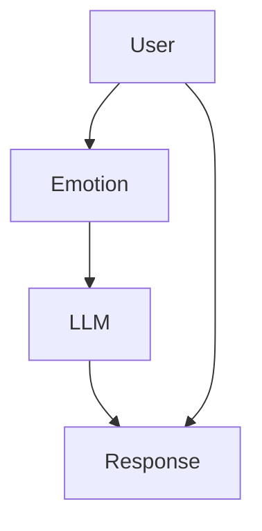
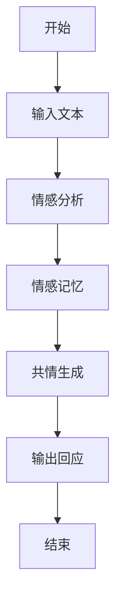
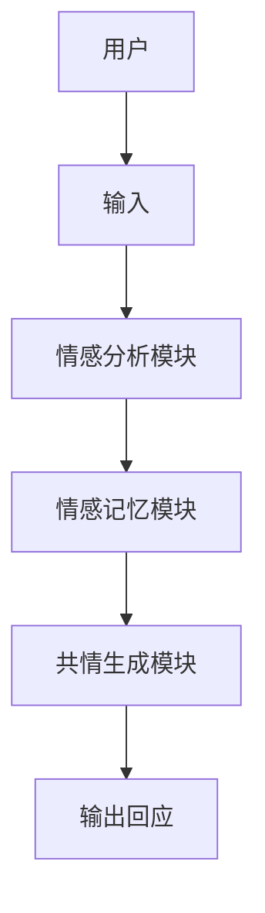
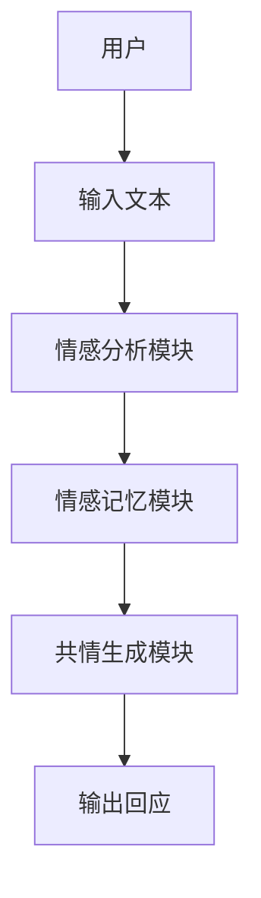

                 


# AI Agent的同理心模拟：增强LLM的情感共鸣能力

## 关键词：AI Agent，同理心模拟，情感共鸣，LLM，人工智能，情感计算

## 摘要：  
本文探讨了AI Agent的同理心模拟技术，旨在增强大语言模型（LLM）在情感共鸣方面的能力。通过分析情感共鸣的核心概念、算法原理及系统架构，本文提出了一种基于情感分析、共情生成和情感记忆的同理心模拟方法。结合实际案例，本文详细介绍了如何通过技术手段提升AI Agent与人类交互的自然性和情感深度。

---

## 第1章: 背景介绍

### 1.1 问题背景
- **当前AI Agent的发展现状**：AI Agent在任务执行和信息处理方面表现出色，但在情感共鸣方面存在不足。
- **情感共鸣能力的缺失问题**：用户对AI Agent的交互体验感到生硬，缺乏情感上的连接。
- **同理心模拟的必要性**：通过模拟人类的同理心，AI Agent可以更好地理解用户情感，提供更贴心的服务。

### 1.2 问题描述
- **情感共鸣能力的定义**：指AI能够理解和回应人类情感的能力。
- **LLM在情感共鸣中的局限性**：LLM依赖预训练数据，缺乏实时情感理解和动态调整能力。
- **同理心模拟的核心目标**：通过技术手段增强LLM的情感共鸣能力，使其能够动态调整回应，提供更符合用户情感需求的交互体验。

### 1.3 问题解决
- **同理心模拟的实现路径**：结合情感分析、共情生成和情感记忆技术，构建情感共鸣模型。
- **增强LLM情感共鸣能力的方法**：引入情感记忆机制，动态更新情感状态，生成更具共情性的回应。
- **AI Agent与人类交互的优化策略**：设计情感驱动的对话流程，优化交互体验。

### 1.4 边界与外延
- **同理心模拟的适用范围**：适用于需要情感共鸣的交互场景，如客服、教育、心理健康等领域。
- **情感共鸣能力的边界**：不追求完全复制人类情感，而是在特定场景下实现情感理解与回应。
- **与传统情感分析的区别**：传统情感分析基于预设规则，而同理心模拟注重动态情感理解和生成。

### 1.5 概念结构与核心要素
- **同理心模拟的核心要素**：情感分析、共情生成、情感记忆。
- **情感共鸣能力的实现模型**：基于情感状态的动态更新和情感驱动的回应生成。
- **AI Agent与人类交互的系统架构**：包含情感输入、情感处理、情感输出三个模块。

---

## 第2章: 核心概念与联系

### 2.1 同理心模拟的基本原理
- **情感分析的数学模型**：基于概率论的情感分类模型，计算文本的情感得分。
- **共情生成的算法原理**：基于情感记忆和上下文，生成符合情感状态的回应。
- **情感记忆的存储机制**：利用向量空间模型或知识图谱，记录用户情感变化。

### 2.2 核心概念对比表格
| 概念           | 情感共鸣能力 | 传统情感分析 | 情感计算 |
|----------------|--------------|--------------|----------|
| 核心目标       | 动态情感回应  | 分类情感极性  | 计算情感  |
| 技术实现       | 情感记忆+共情生成 | 预训练模型分类 | 情感量化 |
| 应用场景       | 交互体验优化 | 情感分类任务 | 情感驱动 |

### 2.3 ER实体关系图


---

## 第3章: 算法原理讲解

### 3.1 同理心模拟的算法基础
- **基于情感分析的算法流程**：文本输入 → 情感分析 → 情感记忆更新 → 共情生成 → 情感驱动的回应生成。
- **情感记忆的构建方法**：利用向量空间模型，将用户情感变化记录为向量序列。
- **共情生成的模型选择**：基于Transformer的生成模型，结合情感记忆向量，生成更具共情性的回应。

### 3.2 算法实现流程图


### 3.3 核心算法代码实现
```python
def emotional_analysis(text):
    # 情感分析算法实现
    model = load_model('emotional_analysis_model')
    return model.predict(text)

def empathy_simulation(emotion_memory):
    # 共情生成算法实现
    model = load_model('empathy_simulation_model')
    return model.generate_response(emotion_memory)
```

### 3.4 数学模型与公式
- **情感得分计算公式**：  
  $$ \text{score} = \sum_{i=1}^{n} w_i \cdot f(x_i) $$
  其中，\( w_i \) 是特征 \( x_i \) 的权重，\( f(x_i) \) 是情感函数。

---

## 第4章: 系统分析与架构设计

### 4.1 系统架构设计
- **系统架构图**：


### 4.2 接口设计
- **输入接口**：接收用户文本输入和情感记忆状态。
- **输出接口**：输出情感驱动的回应和情感记忆更新状态。

### 4.3 交互流程图


---

## 第5章: 项目实战

### 5.1 环境安装
- **Python环境**：Python 3.8+
- **模型依赖**：情感分析模型和共情生成模型。

### 5.2 代码实现
```python
# 安装依赖
pip install numpy tensorflow pandas

# 情感分析模块
def analyze_emotion(text):
    model = load_model('emotional_analysis_model')
    return model.predict(text)

# 共情生成模块
def generate_empathy(emotion_memory):
    model = load_model('empathy_simulation_model')
    return model.generate_response(emotion_memory)
```

### 5.3 案例分析
- **案例描述**：用户与AI Agent的对话中，用户情绪逐渐低落，AI Agent根据情感记忆调整回应语气，最终提升用户情感状态。

### 5.4 项目小结
- **实现成果**：成功构建情感共鸣模型，提升AI Agent的情感回应能力。
- **经验总结**：情感记忆的动态更新和情感驱动的回应生成是关键。

---

## 第6章: 总结与展望

### 6.1 总结
- **核心内容回顾**：本文介绍了AI Agent同理心模拟的核心概念、算法原理和系统架构。
- **技术总结**：通过情感分析、共情生成和情感记忆，实现情感共鸣能力的增强。

### 6.2 注意事项
- **技术实现中的难点**：情感记忆的高效存储和动态更新。
- **实际应用中的挑战**：不同用户的个性化情感需求满足。

### 6.3 未来展望
- **研究方向**：探索更复杂的情感交互模式，如多轮对话中的情感演化。
- **技术发展**：结合边缘计算和实时数据处理，提升情感共鸣能力的实时性。

---

## 作者：AI天才研究院 & 禅与计算机程序设计艺术

