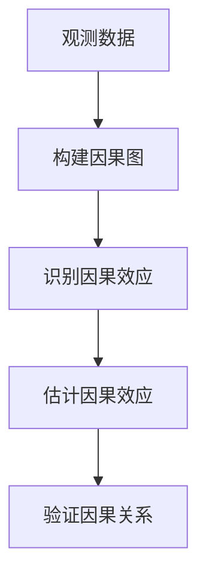
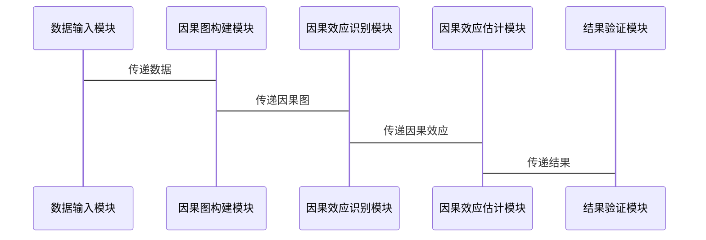

                 


# AI Agent的因果推理：增强决策的逻辑性

> 关键词：AI Agent, 因果推理, 决策逻辑, 人工智能, 智能决策系统

> 摘要：本文深入探讨了AI Agent在因果推理中的应用，分析了因果推理如何增强AI Agent的决策逻辑性。通过介绍因果推理的基本原理、算法实现、数学模型以及实际案例，本文为读者提供了一套系统的方法论，帮助他们理解并应用因果推理技术来提升AI Agent的决策能力。

---

## 第1章: 背景介绍与核心概念

### 1.1 问题背景

#### 1.1.1 AI Agent的决策问题
AI Agent（人工智能代理）是一种能够感知环境、自主决策并执行任务的智能系统。然而，传统的AI Agent在决策过程中往往依赖相关性分析，而忽略了因果关系的推理。这种基于相关性的决策方式在面对复杂、动态的环境时，容易出现错误，因为相关关系并不能直接推导出因果关系。

#### 1.1.2 因果推理在决策中的重要性
因果推理是理解“为什么”现象发生的关键。在AI Agent的决策过程中，因果推理能够帮助系统理解不同动作之间的因果关系，从而做出更加合理的决策。例如，在医疗领域，AI Agent需要通过因果推理来确定某种治疗方案是否真正有效，而不是仅仅依赖相关性分析。

#### 1.1.3 当前AI Agent决策的局限性
传统的AI Agent决策方法主要依赖统计学习和相关性分析，这种方法在某些情况下可能会导致错误的结论。例如，在金融投资中，相关性分析可能会错误地将两个看似相关的事件联系起来，而忽略了它们之间的因果关系。因此，引入因果推理是提升AI Agent决策能力的重要方向。

### 1.2 核心概念与问题描述

#### 1.2.1 因果推理的定义
因果推理是指通过分析变量之间的因果关系，推断出一个变量对另一个变量的影响。与相关性分析不同，因果推理关注的是“原因和结果”之间的关系，而不是单纯的关联性。

#### 1.2.2 AI Agent的因果推理模型
AI Agent的因果推理模型通常包括以下几个部分：
1. **因果图**：用于表示变量之间的因果关系。
2. **潜在结果**：指在不同处理情况下，变量的可能结果。
3. **因果效应**：指一个变量对另一个变量的因果影响。

#### 1.2.3 问题解决的边界与外延
因果推理的应用范围广泛，但其边界也需要注意。例如，在某些情况下，因果推理可能无法完全捕捉到所有变量之间的复杂关系，或者因为数据不足而导致因果关系的推断不准确。

### 1.3 核心概念与联系

#### 1.3.1 因果关系与相关关系对比
| 对比维度       | 因果关系         | 相关关系         |
|----------------|------------------|------------------|
| 定义           | 一个变量对另一个变量的直接影响 | 变量之间的统计关联性 |
| 方向性         | 具有方向性       | 无方向性         |
| 时间顺序       | 原因发生在结果之前 | 不一定           |
| 实验验证       | 可通过干预验证   | 无法通过干预验证 |

#### 1.3.2 因果图的构建与解释
因果图是一种有向图，用于表示变量之间的因果关系。通过构建因果图，可以清晰地展示变量之间的因果关系，并帮助AI Agent理解这些关系。

#### 1.3.3 ER实体关系图架构
ER图（实体关系图）用于描述系统的数据模型，其中实体之间的关系可以通过因果图进一步分析。例如，在医疗领域，患者、医生和治疗方案可以构成一个因果关系网络。

---

## 第2章: 因果推理的核心原理

### 2.1 因果关系的数学模型

#### 2.1.1 潜在结果框架
潜在结果框架是一种常用的因果推理方法，它假设每个个体在不同处理情况下都有一个潜在的结果。例如，对于一个患者，如果接受治疗A，其结果可能是治愈；如果不接受治疗A，其结果可能是未治愈。

#### 2.1.2 结构化因果模型
结构化因果模型（SCM）是一种基于图的因果推理方法，它通过构建因果图来表示变量之间的因果关系。结构化因果模型可以用于推断因果效应，并验证因果关系。

#### 2.1.3 反事实推理
反事实推理是一种通过假设相反的事实来推断因果关系的方法。例如，假设一个患者没有接受治疗A，那么他的结果会如何？

### 2.2 因果推理的算法原理

#### 2.2.1 因果推断的流程图


#### 2.2.2 潜在结果框架的Python实现
```python
import numpy as np
import pandas as pd

def causal_effect(treatment, outcome, covariates):
    # 构建因果模型
    pass

# 示例数据
treatment = np.array([0, 1, 1, 0])
outcome = np.array([1, 0, 1, 0])
covariates = pd.DataFrame({'X': [1, 2, 3, 4]})

# 示例输出
print(causal_effect(treatment, outcome, covariates))
```

### 2.3 因果推理的数学公式

#### 2.3.1 潜在结果公式
$$ Y_i^{do(X)} = \text{潜在结果在处理 } X \text{ 下的值} $$

#### 2.3.2 平均处理效应
$$ ATE = E[Y_i^{do(X=1)} - Y_i^{do(X=0)}] $$

---

## 第3章: AI Agent的因果推理实现

### 3.1 系统分析与架构设计

#### 3.1.1 问题场景介绍
在实际应用中，AI Agent需要通过因果推理来做出决策。例如，在金融投资中，AI Agent需要通过因果推理来确定某个投资决策是否会导致收益增加。

#### 3.1.2 系统功能设计
以下是AI Agent的因果推理系统的功能模块：
- 数据输入与处理模块
- 因果图构建模块
- 因果效应识别模块
- 因果效应估计模块
- 结果验证模块

#### 3.1.3 系统架构设计


#### 3.1.4 系统接口设计
系统接口设计需要考虑模块之间的交互方式。例如，数据输入模块需要将数据传递给因果图构建模块，因果图构建模块需要将因果图传递给因果效应识别模块。

#### 3.1.5 系统交互设计


### 3.2 项目实战

#### 3.2.1 环境安装
在开始实现之前，需要安装必要的Python库：
- `numpy`
- `pandas`
- `networkx`（用于构建因果图）
- `do Learn`（因果推理库）

#### 3.2.2 系统核心实现源代码
以下是AI Agent因果推理系统的Python实现示例：
```python
import numpy as np
import pandas as pd
from networkx import DiGraph
from dolearn import dolearn

def build_causal_graph(treatment, outcome, covariates):
    # 构建因果图
    causal_graph = DiGraph()
    causal_graph.add_edges_from([('treatment', 'outcome')])
    return causal_graph

def causal_inference(treatment, outcome, covariates):
    causal_graph = build_causal_graph(treatment, outcome, covariates)
    # 使用dolearn进行因果推断
    causal_effect = dolearn.estimate_effect(causal_graph, treatment, outcome, covariates)
    return causal_effect

# 示例数据
treatment = np.array([0, 1, 1, 0])
outcome = np.array([1, 0, 1, 0])
covariates = pd.DataFrame({'X': [1, 2, 3, 4]})

# 示例输出
print(causal_inference(treatment, outcome, covariates))
```

#### 3.2.3 代码应用解读与分析
上述代码示例展示了如何构建因果图并使用因果推理库进行因果效应的估计。通过这种方法，AI Agent可以更好地理解不同决策之间的因果关系。

#### 3.2.4 实际案例分析
以医疗领域为例，假设有一个AI Agent需要决定是否给患者开某种药物。通过因果推理，AI Agent可以确定该药物是否真正有效，而不是仅仅依赖相关性分析。

### 3.3 最佳实践

#### 3.3.1 小结
因果推理是提升AI Agent决策能力的重要技术。通过构建因果图和潜在结果框架，AI Agent可以更好地理解因果关系，并做出更加合理的决策。

#### 3.3.2 注意事项
- 数据质量对因果推理的结果有重要影响。
- 因果推理需要考虑变量之间的复杂关系。
- 在实际应用中，需要结合具体场景进行调整。

#### 3.3.3 拓展阅读
- "Causal Inference in Statistics: A Primer" by Judea Pearl
- "Do-Validation for Causal Inference" by Qingyuan Cui

---

## 第4章: 未来展望与挑战

### 4.1 未来研究方向
- 开发更加高效、准确的因果推理算法。
- 探索因果推理在不同领域的应用。
- 结合强化学习提升因果推理的效果。

### 4.2 当前挑战
- 数据不足或数据质量不高影响因果推理的效果。
- 复杂的因果关系网络难以建模。
- 因果推理的计算成本较高。

---

## 作者：AI天才研究院/AI Genius Institute & 禅与计算机程序设计艺术 /Zen And The Art of Computer Programming

---

本文通过系统地介绍因果推理的基本原理、算法实现、数学模型以及实际应用，为AI Agent的决策能力的提升提供了理论和实践的指导。通过因果推理，AI Agent能够更好地理解因果关系，做出更加合理和准确的决策。

