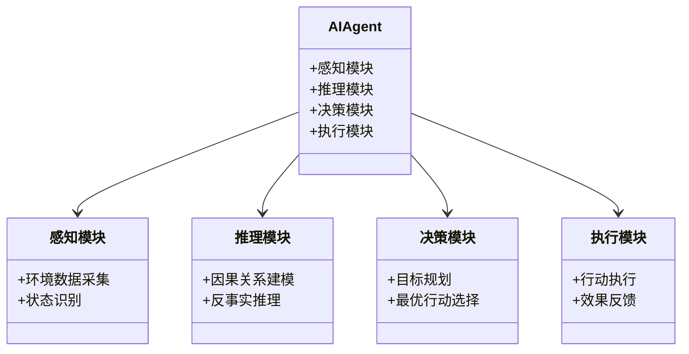

                 


# AI Agent的因果推理：增强决策能力

---

## 关键词：
AI Agent，因果推理，决策能力，反事实推理，因果图，潜在结果模型

---

## 摘要：
AI Agent的决策能力在人工智能领域至关重要，而因果推理是提升决策能力的核心技术。本文系统地探讨了因果推理的基本概念、数学模型、算法实现及其在AI Agent中的应用。通过反事实推理、因果发现和因果推断等方法，结合实际案例分析，深入解析了因果推理如何增强AI Agent的决策能力。本文还详细介绍了系统设计与架构，为读者提供了从理论到实践的全面指导。

---

## 第一部分: 因果推理与AI Agent概述

### 第1章: 因果推理的基本概念

#### 1.1 因果关系的定义与特点
因果关系是理解复杂系统的核心。因果关系不仅仅是相关关系，而是能够揭示事件之间的“原因与结果”的关系。例如，下雨（原因）导致地面湿（结果）。因果关系具有方向性、干预性和可预测性等特点。

#### 1.2 AI Agent与因果推理的关系
AI Agent是一种智能体，能够感知环境、做出决策并采取行动。因果推理帮助AI Agent理解其行为与环境变化之间的因果关系，从而做出更智能的决策。例如，在自动驾驶中，因果推理用于理解刹车（原因）与车辆停止（结果）之间的关系。

#### 1.3 因果推理在AI Agent中的作用
因果推理使AI Agent能够从经验中学习，并根据因果关系进行推理。例如，在医疗诊断中，因果推理帮助AI Agent理解症状（原因）与疾病（结果）之间的关系，从而做出准确的诊断。

---

### 第2章: AI Agent的基本概念

#### 2.1 AI Agent的定义与分类
AI Agent是一种智能体，能够感知环境、自主决策并采取行动以实现目标。根据智能水平，AI Agent可以分为反应式Agent和认知式Agent。反应式Agent基于当前感知做出反应，而认知式Agent能够进行复杂推理和规划。

#### 2.2 AI Agent的核心能力
AI Agent的核心能力包括感知能力、推理能力、决策能力和执行能力。其中，推理能力是AI Agent理解和推断因果关系的关键。

#### 2.3 AI Agent的决策机制
AI Agent的决策机制通常包括感知环境、构建决策模型、评估选项并选择最优行动。因果推理在决策模型构建中起着关键作用，帮助AI Agent理解行动与结果之间的因果关系。

---

## 第二部分: 因果推理的数学模型与算法

### 第3章: 因果推理的数学基础

#### 3.1 概率论基础
概率论是因果推理的基础。例如，贝叶斯定理（$$P(A|B) = \frac{P(B|A)P(A)}{P(B)}$$）用于计算在已知条件下某个事件发生的概率。条件概率（$$P(A|B)$$）表示在事件B发生的情况下，事件A发生的概率。

#### 3.2 图论与因果图
因果图是一种有向图，用于表示变量之间的因果关系。例如，因果图中的箭头表示因果关系的方向。以下是因果图的简单示例：


因果图中的节点表示变量，边表示因果关系。

#### 3.3 因果关系的数学模型
潜在结果模型（Potential Outcome Model）是因果推理的重要工具。例如，对于一个因果关系A→B，潜在结果模型可以表示为：如果施加A，那么B的结果是什么？潜在结果模型通过反事实推理（counterfactual reasoning）来推断因果效应。

---

### 第4章: 因果推理的核心算法

#### 4.1 反事实推理算法
反事实推理是一种通过假设改变某个变量来推断因果效应的方法。例如，反事实推理可以用于推断如果A不发生，结果B会如何变化。以下是反事实推理的简单流程：

1. 定义因果关系模型。
2. 计算在反事实假设下的概率。
3. 通过比较反事实和事实情况，推断因果效应。

#### 4.2 因果发现算法
因果发现算法用于从数据中发现因果关系。例如，基于贝叶斯网络的因果发现算法可以通过数据学习因果图的结构。以下是因果发现算法的简单流程：

1. 收集数据。
2. 构建贝叶斯网络。
3. 学习因果图的结构。

#### 4.3 因果推断算法
因果推断算法用于根据因果关系模型推断因果效应。例如，结构方程模型（SEM）可以通过参数估计和反事实推理来推断因果效应。以下是因果推断算法的简单流程：

1. 定义因果关系模型。
2. 估计模型参数。
3. 通过反事实推理或干预推断因果效应。

---

## 第三部分: AI Agent的因果推理应用

### 第5章: AI Agent的系统设计与架构

#### 5.1 问题场景介绍
AI Agent的因果推理通常应用于需要复杂决策的领域，例如自动驾驶、医疗诊断和金融投资。例如，在自动驾驶中，因果推理用于理解刹车（原因）与车辆停止（结果）之间的关系。

#### 5.2 系统功能设计
以下是AI Agent系统的功能模块设计：



#### 5.3 系统架构设计
以下是AI Agent系统的架构设计：

```mermaid
context diagram
    系统: AI Agent
    参与者: 环境
    参与者: 用户
    系统 --> 环境: 感知环境数据
    系统 --> 用户: 接收用户输入
    系统 --> 环境: 执行行动
    系统 --> 用户: 输出决策结果
```

---

### 第6章: 项目实战

#### 6.1 环境安装
需要安装的工具包括Python、NumPy、Scipy和Pandas。以下是安装命令：

```bash
pip install numpy scipy pandas
```

#### 6.2 核心代码实现
以下是反事实推理算法的Python实现示例：

```python
import numpy as np
from scipy import stats

def potential_outcome(A, B, C):
    return A * B + C

def counterfactual_reasoning(A, B, C):
    factual = potential_outcome(A, B, C)
    counterfactual_A = 0
    counterfactual_B = B
    counterfactual_C = C
    counterfactual = potential_outcome(counterfactual_A, counterfactual_B, counterfactual_C)
    return factual, counterfactual

# 示例
A = 1
B = 2
C = 3
factual, counterfactual = counterfactual_reasoning(A, B, C)
print(f"Factual outcome: {factual}")
print(f"Counterfactual outcome: {counterfactual}")
```

#### 6.3 案例分析
以医疗诊断为例，假设我们有一个因果关系模型，其中症状（A）导致疾病（B）。反事实推理可以帮助我们推断如果症状不存在，疾病是否会发生。例如：

```python
A = 1  # 症状存在
B = 1  # 疾病存在
C = 0  # 其他因素

factual, counterfactual = counterfactual_reasoning(A, B, C)
print(f"如果症状存在，疾病发生概率为：{factual}")
print(f"如果症状不存在，疾病发生概率为：{counterfactual}")
```

---

## 第四部分: 总结与展望

### 第7章: 总结与展望

#### 7.1 本章总结
本文系统地探讨了因果推理在AI Agent中的应用，从基础概念到算法实现，再到系统设计与实战案例，全面解析了因果推理如何增强AI Agent的决策能力。

#### 7.2 未来展望
未来的研究方向包括更复杂的因果图构建、多智能体系统的因果推理以及动态环境中的因果推理。随着技术的进步，因果推理将在更多领域得到应用。

---

## 作者：AI天才研究院 & 禅与计算机程序设计艺术

