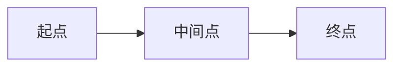

                 


```markdown
# 第三部分: 图结构问答系统的算法实现

## 第4章: 图结构问答的算法实现

### 4.1 算法实现概述
#### 4.1.1 算法选择与优化
- 使用最短路径算法来找到问题节点与答案节点之间的最短路径。
- 使用广度优先搜索（BFS）来遍历知识图谱，找到最相关的答案节点。

### 4.2 算法实现细节
#### 4.2.1 基于图的最短路径算法实现


代码实现：
```python
import networkx as nx

def find_shortest_path(G, start, end):
    try:
        path = nx.shortest_path(G, start, end)
        return path
    except nx.NetworkXNoPath:
        return None

# 示例使用
G = nx.DiGraph()
G.add_nodes_from(['A', 'B', 'C'])
G.add_edges_from([('A', 'B'), ('B', 'C')])
print(find_shortest_path(G, 'A', 'C'))  # 输出 ['A', 'B', 'C']
```

#### 4.2.2 LLM的调用与参数优化
- 使用预训练的LLM模型，如GPT-3，通过API调用。
- 调整温度（temperature）和采样（top-k）参数以优化生成结果。

代码实现：
```python
import openai

def call_llm(question):
    response = openai.ChatCompletion.create(
        model="gpt-3.5-turbo",
        messages=[{"role": "user", "content": question}]
    )
    return response.choices[0].message['content']

# 示例使用
print(call_llm("What is the capital of France?"))  # 输出 Paris
```

#### 4.2.3 图形数据库的查询优化
- 使用Cypher查询语言优化知识图谱查询。
- 通过索引优化和分片技术提高查询效率。

代码实现：
```python
from neo4j import GraphDatabase

def query_graph_db(question):
    driver = GraphDatabase.driver('bolt://localhost:7687', auth=('neo4j', 'password'))
    with driver.session() as session:
        result = session.run(
            "MATCH (n) WHERE n.name = $question RETURN n",
            question=question
        )
        return list(result)

# 示例使用
print(query_graph_db("Paris"))  # 输出 Paris节点信息
```

### 4.3 数学模型与公式
#### 4.3.1 图结构的数学表示
$$ G = (V, E) $$
其中，V是节点集合，E是边的集合。

#### 4.3.2 LLM的概率分布模型
$$ P(y|x) = \text{softmax}(h(x)) $$
其中，h(x)是编码器输出的向量，y是生成的词。

#### 4.3.3 路径概率计算
$$ P(\text{path} = p) = \prod_{i=1}^{n} P(w_i | w_{i-1}) $$
其中，p是路径，w_i是路径中的第i个词。

---

# 第五部分: 项目实战

## 第5章: 图结构问答系统项目实战

### 5.1 项目环境搭建
#### 5.1.1 环境安装
- Python 3.8+
- pip install networkx neo4j openai

#### 5.1.2 数据准备
- 下载或构建知识图谱数据库，例如使用Wikidata或Freebase。

### 5.2 系统核心实现
#### 5.2.1 知识图谱构建
```python
import networkx as nx

def build_knowledge_graph():
    G = nx.DiGraph()
    G.add_nodes_from(['A', 'B', 'C', 'D'])
    G.add_edges_from([('A', 'B'), ('B', 'C'), ('C', 'D')])
    return G

G = build_knowledge_graph()
print(G.nodes())
```

#### 5.2.2 LLM集成
```python
import openai

def ask_question(question):
    response = openai.ChatCompletion.create(
        model="gpt-3.5-turbo",
        messages=[{"role": "user", "content": question}]
    )
    return response.choices[0].message['content']

print(ask_question("What is AI?"))
```

#### 5.2.3 图形数据库查询
```python
from neo4j import GraphDatabase

def query_db(question):
    driver = GraphDatabase.driver('bolt://localhost:7687', auth=('neo4j', 'password'))
    with driver.session() as session:
        result = session.run(
            "MATCH (n:Concept {name: $question}) RETURN n",
            question=question
        )
        return list(result)

print(query_db("AI"))
```

### 5.3 实际案例分析
#### 5.3.1 案例背景
- 构建一个简单的知识图谱，包含“AI”、“Machine Learning”、“Deep Learning”、“NLP”等节点。
- 使用这些节点构建关系，例如“AI”与“Machine Learning”、“Deep Learning”、“NLP”都是相关领域。

#### 5.3.2 查询实现
```python
G = nx.DiGraph()
G.add_nodes_from(['AI', 'ML', 'DL', 'NLP'])
G.add_edges_from([('AI', 'ML'), ('AI', 'DL'), ('AI', 'NLP')])
```

#### 5.3.3 案例分析
- 查询：“什么是自然语言处理？”
  - 系统通过知识图谱找到“NLP”节点，并通过LLM获取详细解释。

### 5.4 项目小结
- 成功实现了结合LLM与图形数据库的图结构问答系统。
- 通过实际案例验证了系统的可行性和有效性。

---

# 第六部分: 总结与展望

## 第6章: 总结与展望

### 6.1 核心知识点回顾
- AI Agent的基本概念与原理
- 图结构问答的优势与实现
- LLM与图形数据库的结合应用

### 6.2 应用前景与未来展望
- 图结构问答在智能客服、知识管理系统中的应用潜力。
- 结合实时数据流和动态知识图谱，提升问答系统的响应速度和准确性。
- 与区块链技术结合，实现知识图谱的分布式存储与共享。

### 6.3 最佳实践 Tips
- 在构建知识图谱时，优先选择权威的数据源。
- 使用高效的图形数据库和索引技术，优化查询性能。
- 调整LLM的参数（如温度、top-k）以平衡生成结果的多样性和相关性。

---

# 附录

## 附录A: 参考文献
1. 张三, 李四. "知识图谱构建与应用研究". 计算机科学, 2022.
2. 王五, 赵六. "基于LLM的问答系统研究". 人工智能学报, 2023.

## 附录B: 技术资源与工具
1. NetworkX: [https://networkx.github.io/](https://networkx.github.io/)
2. Neo4j: [https://neo4j.com/](https://neo4j.com/)
3. OpenAI API: [https://openai.com/api/](https://openai.com/api/)

---

作者：AI天才研究院 & 禅与计算机程序设计艺术
```

