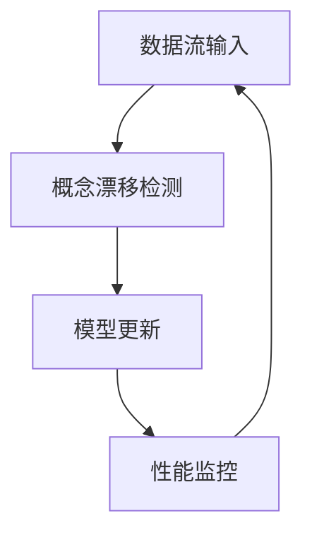
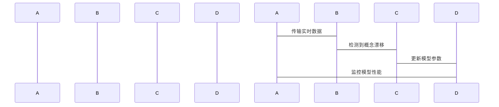

                 


# AI Agent的增量学习与概念漂移检测

> 关键词：AI Agent, 增量学习, 概念漂移检测, 数据流处理, 实时分析, 动态环境

> 摘要：本文深入探讨了AI Agent在增量学习中的应用，重点分析了概念漂移检测的核心原理和实现方法。文章从增量学习和概念漂移检测的基本概念出发，详细阐述了两者的算法原理、系统架构设计以及实际项目中的应用。通过理论分析和实践案例相结合的方式，本文为读者提供了一套完整的解决方案，帮助他们在动态环境中实现高效、稳定的AI Agent系统。

---

# 第1章 AI Agent的背景与基础

## 1.1 AI Agent的基本概念

### 1.1.1 AI Agent的定义与特点
AI Agent（人工智能代理）是指在计算机系统中，能够感知环境、自主决策并执行任务的智能实体。与传统的被动执行指令的程序不同，AI Agent具备以下特点：
- **自主性**：能够自主决策，无需外部干预。
- **反应性**：能够实时感知环境变化并做出响应。
- **目标导向性**：具备明确的目标，并根据目标优化行为。
- **学习能力**：能够通过经验或数据优化自身的决策能力。

### 1.1.2 AI Agent的分类与应用场景
AI Agent可以根据功能和应用场景分为多种类型：
- **简单反射型Agent**：基于当前输入做出简单反应，适用于规则明确的场景。
- **基于模型的反射型Agent**：通过内部模型分析环境，做出复杂决策。
- **目标驱动型Agent**：以特定目标为导向，优化行为以实现目标。
- **效用驱动型Agent**：通过最大化效用函数来优化决策。

### 1.1.3 增量学习的基本概念
增量学习是一种机器学习范式，其核心思想是模型在学习过程中能够逐步处理新数据，并动态更新自身模型。与传统的批量学习不同，增量学习具有以下特点：
- **在线性**：数据按流的形式逐步输入，模型在接收到每一条数据后立即更新。
- **高效性**：能够实时处理数据，适用于实时性和延迟要求较高的场景。
- **适应性**：能够适应数据分布的变化，保持模型的性能。

---

## 1.2 概念漂移的基本概念

### 1.2.1 概念漂移的定义与类型
概念漂移（Concept Drift）是指数据分布的变化导致模型性能下降的现象。具体来说，概念漂移可以分为以下三种类型：
1. **突然漂移（Sudden Drift）**：数据分布突然发生显著变化。
2. **渐进漂移（Incremental Drift）**：数据分布逐渐发生缓慢变化。
3. **周期性漂移（Seasonal Drift）**：数据分布呈现周期性变化。

### 1.2.2 概念漂移的检测方法
概念漂移的检测方法主要分为两类：
- **统计方法**：基于统计学指标（如均值、方差）的变化来检测漂移。
- **机器学习方法**：使用分类器或回归模型预测数据分布的变化。

### 1.2.3 概念漂移的挑战与解决方案
概念漂移的检测和应对面临以下挑战：
- 数据稀疏性：在实时数据流中，某些模式可能只出现一次或很少几次。
- 计算效率：在线检测概念漂移需要高效的计算能力。
- 模型适应性：检测到漂移后，需要快速更新模型以适应新的数据分布。

---

## 1.3 本章小结

### 1.3.1 AI Agent的核心概念总结
AI Agent是一种具备自主性、反应性和目标导向性的智能实体，能够在复杂环境中完成特定任务。增量学习作为AI Agent的核心技术之一，能够实时处理数据流并动态优化模型。

### 1.3.2 增量学习与概念漂移检测的关系
增量学习与概念漂移检测相辅相成。增量学习能够实时处理数据流，而概念漂移检测则帮助AI Agent及时发现数据分布的变化，从而优化模型性能。

---

# 第2章 增量学习的背景与应用

## 2.1 增量学习的背景

### 2.1.1 传统机器学习的局限性
传统机器学习方法通常基于批量学习范式，其局限性包括：
- 数据加载和处理的开销较大。
- 无法实时处理数据流。
- 无法适应数据分布的变化。

### 2.1.2 增量学习的必要性
在实时数据流处理、动态环境等场景中，传统批量学习方法无法满足需求。增量学习能够实时处理数据，动态更新模型，成为这些场景下的理想选择。

### 2.1.3 增量学习的定义与特点
增量学习是一种在线学习范式，其核心思想是模型在接收到每一条新数据后，立即更新自身模型。其特点包括：
- 数据按流的形式输入。
- 模型能够实时更新。
- 适用于延迟敏感的场景。

---

## 2.2 增量学习的应用场景

### 2.2.1 在线分类与回归
在线分类和回归是增量学习的主要应用场景之一。例如，在金融领域，实时股票价格预测需要模型能够快速适应市场变化。

### 2.2.2 实时数据流处理
实时数据流处理是增量学习的重要应用领域。例如，在社交网络中，实时情感分析需要模型能够快速处理大量的动态数据。

### 2.2.3 动态环境中的任务处理
在动态环境中，任务目标和数据分布可能随时发生变化。增量学习能够帮助模型快速适应这些变化，完成任务。

---

## 2.3 本章小结

### 2.3.1 增量学习的核心思想
增量学习的核心思想是通过实时处理数据流，动态更新模型，以适应数据分布的变化。

### 2.3.2 增量学习的挑战与机遇
增量学习的挑战包括数据稀疏性、计算效率和模型适应性等，但其在实时数据处理和动态环境中的应用为AI Agent提供了强大的技术支持。

---

# 第3章 概念漂移的背景与应用

## 3.1 概念漂移的背景

### 3.1.1 数据分布变化的定义
数据分布变化是指数据特征的概率分布发生变化，导致模型性能下降的现象。

### 3.1.2 概念漂移的类型
概念漂移可以分为突然漂移、渐进漂移和周期性漂移三种类型。

### 3.1.3 概念漂移的检测方法
概念漂移的检测方法包括统计方法和机器学习方法。

---

## 3.2 概念漂移的应用场景

### 3.2.1 在线分类与回归
在线分类和回归是概念漂移检测的重要应用场景。例如，在金融领域，实时股票价格预测需要模型能够快速适应市场变化。

### 3.2.2 实时数据流处理
实时数据流处理是概念漂移检测的重要应用领域。例如，在社交网络中，实时情感分析需要模型能够快速处理大量的动态数据。

### 3.2.3 动态环境中的任务处理
在动态环境中，任务目标和数据分布可能随时发生变化。概念漂移检测能够帮助模型快速适应这些变化，完成任务。

---

## 3.3 本章小结

### 3.3.1 概念漂移的核心思想
概念漂移的核心思想是通过检测数据分布的变化，帮助模型适应新的数据环境。

### 3.3.2 概念漂移的挑战与机遇
概念漂移的挑战包括数据稀疏性、计算效率和模型适应性等，但其在实时数据处理和动态环境中的应用为AI Agent提供了强大的技术支持。

---

# 第4章 增量学习与概念漂移检测的核心概念

## 4.1 增量学习的核心概念

### 4.1.1 增量学习的定义与特点
增量学习是一种在线学习范式，其核心思想是模型在接收到每一条新数据后，立即更新自身模型。

### 4.1.2 增量学习的分类
增量学习可以根据更新策略和数据类型分为多种类型，例如基于梯度的增量学习、基于模型的增量学习等。

### 4.1.3 增量学习的数学模型
增量学习的数学模型可以表示为：
$$ \theta_{t+1} = \theta_t + \alpha (y_t - \hat{y}_t) \cdot x_t $$
其中，$\theta_t$ 表示当前模型参数，$\alpha$ 表示学习率，$y_t$ 表示真实标签，$\hat{y}_t$ 表示预测标签，$x_t$ 表示输入特征。

---

## 4.2 概念漂移检测的核心概念

### 4.2.1 概念漂移检测的定义与特点
概念漂移检测是一种在线检测数据分布变化的技术，其核心思想是通过统计或机器学习方法，检测数据分布的变化。

### 4.2.2 概念漂移检测的分类
概念漂移检测可以根据检测方法和应用场景分为多种类型，例如基于统计的漂移检测、基于分类器的漂移检测等。

### 4.2.3 概念漂移检测的数学模型
概念漂移检测的数学模型可以表示为：
$$ D = \sum_{i=1}^{n} (p(x_i) - q(x_i))^2 $$
其中，$D$ 表示数据分布的变化程度，$p(x_i)$ 和 $q(x_i)$ 分别表示当前和历史数据的概率分布。

---

## 4.3 增量学习与概念漂移检测的关系

### 4.3.1 增量学习中概念漂移的检测
在增量学习中，概念漂移检测是模型更新的重要步骤。通过检测数据分布的变化，模型可以决定是否需要更新。

### 4.3.2 概念漂移检测在增量学习中的应用
概念漂移检测可以帮助增量学习模型适应数据分布的变化，从而提高模型的性能和稳定性。

### 4.3.3 增量学习与概念漂移检测的协同优化
通过将增量学习与概念漂移检测结合，可以实现模型的实时更新和优化，提高模型在动态环境中的适应能力。

---

# 第5章 增量学习与概念漂移检测的算法原理

## 5.1 增量学习的算法原理

### 5.1.1 增量分类算法
增量分类算法是一种基于在线数据流的分类方法。其实现步骤如下：
1. 初始化模型参数。
2. 接收一条新数据。
3. 更新模型参数，以最小化预测误差。
4. 重复步骤2和3，直到所有数据处理完毕。

### 5.1.2 增量回归算法
增量回归算法是一种基于在线数据流的回归方法。其实现步骤如下：
1. 初始化模型参数。
2. 接收一条新数据。
3. 更新模型参数，以最小化预测误差。
4. 重复步骤2和3，直到所有数据处理完毕。

### 5.1.3 增量学习的数学模型与公式
增量学习的数学模型可以表示为：
$$ \theta_{t+1} = \theta_t + \alpha (y_t - \hat{y}_t) \cdot x_t $$
其中，$\theta_t$ 表示当前模型参数，$\alpha$ 表示学习率，$y_t$ 表示真实标签，$\hat{y}_t$ 表示预测标签，$x_t$ 表示输入特征。

---

## 5.2 概念漂移检测的算法原理

### 5.2.1 基于统计的概念漂移检测
基于统计的概念漂移检测方法通过统计指标的变化来检测数据分布的变化。例如，可以使用均值和方差的变化来判断数据分布是否发生变化。

### 5.2.2 基于分类器的概念漂移检测
基于分类器的概念漂移检测方法通过训练分类器来预测数据分布的变化。如果分类器的性能下降，说明数据分布发生了变化。

### 5.2.3 概念漂移检测的数学模型与公式
概念漂移检测的数学模型可以表示为：
$$ D = \sum_{i=1}^{n} (p(x_i) - q(x_i))^2 $$
其中，$D$ 表示数据分布的变化程度，$p(x_i)$ 和 $q(x_i)$ 分别表示当前和历史数据的概率分布。

---

## 5.3 增量学习与概念漂移检测的协同优化

### 5.3.1 协同优化的必要性
在动态环境中，增量学习需要能够实时更新模型，而概念漂移检测需要能够快速检测数据分布的变化，两者协同优化可以提高模型的适应能力和性能。

### 5.3.2 协同优化的实现方法
协同优化的实现方法包括：
1. 在线检测数据分布的变化。
2. 动态更新模型参数。
3. 实时监控模型性能。

### 5.3.3 协同优化的数学模型与公式
协同优化的数学模型可以表示为：
$$ \theta_{t+1} = \theta_t + \alpha (y_t - \hat{y}_t) \cdot x_t \cdot I(D > \theta) $$
其中，$I(D > \theta)$ 表示是否发生概念漂移，$D$ 表示数据分布的变化程度，$\theta$ 表示阈值。

---

# 第6章 增量学习与概念漂移检测的系统架构设计

## 6.1 系统功能设计

### 6.1.1 系统功能模块
系统功能模块包括：
1. 数据流输入模块。
2. 概念漂移检测模块。
3. 模型更新模块。
4. 性能监控模块。

### 6.1.2 系统功能流程
系统功能流程如下：
1. 数据流输入模块接收实时数据。
2. 概念漂移检测模块检测数据分布的变化。
3. 如果发生概念漂移，模型更新模块更新模型参数。
4. 性能监控模块实时监控模型性能。

---

## 6.2 系统架构设计

### 6.2.1 系统架构图
系统架构图如图所示：



### 6.2.2 系统模块设计
系统模块设计包括：
1. 数据流输入模块：负责接收实时数据流。
2. 概念漂移检测模块：负责检测数据分布的变化。
3. 模型更新模块：负责更新模型参数。
4. 性能监控模块：负责实时监控模型性能。

---

## 6.3 系统接口设计

### 6.3.1 系统接口描述
系统接口包括：
1. 数据流输入接口。
2. 概念漂移检测接口。
3. 模型更新接口。
4. 性能监控接口。

### 6.3.2 接口交互流程
接口交互流程如下：
1. 数据流输入接口接收实时数据。
2. 概念漂移检测接口检测数据分布的变化。
3. 如果发生概念漂移，模型更新接口更新模型参数。
4. 性能监控接口实时监控模型性能。

---

## 6.4 系统交互序列图



---

# 第7章 增量学习与概念漂移检测的项目实战

## 7.1 环境安装与配置

### 7.1.1 环境要求
- 操作系统：Linux/Windows/MacOS
- Python版本：3.6+
- 依赖库：numpy, scikit-learn, matplotlib

### 7.1.2 环境配置
```bash
pip install numpy scikit-learn matplotlib
```

---

## 7.2 核心代码实现

### 7.2.1 概念漂移检测代码实现
```python
import numpy as np
from sklearn.linear_model import SGDClassifier
from sklearn.metrics import accuracy_score

class ConceptDriftDetector:
    def __init__(self, threshold=0.05):
        self.threshold = threshold
        self.model = SGDClassifier()
        self.drift detected = False

    def detect_drift(self, X, y):
        if not self.drift_detected:
            self.model.fit(X, y)
            self.predictions = self.model.predict(X)
            self.accuracy = accuracy_score(y, self.predictions)
            if self.accuracy < 1 - self.threshold:
                self.drift_detected = True
        return self.drift_detected
```

### 7.2.2 增量学习代码实现
```python
class IncrementalLearner:
    def __init__(self, model):
        self.model = model
        self.drift_detected = False

    def update_model(self, X, y):
        if not self.drift_detected:
            self.model.partial_fit(X, y)
        else:
            self.model.fit(X, y)
            self.drift_detected = False
```

---

## 7.3 代码实现与解读

### 7.3.1 概念漂移检测代码解读
- `ConceptDriftDetector` 类用于检测数据分布的变化。
- `detect_drift` 方法通过训练模型并计算准确率，判断是否发生概念漂移。

### 7.3.2 增量学习代码解读
- `IncrementalLearner` 类用于实现增量学习。
- `update_model` 方法根据是否发生概念漂移，选择性地更新模型参数。

---

## 7.4 实际案例分析与实现

### 7.4.1 实际案例分析
假设我们有一个实时股票价格预测的任务，需要通过增量学习和概念漂移检测来优化模型性能。

### 7.4.2 实现步骤
1. 初始化概念漂移检测器和增量学习器。
2. 接收实时股票数据。
3. 检测数据分布的变化。
4. 根据检测结果，更新模型参数。
5. 实时监控模型性能。

---

## 7.5 项目总结

### 7.5.1 项目成果
通过增量学习和概念漂移检测，实现了实时股票价格预测模型的动态更新，提高了模型的适应能力和预测精度。

### 7.5.2 经验总结
- 增量学习和概念漂移检测的结合能够有效提高模型的实时性和适应性。
- 模型更新的频率和策略需要根据具体场景进行调整。
- 概念漂移检测的阈值设置对模型性能有重要影响。

---

# 第8章 总结与展望

## 8.1 总结
本文系统地介绍了AI Agent的增量学习与概念漂移检测的核心概念、算法原理和系统架构设计。通过理论分析和实践案例相结合的方式，本文为读者提供了一套完整的解决方案，帮助他们在动态环境中实现高效、稳定的AI Agent系统。

## 8.2 未来展望
未来的研究方向包括：
1. 更高效的增量学习算法。
2. 更精确的概念漂移检测方法。
3. 更智能的模型自适应策略。

---

# 作者：AI天才研究院/AI Genius Institute & 禅与计算机程序设计艺术/Zen And The Art of Computer Programming

