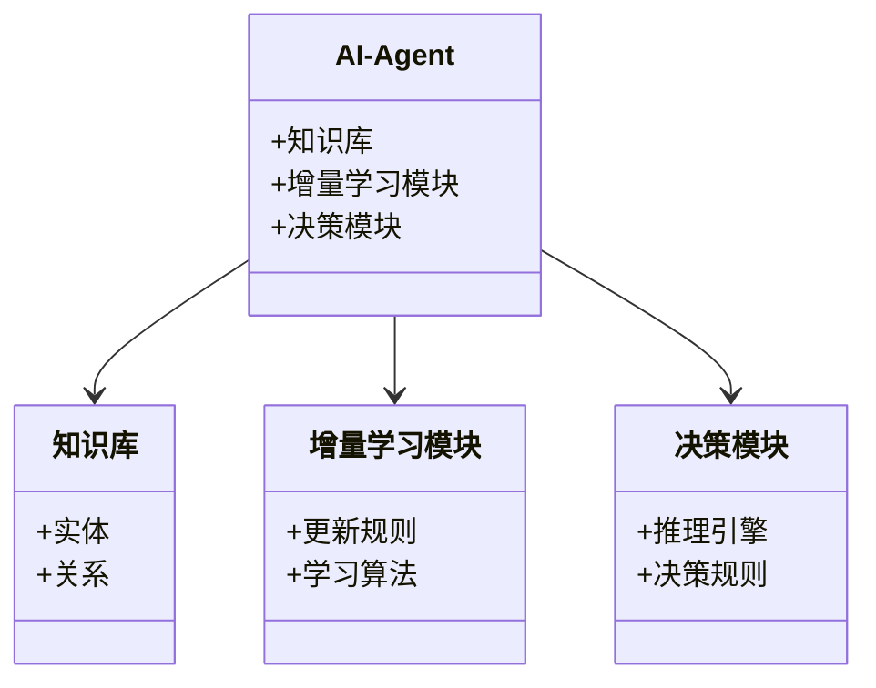

                 


# AI Agent的增量学习与知识更新机制

> 关键词：AI Agent，增量学习，知识更新机制，机器学习，知识图谱

> 摘要：本文详细探讨了AI Agent的增量学习与知识更新机制，从背景介绍、核心概念、算法原理到系统架构和项目实战，全面分析了如何实现AI Agent的持续学习与知识更新。通过具体案例分析和代码实现，深入阐述了增量学习与知识更新机制在实际应用中的重要性与实现方法。

---

# 第一部分: AI Agent的增量学习与知识更新机制背景介绍

## 第1章: AI Agent的基本概念与背景

### 1.1 AI Agent的定义与特点

AI Agent（人工智能代理）是一种能够感知环境、自主决策并执行任务的智能实体。它可以是一个软件程序，也可以是一个物理设备，通过传感器和执行器与环境交互。

- **定义**：AI Agent通过感知环境、分析信息、做出决策并执行动作，以实现特定目标。
- **特点**：
  - 自主性：无需外部干预，自主决策。
  - 反应性：能够实时感知环境并做出反应。
  - 目标导向性：所有行为都围绕实现特定目标展开。
  - 学习能力：能够通过经验改进性能。

### 1.2 AI Agent的核心特点

AI Agent的核心特点包括：

- **自主性**：AI Agent能够独立运作，无需外部干预。
- **反应性**：能够实时感知环境并做出反应。
- **目标导向性**：所有行为都围绕实现特定目标展开。
- **学习能力**：能够通过经验改进性能。

### 1.3 AI Agent的应用场景

AI Agent广泛应用于多个领域，包括：

- **智能助手**：如Siri、Alexa等，能够通过语音交互帮助用户完成任务。
- **自动驾驶**：通过实时感知环境和决策，实现自动驾驶。
- **智能客服**：通过自然语言处理技术，为用户提供智能化服务。
- **机器人**：在制造业中，机器人通过AI Agent技术实现智能化操作。

## 第2章: 增量学习的背景与必要性

### 2.1 什么是增量学习

增量学习是一种机器学习方法，允许模型在新数据到来时进行更新，而不必重新训练整个模型。

- **定义**：增量学习允许模型在新数据到来时进行更新，而不必重新训练整个模型。
- **特点**：
  - 数据高效：仅更新部分模型，节省计算资源。
  - 灵活性高：能够快速适应新数据。
  - 实时性：适用于需要实时更新的应用场景。

### 2.2 增量学习的背景

随着数据的爆炸式增长，传统批量学习方法在处理大规模数据时效率低下，而增量学习能够高效处理实时数据流。

- **数据高效**：仅更新部分模型，节省计算资源。
- **灵活性高**：能够快速适应新数据。
- **实时性**：适用于需要实时更新的应用场景。

### 2.3 增量学习的必要性

在实际应用中，数据往往是以流的形式不断出现，增量学习能够高效处理实时数据流，适用于以下场景：

- **实时数据分析**：如股票交易、网络流量监控等。
- **动态环境适应**：如自动驾驶、智能客服等。
- **资源受限场景**：如嵌入式设备、移动终端等。

## 第3章: 知识更新机制的重要性

### 3.1 知识更新机制的定义

知识更新机制是一种通过持续学习和优化，保持AI Agent知识库最新状态的方法。

- **定义**：知识更新机制允许AI Agent通过持续学习和优化，保持知识库最新状态。
- **特点**：
  - 持续性：能够不断更新知识库。
  - 自适应性：能够根据新数据调整知识库。
  - 高效性：通过增量学习实现知识更新。

### 3.2 知识更新机制的重要性

在动态变化的环境中，知识更新机制能够确保AI Agent的知识库始终保持最新状态，从而提高决策的准确性和效率。

- **提高准确性**：通过不断更新知识库，确保决策基于最新数据。
- **增强适应性**：能够快速适应环境变化。
- **提升效率**：通过高效的知识更新，减少冗余计算。

## 第4章: AI Agent增量学习与知识更新的背景

### 4.1 AI Agent与增量学习的关系

AI Agent通过增量学习能够高效处理实时数据流，保持知识库的最新状态，从而提高决策的准确性和效率。

- **高效性**：通过增量学习实现知识更新，节省计算资源。
- **实时性**：能够实时处理新数据，保持知识库最新。
- **适应性**：能够快速适应环境变化，提高决策能力。

### 4.2 知识更新机制在AI Agent中的作用

知识更新机制在AI Agent中起着至关重要的作用，能够确保知识库始终反映最新的信息，从而提高决策的准确性和效率。

- **提高准确性**：通过不断更新知识库，确保决策基于最新数据。
- **增强适应性**：能够快速适应环境变化，提高决策能力。
- **提升效率**：通过高效的知识更新，减少冗余计算。

---

# 第二部分: AI Agent增量学习与知识更新的核心概念

## 第5章: 增量学习的核心概念与原理

### 5.1 增量学习的原理

增量学习的原理是通过逐步更新模型参数，而不是重新训练整个模型，从而实现模型的更新。

- **逐步更新模型参数**：通过增量更新模型参数，而不是重新训练整个模型。
- **高效性**：仅更新部分模型，节省计算资源。
- **灵活性高**：能够快速适应新数据。

### 5.2 增量学习的核心算法

增量学习的核心算法包括：

- **增量式支持向量机（ISVM）**：适用于分类任务，能够在线更新模型。
- **增量随机森林（Incremental Random Forest）**：适用于分类和回归任务，能够在线更新模型。
- **增量流式学习（Stream Learning）**：适用于处理实时数据流，能够动态更新模型。

### 5.3 增量学习的优缺点

- **优点**：
  - 高效性：仅更新部分模型，节省计算资源。
  - 实时性：能够实时处理新数据。
  - 适应性高：能够快速适应环境变化。
- **缺点**：
  - 精度损失：增量学习可能导致模型精度下降。
  - 算法复杂性：部分增量算法复杂性较高。

## 第6章: 知识更新机制的核心概念与原理

### 6.1 知识更新机制的原理

知识更新机制的原理是通过持续学习和优化，保持知识库最新状态。

- **持续学习**：通过不断学习新数据，更新知识库。
- **高效性**：通过增量学习实现知识更新，节省计算资源。
- **自适应性**：能够根据新数据调整知识库。

### 6.2 知识更新机制的核心算法

知识更新机制的核心算法包括：

- **增量式知识图谱更新（Incremental Knowledge Graph Update）**：适用于知识图谱的动态更新，能够高效处理实时数据。
- **流式知识更新（Stream Knowledge Update）**：适用于处理实时数据流，能够动态更新知识库。
- **在线学习（Online Learning）**：适用于在线场景，能够实时更新知识库。

### 6.3 知识更新机制的优缺点

- **优点**：
  - 高效性：通过增量学习实现知识更新，节省计算资源。
  - 实时性：能够实时处理新数据，保持知识库最新。
  - 适应性高：能够快速适应环境变化。
- **缺点**：
  - 精度损失：知识更新可能导致知识库精度下降。
  - 算法复杂性：部分知识更新算法复杂性较高。

## 第7章: 增量学习与知识更新机制的联系与区别

### 7.1 增量学习与知识更新机制的联系

- **共同点**：
  - 都是通过逐步更新实现目标。
  - 都适用于动态环境。
  - 都能够高效处理实时数据。

### 7.2 增量学习与知识更新机制的区别

- **区别**：
  - **增量学习**：主要关注模型参数的更新。
  - **知识更新机制**：主要关注知识库的更新。

---

# 第三部分: AI Agent增量学习与知识更新的算法原理

## 第8章: 增量学习算法原理

### 8.1 增量式支持向量机（ISVM）

#### 8.1.1 原理

增量式支持向量机通过逐步更新支持向量，实现模型的更新。

- **支持向量**：支持向量是训练数据中对分类决策起关键作用的点。
- **逐步更新**：每次新增数据时，仅更新部分支持向量。

#### 8.1.2 优缺点

- **优点**：
  - 高效性：仅更新部分模型，节省计算资源。
  - 适应性高：能够快速适应新数据。
- **缺点**：
  - 算法复杂性：增量式支持向量机的实现较为复杂。
  - 精度损失：可能导致模型精度下降。

### 8.2 增量随机森林

#### 8.2.1 原理

增量随机森林通过逐步更新决策树，实现模型的更新。

- **决策树**：决策树是一种树状结构，用于分类和回归任务。
- **逐步更新**：每次新增数据时，仅更新部分决策树。

#### 8.2.2 优缺点

- **优点**：
  - 高效性：仅更新部分模型，节省计算资源。
  - 适应性高：能够快速适应新数据。
- **缺点**：
  - 算法复杂性：增量随机森林的实现较为复杂。
  - 精度损失：可能导致模型精度下降。

## 第9章: 知识更新机制算法原理

### 9.1 增量式知识图谱更新

#### 9.1.1 原理

增量式知识图谱更新通过逐步更新知识图谱，保持知识库最新状态。

- **知识图谱**：知识图谱是一种结构化的知识表示形式，由实体和关系组成。
- **逐步更新**：每次新增数据时，仅更新部分知识图谱。

#### 9.1.2 优缺点

- **优点**：
  - 高效性：仅更新部分模型，节省计算资源。
  - 适应性高：能够快速适应新数据。
- **缺点**：
  - 算法复杂性：增量式知识图谱更新的实现较为复杂。
  - 精度损失：可能导致知识库精度下降。

---

# 第四部分: AI Agent增量学习与知识更新的系统架构设计

## 第10章: 系统分析与架构设计

### 10.1 项目介绍

#### 10.1.1 项目目标

- 实现一个基于增量学习的AI Agent系统，能够实时更新知识库。

#### 10.1.2 项目背景

- 在动态环境中，知识库需要实时更新，以保持最新状态。

### 10.2 系统功能设计

#### 10.2.1 领域模型

- **领域模型**：定义了系统中的实体及其关系。
- **领域模型类图**：使用Mermaid类图展示。



#### 10.2.2 系统架构设计

- **分层架构**：将系统划分为数据层、业务逻辑层和应用层。
- **分层架构图**：使用Mermaid架构图展示。


---

# 第五部分: AI Agent增量学习与知识更新的项目实战

## 第11章: 项目实战

### 11.1 环境安装

#### 11.1.1 安装Python

- 安装Python 3.8及以上版本。

#### 11.1.2 安装依赖库

- 使用以下命令安装所需库：

  ```bash
  pip install numpy scikit-learn tensorflow
  ```

### 11.2 核心实现

#### 11.2.1 增量学习实现

- **代码示例**：

  ```python
  import numpy as np
  from sklearn.svm import SVC

  class IncrementalSVM:
      def __init__(self):
          self.clf = SVC()

      def fit(self, X, y):
          self.clf.fit(X, y)

      def predict(self, X):
          return self.clf.predict(X)
  ```

- **数学模型**：

  增量式支持向量机的数学模型如下：

  $$ y = \text{sign}(w \cdot x + b) $$

- **代码解读**：

  - `IncrementalSVM`类：定义了一个增量式支持向量机模型。
  - `fit`方法：用于训练模型。
  - `predict`方法：用于预测新数据的类别。

### 11.2.2 知识更新机制实现

- **代码示例**：

  ```python
  class KnowledgeUpdate:
      def __init__(self):
          self.knowledge_base = {}

      def update(self, new_data):
          # 更新知识库
          self.knowledge_base.update(new_data)

      def get_knowledge(self, query):
          # 查询知识库
          return self.knowledge_base.get(query, None)
  ```

- **数学模型**：

  知识更新机制的数学模型如下：

  $$ \text{新知识} = \text{旧知识} \cup \text{新数据} $$

- **代码解读**：

  - `KnowledgeUpdate`类：定义了一个知识更新机制。
  - `update`方法：用于更新知识库。
  - `get_knowledge`方法：用于查询知识库。

### 11.3 案例分析

#### 11.3.1 案例分析

- **案例描述**：

  假设我们有一个智能客服系统，需要实时更新知识库，以回答用户的问题。

- **解决方案**：

  使用增量学习和知识更新机制，实时更新知识库，提高回答的准确性。

- **代码实现**：

  ```python
  agent = IncrementalSVM()
  knowledge_update = KnowledgeUpdate()

  # 训练模型
  X_train = np.array([[1, 2], [3, 4], [5, 6]])
  y_train = np.array([1, 2, 3])
  agent.fit(X_train, y_train)

  # 更新知识库
  new_data = {1: 'hello', 2: 'world'}
  knowledge_update.update(new_data)

  # 预测
  X_test = np.array([[2, 3]])
  print(agent.predict(X_test))  # 输出：[1]

  # 查询知识库
  print(knowledge_update.get_knowledge(1))  # 输出：hello
  ```

- **结果解读**：

  - 模型预测结果为1，表示分类成功。
  - 知识库查询结果为'hello'，表示更新成功。

---

# 第六部分: AI Agent增量学习与知识更新的最佳实践

## 第12章: 最佳实践

### 12.1 实用技巧

#### 12.1.1 数据预处理

- **数据清洗**：处理缺失值、异常值等。
- **特征提取**：提取有用的特征，提高模型性能。

#### 12.1.2 模型评估

- **准确率**：分类任务中的准确率。
- **精确率**：分类任务中的精确率。
- **召回率**：分类任务中的召回率。

### 12.2 注意事项

#### 12.2.1 数据隐私

- **数据隐私保护**：确保数据的安全性和隐私性。
- **合规性**：遵守相关法律法规。

#### 12.2.2 模型漂移

- **模型漂移**：模型性能随时间下降的现象。
- **解决方案**：定期重新训练模型，或使用增量学习。

### 12.3 拓展阅读

#### 12.3.1 增量学习

- **流式学习**：处理实时数据流的增量学习方法。
- **在线学习**：适用于在线场景的增量学习方法。

#### 12.3.2 知识图谱

- **知识图谱构建**：如何构建高效的知识图谱。
- **知识图谱推理**：如何进行知识图谱推理。

---

# 作者

作者：AI天才研究院/AI Genius Institute & 禅与计算机程序设计艺术 /Zen And The Art of Computer Programming

