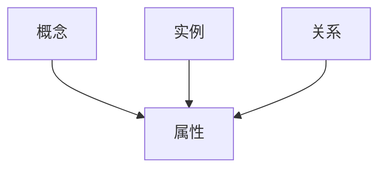
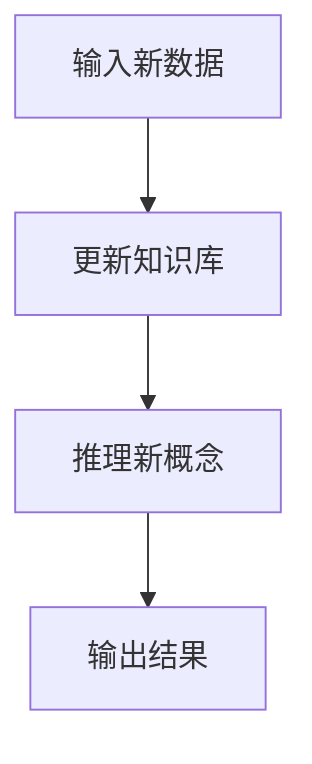
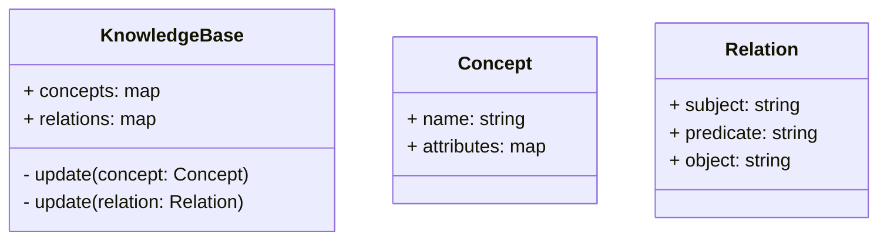
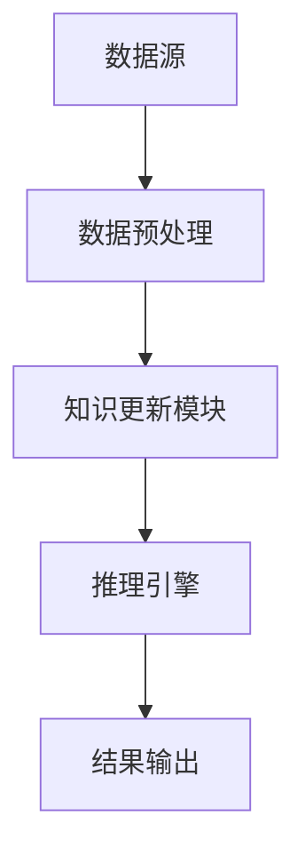
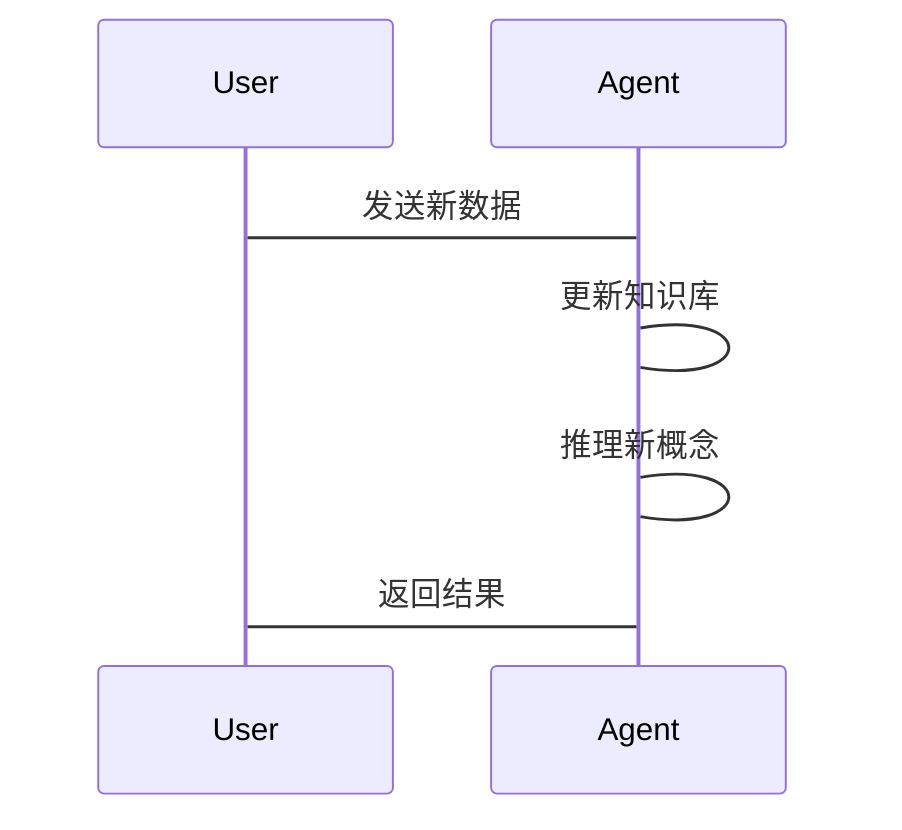

                 


# AI Agent的增量式概念学习与知识更新

---

## 关键词：
AI Agent、增量式学习、知识更新、概念学习、知识图谱、机器学习

---

## 摘要：
本文深入探讨了AI Agent在增量式概念学习与知识更新领域的核心原理与实现方法。文章从背景与概念入手，详细阐述了增量式学习的基本原理、算法实现、系统架构设计以及实际应用场景。通过结合理论分析与实践案例，本文为AI Agent的知识更新与概念学习提供了系统性的解决方案，同时提出了未来研究的潜在方向与优化建议。

---

## 第1章: AI Agent的背景与概念

### 1.1 问题背景与挑战

#### 1.1.1 当前AI Agent的核心问题
AI Agent（智能体）是指在特定环境中能够感知并自主行动以实现目标的实体。随着AI技术的快速发展，AI Agent的应用场景日益广泛，如智能助手、推荐系统、自动驾驶等。然而，AI Agent的核心问题之一是其知识体系的动态更新与维护。在实际应用中，AI Agent需要不断吸收新的知识和信息，以适应环境的变化和用户需求的更新。

#### 1.1.2 知识更新的必要性
知识更新是AI Agent保持高效性和准确性的重要保障。例如，在医疗领域，AI Agent需要及时更新最新的医学研究成果和治疗方案；在金融领域，AI Agent需要实时掌握市场动态和经济指标的变化。知识更新的及时性与准确性直接影响AI Agent的决策能力和用户满意度。

#### 1.1.3 增量式学习的定义与特点
增量式学习是一种动态学习方法，其核心特征是允许AI Agent在接收到新的数据或信息后，逐步更新其知识库，而不是一次性完成全部学习任务。与批量学习相比，增量式学习具有以下特点：
- 数据输入是逐步进行的，而非一次性加载；
- 知识库是动态更新的，能够适应新数据的输入；
- 学习过程是连续的，能够实时响应环境的变化。

### 1.2 问题描述与目标

#### 1.2.1 知识更新的基本问题
知识更新的核心问题在于如何高效地整合新信息，并保持知识体系的连贯性和一致性。例如，当引入新的概念或关系时，AI Agent需要确保这些新增信息能够与现有知识库无缝对接，并且不会导致逻辑冲突或信息冗余。

#### 1.2.2 增量式概念学习的定义
增量式概念学习是指AI Agent在接收到新的数据或信息后，通过逐步分析和推理，扩展其概念体系的过程。与传统的概念学习不同，增量式概念学习强调动态性和灵活性，能够在实时数据流中逐步构建和完善概念体系。

#### 1.2.3 知识更新的目标与边界
知识更新的目标是保持AI Agent的知识库始终反映最新的知识和信息。其边界包括：
- 知识更新的范围：仅限于特定领域或全局知识；
- 更新频率：实时更新或周期性更新；
- 更新方式：主动更新或被动更新。

### 1.3 问题解决与实现路径

#### 1.3.1 知识表示与推理
知识表示是AI Agent实现增量式学习的基础。常用的表示方法包括：
- 知识图谱：通过实体和关系的网络表示知识；
- 向量空间模型：通过向量表示概念的语义信息；
- 隐含语义表示：通过深度学习模型捕获概念的语义特征。

知识推理是基于知识表示进行的逻辑推理过程，旨在从现有知识中推导出新的概念或关系。

#### 1.3.2 增量式学习的实现方法
增量式学习的实现方法包括：
- 在线学习：实时处理数据流；
- 分批学习：按时间段或数据量分批处理；
- 混合学习：结合在线和分批学习的优势。

#### 1.3.3 知识更新的评估指标
知识更新的评估指标包括：
- 准确性：更新后知识的正确性；
- 及时性：更新的响应速度；
- 一致性：更新后知识的逻辑一致性；
- 有效性：更新对AI Agent性能的提升效果。

### 1.4 概念结构与核心要素

#### 1.4.1 概念网络的构建
概念网络是AI Agent知识体系的核心结构，由概念节点和关系边组成。例如，概念“汽车”可以与“品牌”、“型号”、“功能”等节点建立关联。

#### 1.4.2 知识图谱的核心要素
知识图谱由实体、属性和关系三类核心要素组成：
- 实体：表示具体事物，如“人”、“组织”、“事件”；
- 属性：描述实体的特征，如“年龄”、“职位”；
- 关系：表示实体之间的关联，如“属于”、“包含”、“导致”。

#### 1.4.3 概念间的关系与属性
概念间的关系包括：
- 同义关系：两个概念表示同一事物；
- 属于关系：一个概念是另一个概念的子集；
- 并列关系：多个概念并列存在，无包含关系。

---

## 第2章: 增量式概念学习的原理与机制

### 2.1 核心概念原理

#### 2.1.1 增量式学习的基本原理
增量式学习的核心原理在于其动态性和适应性。AI Agent通过逐步处理新数据，不断更新其知识库，并通过推理过程扩展其概念体系。

#### 2.1.2 知识表示的动态更新机制
知识表示的动态更新机制包括：
- 在线更新：实时处理新数据；
- 分批更新：按时间段或数据量分批处理；
- 增量更新：仅更新与新数据相关的部分。

#### 2.1.3 概念推理的逻辑框架
概念推理的逻辑框架包括：
- 前提：已有的知识；
- 结论：通过推理得到的新概念或关系；
- 推理规则：用于连接前提和结论的逻辑规则。

### 2.2 概念属性特征对比表

| 概念 | 属性 | 特征 |
|------|------|------|
| 增量式学习 | 数据输入方式 | 部分数据逐步输入 |
| 知识更新 | 表达形式 | 知识图谱或向量表示 |
| 概念推理 | 推理方式 | 基于图结构或向量空间 |

### 2.3 ER实体关系图



---

## 第3章: 增量式学习算法的实现

### 3.1 算法原理概述

#### 3.1.1 增量式学习的基本流程
增量式学习的基本流程包括：
1. 初始化知识库；
2. 接收新数据；
3. 更新知识库；
4. 推理新概念；
5. 输出结果。

#### 3.1.2 知识更新的核心算法
知识更新的核心算法包括：
- 在线学习算法：如感知机算法、支持向量机算法；
- 分批学习算法：如随机梯度下降算法、贝叶斯分类器。

#### 3.1.3 概念推理的数学模型
概念推理的数学模型包括：
- 向量空间模型：通过向量运算进行推理；
- 知识图谱推理：通过图结构进行推理；
- 深度学习模型：如Transformer模型。

### 3.2 算法流程图



### 3.3 核心算法实现

#### 3.3.1 在线学习算法

```python
def incremental_learning(new_data):
    # 更新知识库
    knowledge_base.update(new_data)
    # 推理新概念
    new_concepts = infer(knowledge_base)
    return new_concepts
```

#### 3.3.2 分批学习算法

```python
def batch_learning(batch_data):
    # 更新知识库
    knowledge_base.update(batch_data)
    # 推理新概念
    new_concepts = infer(knowledge_base)
    return new_concepts
```

### 3.4 数学模型与公式

#### 3.4.1 向量空间模型
在向量空间模型中，概念可以表示为向量空间中的点。例如，概念A和概念B的相似性可以通过向量的内积计算：

$$ \text{similarity}(A, B) = \frac{A \cdot B}{\|A\| \|B\|} $$

---

## 第4章: 系统分析与架构设计

### 4.1 问题场景介绍

#### 4.1.1 项目介绍
本项目旨在开发一个支持增量式概念学习的AI Agent系统，能够在实时数据流中动态更新知识库，并通过推理过程扩展概念体系。

#### 4.1.2 系统功能设计
系统功能设计包括：
- 数据采集：实时采集新数据；
- 知识更新：动态更新知识库；
- 概念推理：推理新概念；
- 结果输出：输出推理结果。

#### 4.1.3 领域模型设计



#### 4.1.4 系统架构设计



#### 4.1.5 系统接口设计
系统接口设计包括：
- 数据输入接口：接收新数据；
- 知识库接口：提供知识库的更新和查询功能；
- 推理接口：提供推理服务。

#### 4.1.6 系统交互设计



---

## 第5章: 项目实战

### 5.1 环境安装与配置

#### 5.1.1 环境要求
- Python 3.8及以上版本；
- 知识图谱存储库（如Neo4j）；
- 深度学习框架（如TensorFlow、PyTorch）。

#### 5.1.2 安装依赖
```bash
pip install neo4j python neo4j tensorflow
```

### 5.2 核心实现代码

#### 5.2.1 知识库更新模块

```python
from neo4j import GraphDatabase

class KnowledgeBase:
    def __init__(self, uri, user, password):
        self.driver = GraphDatabase.driver(uri, user, password)
    
    def update_concept(self, concept):
        # 更新概念
        pass
    
    def update_relation(self, relation):
        # 更新关系
        pass
```

#### 5.2.2 推理引擎模块

```python
from tensorflow.keras import layers

class In

