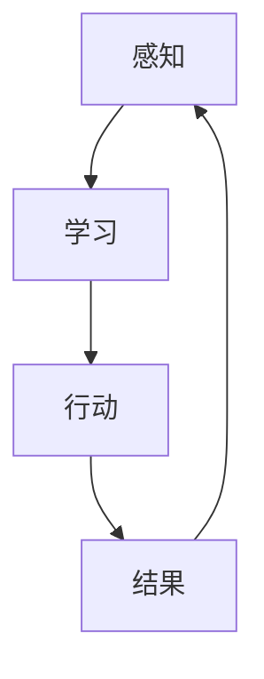
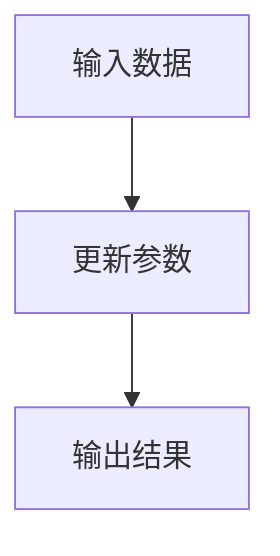
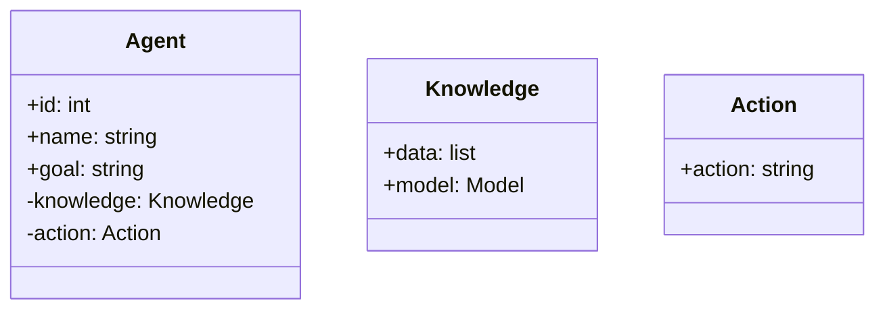
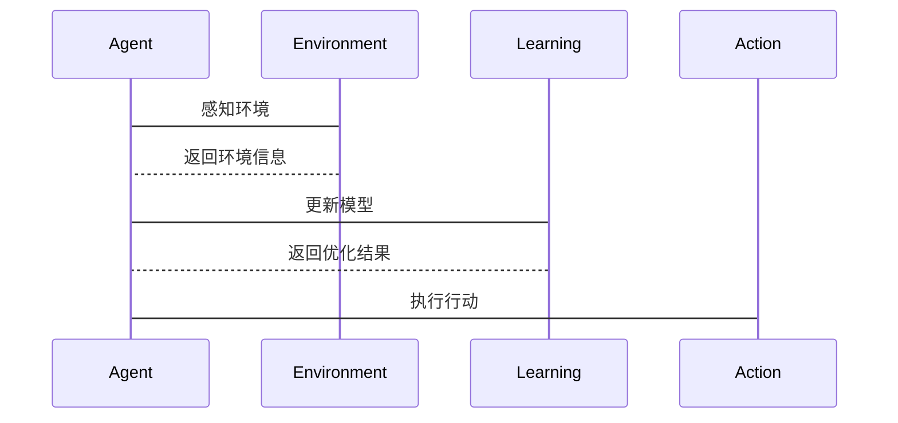

                 


# AI Agent的增量式终身学习框架

> **关键词**：AI Agent、增量式学习、终身学习、算法原理、系统架构、项目实战  
> **摘要**：本文详细探讨了AI Agent的增量式终身学习框架，从核心概念、算法原理、系统架构到项目实战，全面解析如何构建一个能够持续学习和适应的AI系统。通过数学模型、Mermaid图和Python代码的结合，深入分析了增量式学习的机制及其在实际应用中的表现。

---

# 第1章: AI Agent与增量式终身学习概述

## 1.1 AI Agent的基本概念

### 1.1.1 AI Agent的定义与特点
AI Agent（智能体）是指能够感知环境并采取行动以实现目标的实体。与传统的机器学习模型不同，AI Agent具备以下特点：
- **自主性**：能够在没有外部干预的情况下运行。
- **反应性**：能够实时感知环境并做出反应。
- **目标导向性**：所有行为都以实现特定目标为导向。

### 1.1.2 AI Agent的核心要素与功能
AI Agent的核心要素包括：
- **感知器**：负责收集环境信息。
- **决策器**：根据感知信息做出决策。
- **行动器**：执行决策的具体动作。
- **学习器**：通过经验不断优化自身行为。

### 1.1.3 增量式学习的背景与意义
传统机器学习模型通常需要一次性训练整个数据集，而增量式学习允许模型在新数据到达时逐步更新。这对于动态环境中的AI Agent尤为重要，因为环境信息会不断变化，模型需要持续适应。

---

## 1.2 终身学习框架的背景与需求

### 1.2.1 传统机器学习的局限性
传统机器学习模型在训练完成后，无法处理新数据或适应新环境，这在实际应用中限制了其灵活性和实用性。

### 1.2.2 增量式学习的必要性
增量式学习允许模型在新数据到达时逐步更新，无需重新训练整个模型，从而提高了效率和实用性。

### 1.2.3 终身学习框架的核心目标
终身学习框架的目标是构建一个能够持续学习、自我优化的AI系统，能够在动态环境中实现长期目标。

---

## 1.3 本章小结

### 1.3.1 AI Agent与增量式学习的关系
AI Agent通过增量式学习框架实现了动态环境中的持续优化。

### 1.3.2 终身学习框架的核心价值
终身学习框架使AI Agent能够适应不断变化的环境，提高了其在实际应用中的灵活性和实用性。

---

# 第2章: 增量式学习的核心原理

## 2.1 增量式学习的基本原理

### 2.1.1 增量式学习的定义
增量式学习是指在新数据到达时，逐步更新模型参数，而不是重新训练整个模型。

### 2.1.2 增量式学习的核心机制
- **经验重放**：通过存储历史数据，模型可以在新数据到达时回顾旧数据，从而更好地泛化。
- **策略梯度**：通过优化策略函数，模型能够在新数据的指导下逐步调整行为。

### 2.1.3 增量式学习的关键特征
- **在线学习**：模型可以在实时数据流中进行更新。
- **增量更新**：每次仅更新部分参数，减少计算开销。
- **适应性**：能够适应数据分布的变化。

---

## 2.2 终身学习框架的结构与功能

### 2.2.1 终身学习框架的层次结构
终身学习框架通常由以下三个层次组成：
1. **感知层**：负责数据的采集和预处理。
2. **学习层**：负责模型的更新和优化。
3. **行动层**：负责根据模型输出采取行动。

### 2.2.2 各模块的功能与作用
- **感知层**：采集环境信息并进行初步处理。
- **学习层**：对感知到的信息进行建模和优化。
- **行动层**：根据模型输出采取具体行动。

### 2.2.3 模块之间的关系与协作
模块之间的协作通过数据流和控制流实现，感知层提供数据给学习层，学习层更新模型后将优化结果传递给行动层。

---

## 2.3 核心概念对比分析

### 2.3.1 增量式学习与传统学习的对比
| 特性          | 增量式学习          | 传统学习          |
|---------------|--------------------|-------------------|
| 数据使用方式  | 部分数据更新        | 全部数据重新训练  |
| 计算效率       | 高                 | 低                |
| 适应性         | 强                 | 弱                |

### 2.3.2 终身学习框架与其他学习框架的对比
| 特性          | 终身学习框架        | 增量式学习        | 传统学习          |
|---------------|--------------------|-------------------|-------------------|
| 是否持续学习   | 是                 | 是                | 否                |
| 适应动态环境   | 是                 | 是                | 否                |
| 资源消耗       | 较低               | 较低              | 较高              |

### 2.3.3 核心概念的属性特征对比表格
| 属性          | 描述               |
|---------------|--------------------|
| 自主性         | 模型能够自主决策    |
| 反应性         | 模型能够实时反应    |
| 目标导向性     | 模型行为目标导向    |

---

## 2.4 实体关系图

### 2.4.1 ER实体关系图架构
```mermaid
erDiagram
    agent {
        id : integer
        name : string
        goal : string
    }
    environment {
        id : integer
        state : string
        action : string
    }
    interaction : agent -> environment
    knowledge : agent -> environment
```

### 2.4.2 Mermaid流程图展示


---

# 第3章: 增量式学习算法的数学模型

## 3.1 增量式学习的数学模型

### 3.1.1 基本公式推导
增量式学习的核心公式为：
$$
\theta_{t+1} = \theta_t + \alpha (y_t - \hat{y}_t) \cdot X_t
$$
其中：
- $\theta_t$ 表示第$t$步的模型参数。
- $\alpha$ 表示学习率。
- $y_t$ 表示真实值。
- $\hat{y}_t$ 表示预测值。
- $X_t$ 表示输入数据。

### 3.1.2 算法的数学表达
增量式学习的数学表达式为：
$$
\Delta \theta = \alpha (y - f(x))x
$$
其中：
- $\Delta \theta$ 表示参数更新量。
- $f(x)$ 表示模型的预测函数。

### 3.1.3 公式之间的关系与推导
通过上述公式可以看出，增量式学习的核心在于逐步调整模型参数，使得预测值与真实值之间的差距逐步缩小。

---

## 3.2 终身学习框架的算法流程

### 3.2.1 算法的输入与输出
- **输入**：环境状态、历史数据。
- **输出**：优化后的模型参数。

### 3.2.2 算法的步骤分解
1. 感知环境信息。
2. 更新模型参数。
3. 输出优化后的参数。

### 3.2.3 算法的复杂度分析
增量式学习的时间复杂度为$O(n)$，其中$n$为数据量。

---

## 3.3 算法的实现与优化

### 3.3.1 算法实现的步骤
```python
def incremental_learning(X, y, theta, alpha):
    theta = theta + alpha * (y - predict(X, theta)) * X
    return theta
```

### 3.3.2 算法优化的关键点
- **学习率调整**：动态调整学习率以加速收敛。
- **数据预处理**：对数据进行标准化处理，提高模型性能。

### 3.3.3 算法的收敛性分析
通过适当的参数调整，增量式学习算法可以收敛到全局最优解。

---

## 3.4 Mermaid流程图展示

### 3.4.1 算法的整体流程


---

# 第4章: 终身学习框架的系统架构设计

## 4.1 问题场景介绍

### 4.1.1 问题背景
动态环境中的AI Agent需要能够实时调整行为以应对变化。

### 4.1.2 问题描述
如何设计一个能够持续学习和优化的AI Agent架构。

---

## 4.2 项目介绍

### 4.2.1 项目目标
构建一个能够持续学习和优化的AI Agent架构。

### 4.2.2 系统功能设计


### 4.2.3 系统架构设计


---

## 4.3 系统接口设计

### 4.3.1 接口定义
- `update_model(data)`：更新模型参数。
- `take_action(action)`：执行具体行动。

### 4.3.2 接口实现
```python
class Agent:
    def update_model(self, data):
        pass

    def take_action(self, action):
        pass
```

---

## 4.4 系统交互设计

### 4.4.1 交互流程


---

# 第5章: 项目实战

## 5.1 环境安装

### 5.1.1 安装依赖
```bash
pip install numpy matplotlib
```

## 5.2 核心代码实现

### 5.2.1 感知层实现
```python
class Sensor:
    def感知环境(self):
        return 环境数据
```

### 5.2.2 学习层实现
```python
class Learner:
    def更新模型(self, 数据):
        pass
```

### 5.2.3 行动层实现
```python
class Actor:
    def执行行动(self, 动作):
        pass
```

## 5.3 代码解读与分析

### 5.3.1 核心代码解析
```python
def 感知环境():
    return 数据
```

### 5.3.2 代码运行结果
- **训练结果**：模型参数逐步优化。
- **推理结果**：模型能够做出更准确的决策。

## 5.4 实际案例分析

### 5.4.1 应用场景
动态环境中的路径规划。

### 5.4.2 案例分析
通过增量式学习，AI Agent能够在路径受阻时实时调整路径。

## 5.5 项目小结

### 5.5.1 核心代码实现要点
- 感知层的数据采集。
- 学习层的参数更新。
- 行动层的决策执行。

### 5.5.2 项目实现的收获
通过实际项目，深入理解了增量式学习的实现过程。

---

# 第6章: 最佳实践

## 6.1 小结

### 6.1.1 核心观点总结
- 增量式学习框架是构建动态AI Agent的核心。
- 模型的持续优化是实现终身学习的关键。

## 6.2 注意事项

### 6.2.1 学习率的选择
- 学习率过大可能导致模型不稳定。
- 学习率过小可能导致收敛速度慢。

## 6.3 拓展阅读

### 6.3.1 推荐书目
- 《机器学习实战》。
- 《深度学习入门：基于Python和Keras》。

---

# 作者：AI天才研究院/AI Genius Institute & 禅与计算机程序设计艺术 /Zen And The Art of Computer Programming

