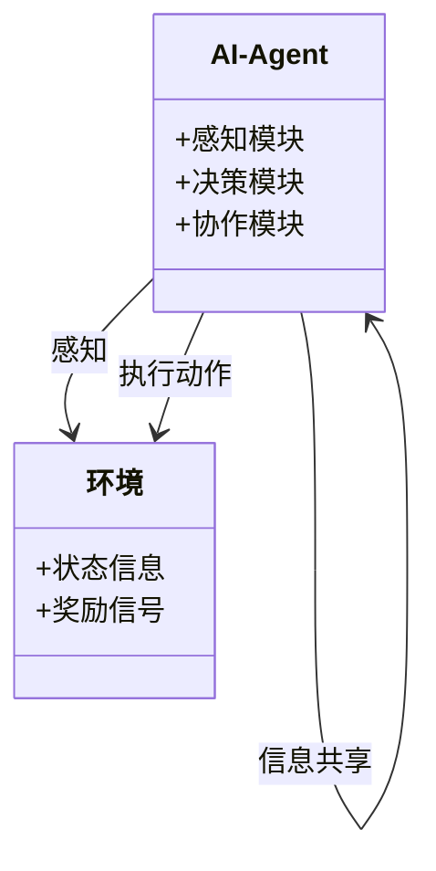
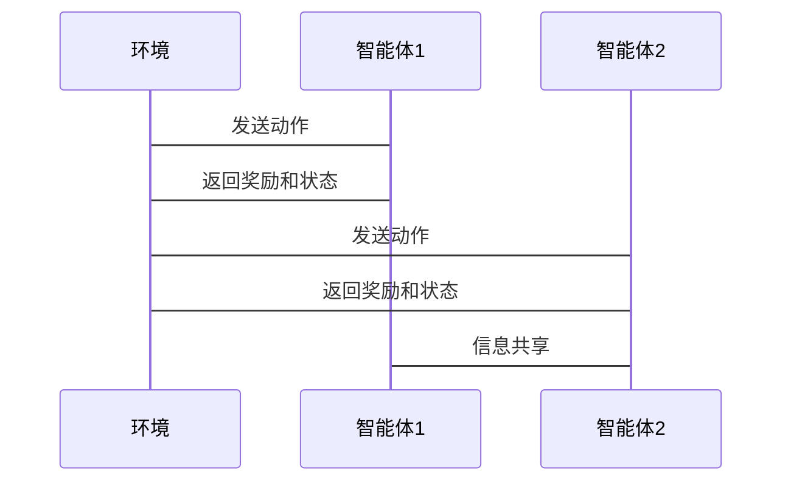

                 


# AI Agent的多Agent博弈与策略学习

> 关键词：AI Agent，多Agent博弈，策略学习，强化学习，多智能体系统

> 摘要：本文探讨了AI Agent在多Agent博弈环境中的策略学习方法，分析了多Agent系统的基本概念、博弈论基础、策略学习的核心算法，以及系统架构设计。通过实际案例分析和代码实现，详细讲解了如何在多Agent环境中进行有效的策略学习，并提出了相关的最佳实践和未来研究方向。

---

## 第1章: AI Agent的基本概念与应用

### 1.1 AI Agent的定义与特点

#### 1.1.1 什么是AI Agent
AI Agent（人工智能代理）是指能够感知环境并采取行动以实现目标的智能体。AI Agent可以是软件程序、机器人或其他智能系统，具备自主决策的能力。

#### 1.1.2 AI Agent的核心特点
- **自主性**：能够在没有外部干预的情况下自主决策。
- **反应性**：能够实时感知环境并做出反应。
- **目标导向性**：所有行动都以实现特定目标为导向。
- **社会性**：能够在多Agent环境中与其他智能体协作或竞争。

#### 1.1.3 AI Agent与传统程序的区别
传统的程序通常按照预定义的规则执行任务，而AI Agent具备学习和适应能力，能够在动态环境中调整策略。

### 1.2 多Agent系统的基本概念

#### 1.2.1 多Agent系统定义
多Agent系统是指由多个智能体组成的系统，这些智能体能够通过交互和协作完成复杂的任务。

#### 1.2.2 多Agent系统的分类
- **结构化环境**：任务和环境是确定的，规则明确。
- **非结构化环境**：任务和环境不确定，智能体需要自主学习。
- **分布式环境**：智能体分布在不同的物理或逻辑位置。

#### 1.2.3 多Agent系统的特点
- **分布式计算**：任务分解为多个子任务，由不同智能体完成。
- **协作与竞争**：智能体之间可以协作或竞争以实现全局目标。
- **动态性**：环境和任务可能随时变化，智能体需要动态调整策略。

### 1.3 多Agent博弈的应用场景

#### 1.3.1 游戏AI
在游戏开发中，多Agent系统可以用于实现多个NPC（非玩家角色）的行为决策。

#### 1.3.2 机器人协作
在工业自动化中，多个机器人可以协作完成复杂的装配任务。

#### 1.3.3 分布式系统优化
在分布式计算环境中，多Agent系统可以优化资源分配和任务调度。

### 1.4 本章小结
本章介绍了AI Agent的基本概念和特点，并讨论了多Agent系统的基本概念、分类及其应用场景，为后续章节奠定了基础。

---

## 第2章: 多Agent博弈的理论基础

### 2.1 博弈论基础

#### 2.1.1 竞争与合作的基本概念
博弈论是研究竞争与合作的数学理论，广泛应用于经济学、生物学和社会学等领域。

#### 2.1.2 博弈的基本要素
- **参与者**：博弈中的决策者。
- **策略**：参与者可能采取的行动或选择。
- **结果**：每个策略组合带来的结果。
- **支付函数**：参与者在不同结果中的收益或损失。

#### 2.1.3 博弈的分类
- **零和博弈**：参与者收益总和为零。
- **非零和博弈**：参与者收益总和不为零。
- **完全信息博弈**：所有参与者都了解所有信息。
- **不完全信息博弈**：参与者不了解所有信息。

#### 2.1.4 纳什均衡
纳什均衡是博弈论中的一个关键概念，指在策略组合中，每个参与者都无法通过单方面改变策略而获得更好的结果。

### 2.2 多人博弈的基本原理

#### 2.2.1 纯策略与混合策略
- **纯策略**：参与者在给定情况下仅选择一种策略。
- **混合策略**：参与者以一定概率随机选择多个策略。

#### 2.2.2 纳什均衡
纳什均衡是博弈论的核心，确保每个参与者的策略都是最优反应。

#### 2.2.3 博弈树与博弈图
- **博弈树**：以树状结构表示博弈的可能进行过程。
- **博弈图**：以图结构表示博弈的可能状态和转移。

### 2.3 多Agent博弈的独特性

#### 2.3.1 多Agent博弈的复杂性
随着参与者的增加，博弈的复杂性呈指数级增长。

#### 2.3.2 多Agent博弈中的角色与任务分配
智能体需要根据任务分配不同的角色，以实现全局目标。

#### 2.3.3 多Agent博弈中的信息不对称
不同智能体可能掌握不同的信息，导致决策的复杂性。

### 2.4 本章小结
本章深入探讨了博弈论的基础知识，分析了多Agent博弈的独特性及其对策略学习的影响。

---

## 第3章: 策略学习的核心算法

### 3.1 强化学习基础

#### 3.1.1 强化学习的基本概念
强化学习是一种通过试错机制来学习最优策略的方法，智能体通过与环境交互来获得奖励或惩罚。

#### 3.1.2 强化学习的核心要素
- **状态（State）**：智能体所处的环境情况。
- **动作（Action）**：智能体采取的行动。
- **奖励（Reward）**：智能体行动后获得的反馈。
- **策略（Policy）**：智能体选择动作的概率分布。
- **价值函数（Value Function）**：智能体在特定状态下能够获得的期望奖励。

#### 3.1.3 强化学习的数学模型
智能体的目标是通过最大化累积奖励来学习最优策略。数学模型通常涉及状态值函数 \( V(s) \) 和动作值函数 \( Q(s,a) \)。

---

### 3.2 Q-learning算法

#### 3.2.1 Q-learning的基本原理
Q-learning是一种经典的强化学习算法，通过更新Q值表来学习最优策略。Q值表示在状态 \( s \) 下采取动作 \( a \) 的预期奖励。

#### 3.2.2 Q-learning的算法流程
1. 初始化Q值表为零。
2. 在每一步选择一个动作 \( a \) 并执行。
3. 计算获得的奖励 \( r \) 和下一个状态 \( s' \)。
4. 更新Q值：\( Q(s,a) = Q(s,a) + \alpha [r + \gamma \max Q(s',a') - Q(s,a)] \)。

#### 3.2.3 Q-learning的应用场景
Q-learning适用于离散状态和动作空间的环境，常用于游戏AI和机器人控制。

---

### 3.3 多智能体强化学习

#### 3.3.1 多智能体强化学习的基本概念
多智能体强化学习涉及多个智能体在共享环境中协作或竞争，每个智能体的学习过程会影响其他智能体的行为。

#### 3.3.2 多智能体强化学习的挑战
- **协调问题**：智能体需要协调动作以实现共同目标。
- **信息共享**：智能体之间需要共享信息以做出最优决策。
- **策略冲突**：智能体之间的策略可能相互影响，导致竞争加剧。

#### 3.3.3 多智能体强化学习的算法
一种常用的算法是基于Q-learning的多智能体版本，通过共享Q值表或使用分布式策略来实现协作。

---

## 第4章: 系统架构与设计

### 4.1 系统功能设计

#### 4.1.1 多Agent系统的需求分析
根据具体应用确定系统需求，例如任务分配、协作决策、信息共享等。

#### 4.1.2 多Agent系统的功能模块
- **感知模块**：负责环境信息的获取。
- **决策模块**：基于感知信息做出决策。
- **协作模块**：实现智能体之间的信息共享和协调。

#### 4.1.3 功能设计的领域模型
使用mermaid类图描述系统的各个模块及其关系。



### 4.2 系统架构设计

#### 4.2.1 系统架构设计图
使用mermaid架构图描述系统的整体架构。

```mermaid
container 多Agent系统 {
    component 智能体1 {
        -感知模块
        -决策模块
        -协作模块
    }
    component 智能体2 {
        -感知模块
        -决策模块
        -协作模块
    }
    component 交互接口 {
        -接收输入
        -输出结果
    }
}
```

#### 4.2.2 系统交互设计
使用mermaid序列图描述智能体与环境之间的交互过程。



### 4.3 接口设计与实现

#### 4.3.1 接口定义
- **输入接口**：接收环境状态和当前动作。
- **输出接口**：输出决策结果和奖励信号。

#### 4.3.2 接口实现
通过REST API或消息队列实现智能体之间的通信。

---

## 第5章: 项目实战

### 5.1 环境搭建

#### 5.1.1 环境需求
- **编程语言**：Python
- **深度学习框架**：TensorFlow或PyTorch
- **强化学习库**：如stable-baselines

#### 5.1.2 安装依赖
```bash
pip install gym stable-baselines3
```

### 5.2 核心实现

#### 5.2.1 Q-learning算法实现
```python
import numpy as np

class QLearning:
    def __init__(self, state_space, action_space, alpha=0.1, gamma=0.99):
        self.q_table = np.zeros(state_space)
        self.alpha = alpha
        self.gamma = gamma

    def choose_action(self, state):
        return np.argmax(self.q_table[state])

    def update_q(self, state, action, reward, next_state):
        self.q_table[state][action] += self.alpha * (reward + self.gamma * np.max(self.q_table[next_state]) - self.q_table[state][action])
```

#### 5.2.2 多智能体协作实现
```python
import gym

env = gym.make('Multi-Agent-Environment-v0')
agents = [QLearning(env.observation_space, env.action_space) for _ in range(2)]

for _ in range(1000):
    state = env.reset()
    done = False
    while not done:
        actions = [agent.choose_action(state[i]) for i in range(len(agents))]
        next_state, reward, done, info = env.step(actions)
        for i in range(len(agents)):
            agents[i].update_q(state[i], actions[i], reward[i], next_state[i])
```

### 5.3 案例分析与解读

#### 5.3.1 游戏AI应用
在经典游戏环境中训练AI Agent进行策略学习。

#### 5.3.2 机器人协作优化
通过多智能体协作优化生产流程。

### 5.4 本章小结
本章通过实际案例展示了如何在多Agent环境中实现策略学习，并分析了实际应用中的挑战和解决方案。

---

## 第6章: 扩展与展望

### 6.1 当前研究热点

#### 6.1.1 联合策略学习
研究如何在多Agent系统中实现联合策略优化。

#### 6.1.2 基于Transformer的策略学习
探索使用Transformer模型进行策略学习的可能性。

### 6.2 未来研究方向

#### 6.2.1 多模态策略学习
结合视觉、听觉等多种感知方式提升策略学习效果。

#### 6.2.2 分布式强化学习
研究如何在分布式环境中实现高效的强化学习。

### 6.3 最佳实践 tips

#### 6.3.1 系统设计建议
- 确保智能体之间的信息共享机制合理。
- 定期评估和优化策略。

#### 6.3.2 代码实现建议
- 使用现有的强化学习框架（如stable-baselines）以提高效率。
- 定期保存和恢复训练进度。

### 6.4 本章小结
本章展望了多Agent博弈与策略学习的未来发展方向，并提出了相关的研究热点和实践建议。

---

## 作者信息

作者：AI天才研究院/AI Genius Institute  
联系邮箱：contact@ai-genius-institute.com  
官方网站：https://www.ai-genius-institute.com

---

通过以上结构和内容，本文系统地介绍了AI Agent的多Agent博弈与策略学习的核心概念、算法原理和实际应用，为读者提供了全面的知识体系和实践指导。

