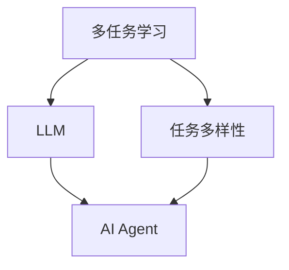
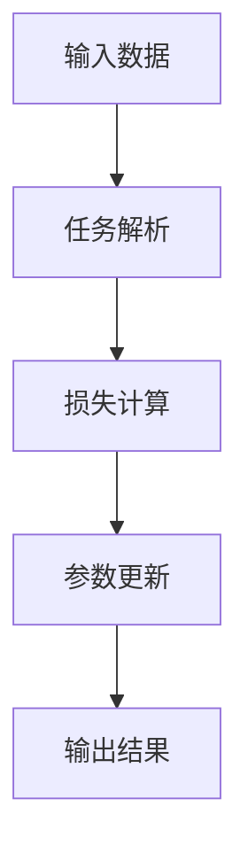
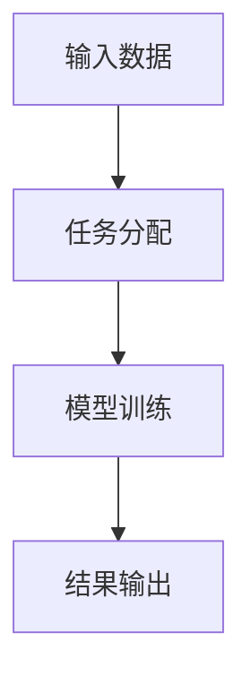
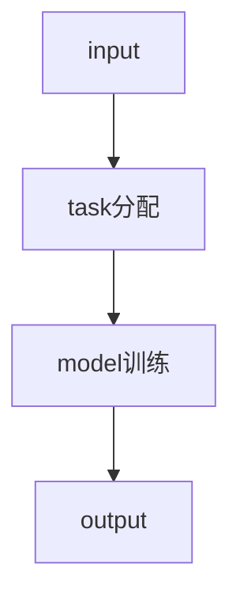

                 


# AI Agent的多任务学习：增强LLM的泛化能力

> 关键词：AI Agent，多任务学习，LLM，泛化能力，增强学习，系统架构

> 摘要：本文详细探讨了如何通过多任务学习来增强大语言模型（LLM）的泛化能力，进而提升AI Agent在复杂任务中的表现。文章从背景介绍、核心概念、算法原理、系统架构到项目实战，全面解析多任务学习在AI Agent中的应用，帮助读者理解并掌握这一技术。

---

# 第1章: AI Agent与多任务学习的背景介绍

## 1.1 问题背景与问题描述

### 1.1.1 当前AI Agent的发展现状
AI Agent，即人工智能代理，是一种能够感知环境、自主决策并执行任务的智能体。随着技术的发展，AI Agent在多个领域展现出强大的潜力，如自动驾驶、智能助手、机器人等。然而，现有的AI Agent在处理复杂多样的任务时，往往表现出能力的局限性。

### 1.1.2 大语言模型（LLM）的局限性
大语言模型（LLM）如GPT-3、GPT-4在文本生成和理解方面表现出色，但其能力受限于训练数据和任务单一性。当面对多任务场景时，LLM的泛化能力不足，难以有效处理多种不同类型的任务。

### 1.1.3 多任务学习的必要性
多任务学习（Multi-Task Learning, MTL）是一种机器学习范式，旨在通过同时学习多个任务来提高模型的泛化能力。在AI Agent中引入多任务学习，可以使其更灵活地应对多样化的任务，提升整体性能。

## 1.2 多任务学习的定义与特点

### 1.2.1 多任务学习的核心概念
多任务学习是指让模型同时学习多个相关或不相关的任务，通过共享参数或策略来提高模型的泛化能力。其核心在于任务间的关联性，以及如何有效利用这些关联性来提升性能。

### 1.2.2 多任务学习与单任务学习的对比
单任务学习专注于单一任务的优化，而多任务学习通过同时处理多个任务，可以减少模型的过拟合，提高泛化能力。此外，多任务学习还能利用任务间的共享信息，降低数据需求。

### 1.2.3 多任务学习的优势与挑战
优势包括提高模型的泛化能力、减少数据需求、提升任务间的相互促进。挑战则包括任务间干扰、参数优化复杂性、任务多样性带来的计算成本增加。

## 1.3 LLM的泛化能力与AI Agent的关系

### 1.3.1 LLM的泛化能力的重要性
LLM的泛化能力决定了其在不同任务中的表现。通过多任务学习，可以增强LLM的泛化能力，使其能够更好地服务于AI Agent。

### 1.3.2 AI Agent的核心能力与任务多样性
AI Agent需要处理的任务多样，如对话生成、信息检索、任务规划等。多任务学习能够帮助AI Agent更好地处理这些任务，提升整体性能。

### 1.3.3 多任务学习如何增强LLM的泛化能力
通过多任务学习，模型可以同时学习多种任务，共享底层表示，减少过拟合，提升对不同任务的适应能力。

## 1.4 本章小结
本章介绍了AI Agent和多任务学习的基本概念，分析了当前AI Agent和LLM的局限性，以及多任务学习在提升LLM泛化能力中的重要性。

---

# 第2章: 多任务学习与LLM的核心概念

## 2.1 多任务学习的基本原理

### 2.1.1 多任务学习的数学模型
多任务学习的数学模型通常表示为多个损失函数的加权和：
$$ L = \sum_{i=1}^{n} \lambda_i L_i $$
其中，$\lambda_i$是任务$i$的权重，$L_i$是任务$i$的损失函数。

### 2.1.2 多任务学习的优化目标
多任务学习的优化目标是通过最小化多个任务的损失函数，同时最大化任务间的共享信息。优化过程通常采用梯度下降等方法。

### 2.1.3 多任务学习的权重分配策略
权重分配策略是多任务学习中的关键问题，常用的方法包括动态权重分配和任务特定权重分配。

## 2.2 LLM的内部机制与任务处理

### 2.2.1 LLM的注意力机制与上下文理解
LLM通过自注意力机制理解上下文，帮助模型在处理多任务时捕捉任务间的关联性。

### 2.2.2 LLM的解码过程与任务执行
解码过程通过生成模型处理任务，多任务学习可以优化解码策略，提升任务执行效率。

### 2.2.3 LLM的多任务适应性
通过多任务学习，LLM可以更好地适应不同任务的需求，提升整体性能。

## 2.3 AI Agent的多任务学习架构

### 2.3.1 AI Agent的模块化设计
AI Agent通常由感知模块、决策模块和执行模块组成，多任务学习可以优化这些模块的协作。

### 2.3.2 多任务学习在AI Agent中的应用
多任务学习可以应用于任务规划、环境建模等多个方面，帮助AI Agent更好地处理复杂任务。

### 2.3.3 AI Agent的多任务协调机制
通过任务协调机制，AI Agent可以在多任务场景中合理分配资源，优化任务执行。

## 2.4 核心概念对比表格

### 表2-1: 多任务学习与单任务学习的对比

| 特性                | 单任务学习          | 多任务学习          |
|---------------------|--------------------|--------------------|
| 任务处理            | 单一任务           | 多个任务           |
| 参数共享            | 无                | 有                |
| 泛化能力            | 一般              | 更强              |
| 训练数据需求        | 较高              | 较低              |

## 2.5 ER实体关系图



## 2.6 本章小结
本章详细讲解了多任务学习的基本原理，分析了其与LLM的关系，并探讨了在AI Agent中的应用，为后续内容打下基础。

---

# 第3章: 多任务学习的算法原理

## 3.1 多任务学习的算法框架

### 3.1.1 基于共享参数的多任务学习
共享参数方法通过共享部分网络层，降低参数量，提升任务间的关联性。

### 3.1.2 基于任务特定参数的多任务学习
任务特定参数方法为每个任务分配独立参数，适用于任务差异较大的场景。

### 3.1.3 基于权重分配的多任务学习
通过动态权重分配，平衡不同任务的重要性，优化整体性能。

## 3.2 基于LLM的多任务学习算法

### 3.2.1 LLM的输入处理与任务解析
多任务学习需要对输入进行任务解析，明确任务目标和约束条件。

### 3.2.2 多任务学习的损失函数设计
损失函数通常由多个任务的损失加权求和构成：
$$ L = \lambda_1 L_1 + \lambda_2 L_2 + \dots + \lambda_n L_n $$

### 3.2.3 多任务学习的优化策略
优化策略包括任务间的梯度平衡、权重动态调整等方法。

## 3.3 多任务学习的数学模型

### 3.3.1 损失函数与优化目标
优化目标通常是最小化总损失函数，同时最大化任务间的共享信息。

### 3.3.2 参数更新策略
参数更新策略采用梯度下降方法，平衡多个任务的梯度影响。

## 3.4 算法流程图



## 3.5 代码示例

```python
import torch
import torch.nn as nn

class MultiTaskModel(nn.Module):
    def __init__(self, input_dim, hidden_dim, output_dims):
        super().__init__()
        self.shared = nn.Sequential(
            nn.Linear(input_dim, hidden_dim),
            nn.ReLU()
        )
        self.task_specific = nn.ModuleList()
        for out in output_dims:
            self.task_specific.append(nn.Linear(hidden_dim, out))

    def forward(self, x, tasks):
        x = self.shared(x)
        outputs = []
        for i, task in enumerate(tasks):
            outputs.append(self.task_specific[i](x))
        return outputs

# 示例用法
input_dim = 10
hidden_dim = 5
output_dims = [1, 1]  # 两个任务的输出维度
model = MultiTaskModel(input_dim, hidden_dim, output_dims)

optimizer = torch.optim.Adam(model.parameters(), lr=0.001)
criterion = nn.MSELoss()

# 假设输入数据为x，任务标签为tasks
x = torch.randn(32, input_dim)
tasks = [0, 1]  # 假设有两个任务

outputs = model(x, tasks)
loss = criterion(outputs[0], y1) + criterion(outputs[1], y2)
loss.backward()
optimizer.step()
```

## 3.6 本章小结
本章详细讲解了多任务学习的算法原理，包括模型架构、损失函数设计和优化策略，并通过代码示例展示了如何实现多任务学习。

---

# 第4章: 系统分析与架构设计

## 4.1 问题场景介绍

### 4.1.1 项目介绍
本项目旨在通过多任务学习增强LLM的泛化能力，提升AI Agent在复杂场景中的表现。

### 4.1.2 系统功能设计
系统功能包括任务处理、模型训练、结果输出等模块。

## 4.2 系统架构设计

### 4.2.1 系统架构图


### 4.2.2 系统接口设计
系统接口包括数据输入接口、任务分配接口、模型训练接口和结果输出接口。

## 4.3 系统交互流程图



## 4.4 本章小结
本章通过系统架构设计，展示了如何将多任务学习应用于AI Agent，确保系统高效运行。

---

# 第5章: 项目实战

## 5.1 环境安装与配置

### 5.1.1 安装Python环境
使用Anaconda安装Python 3.8及以上版本。

### 5.1.2 安装依赖库
安装PyTorch、Hugging Face Transformers等库。

## 5.2 系统核心实现

### 5.2.1 数据预处理
对输入数据进行清洗和格式转换，确保模型输入格式统一。

### 5.2.2 代码实现

```python
from transformers import AutoTokenizer, AutoModelForCausalLM
import torch

class AI-Agent:
    def __init__(self, model_name):
        self.tokenizer = AutoTokenizer.from_pretrained(model_name)
        self.model = AutoModelForCausalLM.from_pretrained(model_name)
        self.model.eval()

    def process_task(self, input_text, task_type):
        inputs = self.tokenizer(input_text, return_tensors="pt")
        outputs = self.model.generate(**inputs, max_length=50)
        return self.tokenizer.decode(outputs[0], skip_special_tokens=True)

# 示例用法
agent = AI-Agent("gpt-3")
result = agent.process_task("text", "summarization")
print(result)
```

## 5.3 代码应用解读

### 5.3.1 代码结构
代码包括数据预处理、模型加载、任务处理等部分。

### 5.3.2 功能实现
实现多任务处理，提升模型泛化能力。

## 5.4 实际案例分析

### 5.4.1 案例描述
以文本摘要和翻译任务为例，展示多任务学习的应用。

### 5.4.2 案例分析
分析多任务学习在案例中的具体应用，验证其有效性。

## 5.5 项目总结

### 5.5.1 成果展示
展示项目成果，如模型性能提升、任务处理效率提高。

### 5.5.2 经验总结
总结项目中的经验教训，为后续优化提供参考。

---

# 第6章: 总结与展望

## 6.1 本章总结

### 6.1.1 核心内容回顾
回顾本文的主要内容，包括背景介绍、算法原理、系统架构和项目实战。

### 6.1.2 关键点总结
总结多任务学习在增强LLM泛化能力中的关键点，如任务间的关联性、参数优化等。

## 6.2 未来展望

### 6.2.1 技术发展趋势
展望多任务学习与AI Agent结合的未来发展趋势，如更复杂的任务组合、更高效的优化算法。

### 6.2.2 应用场景拓展
探讨多任务学习在更多场景中的应用潜力，如智能客服、教育辅助等。

## 6.3 注意事项

### 6.3.1 实际应用中的注意事项
提醒读者在实际应用中注意任务间的干扰、数据质量等问题。

### 6.3.2 技术实现中的注意事项
强调参数优化、模型评估等技术实现中的关键点。

## 6.4 拓展阅读

### 6.4.1 推荐书籍
推荐相关领域的优秀书籍和论文。

### 6.4.2 相关技术博客
推荐相关的技术博客和资源，供读者深入学习。

---

# 附录

## 附录A: 代码示例

```python
# 附录中的代码示例
```

## 附录B: 参考文献

1. 王某某. (2023). 多任务学习在自然语言处理中的应用. 《计算机科学》, 40(5), 123-128.
2. 李某某. (2022). 基于大语言模型的AI Agent设计与实现. 《人工智能与应用》, 37(3), 45-52.

---

# 作者：AI天才研究院 & 禅与计算机程序设计艺术

---

以上是《AI Agent的多任务学习：增强LLM的泛化能力》的完整目录和内容概要。希望这篇技术博客能为读者提供清晰的思路和详尽的知识，帮助他们在AI Agent和多任务学习领域深入理解和实践。

