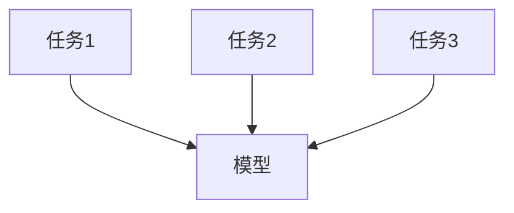
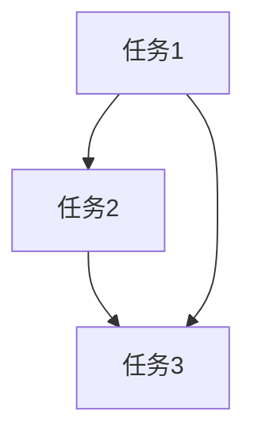
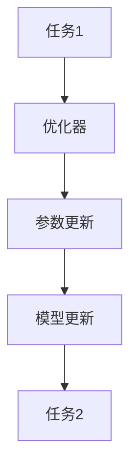
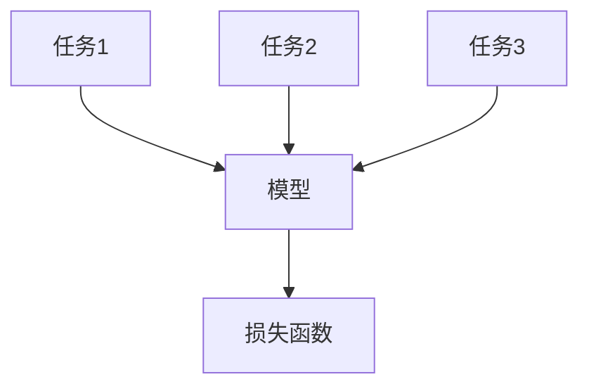
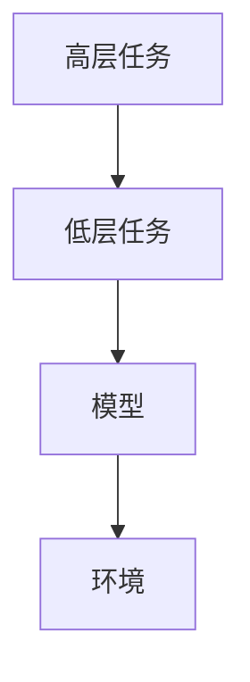
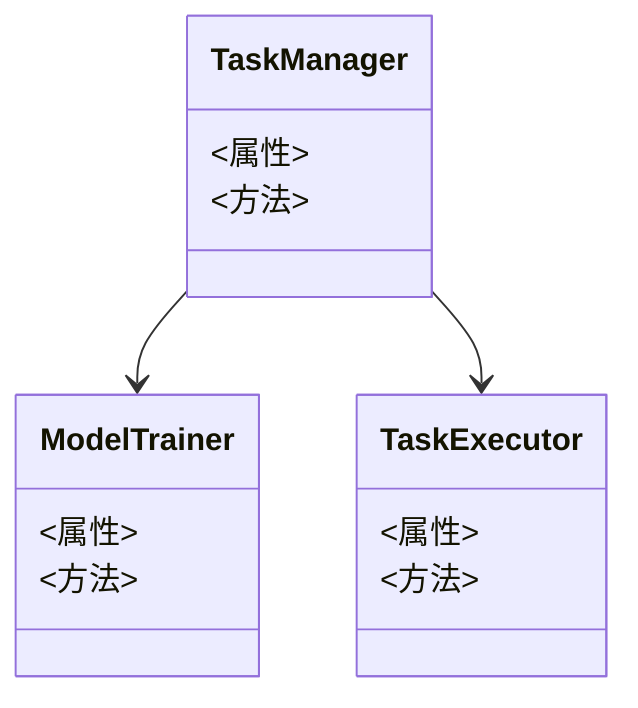
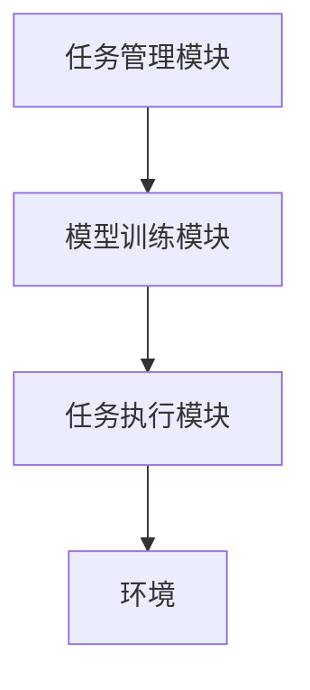
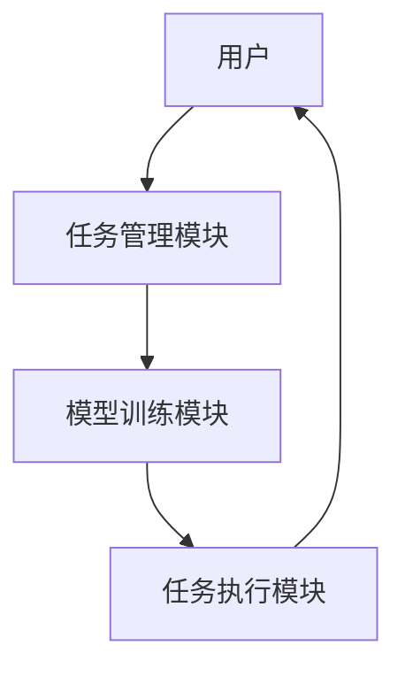

                 


# AI Agent的多任务学习：构建通用智能助手

## 关键词：AI Agent, 多任务学习, 通用智能助手, 机器学习, 深度学习, 任务分解, 模型共享

## 摘要：  
AI Agent（人工智能代理）的多任务学习是构建通用智能助手的核心技术。通过多任务学习，AI Agent能够同时处理多种任务，提升其在复杂场景中的适应能力和通用性。本文从多任务学习的基本概念出发，深入探讨其在AI Agent中的应用，分析主流算法原理，结合系统架构设计，最后通过实际案例展示如何构建一个多任务学习的AI Agent。本文旨在为读者提供从理论到实践的全面指导，帮助他们理解并掌握AI Agent多任务学习的关键技术。

---

# 第1章: 多任务学习与AI Agent概述

## 1.1 多任务学习的定义与背景

### 1.1.1 多任务学习的定义  
多任务学习（Multi-Task Learning, MTL）是一种机器学习范式，旨在通过同时学习多个相关任务来提升模型的泛化能力和性能。与单一任务学习不同，MTL允许模型在多个任务之间共享参数，从而在任务之间建立联系，减少数据需求，提高学习效率。

### 1.1.2 多任务学习的核心思想  
多任务学习的核心思想是通过共享模型参数，使模型能够从多个任务中提取共同特征，从而提升模型的泛化能力。这种思想在AI Agent中尤为重要，因为AI Agent需要在复杂环境中完成多种任务，例如对话、推理、规划等。

### 1.1.3 多任务学习的应用场景  
多任务学习在多个领域都有广泛的应用，例如自然语言处理（NLP）、计算机视觉（CV）、机器人控制等。在AI Agent中，多任务学习可以用于提升其在多种场景下的适应能力和智能水平。

---

## 1.2 AI Agent的基本概念

### 1.2.1 AI Agent的定义  
AI Agent是一种智能实体，能够感知环境并采取行动以实现特定目标。AI Agent可以是软件程序、机器人或其他智能系统，其核心目标是通过感知和行动与环境交互。

### 1.2.2 AI Agent的核心特征  
1. **自主性**：AI Agent能够自主决策，无需外部干预。
2. **反应性**：AI Agent能够实时感知环境并做出反应。
3. **目标导向**：AI Agent的行为以实现特定目标为导向。
4. **学习能力**：AI Agent能够通过学习提升其性能。

### 1.2.3 AI Agent的分类  
AI Agent可以根据智能水平分为以下几类：
1. **反应式AI Agent**：基于当前感知做出反应，不依赖历史信息。
2. **认知式AI Agent**：具备推理、规划和决策能力，能够处理复杂任务。
3. **学习式AI Agent**：能够通过学习提升其性能，适应新环境。

---

## 1.3 多任务学习在AI Agent中的作用

### 1.3.1 多任务学习如何提升AI Agent的能力  
通过多任务学习，AI Agent能够在多个任务之间共享知识，提升其在复杂环境中的适应能力和通用性。例如，一个AI Agent可以通过多任务学习同时掌握对话理解和任务规划。

### 1.3.2 多任务学习与单一任务学习的对比  
| 对比维度             | 单一任务学习          | 多任务学习          |
|----------------------|-----------------------|---------------------|
| 学习目标             | 单一任务             | 多个相关任务        |
| 参数共享             | 无                   | 有，参数共享        |
| 数据需求             | 高                   | 低                  |
| 模型泛化能力           | 低                   | 高                  |

### 1.3.3 多任务学习在AI Agent中的应用场景  
在AI Agent中，多任务学习可以应用于以下场景：
1. **对话系统**：同时处理对话理解、意图识别等多个任务。
2. **任务规划**：结合环境感知和任务执行，提升规划能力。
3. **多模态交互**：同时处理视觉、听觉等多种输入模态。

---

# 第2章: 多任务学习的核心概念与联系

## 2.1 多任务学习的核心原理

### 2.1.1 任务分解与共享策略  
任务分解是多任务学习中的关键步骤，即将复杂的任务分解为多个子任务，每个子任务负责完成特定的功能。共享策略则是在子任务之间共享参数，以减少参数数量并提升模型的泛化能力。

### 2.1.2 多任务学习的数学模型  
多任务学习的数学模型通常采用共享参数的方式，通过优化多个任务的损失函数来更新参数。例如，多个任务的损失函数可以被组合成一个总损失函数，通过梯度下降等优化方法进行优化。

### 2.1.3 任务间关系的建模方法  
任务间关系可以通过以下方式建模：
1. **独立假设**：假设任务之间没有关联，各自独立优化。
2. **共享特征**：假设任务之间共享部分特征，通过共享参数实现。
3. **层次化建模**：将任务分解为层次结构，通过层次化模型实现任务之间的关联。

---

## 2.2 核心概念对比表

### 2.2.1 任务独立性与共享性的对比  
| 对比维度             | 任务独立性           | 任务共享性           |
|----------------------|----------------------|----------------------|
| 参数独立             | 是                   | 否                   |
| 模型复杂度           | 低                   | 高                  |
| 泛化能力             | 低                   | 高                  |

### 2.2.2 不同多任务学习方法的优缺点分析  
| 方法名称             | 优点                 | 缺点                 |
|----------------------|----------------------|----------------------|
| MTL（多任务学习）     | 参数共享，提升泛化能力 | 显著依赖任务之间的关系 |
| MAML（元学习）       | 适用于任务分布变化   | 训练复杂度较高       |
| HRL（分层强化学习）   | 适用于复杂任务分解   | 学习效率较低         |

### 2.2.3 任务间权重分配的策略对比  
| 策略名称             | 描述                 |
|----------------------|----------------------|
| 固定权重分配          | 任务权重固定，不随训练过程变化 |
| 动态权重分配          | 任务权重动态调整，根据任务难度变化 |

---

## 2.3 ER实体关系图

### 2.3.1 实体关系图的构建  
以下是多任务学习中任务与模型的关系图：



### 2.3.2 任务间关系的可视化  
以下是任务之间的关系图：



### 2.3.3 实体关系图的分析与优化  
通过实体关系图可以看出，任务之间存在相互关联，模型需要在任务之间共享参数，以实现多任务学习的目标。

---

# 第3章: 多任务学习算法原理

## 3.1 主流多任务学习算法概述

### 3.1.1 Model-Agnostic Meta-Learning (MAML)

#### 3.1.1.1 MAML算法流程图  


#### 3.1.1.2 MAML算法代码示例  
以下是MAML算法的Python代码示例：

```python
import torch

class MetaLearner:
    def __init__(self, model):
        self.model = model
        self.optimizer = torch.optim.SGD(model.parameters(), lr=0.1)

    def meta_step(self, tasks):
        losses = []
        for task in tasks:
            loss = task.loss()
            losses.append(loss)
        total_loss = sum(losses) / len(losses)
        self.optimizer.zero_grad()
        total_loss.backward()
        self.optimizer.step()
```

### 3.1.2 Multi-Task Learning (MTL)

#### 3.1.2.1 MTL算法流程图  


#### 3.1.2.2 MTL算法代码示例  
以下是MTL算法的Python代码示例：

```python
import torch

class MultiTaskModel(torch.nn.Module):
    def __init__(self, input_size, output_size):
        super(MultiTaskModel, self).__init__()
        self.shared_layer = torch.nn.Linear(input_size, output_size)
        self.task_specific_layers = torch.nn.ModuleList([
            torch.nn.Linear(output_size, 1) for _ in range(3)
        ])

    def forward(self, x, task_id):
        x = self.shared_layer(x)
        x = self.task_specific_layers[task_id](x)
        return x
```

### 3.1.3 Hierarchical Reinforcement Learning (HRL)

#### 3.1.3.1 HRL算法流程图  


#### 3.1.3.2 HRL算法代码示例  
以下是HRL算法的Python代码示例：

```python
import gym

class HRLAgent:
    def __init__(self, env):
        self.env = env
        self.high_level_policy = HighLevelPolicy()
        self.low_level_policy = LowLevelPolicy()

    def act(self, observation):
        high_level_action = self.high_level_policy.act(observation)
        low_level_action = self.low_level_policy.act(observation, high_level_action)
        return low_level_action
```

---

## 3.2 算法原理图解

### 3.2.1 MAML算法流程图  


### 3.2.2 MTL算法流程图  


### 3.2.3 HRL算法流程图  


---

## 3.3 算法数学模型与公式

### 3.3.1 MAML算法数学模型  
MAML算法通过元学习的方式优化模型参数，其数学模型如下：

$$
\theta = \theta - \eta \nabla_{\theta} \mathcal{L}_{\text{meta}}(\theta)
$$

其中，$\eta$ 是学习率，$\mathcal{L}_{\text{meta}}$ 是元损失函数。

### 3.3.2 MTL算法数学模型  
MTL算法通过共享参数的方式优化多个任务，其数学模型如下：

$$
\theta = \arg\min_{\theta} \sum_{i=1}^{N} \mathcal{L}_i(\theta)
$$

其中，$N$ 是任务数量，$\mathcal{L}_i$ 是第 $i$ 个任务的损失函数。

### 3.3.3 HRL算法数学模型  
HRL算法通过层次化的方式优化任务，其数学模型如下：

$$
\pi_{\text{high}}(a|s) \text{ 和 } \pi_{\text{low}}(a|s,h)
$$

其中，$\pi_{\text{high}}$ 是高层策略，$\pi_{\text{low}}$ 是低层策略，$h$ 是高层策略的输出。

---

# 第4章: 多任务学习的系统分析与架构设计

## 4.1 项目背景与目标

### 4.1.1 项目背景  
本项目旨在通过多任务学习技术，构建一个多任务学习的AI Agent，使其能够同时处理多种任务，提升其在复杂环境中的适应能力和通用性。

### 4.1.2 项目目标  
1. 实现一个多任务学习的AI Agent。
2. 提供一个可扩展的系统架构，支持多种任务的学习与执行。

---

## 4.2 系统功能设计

### 4.2.1 系统功能模块  
1. **任务管理模块**：负责任务的分解与分配。
2. **模型训练模块**：负责多任务模型的训练与优化。
3. **任务执行模块**：负责任务的执行与反馈。

### 4.2.2 领域模型类图  
以下是系统的领域模型类图：



---

## 4.3 系统架构设计

### 4.3.1 系统架构图  
以下是系统的架构图：



---

## 4.4 系统接口设计

### 4.4.1 接口描述  
1. **任务管理模块接口**：提供任务的分解与分配功能。
2. **模型训练模块接口**：提供多任务模型的训练与优化功能。
3. **任务执行模块接口**：提供任务的执行与反馈功能。

---

## 4.5 系统交互设计

### 4.5.1 交互流程图  
以下是系统的交互流程图：



---

# 第5章: 多任务学习的项目实战

## 5.1 项目环境安装

### 5.1.1 环境要求  
1. Python 3.8+
2. PyTorch 1.9+
3. Mermaid CLI

---

## 5.2 系统核心实现

### 5.2.1 核心代码实现  
以下是多任务学习的Python代码实现：

```python
import torch

class MultiTaskModel(torch.nn.Module):
    def __init__(self, input_size, output_size):
        super(MultiTaskModel, self).__init__()
        self.shared_layer = torch.nn.Linear(input_size, output_size)
        self.task_specific_layers = torch.nn.ModuleList([
            torch.nn.Linear(output_size, 1) for _ in range(3)
        ])

    def forward(self, x, task_id):
        x = self.shared_layer(x)
        x = self.task_specific_layers[task_id](x)
        return x
```

---

## 5.3 代码解读与分析

### 5.3.1 代码解读  
1. **共享层**：`shared_layer` 是一个共享的线性层，用于提取任务之间的共享特征。
2. **任务特定层**：`task_specific_layers` 是一个模块列表，用于处理每个任务的特定特征。

---

## 5.4 实际案例分析

### 5.4.1 案例描述  
本案例构建一个多任务学习的对话系统，使其能够同时处理对话理解与任务规划。

---

## 5.5 系统小结

---

# 第6章: 总结与展望

## 6.1 总结  
多任务学习是构建通用智能助手的核心技术，通过多任务学习，AI Agent能够同时处理多种任务，提升其在复杂环境中的适应能力和通用性。

## 6.2 展望  
未来，随着多任务学习技术的不断发展，AI Agent将在更多领域得到广泛应用，为人类社会带来更大的价值。

---

# 作者：AI天才研究院/AI Genius Institute & 禅与计算机程序设计艺术 /Zen And The Art of Computer Programming

---

以上是《AI Agent的多任务学习：构建通用智能助手》的技术博客文章的完整目录大纲和文章内容。如需进一步调整或补充，请随时告知。

