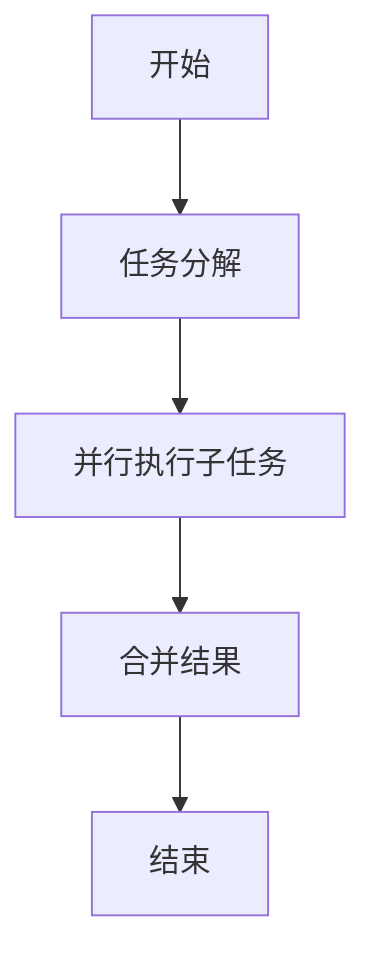
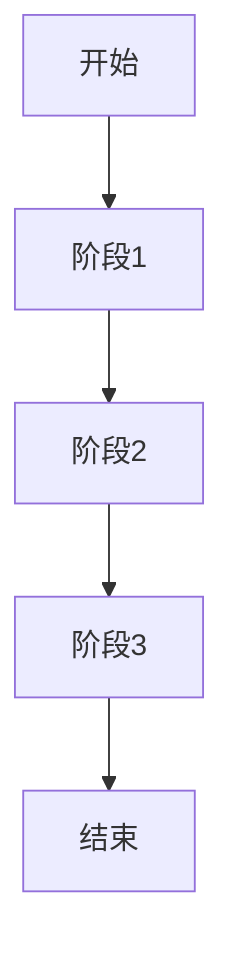
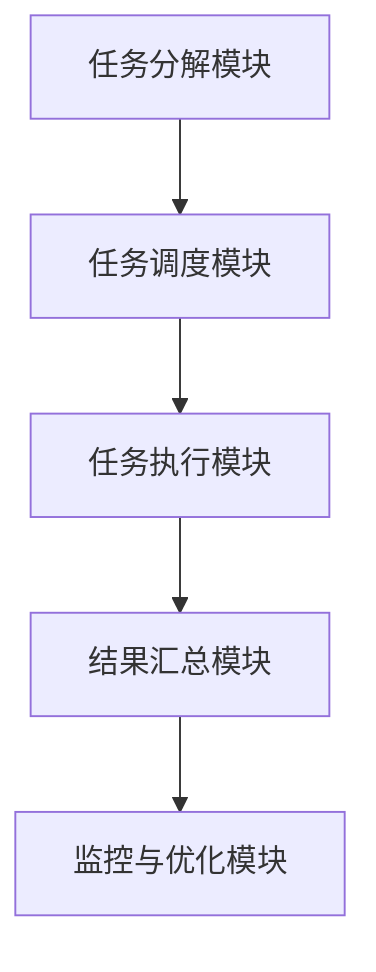
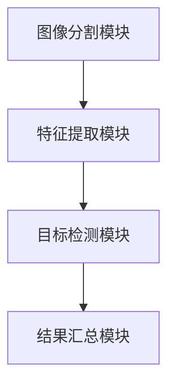

                 


# AI Agent的多任务并行处理技术

## 关键词：AI Agent, 多任务处理, 并行计算, 任务调度, 算法优化, 系统架构

## 摘要：  
本文深入探讨了AI Agent在多任务并行处理技术中的核心原理和实际应用。从AI Agent的基本概念到多任务并行处理的算法优化，从系统架构设计到实际项目案例分析，本文系统性地解析了AI Agent如何高效地实现多任务并行处理，并提供了可操作的优化建议。通过本文的阐述，读者可以全面了解AI Agent的多任务并行处理技术及其在实际场景中的应用价值。

---

# 第一部分：AI Agent的多任务并行处理概述

## 第1章：AI Agent与多任务并行处理的背景

### 1.1 AI Agent的基本概念
AI Agent（人工智能代理）是一种能够感知环境、自主决策并执行任务的智能实体。它可以通过传感器获取信息，利用算法进行分析和决策，并通过执行器与环境交互。AI Agent的核心特征包括自主性、反应性、目标导向性和社会性。

### 1.2 多任务并行处理的背景与意义
在现代AI应用中，单任务处理已无法满足复杂的场景需求。例如，在智能客服系统中，AI Agent需要同时处理多个用户的请求；在自动驾驶系统中，AI Agent需要实时处理感知、决策和执行任务。多任务并行处理能够显著提高效率，缩短响应时间，并增强系统的实时性和可靠性。

### 1.3 多任务并行处理的挑战
多任务并行处理的核心挑战在于任务间的资源竞争、通信延迟和同步问题。此外，任务的优先级管理和异常处理也是实现高效多任务并行处理的关键难点。

---

## 第2章：AI Agent多任务并行处理的核心概念

### 2.1 任务分解与调度
AI Agent的多任务并行处理需要将复杂的任务分解为多个子任务，并根据系统资源和任务优先级进行调度。任务分解的基本原则包括均衡性、独立性和可扩展性。

### 2.2 任务间的通信机制
在多任务并行处理中，任务之间需要通过通信机制进行信息交换。常用的通信机制包括共享内存、消息队列和发布-订阅模型。选择合适的通信机制对系统的性能和扩展性至关重要。

### 2.3 同步与异步处理
同步处理确保任务按顺序执行，避免数据竞争和不一致性；异步处理则允许任务独立执行，提高系统的吞吐量。在实际应用中， often采用混合同步-异步策略。

---

# 第二部分：AI Agent多任务并行处理的算法与系统架构

## 第3章：多任务并行处理的算法原理

### 3.1 并行计算的基本原理
并行计算是多任务并行处理的核心技术。通过将任务分解为多个子任务，并利用多核处理器或分布式计算资源进行并行执行，可以显著提高计算效率。

#### 3.1.1 并行计算的数学模型
$$ T_{\text{parallel}} = \frac{T_{\text{serial}}}{N} $$
其中，$T_{\text{parallel}}$表示并行计算时间，$T_{\text{serial}}$表示串行计算时间，$N$表示并行任务数。

#### 3.1.2 并行计算中的负载均衡
负载均衡是确保并行任务在各计算节点之间均匀分配的关键技术。常用的负载均衡算法包括静态负载均衡和动态负载均衡。

### 3.2 分支-合并模型
分支-合并模型是一种适用于多任务并行处理的算法模型。其基本步骤如下：
1. 将任务分解为多个子任务。
2. 并行执行子任务。
3. 合并子任务的结果，生成最终输出。

#### 分支-合并模型的流程图


### 3.3 管道-过滤器模型
管道-过滤器模型是一种适用于数据流处理的并行计算模型。其基本步骤如下：
1. 数据流通过多个管道阶段进行处理。
2. 每个管道阶段由多个过滤器并行执行。
3. 数据在管道阶段之间流动，直到最终输出。

#### 管道-过滤器模型的流程图


---

## 第4章：多任务并行处理的系统架构设计

### 4.1 系统架构概述
多任务并行处理的系统架构需要考虑任务调度、资源管理、通信机制和结果汇总等多个方面。

#### 系统架构图


### 4.2 任务调度算法
任务调度是多任务并行处理的核心算法之一。常用的任务调度算法包括静态调度和动态调度。

#### 任务调度算法比较表
| 算法名称       | 特点                     | 适用场景           |
|----------------|--------------------------|--------------------|
| 静态调度       | 提前确定任务分配         | 系统负载稳定       |
| 动态调度       | 根据实时负载动态分配     | 系统负载波动较大   |

### 4.3 通信机制设计
在多任务并行处理中，任务之间的通信机制设计直接影响系统的性能。常用的通信机制包括共享内存和消息队列。

#### 通信机制优缺点比较表
| 通信机制       | 优点                     | 缺点                   |
|----------------|--------------------------|-----------------------|
| 共享内存       | 高效，低延迟             | 竞争激烈，可能导致死锁 |
| 消息队列        | 解耦性强，避免竞争       | 延迟较高               |

---

# 第三部分：AI Agent多任务并行处理的项目实战与优化

## 第5章：项目实战：AI Agent的多任务图像识别系统

### 5.1 项目背景
本项目旨在设计一个基于AI Agent的多任务图像识别系统，实现对多张图像的并行识别。

### 5.2 系统功能设计
系统功能包括图像分割、特征提取、目标检测和结果汇总。

#### 系统功能模块图


### 5.3 代码实现
以下是Python实现的图像分割模块代码：
```python
import concurrent.futures

def process_image(image):
    # 图像处理逻辑
    return processed_image

def main():
    with concurrent.futures.ThreadPoolExecutor() as executor:
        futures = [executor.submit(process_image, image) for image in images]
        for future in concurrent.futures.as_completed(futures):
            print(future.result())

if __name__ == "__main__":
    main()
```

### 5.4 性能优化
通过优化任务调度算法和通信机制，可以显著提高系统的并行处理效率。

---

## 第6章：数学模型与优化策略

### 6.1 并行计算中的数学模型
并行计算的数学模型是优化多任务并行处理性能的基础。通过分析任务之间的依赖关系和资源分配，可以设计高效的并行计算策略。

#### 并行计算的数学模型
$$ T_{\text{total}} = \max_{i=1}^{N} T_{i} $$
其中，$T_{\text{total}}$表示系统总执行时间，$T_{i}$表示第$i$个任务的执行时间。

### 6.2 优化策略
优化策略包括任务粒度优化、资源分配优化和通信优化。

#### 任务粒度优化
任务粒度是指单个任务的计算量。通过调整任务粒度，可以平衡任务的并行性和资源利用率。

#### 资源分配优化
资源分配优化是通过动态调整任务的执行资源，提高系统的负载均衡性。

---

## 第7章：总结与展望

### 7.1 总结
本文系统性地探讨了AI Agent的多任务并行处理技术，从核心概念到算法优化，从系统架构到项目实战，全面解析了多任务并行处理的关键技术。

### 7.2 展望
随着AI技术的不断发展，多任务并行处理技术将在更多领域得到广泛应用。未来的研究方向包括更高效的并行计算算法、更智能的任务调度策略和更优化的系统架构设计。

---

## 最佳实践 Tips

1. 在实际应用中，根据系统的负载特点选择合适的并行计算模型。
2. 优化任务调度算法和通信机制是提高系统性能的关键。
3. 在多任务并行处理中，任务粒度的调整和资源分配的优化对系统的性能影响显著。

---

## 作者：AI天才研究院 & 禅与计算机程序设计艺术

