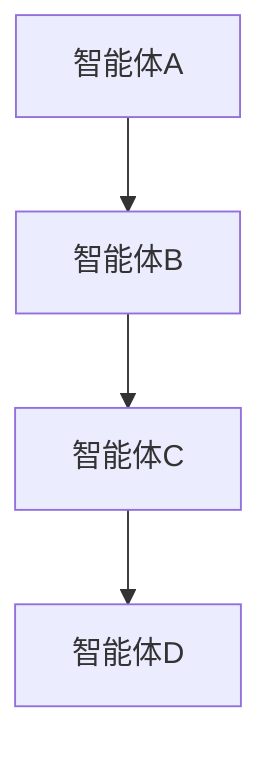
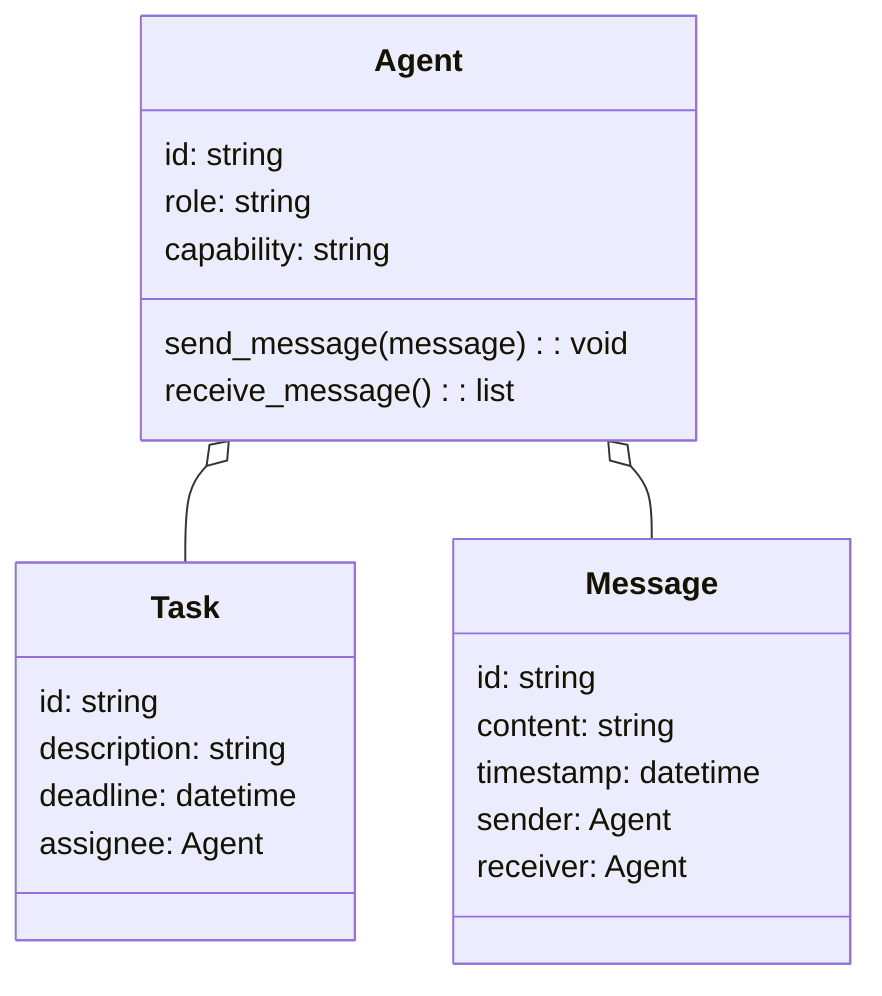
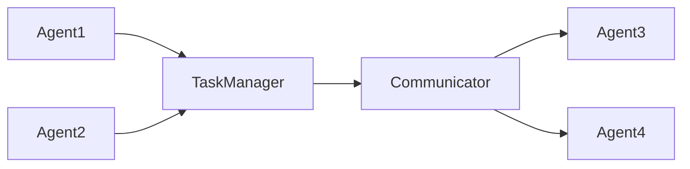

                 


```markdown
# AI Agent的多智能体协作与通信机制

> 关键词：AI Agent，多智能体协作，通信机制，分布式系统，区块链，事件驱动

> 摘要：AI Agent的多智能体协作与通信机制是实现智能系统协同工作的核心。本文从AI Agent的基本概念出发，详细探讨了多智能体协作的核心原理、通信机制的实现算法、数学模型、系统架构设计以及实际应用案例。通过理论分析和实践结合，本文为读者提供了一个全面理解AI Agent多智能体协作与通信机制的视角。

---

# 第1章 AI Agent与多智能体协作基础

## 1.1 AI Agent的基本概念

### 1.1.1 AI Agent的定义与特点
- **定义**：AI Agent（人工智能代理）是指能够感知环境并采取行动以实现目标的智能实体。
- **特点**：
  - **自主性**：能够在没有外部干预的情况下独立运行。
  - **反应性**：能够根据环境变化动态调整行为。
  - **社会性**：能够与其他智能体或人类进行交互与协作。

### 1.1.2 多智能体系统的定义与分类
- **定义**：多智能体系统（Multi-Agent System, MAS）是由多个智能体组成的分布式系统，这些智能体能够通过通信和协作完成复杂任务。
- **分类**：
  - **基于任务的MAS**：智能体协作完成特定任务。
  - **基于目标的MAS**：智能体通过共享目标实现协作。
  - **基于行为的MAS**：智能体通过行为交互实现协作。

### 1.1.3 多智能体协作的背景与必要性
- **背景**：随着人工智能技术的发展，单个智能体的能力已无法满足复杂场景的需求，多智能体协作成为必然趋势。
- **必要性**：通过协作，多个智能体能够共同完成更复杂、更高效的任务。

## 1.2 多智能体协作的核心要素

### 1.2.1 协作任务的定义与分解
- **协作任务**：需要多个智能体共同完成的任务。
- **任务分解**：将协作任务分解为子任务，分配给不同的智能体。

### 1.2.2 智能体之间的通信机制
- **通信**：智能体之间通过信息交换实现协作。
- **通信机制**：定义了信息传递的方式和规则。

### 1.2.3 协作策略与协议
- **协作策略**：智能体在协作过程中采取的策略。
- **协议**：定义了智能体之间通信和协作的规则。

## 1.3 通信机制的重要性

### 1.3.1 通信在多智能体协作中的作用
- **信息共享**：智能体之间通过通信共享信息，提高协作效率。
- **协调行动**：通过通信协调各智能体的行动，避免冲突。

### 1.3.2 通信机制的分类与选择
- **分类**：
  - **同步通信**：智能体之间同步交换信息。
  - **异步通信**：智能体之间异步交换信息。
  - **发布-订阅模式**：智能体通过发布信息和订阅信息实现通信。
- **选择**：根据任务需求选择合适的通信机制。

### 1.3.3 通信效率与系统性能的关系
- **通信效率**：通信机制的效率直接影响系统的整体性能。
- **优化**：通过优化通信机制提高系统性能。

## 1.4 本章小结
本章介绍了AI Agent的基本概念，分析了多智能体协作的核心要素，强调了通信机制在协作中的重要性，并为后续章节奠定了基础。

---

# 第2章 多智能体协作的核心概念与联系

## 2.1 多智能体协作的核心原理

### 2.1.1 分布式协作的基本原理
- **分布式协作**：多个智能体在分布式环境中协作完成任务。
- **去中心化**：协作过程中没有中心节点，各智能体平等协作。

### 2.1.2 协作任务的分配与调度
- **任务分配**：将协作任务分配给不同的智能体。
- **调度策略**：根据任务优先级和智能体能力进行调度。

### 2.1.3 协作过程中的动态变化
- **动态性**：环境变化可能导致任务分解和协作策略的变化。
- **适应性**：智能体需要根据动态变化调整协作策略。

## 2.2 多智能体协作的核心概念对比

### 2.2.1 智能体的属性特征对比
| 属性 | 定义 | 示例 |
|------|------|------|
| **自主性** | 独立运行的能力 | 自动执行任务 |
| **反应性** | 根据环境变化调整行为 | 实时响应用户请求 |
| **社会性** | 与其他智能体协作的能力 | 多智能体共同完成任务 |

### 2.2.2 协作任务的复杂度对比
| 任务类型 | 定义 | 示例 |
|----------|------|------|
| **简单任务** | 单一智能体即可完成的任务 | 个人助手完成日历管理 |
| **复杂任务** | 需要多个智能体协作的任务 | 多智能体共同完成交通调度 |

### 2.2.3 通信机制的效率对比
| 通信机制 | 优缺点 | 适用场景 |
|----------|--------|----------|
| **同步通信** | 延迟低，但资源消耗大 | 实时性要求高的场景 |
| **异步通信** | 延迟高，但资源消耗小 | 实时性要求不高的场景 |
| **发布-订阅模式** | 灵活性高，但实现复杂 | 分布式系统中的事件驱动场景 |

## 2.3 多智能体协作的ER实体关系图

```mermaid
er
    entity(Agent) {
        id: string
        role: string
        capability: string
    }
    entity(Task) {
        id: string
        description: string
        deadline: datetime
    }
    entity(Message) {
        id: string
        content: string
        timestamp: datetime
    }
    relationship(Assigns) {
        Agent - Task
    }
    relationship(Communicates) {
        Agent - Message
    }
```

## 2.4 本章小结
本章通过对比分析，详细阐述了多智能体协作的核心概念，并通过ER实体关系图展示了协作过程中的实体关系。

---

# 第3章 多智能体协作的通信机制算法原理

## 3.1 通信协议的选择与设计

### 3.1.1 基于图灵测试的通信协议
- **图灵测试**：通过模拟人类对话的方式验证智能体的智能水平。
- **应用**：用于智能体之间的身份验证和信息加密。

### 3.1.2 基于分布式一致性协议的通信机制
- **分布式一致性协议**：如Paxos、Raft等，用于保证分布式系统中数据的一致性。
- **应用**：用于多智能体协作中的任务分配和状态同步。

### 3.1.3 基于区块链的通信安全机制
- **区块链**：通过去中心化和不可篡改的特性保证通信安全。
- **应用**：用于多智能体协作中的数据安全和信任建立。

## 3.2 通信机制的实现算法

### 3.2.1 基于消息传递的协作算法

#### 3.2.1.1 消息传递算法流程图



#### 3.2.1.2 消息传递算法实现代码

```python
class Agent:
    def __init__(self, id):
        self.id = id
        self.messages = []

    def send_message(self, receiver, content):
        receiver.messages.append((self.id, content))

    def receive_message(self):
        return self.messages

# 示例用法
agent1 = Agent("A")
agent2 = Agent("B")
agent1.send_message(agent2, "Hello")
print(agent2.receive_message())  # 输出： [("A", "Hello")]
```

### 3.2.2 基于状态同步的协作算法

#### 3.2.2.1 状态同步算法流程图


#### 3.2.2.2 状态同步算法实现代码

```python
class Agent:
    def __init__(self, id):
        self.id = id
        self.state = {}

    def update_state(self, key, value):
        self.state[key] = value

    def get_state(self, key):
        return self.state.get(key, None)

# 示例用法
agent1 = Agent("A")
agent1.update_state("temperature", 25)
agent2 = Agent("B")
agent2.update_state("location", "room1")
```

### 3.2.3 基于事件驱动的协作算法

#### 3.2.3.1 事件驱动算法流程图


#### 3.2.3.2 事件驱动算法实现代码

```python
import threading

class Agent:
    def __init__(self, id):
        self.id = id
        self.events = []

    def publish_event(self, event):
        self.events.append(event)

    def subscribe_event(self, event):
        return self.events.count(event)

# 示例用法
agent1 = Agent("A")
agent1.publish_event("start_task")
print(agent1.subscribe_event("start_task))  # 输出：1
```

## 3.3 通信机制的数学模型

### 3.3.1 通信效率的数学模型
$$
\text{通信效率} = \frac{\text{成功传递的消息数}}{\text{总消息数}} \times 100\%
$$

### 3.3.2 分布式系统中的通信延迟
$$
\text{总延迟} = \text{消息传递时间} + \text{处理时间} + \text{排队时间}
$$

### 3.3.3 事件驱动的通信模型
$$
\text{事件触发条件} = \text{事件源状态} \geq \text{阈值}
$$

## 3.4 本章小结
本章详细介绍了通信机制的选择与设计，并通过具体的算法实现和数学模型，展示了多智能体协作中通信机制的核心原理。

---

# 第4章 多智能体协作的数学模型与优化

## 4.1 通信机制的数学模型

### 4.1.1 信息传递的数学模型
$$
\text{信息传递概率} = \frac{\text{成功传递的消息数}}{\text{总消息数}} \times 100\%
$$

### 4.1.2 协作任务的分解模型
$$
\text{任务分解} = \sum_{i=1}^{n} \text{子任务}_i
$$

### 4.1.3 系统性能的评估模型
$$
\text{系统性能} = \text{任务完成时间} \times \text{资源利用率}
$$

## 4.2 优化策略与算法设计

### 4.2.1 基于概率论的优化算法
$$
P(\text{成功}) = 1 - e^{-\lambda t}
$$
其中，$\lambda$ 是速率参数，$t$ 是时间。

### 4.2.2 基于图论的协作网络优化
$$
\text{最短路径} = \sum_{i=1}^{n} \text{边权重}_i
$$

### 4.2.3 基于博弈论的协作策略优化
$$
\text{纳什均衡} = \text{所有智能体策略的最优反应}
$$

## 4.3 本章小结
本章通过数学模型分析了多智能体协作的优化策略，并提出了基于概率论、图论和博弈论的优化算法。

---

# 第5章 多智能体协作的系统架构设计

## 5.1 系统功能设计

### 5.1.1 领域模型设计



### 5.1.2 系统功能模块
- **任务管理模块**：负责任务的分配和调度。
- **通信模块**：负责智能体之间的信息传递。
- **协作模块**：负责协调各智能体的行动。

## 5.2 系统架构设计

### 5.2.1 系统架构图



### 5.2.2 接口设计
- **Agent接口**：
  - `send_message(receiver, content)`
  - `receive_message()`
- **TaskManager接口**：
  - `assign_task(agent, task)`
  - `get_task_status(task_id)`

## 5.3 本章小结
本章通过系统功能设计和架构设计，展示了多智能体协作的实际应用。

---

# 第6章 多智能体协作的项目实战

## 6.1 项目背景与目标

### 6.1.1 项目背景
- **项目名称**：智能交通管理系统
- **项目目标**：通过多智能体协作实现交通流量的实时监控和调度。

## 6.2 项目核心代码实现

### 6.2.1 环境搭建
- **技术栈**：Python、Django、Redis
- **依赖安装**：
  ```bash
  pip install django redis
  ```

### 6.2.2 核心代码实现

```python
import redis

class Agent:
    def __init__(self, id):
        self.id = id
        self.redis = redis.Redis()

    def send_message(self, receiver, content):
        self.redis.publish(receiver, content)

    def receive_message(self, pattern):
        return self.redis.listen(pattern)

# 示例用法
agent1 = Agent("A")
agent1.send_message("B", "交通信号异常")
agent2 = Agent("B")
print(agent2.receive_message("*"))  # 输出： ("B", "交通信号异常")
```

## 6.3 项目分析与总结

### 6.3.1 案例分析
- **任务分解**：智能体A负责交通信号监控，智能体B负责交通信号调整。
- **协作过程**：智能体A检测到交通信号异常后，通过通信模块通知智能体B进行调整。

### 6.3.2 项目总结
- **优势**：通过多智能体协作实现了高效的交通管理。
- **不足**：通信延迟对实时性有一定影响。

## 6.4 本章小结
本章通过项目实战，展示了多智能体协作的实际应用，并总结了经验与教训。

---

# 第7章 总结与展望

## 7.1 本章总结
- **总结**：本文详细介绍了AI Agent的多智能体协作与通信机制，从理论到实践，全面分析了其核心原理和实现方法。
- **收获**：通过项目实战，验证了理论的可行性和实际应用价值。

## 7.2 未来展望
- **研究方向**：进一步优化通信机制，提高系统的实时性和安全性。
- **技术发展**：探索更多新兴技术（如区块链、边缘计算）在多智能体协作中的应用。

## 7.3 注意事项
- **安全性**：通信机制需要考虑数据加密和身份验证。
- **可靠性**：系统需要具备容错和容灾能力。
- **可扩展性**：系统设计需要考虑扩展性，方便后续功能的增加和升级。

## 7.4 拓展阅读
- **推荐书籍**：
  - 《Multi-Agent Systems: Algorithmic, Complexity, and Theory》
  - 《Distributed Systems: Concepts and Design》
- **推荐论文**：
  - "Communication Protocols for Multi-Agent Systems"
  - "Distributed Consensus Algorithms in Multi-Agent Systems"

## 7.5 本章小结
本文通过总结和展望，为读者提供了进一步学习和研究的方向。

---

# 作者

作者：AI天才研究院/AI Genius Institute & 禅与计算机程序设计艺术/Zen And The Art of Computer Programming
```

