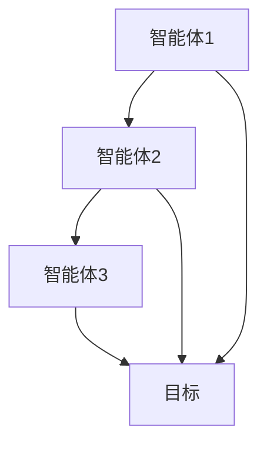
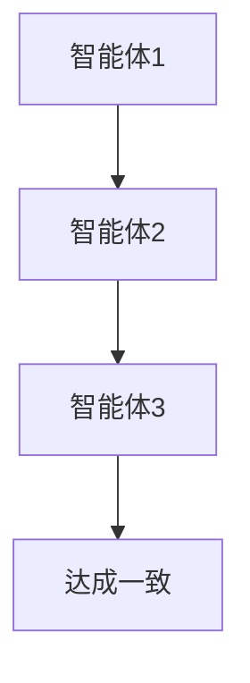
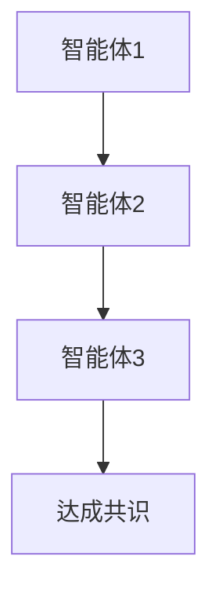
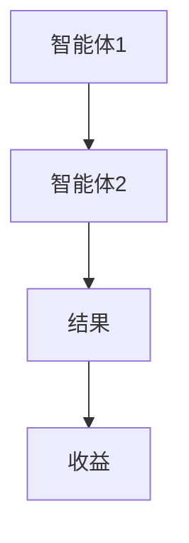
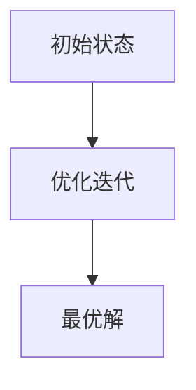
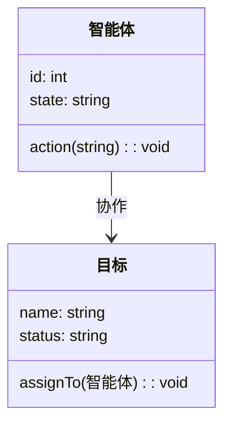
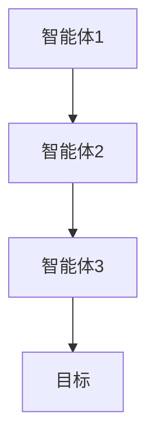

                 


```markdown
# AI Agent的多智能体协作决策系统

> 关键词：多智能体协作、AI Agent、分布式计算、共识算法、协作决策

> 摘要：AI Agent的多智能体协作决策系统是人工智能领域的重要研究方向，本文从多智能体协作的基本概念出发，详细探讨了其算法原理、数学模型、系统架构设计及项目实战。通过理论与实践的结合，全面解析了多智能体协作决策系统的实现过程，并提供了丰富的案例分析和代码示例，帮助读者深入理解这一复杂而重要的技术。

---

## 第1章: 多智能体协作决策系统背景介绍

### 1.1 问题背景与问题描述

#### 1.1.1 多智能体协作的定义
多智能体协作决策系统是指多个智能体（AI Agent）通过协作完成共同目标的系统。这些智能体可以是独立的个体或子系统，通过信息共享和决策协商实现协同工作。

#### 1.1.2 多智能体协作的必要性
在许多实际场景中，单个智能体难以独立完成任务，例如自动驾驶中的车辆协同、机器人团队的合作等，都需要多个智能体的协作。

#### 1.1.3 多智能体协作的挑战
- 智能体之间的通信与协调
- 分布式决策的复杂性
- 动态环境下的适应性

### 1.2 问题解决与边界

#### 1.2.1 多智能体协作的核心问题
- 信息共享与隐私保护
- 协作决策的效率与准确性
- 动态环境中的自适应性

#### 1.2.2 系统的边界与外延
- 系统的输入与输出边界
- 系统与外部环境的交互
- 多智能体协作的适用范围

#### 1.2.3 多智能体协作的实现边界
- 智能体之间的通信机制
- 分布式计算的资源分配
- 协作决策的算法选择

### 1.3 核心要素与概念结构

#### 1.3.1 多智能体协作的核心要素
- 智能体的独立性与协作性
- 信息共享与知识表示
- 协作目标与决策规则

#### 1.3.2 概念结构与关系
通过以下表格对比不同概念的属性特征：

| 概念 | 定义 | 特性 | 示例 |
|------|------|------|------|
| 智能体 | 具有感知和决策能力的实体 | 独立性、协作性 | 自动驾驶中的车辆 |
| 协作 | 多个智能体共同完成任务 | 信息共享、目标一致 | 机器人团队完成任务 |

#### 1.3.3 多智能体协作的系统架构
以下是多智能体协作的系统架构图：



---

## 第2章: 多智能体协作决策系统的算法原理

### 2.1 分布式计算与多智能体协作

#### 2.1.1 分布式计算的基本原理
分布式计算通过将任务分解到多个节点上并行执行，提高计算效率。

#### 2.1.2 多智能体协作中的分布式计算
在多智能体协作中，每个智能体负责一部分计算任务，通过通信模块共享结果。

#### 2.1.3 分布式计算在多智能体协作中的应用
- 负载均衡
- 并行计算
- 分布式存储

### 2.2 协商算法与决策机制

#### 2.2.1 协商算法的定义与分类
协商算法是智能体之间通过交换信息达成一致的算法。

#### 2.2.2 基于协商的决策机制
以下是协商算法的流程图：



#### 2.2.3 协商算法的实现步骤
1. 初始化协商参数
2. 信息交换与协商
3. 达成一致或继续协商
4. 输出决策结果

### 2.3 共识算法与协作决策

#### 2.3.1 共识算法的定义与特点
共识算法是确保分布式系统中所有节点达成一致的算法。

#### 2.3.2 基于共识的协作决策
以下是基于共识算法的协作决策流程图：



#### 2.3.3 共识算法的实现流程
1. 提议者提出提案
2. 提案传播与验证
3. 达成共识
4. 输出决策结果

---

## 第3章: 多智能体协作决策系统的数学模型

### 3.1 概率论与决策模型

#### 3.1.1 概率论的基本概念
概率论用于描述随机事件的发生可能性。

#### 3.1.2 基于概率的决策模型
假设有一个智能体在两个选项中选择，概率分别为p和1-p，选择最优选项的策略。

#### 3.1.3 概率模型在多智能体协作中的应用
- 风险评估
- 概率分布计算

### 3.2 博弈论与协作决策

#### 3.2.1 博弈论的基本概念
博弈论研究理性决策者在策略互动中的行为。

#### 3.2.2 基于博弈论的协作决策模型
以下是博弈论模型示意图：



#### 3.2.3 博弈论在多智能体协作中的应用
- 竞合关系建模
- Nash均衡计算

### 3.3 优化算法与协作决策

#### 3.3.1 优化算法的基本原理
优化算法通过迭代改进找到最优解。

#### 3.3.2 基于优化的协作决策模型
以下是优化算法的流程图：



#### 3.3.3 优化算法在多智能体协作中的应用
- 分布式优化
- 资源分配优化

---

## 第4章: 多智能体协作决策系统的系统分析与架构设计

### 4.1 问题场景介绍
我们考虑一个典型的多智能体协作场景：自动驾驶中的车辆协同。

### 4.2 系统功能设计

#### 4.2.1 领域模型设计
以下是领域模型的类图：



### 4.3 系统架构设计

#### 4.3.1 系统架构图
以下是系统架构图：



### 4.4 系统接口设计
- 智能体之间的通信接口
- 目标分配接口
- 结果反馈接口

### 4.5 系统交互设计

#### 4.5.1 交互流程图
以下是系统交互流程图：


---

## 第5章: 多智能体协作决策系统的项目实战

### 5.1 环境安装
安装必要的库和工具，例如Python的`multiprocessing`库。

### 5.2 系统核心实现源代码

#### 5.2.1 协商算法实现
以下是协商算法的Python代码示例：

```python
def协商算法(智能体列表):
    while True:
        for 智能体 in 智能体列表:
            智能体.exchange_info()
        if 智能体列表达成一致:
            return 结果
```

#### 5.2.2 共识算法实现
以下是共识算法的Python代码示例：

```python
def共识算法(智能体列表):
    提议者.propose()
    for 智能体 in 智能体列表:
        智能体.vote()
    if 大于等于2/3通过:
        return 结果
```

### 5.3 案例分析与详细讲解

#### 5.3.1 案例分析
以自动驾驶中的车辆协同为例，分析多智能体协作的过程。

#### 5.3.2 代码应用解读
解读上述协商算法和共识算法的实现细节。

---

## 第6章: 最佳实践与注意事项

### 6.1 最佳实践 tips
- 合理设计通信机制
- 定期验证系统稳定性
- 优化算法效率

### 6.2 小结
本文详细探讨了多智能体协作决策系统的实现过程，从理论到实践，为读者提供了全面的指导。

### 6.3 注意事项
- 确保智能体之间的通信安全
- 定期更新算法以适应环境变化
- 处理好智能体之间的冲突与协作关系

### 6.4 拓展阅读
建议读者进一步阅读相关领域的书籍和论文，深入研究多智能体协作决策系统的前沿技术。

---

## 作者

作者：AI天才研究院/AI Genius Institute & 禅与计算机程序设计艺术 /Zen And The Art of Computer Programming
```

