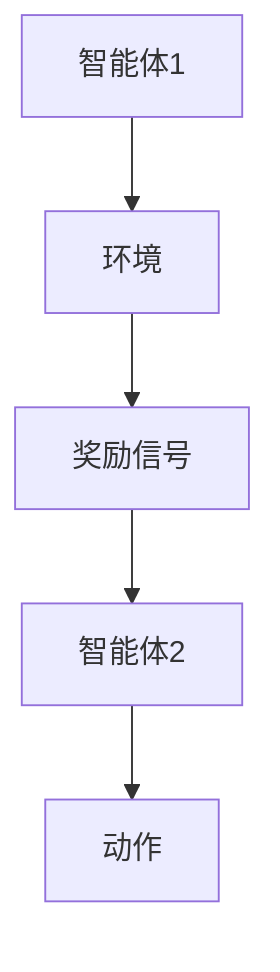
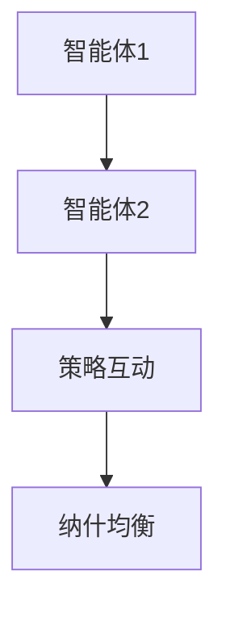
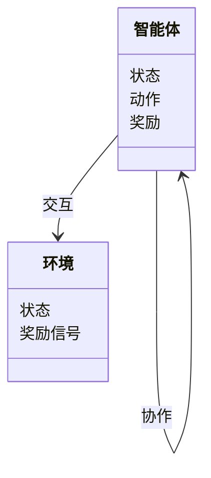
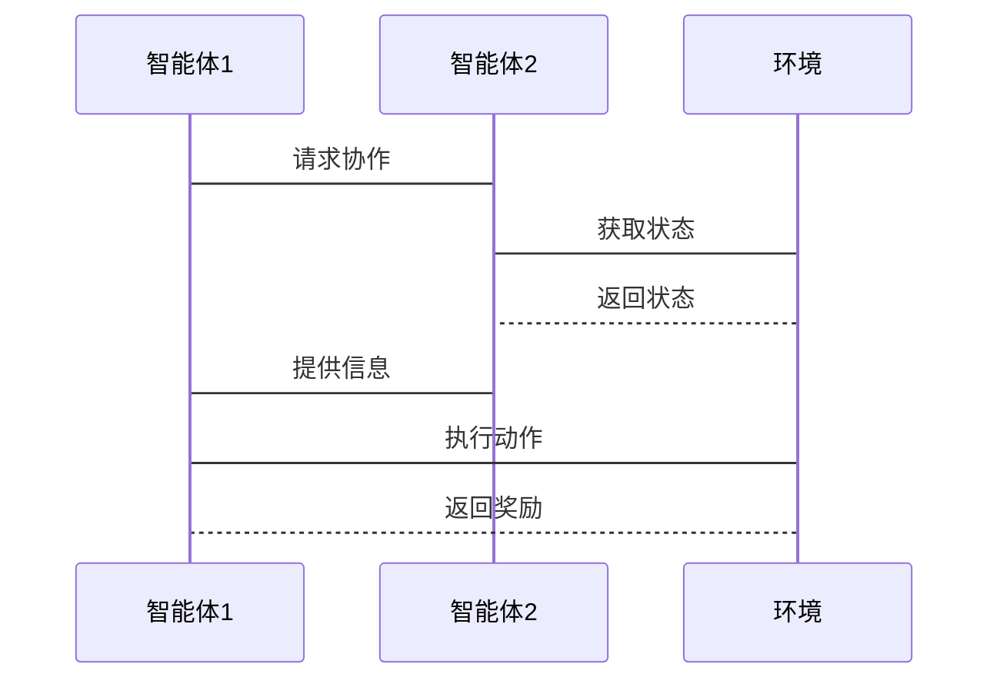

                 


# 第3章: 多智能体协作学习的算法原理

## 3.1 多智能体协作学习算法概述

### 3.1.1 基于强化学习的协作算法

强化学习（Reinforcement Learning, RL）是一种通过智能体与环境交互来学习最优策略的方法。在多智能体协作学习中，强化学习被广泛应用于多个智能体之间的协作任务。每个智能体通过与环境和其他智能体的交互，学习如何协作以达到共同的目标。

### 3.1.2 基于博弈论的协作算法

博弈论为多智能体协作提供了理论基础，特别是在纳什均衡和协作博弈方面。通过分析智能体之间的策略互动，可以设计出协作机制，使得智能体在博弈中寻求最优策略。

### 3.1.3 基于分布式计算的协作算法

分布式计算技术在多智能体协作中起着关键作用，特别是在大规模智能体系统中。通过分布式计算，智能体可以在不同的节点上协同工作，提高计算效率和协作效果。

## 3.2 多智能体协作学习算法流程

### 3.2.1 基于强化学习的协作算法流程



### 3.2.2 基于博弈论的协作算法流程



## 3.3 基于强化学习的协作算法实现

### 3.3.1 强化学习的基本原理

强化学习的基本原理是通过智能体与环境的交互，学习最优策略。智能体通过执行动作，观察环境的状态和接收到的奖励信号，逐步优化策略。

### 3.3.2 多智能体协作学习的强化学习实现

以下是一个简单的强化学习算法实现示例：

```python
class Agent:
    def __init__(self, state_space, action_space):
        self.state_space = state_space
        self.action_space = action_space
        # 初始化策略参数
        self.theta = np.random.randn(state_space, action_space)

    def act(self, state):
        # 根据当前状态选择动作
        action_probs = softmax(self.theta[state, :])
        action = np.random.choice(self.action_space, p=action_probs)
        return action

    def update(self, reward, state, action):
        # 根据奖励更新策略参数
        self.theta[state, action] += reward * learning_rate
```

### 3.3.3 多智能体协作学习的数学模型和公式

在多智能体协作学习中，通常使用联合策略来描述多个智能体的协作行为。假设我们有两个智能体A和B，它们在协作任务中的策略分别为π_A和π_B。它们的目标是通过协作最大化总奖励：

$$ R = R_A + R_B $$

其中，R_A和R_B分别表示智能体A和B的奖励。

## 3.4 本章小结

本章详细讲解了多智能体协作学习的算法原理，包括基于强化学习、博弈论和分布式计算的协作算法。通过流程图和代码示例，我们展示了如何实现这些算法，并解释了其数学模型和公式。

---

# 第4章: 多智能体协作学习的系统分析与架构设计

## 4.1 问题场景介绍

在多智能体协作学习中，我们通常需要设计一个系统，使得多个智能体能够在不同的环境中协作完成任务。例如，在机器人协作任务中，多个机器人需要协同工作以完成特定的目标。

## 4.2 系统功能设计

### 4.2.1 领域模型

以下是一个多智能体协作学习的领域模型：



### 4.2.2 系统架构设计

多智能体协作学习的系统架构通常包括以下几个部分：


## 4.3 系统接口设计

### 4.3.1 智能体与环境的接口

智能体与环境之间的接口通常包括状态输入、动作输出和奖励信号。

### 4.3.2 智能体之间的接口

智能体之间的接口通常包括协作策略、任务分配和信息共享。

## 4.4 系统交互设计

### 4.4.1 协作过程中的交互

以下是一个协作过程的交互示例：



## 4.5 本章小结

本章从系统角度分析了多智能体协作学习的架构设计，包括领域模型、系统架构、接口设计和交互设计。通过图表和示例，我们展示了如何设计一个多智能体协作学习的系统。

---

# 第5章: 多智能体协作学习的项目实战

## 5.1 环境安装

为了进行多智能体协作学习的实验，我们需要安装以下环境：

```bash
pip install gym
pip install numpy
pip install matplotlib
```

## 5.2 系统核心实现源代码

以下是一个简单的多智能体协作学习的Python实现示例：

```python
import gym
import numpy as np

class MultiAgent:
    def __init__(self, n_agents=2):
        self.env = gym.make('MultiAgent Cooperation-v0')
        self.n_agents = n_agents
        self.agents = [Agent(self.env.observation_space, self.env.action_space) for _ in range(n_agents)]

    def run(self, episodes=100):
        for episode in range(episodes):
            state = self.env.reset()
            done = False
            while not done:
                actions = [agent.act(state[i]) for i in range(self.n_agents)]
                next_state, reward, done, info = self.env.step(actions)
                for i in range(self.n_agents):
                    self.agents[i].update(reward[i], state[i], actions[i])
                state = next_state

if __name__ == '__main__':
    multi_agent = MultiAgent()
    multi_agent.run()
```

## 5.3 代码应用解读与分析

### 5.3.1 代码结构

该代码实现了一个多智能体协作学习系统，包含环境初始化、智能体初始化、运行循环和更新逻辑。每个智能体根据当前状态选择动作，并根据奖励信号更新策略。

### 5.3.2 代码实现细节

- `Agent`类：实现了智能体的基本功能，包括动作选择和策略更新。
- `MultiAgent`类：实现了多智能体协作学习的主程序，包括环境初始化、智能体动作选择和更新逻辑。

## 5.4 实际案例分析和详细讲解剖析

### 5.4.1 案例分析

以一个简单的协作任务为例，假设两个智能体需要协作完成一个目标。通过上述代码，我们可以观察到两个智能体如何通过协作逐步提高任务完成效率。

### 5.4.2 详细讲解

在实际运行中，智能体会根据环境的状态和奖励信号不断优化自己的策略，从而实现协作目标。通过观察奖励信号的变化，我们可以评估协作效果。

## 5.5 项目小结

本章通过实际案例展示了如何实现一个多智能体协作学习系统。通过代码实现和案例分析，我们能够更好地理解多智能体协作学习的实际应用。

---

# 第6章: 总结与展望

## 6.1 最佳实践 tips

- 在设计多智能体协作学习系统时，应充分考虑协作机制的设计和智能体之间的通信方式。
- 在实现过程中，应注重算法的可扩展性和系统的鲁棒性。

## 6.2 小结

本篇文章详细讲解了多智能体协作学习的核心概念、算法原理、系统架构和项目实战。通过理论与实践的结合，我们能够更好地理解和应用多智能体协作学习技术。

## 6.3 注意事项

- 在实际应用中，应根据具体任务需求选择合适的算法和架构。
- 应注重系统的可解释性和可调试性，以便于问题排查和性能优化。

## 6.4 拓展阅读

- 《Multi-agent Systems: Algorithm and Applications》
- 《Reinforcement Learning: Theory and Algorithms》

---

# 作者

作者：AI天才研究院/AI Genius Institute & 禅与计算机程序设计艺术 /Zen And The Art of Computer Programming

