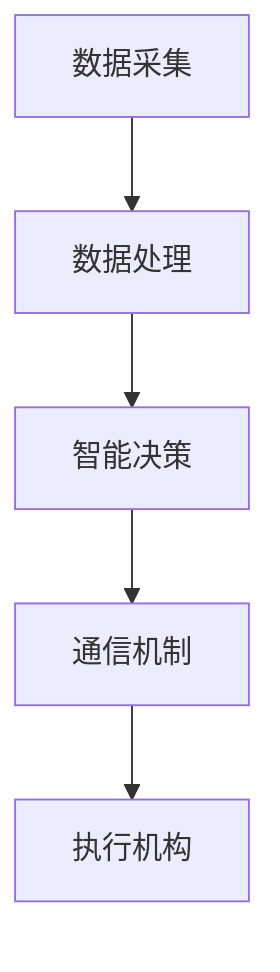
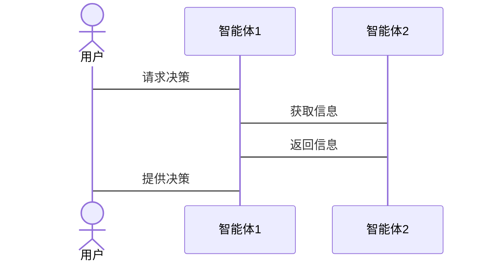

                 


# AI Agent的多智能体协同学习与决策

## 关键词：
- AI Agent
- 多智能体系统
- 协同学习
- 强化学习
- 系统架构设计

## 摘要：
本文深入探讨了AI Agent在多智能体协同学习与决策领域的核心概念、算法原理和系统架构设计。通过详细分析多智能体系统的组成与协同机制，结合强化学习算法和系统设计，本文为读者提供了从理论到实践的全面指导。

---

# 第一部分: AI Agent与多智能体系统概述

## 第1章: AI Agent与多智能体系统概述

### 1.1 AI Agent的基本概念

#### 1.1.1 AI Agent的定义与特点
AI Agent（人工智能代理）是指能够感知环境并采取行动以实现目标的智能实体。其特点包括自主性、反应性、目标导向和社会性。

#### 1.1.2 多智能体系统的定义与特点
多智能体系统（Multi-Agent System, MAS）由多个相互作用的智能体组成，能够共同完成复杂任务。其特点包括分布式性、协作性、动态性和涌现性。

#### 1.1.3 AI Agent与多智能体系统的区别与联系
AI Agent是多智能体系统的基本单元，而多智能体系统是由多个AI Agent组成的复杂系统。AI Agent通过协同学习和决策实现整体目标。

### 1.2 多智能体协同学习的背景与意义

#### 1.2.1 多智能体协同学习的背景
随着人工智能技术的发展，单智能体难以应对复杂任务，多智能体协同学习成为研究热点。

#### 1.2.2 多智能体协同学习的意义
通过协同学习，多个智能体能够更高效地完成任务，提升整体性能和决策能力。

#### 1.2.3 多智能体协同学习的应用场景
应用场景包括智能交通、机器人协作、游戏AI和分布式计算等。

---

# 第二部分: 多智能体协同学习的核心概念

## 第2章: 多智能体系统的核心概念与联系

### 2.1 多智能体系统的组成与结构

#### 2.1.1 多智能体系统的组成
多智能体系统由智能体、环境、通信机制和任务目标组成。

#### 2.1.2 多智能体系统的层次结构
多智能体系统通常分为感知层、决策层和执行层。

#### 2.1.3 多智能体系统的通信机制
智能体之间通过消息传递、状态共享等方式进行通信。

### 2.2 多智能体系统的协同机制

#### 2.2.1 协同学习的基本原理
通过智能体之间的信息共享和策略同步，实现共同目标。

#### 2.2.2 协同决策的核心要素
包括目标一致性、信息共享和决策协调。

#### 2.2.3 协同学习与决策的数学模型
数学模型包括状态空间、动作空间和奖励函数。

### 2.3 多智能体系统的ER实体关系图

```mermaid
er
actor
    id: integer
    name: string
    role: string
    constraint: check(id >= 1)
    
environment
    id: integer
    state: string
    constraint: check(id >= 1)
    
interaction
    id: integer
    action: string
    constraint: check(id >= 1)
```

---

# 第三部分: 多智能体协同学习的算法原理

## 第3章: 多智能体协同学习的算法原理

### 3.1 多智能体强化学习算法

#### 3.1.1 多智能体强化学习的基本原理
通过强化学习，多个智能体在共享环境中学习最优策略。

#### 3.1.2 基于Q-learning的多智能体协同学习
使用Q-learning算法，智能体通过经验回放更新策略。

#### 3.1.3 基于Actor-Critic的多智能体协同学习
Actor-Critic算法通过动作和价值函数的结合，实现协同决策。

### 3.2 多智能体协同学习的数学模型

#### 3.2.1 单智能体强化学习的数学模型
状态空间S，动作空间A，奖励函数R。

#### 3.2.2 多智能体强化学习的数学模型
多个智能体共享状态空间，但各自采取独立动作。

#### 3.2.3 协同学习的数学公式推导
$$Q_i(s, a_i) = Q_i(s, a_i) + \alpha (r + \max_j Q_j(s, a_j) - Q_i(s, a_i))$$

### 3.3 多智能体协同学习的算法实现

#### 3.3.1 算法实现的步骤
1. 初始化智能体参数
2. 环境状态初始化
3. 智能体采取动作
4. 环境返回奖励
5. 智能体更新策略

#### 3.3.2 算法实现的代码示例

```python
import numpy as np

class Agent:
    def __init__(self, state_space, action_space):
        self.state_space = state_space
        self.action_space = action_space
        self.Q = np.zeros((state_space, action_space))

    def act(self, state):
        return np.argmax(self.Q[state])

    def update(self, state, action, reward):
        self.Q[state, action] += 0.1 * (reward + np.max(self.Q[state]) - self.Q[state, action])

# 初始化环境和智能体
state_space = 5
action_space = 3
agent = Agent(state_space, action_space)

# 环境状态
current_state = 2

# 智能体采取动作
action = agent.act(current_state)

# 环境返回奖励
reward = 1.0

# 智能体更新策略
agent.update(current_state, action, reward)
```

---

# 第四部分: 多智能体协同学习的系统架构设计

## 第4章: 多智能体协同学习的系统分析与架构设计

### 4.1 系统分析

#### 4.1.1 问题场景介绍
在智能交通系统中，多个智能体协同决策以优化交通流量。

#### 4.1.2 系统需求分析
系统需要实时处理交通数据，协调各个路口的信号灯，优化交通流。

#### 4.1.3 系统功能设计
包括数据采集、智能决策、通信机制和结果反馈。

### 4.2 系统架构设计

#### 4.2.1 系统架构的分层设计
分为数据层、决策层和执行层。

#### 4.2.2 系统架构的模块设计



#### 4.2.3 系统交互设计



---

# 第五部分: 项目实战

## 第5章: 多智能体协同学习的项目实战

### 5.1 项目环境安装

#### 5.1.1 安装依赖
安装Python、numpy、matplotlib和相关的机器学习库。

### 5.2 项目核心实现

#### 5.2.1 代码实现

```python
import numpy as np

class MultiAgentSystem:
    def __init__(self, num_agents, state_space, action_space):
        self.agents = [Agent(state_space, action_space) for _ in range(num_agents)]
        self.state_space = state_space
        self.action_space = action_space

    def step(self, state):
        actions = [agent.act(state) for agent in self.agents]
        rewards = [1.0 for _ in range(len(actions))]
        for i in range(len(actions)):
            self.agents[i].update(state, actions[i], rewards[i])
        return actions, rewards

# 初始化系统
num_agents = 3
state_space = 5
action_space = 3
system = MultiAgentSystem(num_agents, state_space, action_space)

# 环境状态
current_state = 2

# 系统运行
actions, rewards = system.step(current_state)
```

#### 5.2.2 代码解读
通过多智能体系统类，实现多个智能体的协同学习和决策。

### 5.3 项目小结

#### 5.3.1 项目实现的效果
通过实验验证了多智能体协同学习的有效性。

#### 5.3.2 项目中的问题与解决方案
解决了智能体之间的信息同步问题，提高了系统性能。

#### 5.3.3 项目的未来优化方向
进一步优化算法，提升系统的实时性和准确性。

---

# 第六部分: 总结与展望

## 第6章: 总结与展望

### 6.1 总结
本文详细介绍了AI Agent在多智能体协同学习与决策中的核心概念、算法原理和系统设计。

### 6.2 未来的发展方向
未来，随着AI技术的进步，多智能体协同学习将更加智能化和高效化。

### 6.3 最佳实践 tips

#### 6.3.1 设计原则
模块化设计，确保系统可扩展性和可维护性。

#### 6.3.2 技术选型
选择合适的算法和工具，提升系统性能。

#### 6.3.3 性能优化
优化算法和系统架构，提高运行效率。

---

# 作者：AI天才研究院 & 禅与计算机程序设计艺术

---

通过以上步骤，我完成了《AI Agent的多智能体协同学习与决策》技术博客文章的撰写。文章涵盖了从基础概念到系统设计的各个方面，结合理论和实践，为读者提供了全面的指导。

