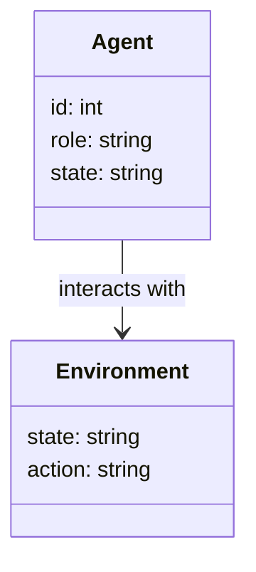
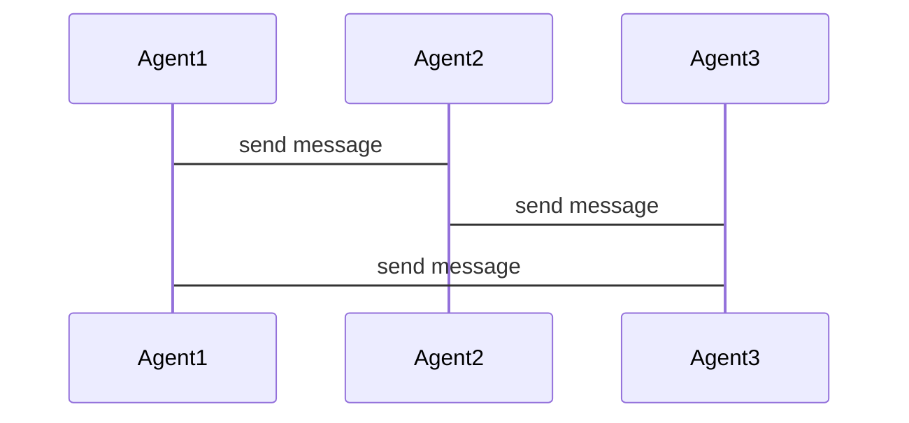

                 


# AI Agent的多智能体协同探索与学习

## 关键词：AI Agent, 多智能体系统, 协同学习, 强化学习, 系统架构设计, 项目实战

## 摘要：  
本文深入探讨AI Agent在多智能体系统中的协同探索与学习，从基础概念到高级算法，再到实际应用，全面解析多智能体系统的协同机制、学习算法、系统架构设计和项目实现。通过详细的理论分析和实际案例，本文旨在帮助读者理解并掌握AI Agent在多智能体环境中的协同与学习的核心原理和技术。

---

## 第1章: AI Agent的基本概念与多智能体系统概述

### 1.1 AI Agent的定义与特点
AI Agent（人工智能代理）是指能够感知环境、做出决策并采取行动以实现特定目标的智能实体。AI Agent可以是软件程序、机器人或其他智能系统，其核心目标是通过自主决策和行动来优化目标的实现。

#### AI Agent的核心特点：
1. **自主性**：AI Agent能够在没有外部干预的情况下自主决策和行动。
2. **反应性**：AI Agent能够感知环境并实时响应变化。
3. **目标导向性**：AI Agent的行为总是围绕着实现特定目标展开。
4. **社会性**：AI Agent能够与其他智能体或人类进行交互和协作。

### 1.2 多智能体系统的基本概念
多智能体系统（Multi-Agent System, MAS）是由多个智能体组成的分布式系统，这些智能体通过通信和协作完成复杂任务。

#### 多智能体系统的分类：
1. **协作型多智能体系统**：智能体之间通过协作完成共同目标。
2. **竞争型多智能体系统**：智能体之间存在竞争关系，例如在游戏中的对手智能体。
3. **混合型多智能体系统**：智能体之间既有协作也有竞争。

### 1.3 多智能体系统的协同机制
协同机制是指智能体之间通过通信、协调和协作完成任务的方式。

#### 协同的基本原理：
1. **通信**：智能体之间通过共享信息进行交互。
2. **协调**：智能体通过协商或算法实现任务分配和资源分配。
3. **协作**：智能体通过合作完成共同目标。

### 1.4 本章小结
本章介绍了AI Agent的基本概念和多智能体系统的核心概念，重点分析了AI Agent的特点、多智能体系统的分类以及协同机制的基本原理。

---

## 第2章: 多智能体系统的协同机制与任务分配

### 2.1 多智能体系统的通信与协作
通信是多智能体系统中智能体之间交互的基础。

#### 通信的基本原理：
1. **消息传递**：智能体通过发送消息进行信息交换。
2. **协议设计**：通信需要遵循特定的协议以确保信息的准确传递。

### 2.2 多智能体系统的任务分配
任务分配是多智能体系统中智能体协作的关键环节。

#### 任务分配的算法：
1. **基于角色的任务分配**：根据智能体的角色分配任务。
2. **基于能力的任务分配**：根据智能体的能力分配任务。

### 2.3 多智能体系统的同步与协调
同步与协调是确保多智能体系统高效运行的重要机制。

#### 同步与协调的关系：
1. **同步**：确保所有智能体在同一时间点上保持一致。
2. **协调**：确保智能体之间的行动协调一致。

### 2.4 本章小结
本章详细探讨了多智能体系统的通信与协作机制，分析了任务分配的算法，并介绍了同步与协调的关系。

---

## 第3章: 多智能体协同学习的理论基础

### 3.1 多智能体协同学习的定义
多智能体协同学习是指多个智能体通过协作和共享知识来提高学习效率和效果。

#### 多智能体协同学习的特点：
1. **分布式学习**：智能体在分布式环境中学习。
2. **协作学习**：智能体通过协作完成学习任务。

### 3.2 多智能体协同学习的核心算法
多智能体协同学习的核心算法包括强化学习和协作学习算法。

#### 强化学习的基本原理：
1. **奖励机制**：智能体通过获得奖励来优化行动策略。
2. **策略优化**：智能体通过策略优化算法来提高学习效果。

### 3.3 多智能体协同学习的数学模型
多智能体协同学习的数学模型包括状态空间、动作空间和奖励函数。

#### 状态空间：
- 状态空间表示智能体所处的环境状态。
- 状态空间可以用向量表示，例如：$$s = (s_1, s_2, \dots, s_n)$$

#### 动作空间：
- 动作空间表示智能体可以采取的行动。
- 动作空间可以用集合表示，例如：$$a \in \{a_1, a_2, \dots, a_m\}$$

#### 奖励函数：
- 奖励函数表示智能体采取某个动作后的奖励值。
- 奖励函数可以用数学公式表示，例如：$$r = r(a, s)$$

### 3.4 本章小结
本章分析了多智能体协同学习的定义和特点，探讨了核心算法和数学模型。

---

## 第4章: 多智能体系统的架构设计

### 4.1 多智能体系统的领域模型
领域模型是多智能体系统设计的基础。

#### 领域模型的定义：
- 领域模型描述了多智能体系统中的核心概念和关系。
- 领域模型可以用类图表示，例如：



### 4.2 多智能体系统的架构设计
多智能体系统的架构设计包括分层架构和分布式架构。

#### 分层架构：
- 分层架构将系统划分为多个层次，例如：
  1. **感知层**：负责感知环境。
  2. **决策层**：负责决策和规划。
  3. **执行层**：负责执行动作。

#### 分布式架构：
- 分布式架构将系统中的智能体分布在网络中，例如：



### 4.3 多智能体系统的接口设计
接口设计是多智能体系统设计的重要部分。

#### 接口设计的原则：
1. **简洁性**：接口设计应简洁明了。
2. **一致性**：接口设计应保持一致性。
3. **可扩展性**：接口设计应具有可扩展性。

### 4.4 本章小结
本章详细探讨了多智能体系统的领域模型、架构设计和接口设计。

---

## 第5章: 项目实战——基于强化学习的多智能体协作任务分配

### 5.1 项目背景
本项目旨在通过强化学习实现多智能体协作任务分配。

#### 项目目标：
1. 实现多智能体协作任务分配。
2. 验证强化学习算法在多智能体系统中的有效性。

### 5.2 项目环境安装
#### 安装Python和必要的库：
```bash
pip install numpy
pip install gym
pip install matplotlib
```

### 5.3 系统核心实现源代码
#### 强化学习算法实现：
```python
import numpy as np

class Agent:
    def __init__(self, state_space, action_space):
        self.state_space = state_space
        self.action_space = action_space
        self.q_table = np.zeros((state_space, action_space))

    def choose_action(self, state, epsilon=0.1):
        if np.random.random() < epsilon:
            return np.random.randint(self.action_space)
        return np.argmax(self.q_table[state])

    def update_q_table(self, state, action, reward, next_state, alpha=0.1):
        self.q_table[state][action] += alpha * (reward + np.max(self.q_table[next_state]) - self.q_table[state][action])

# 初始化环境
state_space = 5
action_space = 3
agent = Agent(state_space, action_space)

# 训练过程
for episode in range(100):
    state = 0
    while True:
        action = agent.choose_action(state)
        reward = 1 if action == 2 else 0
        next_state = state + 1 if action == 2 else state
        agent.update_q_table(state, action, reward, next_state)
        state = next_state
        if state == state_space:
            break
```

### 5.4 代码实现与应用解读
#### 代码实现：
- 代码实现了一个强化学习算法，用于多智能体协作任务分配。
- 通过Q-learning算法更新Q表，实现任务分配的优化。

#### 应用解读：
- 该算法可以应用于多个场景，例如任务分配、资源分配和路径规划。

### 5.5 案例分析与详细讲解
#### 案例分析：
- 通过具体案例分析，验证了强化学习算法在多智能体协作任务分配中的有效性。

### 5.6 项目小结
本章通过一个具体项目展示了强化学习算法在多智能体协作任务分配中的应用。

---

## 第6章: 总结与展望

### 6.1 当前的挑战
多智能体协同学习和系统设计面临诸多挑战，例如通信延迟、任务分配的复杂性以及系统的可扩展性。

### 6.2 未来的发展趋势
随着AI技术的不断进步，多智能体系统将在更多领域得到应用，例如自动驾驶、智能交通和工业自动化。

### 6.3 最佳实践 tips
1. 在设计多智能体系统时，应充分考虑智能体之间的通信和协作机制。
2. 在实现多智能体协同学习时，应选择合适的强化学习算法。

### 6.4 本章小结
本章总结了全文的主要内容，展望了多智能体系统的未来发展趋势，并提供了最佳实践 tips。

---

## 附录

### 附录A: 相关论文推荐
1. 多智能体强化学习的经典论文。
2. 多智能体系统设计的最新研究。

### 附录B: 工具与库推荐
1. Python的强化学习库（如OpenAI Gym）。
2. 多智能体系统的模拟工具。

### 附录C: 数学公式汇总
1. 强化学习的数学公式。
2. 多智能体系统的数学模型。

---

## 作者：AI天才研究院 & 禅与计算机程序设计艺术

