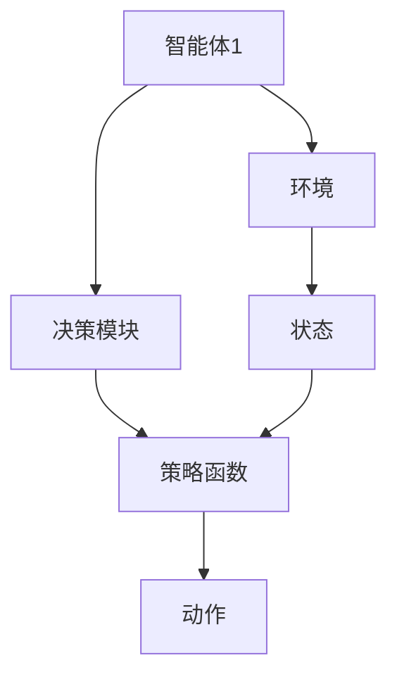

                 


# AI Agent的多智能体博弈与策略学习

## 关键词：AI Agent, 多智能体, 博弈论, 策略学习, 强化学习, 纳什均衡

## 摘要：  
本文深入探讨了AI Agent在多智能体博弈环境中的策略学习方法。从基础概念到高级算法，从理论分析到实际应用，系统性地介绍了多智能体博弈与策略学习的核心原理、数学模型、系统架构以及项目实战。通过详细分析多智能体博弈中的竞争与合作关系，结合具体案例和数学推导，本文为读者提供了一套全面理解和实现AI Agent多智能体策略学习的解决方案。

---

# 第1章: 多智能体系统与AI Agent概述

## 1.1 多智能体系统的基本概念

### 1.1.1 多智能体系统的定义  
多智能体系统（Multi-Agent System, 简称MAS）是由多个智能体（Agent）组成的分布式系统，这些智能体通过交互协作完成共同目标或任务。智能体可以是软件程序、机器人或其他具备感知和决策能力的实体。

### 1.1.2 多智能体系统的特征  
1. **分布式性**：智能体独立运行，通过通信协作完成任务。  
2. **自主性**：每个智能体具备自主决策能力。  
3. **社会性**：智能体之间存在交互与协作关系。  
4. **动态性**：环境和智能体的状态可能动态变化。  

### 1.1.3 多智能体系统的应用场景  
1. **游戏AI**：如《王者荣耀》中的多英雄协作。  
2. **自动驾驶**：车辆之间的实时协作与避障。  
3. **机器人协作**：工业机器人协同完成复杂任务。  

## 1.2 AI Agent的基本概念

### 1.2.1 AI Agent的定义  
AI Agent是指具备感知环境、自主决策和执行任务能力的智能体。它可以基于当前状态和历史信息做出最优决策。

### 1.2.2 AI Agent的核心属性  
1. **感知能力**：通过传感器或数据输入获取环境信息。  
2. **决策能力**：基于感知信息做出决策。  
3. **执行能力**：通过动作或输出影响环境。  

### 1.2.3 AI Agent的分类  
1. **简单反射型Agent**：基于当前输入做出反应，无状态记忆。  
2. **基于模型的反射型Agent**：具备环境模型，决策基于模型预测。  
3. **目标驱动型Agent**：根据目标选择最优动作。  

## 1.3 多智能体博弈的基本原理

### 1.3.1 博弈论基础  
博弈论是研究理性决策者在竞争与合作环境中的行为理论。多智能体博弈是多个智能体在共享环境中进行决策的过程。

### 1.3.2 多智能体博弈的分类  
1. **完全信息博弈**：所有智能体掌握所有信息。  
2. **不完全信息博弈**：部分信息不透明。  
3. **零和博弈**：一方获益，另一方必定损失。  
4. **非零和博弈**：可能存在双赢或多赢的结果。  

### 1.3.3 多智能体博弈的关键问题  
1. **纳什均衡**：所有智能体采取最优策略，无法单方面改变策略以提高收益。  
2. **协调问题**：智能体之间如何达成一致策略。  
3. **竞争问题**：如何在竞争中取得优势。  

---

# 第2章: 策略学习的核心概念与方法

## 2.1 策略学习的基本概念

### 2.1.1 策略学习的定义  
策略学习（Reinforcement Learning, RL）是指智能体通过与环境交互，学习最优策略以最大化累积奖励的过程。

### 2.1.2 策略学习的目标  
智能体通过不断尝试和错误，找到最优策略，使期望累积奖励最大化。

### 2.1.3 策略学习的挑战  
1. **环境复杂性**：环境可能高度动态和不确定。  
2. **策略空间**：策略空间可能非常大，导致计算复杂度高。  
3. **样本效率**：需要在有限的交互次数内找到最优策略。  

## 2.2 策略学习的主要方法

### 2.2.1 基于值函数的方法  
1. **Q-Learning**：通过更新Q值函数，找到最优动作。  
2. **Deep Q-Networks (DQN)**：使用深度神经网络近似Q值函数。  

### 2.2.2 基于策略梯度的方法  
1. **策略梯度（Policy Gradient）**：直接优化策略参数，使奖励最大化。  
2. **Actor-Critic 方法**：同时学习策略（Actor）和价值函数（Critic）。  

### 2.2.3 基于强化学习的方法  
1. **马尔可夫决策过程（MDP）**：定义状态、动作、奖励和转移概率。  
2. **策略评估与改进**：通过贝尔曼方程评估当前策略，改进策略以最大化奖励。  

## 2.3 多智能体策略学习的独特性

### 2.3.1 多智能体策略学习的复杂性  
多个智能体的决策相互影响，导致策略空间指数级增长。  

### 2.3.2 多智能体策略学习的协调性  
智能体需要协调策略，避免冲突，实现协作。  

### 2.3.3 多智能体策略学习的同步性  
智能体之间需要同步决策，避免信息延迟和策略不一致。  

---

# 第3章: 多智能体博弈与策略学习的核心概念

## 3.1 多智能体博弈的核心概念

### 3.1.1 竞争与合作的平衡  
智能体在博弈中可能需要在竞争与合作之间找到平衡点。  

### 3.1.2 博弈空间的构建  
通过定义状态、动作和奖励函数，构建多智能体博弈环境。  

### 3.1.3 博弈结果的评估  
通过收益矩阵和纳什均衡评估博弈结果。  

## 3.2 策略学习在多智能体博弈中的应用

### 3.2.1 策略学习的目标函数  
最大化智能体的累积奖励，同时考虑其他智能体的策略。  

### 3.2.2 策略学习的优化方法  
使用多智能体强化学习算法，如MADDPG（Multi-Agent Distributed Deep Policy Gradient）。  

### 3.2.3 策略学习的收敛性分析  
分析多智能体策略学习的收敛性，确保算法在有限步数内收敛到纳什均衡。  

## 3.3 多智能体博弈与策略学习的联系

### 3.3.1 策略学习如何影响博弈结果  
智能体通过策略学习不断改进决策，影响博弈结果。  

### 3.3.2 博弈环境如何影响策略学习  
博弈环境的动态性和复杂性直接影响策略学习的难度和效果。  

### 3.3.3 多智能体博弈与策略学习的协同进化  
智能体通过不断学习和适应，实现博弈环境与策略的协同进化。  

---

# 第4章: 多智能体博弈与策略学习的数学模型

## 4.1 多智能体博弈的数学模型

### 4.1.1 博弈论的基本模型  
1. **状态空间**：$S$，表示环境的所有可能状态。  
2. **动作空间**：$A_i$，表示智能体$i$的所有可能动作。  
3. **收益函数**：$r_i(s, a_1, a_2, ..., a_n)$，表示智能体$i$在状态$s$下采取动作$a_i$的收益。  

### 4.1.2 多智能体博弈的收益矩阵  
收益矩阵表示智能体在不同策略组合下的收益情况，可以用矩阵形式表示：

$$
R = [r_{ij}]
$$

其中，$r_{ij}$表示智能体$i$在智能体$j$采取策略时的收益。  

### 4.1.3 多智能体博弈的纳什均衡  
纳什均衡是指在其他智能体策略不变的情况下，智能体无法通过单方面改变策略而提高收益的状态。数学表达为：

$$
\text{对于所有智能体} \ i, \ \exists \ \text{策略} \ \sigma_i, \ \text{使得} \ \forall j \neq i, \ r_i(\sigma_i, \sigma_j) \geq r_i(\sigma_i', \sigma_j)
$$

## 4.2 策略学习的数学模型

### 4.2.1 值函数的数学表达  
值函数$V(s)$表示智能体在状态$s$下采取某种策略的期望累积奖励。数学表达为：

$$
V(s) = \max_{a} [r(s, a) + \gamma V(s') ]
$$

其中，$\gamma$是折扣因子，$s'$是状态$s$下采取动作$a$后的下一个状态。  

### 4.2.2 策略梯度的数学推导  
策略梯度方法通过优化策略参数$\theta$，使奖励最大化。数学表达为：

$$
\theta = \theta + \alpha \nabla_{\theta} J(\theta)
$$

其中，$J(\theta)$是目标函数，$\alpha$是学习率。  

### 4.2.3 强化学习的数学公式  
强化学习的贝尔曼方程描述了当前状态的价值与后续状态价值之间的关系：

$$
V(s) = r(s) + \gamma \mathbb{E}[V(s')]
$$

---

# 第5章: 系统分析与架构设计

## 5.1 系统功能设计

### 5.1.1 系统架构设计  
系统由多个智能体组成，每个智能体具备感知、决策和执行能力。  

### 5.1.2 功能模块设计  
1. **感知模块**：获取环境信息。  
2. **决策模块**：基于策略函数做出决策。  
3. **执行模块**：输出动作影响环境。  

## 5.2 系统架构图



## 5.3 系统接口设计

### 5.3.1 智能体与环境的接口  
1. **输入接口**：感知环境状态。  
2. **输出接口**：执行动作影响环境。  

### 5.3.2 智能体与智能体的接口  
1. **通信接口**：智能体之间通信协作。  
2. **同步接口**：同步决策和状态信息。  

---

# 第6章: 项目实战

## 6.1 环境安装

### 6.1.1 安装Python与深度学习框架  
安装Python 3.8及以上版本，安装TensorFlow或PyTorch。  

### 6.1.2 安装其他依赖  
安装必要的库，如Gym、numpy、matplotlib。  

## 6.2 核心代码实现

### 6.2.1 多智能体博弈环境的实现  
```python
import gym
import numpy as np

class MultiAgentEnv(gym.Env):
    def __init__(self):
        self.envs = [gym.make("CartPole-v1") for _ in range(2)]
        self.observation_space = self.envs[0].observation_space
        self.action_space = self.envs[0].action_space

    def reset(self):
        resets = [env.reset() for env in self.envs]
        return resets

    def step(self, actions):
        next_obs = []
        rewards = []
        dones = []
        for i, action in enumerate(actions):
            obs, r, d, _ = self.envs[i].step(action)
            next_obs.append(obs)
            rewards.append(r)
            dones.append(d)
        return next_obs, rewards, dones, {}
```

### 6.2.2 策略学习算法的实现  
```python
import torch
import torch.nn as nn

class PolicyNetwork(nn.Module):
    def __init__(self, input_dim, output_dim):
        super(PolicyNetwork, self).__init__()
        self.fc1 = nn.Linear(input_dim, 64)
        self.fc2 = nn.Linear(64, output_dim)
        self.softmax = nn.Softmax(dim=-1)

    def forward(self, x):
        x = torch.relu(self.fc1(x))
        x = self.softmax(self.fc2(x))
        return x

policy = PolicyNetwork(input_dim=4, output_dim=2)
optimizer = torch.optim.Adam(policy.parameters(), lr=0.01)
```

### 6.2.3 多智能体协作的案例分析  
以《王者荣耀》为例，多个AI Agent协作完成游戏任务。每个智能体负责不同的角色，如坦克、ADC，通过通信协作完成击杀敌方英雄的目标。  

## 6.3 项目小结  
通过项目实战，我们验证了多智能体博弈与策略学习算法的有效性，同时发现了实际应用中的挑战，如通信延迟和策略同步问题。  

---

# 第7章: 最佳实践与总结

## 7.1 最佳实践

### 7.1.1 数据收集与处理  
确保数据的多样性和代表性，避免过拟合。  

### 7.1.2 模型训练与调优  
选择合适的超参数，如学习率、折扣因子，进行网格搜索优化。  

### 7.1.3 系统优化与部署  
优化系统架构，确保智能体之间的通信延迟最低。  

## 7.2 小结  
本文系统性地介绍了AI Agent的多智能体博弈与策略学习的核心概念、算法原理和实际应用。通过理论分析和项目实战，我们验证了多智能体策略学习的有效性。  

## 7.3 注意事项  
1. **计算资源**：多智能体博弈需要大量计算资源，需优化算法复杂度。  
2. **通信延迟**：智能体之间的通信延迟可能影响决策的实时性。  
3. **策略同步**：确保智能体之间策略同步，避免策略漂移。  

## 7.4 拓展阅读  
1.《Multi-Agent Reinforcement Learning: A Survey》  
2.《Mastering the Game of Go with Deep Neural Networks and Tree Search》  

---

# 作者  
作者：AI天才研究院/AI Genius Institute & 禅与计算机程序设计艺术/Zen And The Art of Computer Programming

