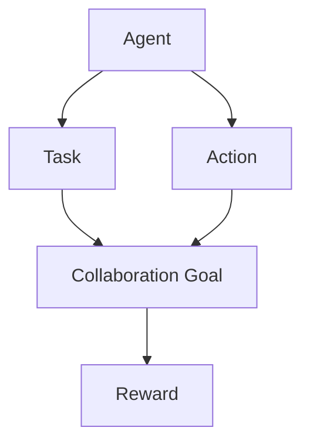
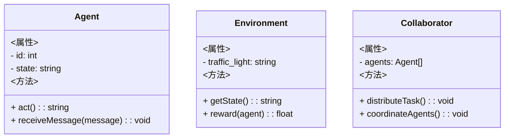

                 


# AI Agent的多智能体强化学习协作机制

> 关键词：AI Agent，多智能体，强化学习，协作机制，分布式系统，系统架构

> 摘要：本文系统地探讨了AI Agent在多智能体强化学习中的协作机制，从基础概念、算法原理到系统架构和实际应用，全面解析了多智能体协作的核心问题及其解决方案。文章通过详细的理论分析和实际案例，展示了如何设计和实现高效的多智能体协作系统。

---

## 第1章 多智能体强化学习协作机制的背景与概念

### 1.1 AI Agent的基本概念

AI Agent（人工智能代理）是指能够感知环境、自主决策并执行任务的智能实体。它可以是一个软件程序、机器人或其他智能系统，其核心目标是通过感知和行动来实现特定任务。

#### 1.1.1 AI Agent的分类与特点

AI Agent可以根据智能水平、任务类型和环境类型进行分类。常见的分类如下：

- **按智能水平**：
  - **反应式Agent**：基于当前感知做出反应，适用于简单的任务。
  - **认知式Agent**：具有推理和规划能力，适用于复杂任务。
  
- **按任务类型**：
  - **服务型Agent**：提供特定服务，如智能助手。
  - **决策型Agent**：用于复杂决策，如自动驾驶。

- **按环境类型**：
  - **静态环境**：环境在Agent决策期间不变。
  - **动态环境**：环境在决策过程中可能变化。

AI Agent的特点包括自主性、反应性、目标导向性和学习能力。

---

### 1.2 多智能体系统的背景与挑战

多智能体系统由多个AI Agent组成，通过协作完成复杂的任务。其背景包括：

- **分布式计算的发展**：多智能体系统广泛应用于分布式系统、机器人网络等领域。
- **复杂任务的需求**：单个Agent难以完成复杂任务，需要多个Agent协作。

多智能体系统的挑战包括：

- **通信与协调**：Agent之间需要高效通信和协调。
- **任务分配**：如何将任务分解并分配给不同的Agent。
- **冲突与合作**：Agent之间的利益可能冲突，需要平衡合作与竞争。

---

## 第2章 多智能体协作机制的核心概念

### 2.1 多智能体协作机制的原理

协作机制是多智能体系统的核心，旨在通过Agent之间的协作实现全局目标。

#### 2.1.1 协作模型的构建

协作模型包括以下关键部分：

- **任务分解**：将全局任务分解为子任务。
- **任务分配**：将子任务分配给不同的Agent。
- **协作规则**：定义Agent之间的协作规则。

#### 2.1.2 协作过程中的信息传递

信息传递是协作的关键，常用的通信方式包括：

- **显式通信**：Agent之间通过消息传递信息。
- **隐式通信**：通过环境状态间接传递信息。

#### 2.1.3 协作目标的分解与分配

任务分解可以通过以下步骤实现：

1. **目标识别**：识别全局目标。
2. **任务分解**：将目标分解为子任务。
3. **任务分配**：根据Agent的能力分配子任务。

---

### 2.2 多智能体协作机制的属性特征对比

协作机制的优缺点取决于其应用场景。以下是一些常见协作机制的对比：

| 协作机制       | 优点                           | 缺点                           |
|----------------|--------------------------------|--------------------------------|
| 基于规则的协作 | 实现简单，易于部署             | 灵活性差，难以应对复杂场景     |
| 基于博弈的协作 | 可处理冲突，结果公平           | 计算复杂，效率较低             |
| 基于学习的协作 | 灵活性高，适应性强             | 需大量数据，训练时间较长       |

---

### 2.3 多智能体协作机制的ER实体关系图

以下是多智能体协作机制的实体关系图：



---

## 第3章 多智能体协作机制的算法原理

### 3.1 多智能体强化学习的数学模型

强化学习中的数学模型包括：

- **状态空间（S）**：环境中的所有可能状态。
- **动作空间（A）**：Agent可执行的所有动作。
- **奖励函数（R）**：根据状态和动作，返回奖励值。

公式：
$$ R(s, a) = \text{奖励值} $$

### 3.2 多智能体协作机制的算法流程

以下是基于强化学习的协作算法流程图：

```mermaid
graph TD
    Start --> Initialize agents
    Initialize agents --> Set initial state
    Set initial state --> Loop
    Loop --> Get observation
    Get observation --> Choose action
    Choose action --> Execute action
    Execute action --> Get reward
    Get reward --> Update policy
    Update policy --> Loop
```

---

## 第4章 多智能体协作机制的系统架构设计

### 4.1 问题场景介绍

以交通灯控制为例，多个AI Agent负责协调交通流量。

### 4.2 系统功能设计

以下是系统功能设计的类图：



---

## 第5章 项目实战：多智能体协作机制的实现

### 5.1 环境配置

安装必要的库：
```bash
pip install gym multi-agent-reinforcement-learning
```

### 5.2 核心代码实现

以下是协作机制的Python代码示例：

```python
import gym
from gym import spaces
import numpy as np

class MultiAgentEnv(gym.Env):
    def __init__(self):
        super().__init__()
        self.agents = 2
        self.observation_space = spaces.Tuple([spaces.Discrete(4), spaces.Discrete(4)])
        self.action_space = spaces.Tuple([spaces.Discrete(2), spaces.Discrete(2)])
    
    def step(self, action):
        obs, reward, done, info = super().step(action)
        return obs, reward, done, info
    
    def reset(self):
        return super().reset()
```

### 5.3 案例分析与解读

以交通灯控制为例，多个Agent协作优化交通流量。

---

## 第6章 应用案例分析

### 6.1 应用场景

- **智能交通系统**：多个AI Agent协作优化交通流量。
- **分布式机器人系统**：多个机器人协作完成任务。

### 6.2 案例分析

以智能交通灯为例，分析协作机制的应用。

---

## 第7章 总结与展望

### 7.1 总结

本文系统地探讨了AI Agent在多智能体强化学习中的协作机制，从背景到实现，全面解析了协作机制的核心问题。

### 7.2 展望

未来的研究方向包括更高效的通信协议、更智能的任务分配算法以及更强大的学习模型。

---

## 作者：AI天才研究院/AI Genius Institute & 禅与计算机程序设计艺术/Zen And The Art of Computer Programming

---

以上是文章的完整目录大纲和部分内容，您可以根据需要进一步扩展每一部分的内容，添加更多细节和案例分析。

