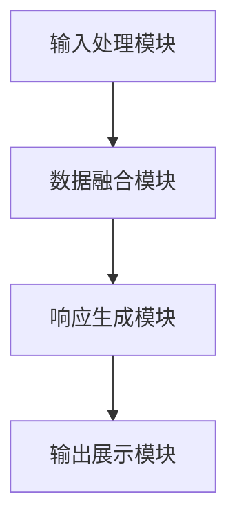
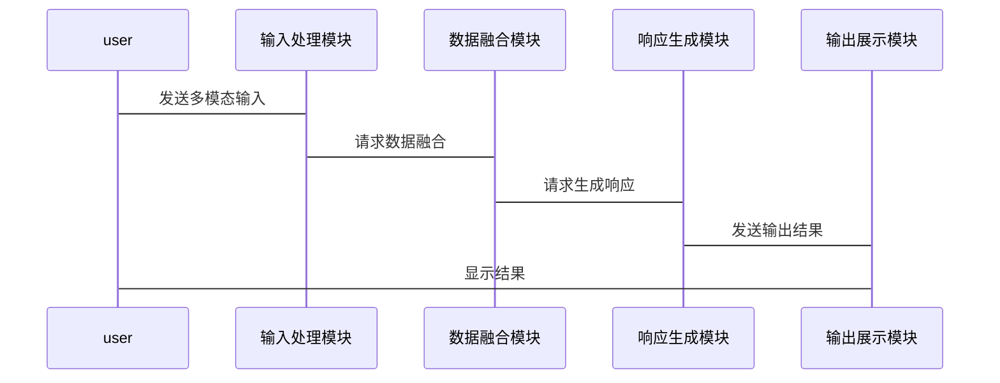

                 


# AI Agent的多模态交互界面设计与实现

> 关键词：AI Agent，多模态交互，自然语言处理，计算机视觉，语音处理，系统架构设计，项目实战

> 摘要：本文系统地探讨了AI Agent的多模态交互界面设计与实现的核心内容。文章首先介绍了多模态交互的基本概念和AI Agent的定义及其在多模态交互中的作用，然后深入分析了多模态交互的核心概念与联系，包括多模态数据融合算法和响应生成算法的原理。接着，详细讲解了多模态交互界面的设计原则和系统架构设计，通过一个具体的项目案例展示了实现过程，并总结了经验与教训。最后，展望了多模态交互技术的未来发展方向。

---

## 第一部分: AI Agent的多模态交互界面设计与实现概述

### 第1章: 多模态交互与AI Agent概述

#### 1.1 多模态交互的基本概念
##### 1.1.1 多模态交互的定义
多模态交互是指通过多种信息载体（如文本、语音、图像、视频等）进行信息传递和用户互动的方式。它结合了不同模态的数据，以提供更丰富、更自然的交互体验。

##### 1.1.2 多模态交互的核心要素
多模态交互的核心要素包括输入数据的多样性、数据处理的复杂性和输出结果的综合性。不同模态的数据需要协同工作，以实现更高效的交互。

##### 1.1.3 多模态交互的优势与应用场景
多模态交互的优势在于它可以利用多种信息源，提高交互的准确性和用户体验。应用场景包括智能客服、智能家居、虚拟助手、教育机器人等。

#### 1.2 AI Agent的定义与特点
##### 1.2.1 AI Agent的基本概念
AI Agent是一种智能体，能够感知环境、执行任务并做出决策。它具备自主性、反应性、社交性和学习性等特点。

##### 1.2.2 AI Agent的核心能力
AI Agent的核心能力包括自然语言处理、计算机视觉、语音识别和生成、决策推理和知识表示等。

##### 1.2.3 AI Agent与传统软件的区别
AI Agent的核心区别在于其智能化和自主性。它能够理解和处理复杂的信息，并根据环境动态调整行为。

#### 1.3 多模态交互在AI Agent中的作用
##### 1.3.1 多模态交互提升用户体验
通过结合多种交互方式，多模态交互能够提供更自然、更便捷的用户体验，满足用户多样化的需求。

##### 1.3.2 多模态交互增强AI Agent的功能
多模态交互使得AI Agent能够处理更多的信息源，提高其理解和执行任务的能力，从而增强其功能。

##### 1.3.3 多模态交互的挑战与未来趋势
多模态交互面临数据融合、实时性、隐私保护等挑战。未来的发展趋势包括更高效的数据处理算法和更自然的交互方式。

---

## 第二部分: 多模态交互的核心概念与联系

### 第2章: 多模态交互的核心概念与联系

#### 2.1 多模态交互的核心概念
##### 2.1.1 多模态数据的整合与处理
多模态数据整合与处理需要将不同模态的数据进行融合，以实现更准确的分析和理解。

##### 2.1.2 多模态模型的构建与训练
多模态模型的构建与训练需要结合多种数据源，设计合适的模型架构，并进行大量的数据训练。

##### 2.1.3 多模态交互的实时性与响应速度
多模态交互需要实时处理用户的输入，并快速生成响应，以保证交互的流畅性。

#### 2.2 多模态交互的核心要素对比
##### 2.2.1 不同模态的数据特征对比
不同模态的数据具有不同的特征，例如文本的语义性、语音的时序性、图像的视觉性等。

##### 2.2.2 各模态数据处理的复杂性对比
不同模态的数据处理复杂性不同，例如图像处理需要大量的计算资源，而文本处理相对简单。

##### 2.2.3 各模态数据在AI Agent中的权重分配
在AI Agent中，不同模态的数据权重需要根据具体场景和任务进行调整。

#### 2.3 多模态交互的ER实体关系图
```mermaid
er
  actor(Agent, 用户)
  entity(输入数据类型, 输出结果类型)
  relationship(输入数据类型-输出结果类型, "映射与转换")
```

---

## 第三部分: 多模态交互的算法原理讲解

### 第3章: 多模态交互的算法原理

#### 3.1 多模态数据融合算法
##### 3.1.1 多模态数据融合的流程
多模态数据融合的流程包括数据预处理、特征提取、融合策略选择和结果生成。

##### 3.1.2 多模态数据融合的数学模型
$$ y = f(x_1, x_2, ..., x_n) $$
其中，$x_i$ 表示不同模态的输入数据，$y$ 表示融合后的输出结果。

#### 3.2 多模态交互的响应生成算法
##### 3.2.1 基于Transformer的多模态编码
使用Transformer模型对多模态数据进行编码，以生成合适的响应。

---

## 第四部分: 多模态交互界面设计与实现

### 第4章: 多模态交互界面的设计原则

#### 4.1 信息架构设计
##### 4.1.1 用户任务分析与信息组织
分析用户的任务需求，合理组织信息，以提高交互效率。

#### 4.2 用户体验设计
##### 4.2.1 视觉设计与交互反馈
设计直观的视觉界面，并提供及时的交互反馈，以增强用户体验。

#### 4.3 交互模式设计
##### 4.3.1 多模态输入的交互模式
支持多种输入方式，如文本输入、语音指令和手势识别。

---

## 第五部分: 项目实战与系统架构设计

### 第5章: 多模态交互界面的系统架构设计

#### 5.1 项目介绍
##### 5.1.1 项目背景与目标
介绍项目的背景和目标，说明为什么要进行多模态交互界面设计与实现。

#### 5.2 系统功能设计
##### 5.2.1 系统功能模块划分
将系统划分为输入处理模块、数据融合模块、响应生成模块和输出展示模块。

#### 5.3 系统架构设计
##### 5.3.1 系统架构设计图


#### 5.4 系统接口设计
##### 5.4.1 系统接口定义
定义系统的输入接口和输出接口，说明接口的参数和调用方式。

#### 5.5 系统交互设计
##### 5.5.1 系统交互流程图


---

## 第六部分: 项目实战与经验分享

### 第6章: 项目实战

#### 6.1 环境安装与配置
##### 6.1.1 开发环境搭建
安装必要的开发工具和库，如Python、TensorFlow、OpenCV等。

#### 6.2 核心代码实现
##### 6.2.1 输入处理模块实现
实现多模态输入的接收和预处理。

#### 6.3 系统功能实现
##### 6.3.1 数据融合与响应生成
结合多种数据源，生成合适的响应。

#### 6.4 项目总结
##### 6.4.1 经验总结
总结项目中的经验和教训，提出改进建议。

---

## 第七部分: 未来展望与总结

### 第7章: 未来展望

#### 7.1 多模态交互技术的发展趋势
##### 7.1.1 更高效的数据处理算法
未来将开发更高效的算法，以提高多模态数据处理的效率。

##### 7.1.2 更自然的交互方式
探索更多自然的交互方式，如脑机接口和情感计算。

#### 7.2 对未来研究方向的建议
建议未来研究多模态数据的高效融合方法和新型交互模式的设计与实现。

---

## 作者信息

作者：AI天才研究院/AI Genius Institute & 禅与计算机程序设计艺术 /Zen And The Art of Computer Programming

---

这篇文章系统地探讨了AI Agent的多模态交互界面设计与实现的核心内容，涵盖了从基础概念到实际应用的各个方面，结合理论分析和项目实战，为读者提供了全面的知识和实践指导。

