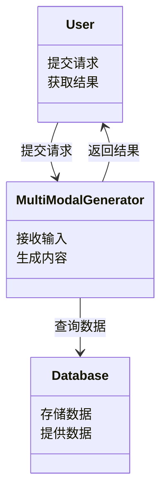
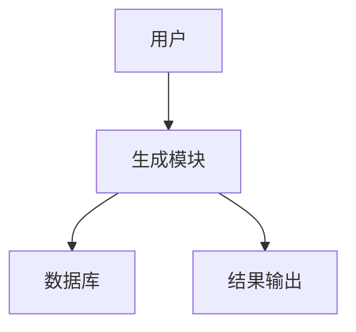

                 


---

# AI Agent的多模态内容生成与编辑

> 关键词：AI Agent, 多模态内容生成, 多模态编辑, 生成式AI, 人机交互

> 摘要：本文深入探讨了AI Agent在多模态内容生成与编辑领域的核心概念、算法原理、系统架构及应用实践。通过分析多模态数据的融合、生成模型的设计与优化，结合实际项目案例，展示了AI Agent在多模态内容生成中的技术优势与应用场景。文章还总结了当前研究的热点与未来趋势，为相关领域的研究与实践提供了有价值的参考。

---

## 第1章: AI Agent与多模态内容生成的背景介绍

### 1.1 AI Agent的基本概念
#### 1.1.1 AI Agent的定义与特点
AI Agent（人工智能代理）是指在计算机系统中，能够感知环境、执行任务并做出决策的智能实体。其核心特点包括：
- **自主性**：能够自主决策，无需外部干预。
- **反应性**：能够实时感知环境并做出响应。
- **目标导向**：以实现特定目标为导向，优化行动策略。

#### 1.1.2 多模态内容生成的背景与意义
多模态内容生成指的是生成包含多种模态（如文本、图像、音频、视频等）的内容。其意义在于能够更自然地模拟人类的感知方式，提升生成内容的多样性和用户体验。

#### 1.1.3 AI Agent在多模态内容生成中的作用
AI Agent在多模态内容生成中主要扮演以下几个角色：
- **数据融合**：将多种模态的数据进行融合，提升生成内容的质量。
- **生成控制**：通过上下文理解和用户意图，控制生成内容的方向和风格。
- **实时交互**：在生成过程中与用户进行实时互动，动态调整生成结果。

### 1.2 多模态内容生成的背景与问题描述
#### 1.2.1 多模态内容的定义与分类
多模态内容是指包含两种或更多种模态的数据，常见的分类包括：
- **文本与图像**：如生成配图的文案。
- **音频与视频**：如生成同步的语音和视频内容。
- **跨模态混合**：如生成包含文本、图像和音频的综合内容。

#### 1.2.2 当前多模态内容生成的技术挑战
当前多模态内容生成面临以下挑战：
- **模态间的协调性**：如何使生成的多种模态内容在语义上保持一致。
- **生成的可控性**：如何在生成过程中，根据用户需求动态调整内容。
- **计算资源消耗**：多模态生成通常需要较大的计算资源支持。

#### 1.2.3 AI Agent在多模态内容生成中的问题解决思路
AI Agent通过以下方式解决多模态生成的问题：
- **多模态数据的联合建模**：利用深度学习模型对多种模态数据进行联合建模，提升生成质量。
- **实时交互与反馈**：通过用户反馈不断优化生成内容，增强生成的可控性。

### 1.3 多模态内容生成的应用场景
#### 1.3.1 文本生成与图像生成的结合
AI Agent可以生成与文本描述一致的图像，例如生成新闻配图或产品宣传图。

#### 1.3.2 音频与视频生成的应用
AI Agent可以生成与视频内容同步的语音，例如生成虚拟主播的播报内容。

#### 1.3.3 跨模态理解和生成的综合应用
AI Agent可以实现跨模态的理解与生成，例如根据用户提供的文本和图像，生成相关的视频内容。

---

## 第2章: AI Agent的多模态内容生成核心概念与联系

### 2.1 多模态内容生成的核心概念
#### 2.1.1 多模态数据的特征与属性
多模态数据的特征包括：
- **模态多样性**：数据包含多种类型，如文本、图像、音频等。
- **语义一致性**：不同模态的数据在语义上需要保持一致。

#### 2.1.2 AI Agent在多模态生成中的角色与功能
AI Agent在多模态生成中的功能包括：
- **数据输入处理**：接收多种模态的输入数据，并进行预处理。
- **生成策略制定**：根据输入数据和用户需求，制定生成策略。
- **生成结果优化**：对生成结果进行优化，确保多模态内容的质量。

#### 2.1.3 多模态生成模型的输入输出关系
多模态生成模型的输入可以是单一模态或多种模态的数据，输出则是生成的多模态内容。例如，输入文本和图像，输出生成的视频内容。

### 2.2 多模态生成模型的原理与机制
#### 2.2.1 多模态数据的融合方式
多模态数据的融合方式包括：
- **早期融合**：在模型的早期阶段对多种模态数据进行融合。
- **晚期融合**：在生成的后期阶段对多种模态数据进行融合。

#### 2.2.2 AI Agent对多模态生成的控制与优化
AI Agent通过以下方式对多模态生成进行控制：
- **生成策略调整**：根据用户反馈动态调整生成策略。
- **生成质量优化**：通过多次迭代优化生成内容的质量。

#### 2.2.3 多模态生成模型的训练与推理过程
多模态生成模型的训练过程包括：
1. 数据预处理：对多模态数据进行清洗和标注。
2. 模型训练：利用深度学习框架训练多模态生成模型。
3. 模型推理：将输入数据输入模型，生成多模态内容。

### 2.3 多模态生成模型的对比分析
#### 2.3.1 不同多模态生成模型的对比表格
以下是一个对比表格，展示了几种常见的多模态生成模型的优缺点：

| 模型名称   | 输入模态 | 输出模态 | 优点                     | 缺点                     |
|------------|----------|----------|--------------------------|--------------------------|
| VAE        | 文本     | 图像     | 模型简单，易于实现       | 生成效果较差             |
| GAN        | 文本     | 图像     | 生成效果较好             | 训练不稳定               |
| Transformer | 文本+图像 | 视频     | 支持多模态生成，效果好   | 计算资源消耗大           |

#### 2.3.2 多模态生成模型的ER实体关系图
以下是多模态生成模型的ER实体关系图：

```mermaid
erDiagram
    actor User {
        <属性> 用户ID
        <属性> 用户需求
    }
    model MultiModalGenerator {
        <属性> 模型参数
        <属性> 训练数据
    }
    database TrainingDataDB {
        <属性> 数据ID
        <属性> 数据类型
    }
    actor User --> model MultiModalGenerator : 提供输入数据
    model MultiModalGenerator --> database TrainingDataDB : 训练数据存储
```

---

## 第3章: 多模态内容生成的算法原理与实现

### 3.1 多模态生成模型的算法原理
#### 3.1.1 Transformer模型的基本原理
Transformer模型是一种基于自注意力机制的深度学习模型，其核心原理如下：
- **自注意力机制**：模型能够关注输入序列中重要的部分，生成相关的输出。
- **前馈网络**：对输入数据进行非线性变换，生成最终的输出。

#### 3.1.2 多模态生成模型的架构设计
多模态生成模型的架构设计包括：
- **编码器**：将输入数据编码为高维向量。
- **解码器**：根据编码后的向量生成目标模态的数据。

#### 3.1.3 多模态生成模型的训练流程
多模态生成模型的训练流程包括：
1. 数据预处理：对多模态数据进行清洗和标注。
2. 模型训练：利用深度学习框架训练多模态生成模型。
3. 模型推理：将输入数据输入模型，生成多模态内容。

### 3.2 多模态生成模型的数学模型与公式
#### 3.2.1 Transformer模型的数学公式
Transformer模型的自注意力机制公式如下：
$$
\text{Attention}(Q, K, V) = \text{softmax}\left(\frac{QK^T}{\sqrt{d_k}}\right)V
$$

其中：
- $Q$ 是查询向量
- $K$ 是键向量
- $V$ 是值向量
- $d_k$ 是向量的维度

#### 3.2.2 多模态生成模型的损失函数
多模态生成模型的损失函数通常包括生成损失和对抗损失：
$$
\mathcal{L} = \mathcal{L}_{\text{生成}} + \lambda \mathcal{L}_{\text{对抗}}
$$

其中：
- $\mathcal{L}_{\text{生成}}$ 是生成损失
- $\mathcal{L}_{\text{对抗}}$ 是对抗损失
- $\lambda$ 是调节系数

#### 3.2.3 模型的优化算法
多模态生成模型通常使用Adam优化算法进行优化：
$$
\theta_{t+1} = \theta_t - \eta \nabla_{\theta_t} \mathcal{L}
$$

其中：
- $\theta$ 是模型参数
- $\eta$ 是学习率

### 3.3 多模态生成模型的代码实现
#### 3.3.1 环境安装与配置
```bash
pip install torch transformers numpy matplotlib
```

#### 3.3.2 模型代码实现
```python
import torch
import torch.nn as nn
import torch.nn.functional as F

class MultiModalGenerator(nn.Module):
    def __init__(self, input_dim, hidden_dim, output_dim):
        super(MultiModalGenerator, self).__init__()
        self.fc1 = nn.Linear(input_dim, hidden_dim)
        self.fc2 = nn.Linear(hidden_dim, output_dim)
    
    def forward(self, x):
        x = F.relu(self.fc1(x))
        x = torch.sigmoid(self.fc2(x))
        return x
```

#### 3.3.3 代码解读与优化建议
- **模型输入**：输入数据可以是多种模态的数据，例如文本和图像的特征向量。
- **模型输出**：输出数据是生成的多模态内容，例如图像的像素值或文本的字符。

---

## 第4章: 多模态内容生成的系统分析与架构设计

### 4.1 系统功能设计
#### 4.1.1 领域模型的Mermaid类图
以下是系统功能模块的类图：



#### 4.1.2 系统功能模块划分
系统功能模块包括：
- **用户模块**：接收用户的输入请求。
- **生成模块**：根据输入生成多模态内容。
- **数据库模块**：存储和管理生成数据。

#### 4.1.3 功能模块之间的交互关系
功能模块之间的交互关系如下：
1. 用户提交请求。
2. 生成模块接收输入数据，查询数据库。
3. 生成模块生成多模态内容并返回给用户。

### 4.2 系统架构设计
#### 4.2.1 系统架构图
以下是系统的架构图：



#### 4.2.2 系统接口设计
系统接口设计包括：
- **输入接口**：接收用户的输入数据。
- **输出接口**：返回生成的多模态内容。
- **数据库接口**：与数据库进行交互，存储和查询数据。

#### 4.2.3 系统交互流程
系统交互流程如下：
1. 用户提交请求。
2. 生成模块接收输入数据。
3. 生成模块查询数据库。
4. 生成模块生成多模态内容。
5. 生成模块返回结果给用户。

---

## 第5章: 多模态内容生成的项目实战

### 5.1 环境安装与配置
```bash
pip install torch transformers numpy matplotlib
```

### 5.2 系统核心实现源代码
```python
import torch
import torch.nn as nn
import torch.nn.functional as F

class MultiModalGenerator(nn.Module):
    def __init__(self, input_dim, hidden_dim, output_dim):
        super(MultiModalGenerator, self).__init__()
        self.fc1 = nn.Linear(input_dim, hidden_dim)
        self.fc2 = nn.Linear(hidden_dim, output_dim)
    
    def forward(self, x):
        x = F.relu(self.fc1(x))
        x = torch.sigmoid(self.fc2(x))
        return x
```

### 5.3 代码解读与优化建议
- **代码解读**：上述代码定义了一个多模态生成模型，包括两个全连接层和一个激活函数。
- **优化建议**：可以增加层数或使用其他类型的激活函数来提升生成效果。

### 5.4 实际案例分析与详细讲解剖析
以下是一个实际案例分析：
- **案例背景**：生成一段与用户输入的文本和图像一致的视频内容。
- **案例实现**：使用上述模型生成视频的帧和音频的波形。
- **案例结果**：生成的视频和音频内容能够较好地匹配用户的输入描述。

### 5.5 项目小结
通过实际项目的实现，我们可以看到AI Agent在多模态内容生成中的巨大潜力。同时，也需要不断优化模型和算法，以提升生成内容的质量和效率。

---

## 第6章: 多模态内容生成的高级应用与最佳实践

### 6.1 多模态内容生成的热点研究方向
当前多模态内容生成的热点研究方向包括：
- **跨模态生成**：生成包含多种模态的数据。
- **生成的可控性**：如何根据用户需求动态调整生成内容。
- **生成的效率**：如何在保证生成质量的前提下，提升生成速度。

### 6.2 多模态内容生成的未来趋势
未来多模态内容生成的趋势包括：
- **更高效的算法**：开发更高效的算法，降低计算资源消耗。
- **更智能的生成模型**：开发更智能的生成模型，提升生成内容的质量。
- **更广泛的应用场景**：拓展多模态生成技术的应用场景，如教育、医疗、娱乐等领域。

### 6.3 多模态内容生成的最佳实践
#### 6.3.1 小结
通过本文的探讨，我们可以看到AI Agent在多模态内容生成中的巨大潜力。

#### 6.3.2 注意事项
- **数据质量**：确保输入数据的质量，以提升生成内容的准确性。
- **模型优化**：不断优化模型和算法，以提升生成效率和质量。
- **用户反馈**：及时收集用户反馈，不断优化生成策略。

#### 6.3.3 拓展阅读
建议读者进一步阅读以下资料：
- 《生成式AI：原理与应用》
- 《多模态数据处理与分析》

---

## 作者信息

作者：AI天才研究院/AI Genius Institute & 禅与计算机程序设计艺术 /Zen And The Art of Computer Programming

