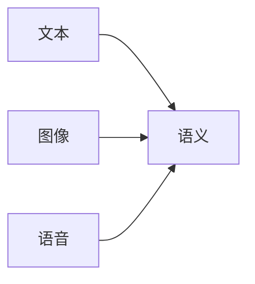
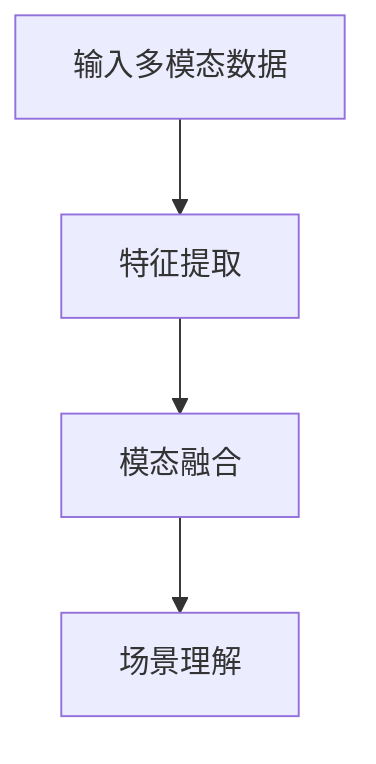
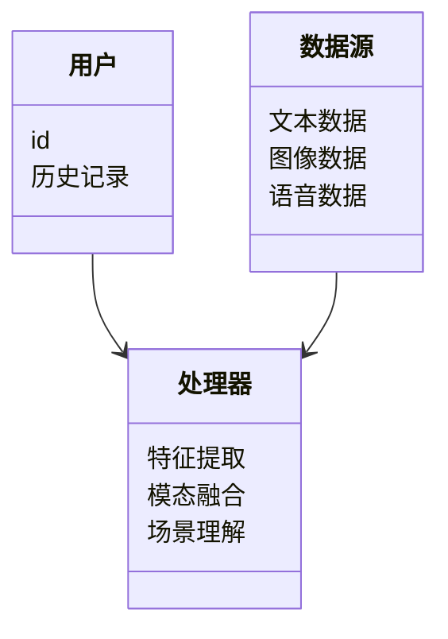
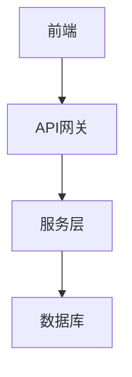
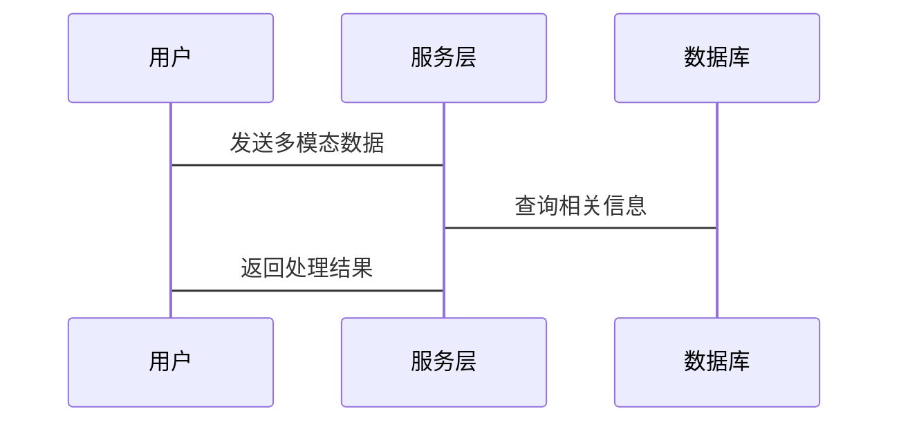

                 


# AI Agent的多模态场景理解与推理

> 关键词：AI Agent，多模态，场景理解，推理，算法，系统架构

> 摘要：本文深入探讨了AI Agent在多模态场景理解与推理中的应用，分析了多模态数据的特征与表示方法，详细讲解了多模态融合的核心算法原理，系统地介绍了多模态场景理解的系统架构设计，并通过实际案例展示了项目实战。最后，总结了多模态场景理解与推理的最佳实践。

---

## 第一章: AI Agent与多模态场景理解概述

### 1.1 AI Agent的基本概念
#### 1.1.1 AI Agent的定义与特点
AI Agent（智能体）是一种能够感知环境、自主决策并执行任务的智能系统。它具有自主性、反应性、目标导向性和社会性等特征。

#### 1.1.2 多模态数据的定义与特征
多模态数据是指来自多种感官渠道（如视觉、听觉、语言等）的数据。其特征包括异构性、互补性和关联性。

#### 1.1.3 多模态场景理解的必要性
在复杂环境中，单一模态数据难以提供足够的信息，因此需要结合多模态数据来提高理解和推理能力。

### 1.2 多模态场景理解的技术背景
#### 1.2.1 多模态数据的融合方式
多模态数据的融合方式包括基于特征的融合、基于决策的融合和基于模型的融合。

#### 1.2.2 场景理解的核心问题
场景理解的核心问题是如何从多模态数据中提取语义信息并进行推理。

#### 1.2.3 多模态推理的挑战与机遇
多模态推理的挑战在于不同模态数据的异构性和关联性的处理，而机遇在于可以通过多模态数据互补性提高理解能力。

### 1.3 多模态场景理解的应用现状
#### 1.3.1 当前主流应用领域
多模态场景理解在智能客服、自动驾驶、智能助手等领域有广泛应用。

#### 1.3.2 技术发展趋势
技术发展趋势包括深度学习的进一步发展、多模态数据的高效融合方法研究以及跨模态检索技术的提升。

#### 1.3.3 存在的主要问题与挑战
主要问题包括数据异构性处理困难、多模态融合的计算复杂度高以及场景理解的实时性要求高等。

### 1.4 本章小结
本章介绍了AI Agent的基本概念，分析了多模态场景理解的必要性及其技术背景，总结了当前的应用现状和未来的发展趋势。

---

## 第二章: 多模态数据的特征与表示

### 2.1 多模态数据的特征分析
#### 2.1.1 各类模态数据的特征对比
| 模态类型 | 特征描述 |
|----------|-----------|
| 文本      | 顺序性、语义性 |
| 图像      | 空间性、视觉性 |
| 语音      | 时间性、情感性 |

#### 2.1.2 多模态数据的异构性与关联性
异构性指不同模态数据在形式和语义上的差异；关联性指不同模态数据之间的相互作用和依赖。

#### 2.1.3 模态数据的表示方法
文本可以使用词向量或BERT模型表示，图像可以使用CNN或GAN模型表示，语音可以使用Mel频谱或MFCC特征表示。

### 2.2 多模态数据的融合策略
#### 2.2.1 基于特征的融合
将不同模态的特征向量进行拼接或加权求和。

#### 2.2.2 基于决策的融合
根据不同模态数据的决策结果进行综合判断。

#### 2.2.3 基于模型的融合
使用深度学习模型（如Transformer）对多模态数据进行联合建模。

### 2.3 多模态数据的实体关系图


### 2.4 本章小结
本章详细分析了多模态数据的特征，对比了各类模态数据的特性，并探讨了多模态数据的融合策略，最后通过实体关系图展示了多模态数据之间的关联性。

---

## 第三章: 多模态场景理解的算法原理

### 3.1 多模态融合算法原理
#### 3.1.1 注意力机制在多模态融合中的应用
注意力机制可以用于跨模态信息的选择和权重分配。

#### 3.1.2 多模态编码器-解码器模型
编码器负责将多模态数据编码为语义表示，解码器负责根据语义生成目标输出。

#### 3.1.3 图神经网络在多模态数据中的应用
图神经网络可以用于处理多模态数据之间的关系和依赖。

### 3.2 多模态融合的数学模型
#### 3.2.1 注意力机制的数学表达
$$\alpha_i = \frac{\exp(e_i)}{\sum_{j} \exp(e_j)}$$

#### 3.2.2 多模态编码器的数学公式
$$z = f(x_1, x_2, ..., x_n)$$

### 3.3 多模态推理算法的流程图


### 3.4 本章小结
本章详细讲解了多模态融合的核心算法，包括注意力机制和编码器-解码器模型，并通过流程图展示了多模态推理的整个过程。

---

## 第四章: 多模态场景理解的系统架构设计

### 4.1 应用场景介绍
#### 4.1.1 智能客服
通过多模态数据理解客户意图，提供个性化服务。

#### 4.1.2 智能助手
通过多模态数据理解用户的指令，执行相应的操作。

#### 4.1.3 智能监控
通过多模态数据分析视频和音频信息，识别异常行为。

### 4.2 系统功能设计
#### 4.2.1 领域模型


### 4.3 系统架构设计


### 4.4 系统接口设计
#### 4.4.1 API接口
提供RESTful API，用于接收多模态数据并返回处理结果。

#### 4.4.2 交互序列图


### 4.5 本章小结
本章介绍了多模态场景理解的应用场景，设计了系统的功能模块和架构，并通过接口设计展示了系统的交互流程。

---

## 第五章: 项目实战

### 5.1 环境安装
安装必要的依赖库，如TensorFlow、PyTorch、OpenCV等。

### 5.2 核心代码实现
#### 5.2.1 多模态数据处理
```python
import numpy as np
from tensorflow.keras import layers

# 文本处理
text_input = layers.Input(shape=(None,))
text_embedding = layers.Embedding(vocab_size, embedding_dim)(text_input)

# 图像处理
image_input = layers.Input(shape=(224,224,3))
image_embedding = layers.Conv2D(64, (3,3), activation='relu')(image_input)

# 模态融合
merged = layers.Concatenate()([text_embedding, image_embedding])
dense = layers.Dense(128, activation='relu')(merged)
output = layers.Dense(num_classes, activation='softmax')(dense)

model = Model(inputs=[text_input, image_input], outputs=output)
```

#### 5.2.2 训练与推理
```python
model.compile(optimizer='adam', loss='sparse_categorical_crossentropy', metrics=['accuracy'])
model.fit([text_train, image_train], labels_train, epochs=10, batch_size=32)
```

### 5.3 代码解读与分析
解释代码实现的每一步，包括数据输入、特征提取、模态融合和模型训练。

### 5.4 实际案例分析
通过具体案例分析，展示多模态场景理解的实际应用效果。

### 5.5 项目小结
总结项目实现的关键点和经验教训。

---

## 第六章: 最佳实践与总结

### 6.1 小结
总结全文内容，强调多模态场景理解的重要性和应用价值。

### 6.2 注意事项
在实际应用中需要注意数据的异构性处理、模型的泛化能力和系统的实时性要求。

### 6.3 拓展阅读
推荐相关领域的书籍和论文，供读者进一步学习和研究。

---

## 作者信息

作者：AI天才研究院/AI Genius Institute  
联系方式：[email protected]  
GitHub：[GitHub Repository](https://github.com/AI-Genius-Institute)

