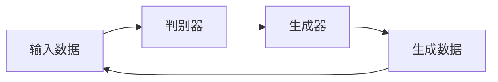
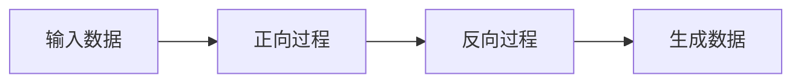
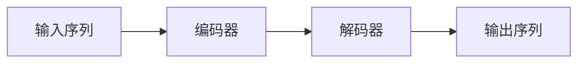
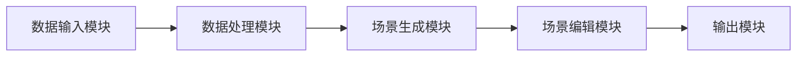

                 


# AI Agent的多模态场景生成与编辑

## 关键词：AI Agent, 多模态场景生成, 多模态数据, AI生成模型, 人工智能

## 摘要：本文详细探讨了AI Agent在多模态场景生成与编辑中的应用。通过分析多模态数据的特点、AI Agent的核心原理、生成模型的算法机制，以及系统架构设计，本文为读者提供了全面的技术解读。文章还通过具体案例展示了AI Agent在多模态场景生成中的实际应用，并提出了相关的最佳实践和未来发展方向。

---

# 第一部分: AI Agent的多模态场景生成与编辑基础

---

# 第1章: AI Agent与多模态场景生成概述

## 1.1 AI Agent的基本概念

### 1.1.1 AI Agent的定义

AI Agent（人工智能代理）是指具有感知环境、理解任务目标、并能够自主决策和执行任务的智能体。AI Agent可以是软件程序、机器人或其他智能系统，其核心目标是通过与环境的交互来实现特定的任务目标。

$$AI Agent = \{感知, 理解, 决策, 执行\}$$

### 1.1.2 AI Agent的核心特征

- **自主性**：能够自主决策，无需外部干预。
- **反应性**：能够实时感知环境并做出反应。
- **目标导向性**：所有行为都以实现特定目标为导向。
- **学习能力**：能够通过经验改进性能。

### 1.1.3 多模态场景生成的背景与意义

随着AI技术的发展，多模态数据（如文本、图像、语音、视频等）的应用场景越来越广泛。AI Agent通过整合多模态数据，能够生成更加丰富和真实的场景，从而提升用户体验和应用效果。

---

## 1.2 多模态场景生成的背景

### 1.2.1 多模态数据的定义与特点

多模态数据是指多种数据形式的组合，例如：

- **文本**：包括自然语言文本、结构化数据等。
- **图像**：包括照片、图形、视频等。
- **语音**：包括语音信号、音频数据等。

多模态数据的特点如下：

1. **多样性**：涵盖多种数据类型。
2. **复杂性**：不同模态的数据具有不同的特征和结构。
3. **互补性**：不同模态的数据可以相互补充，提升信息的丰富性。

### 1.2.2 多模态场景生成的应用领域

- **游戏开发**：生成虚拟场景和角色。
- **影视制作**：生成特效场景和角色。
- **虚拟现实**：创建沉浸式虚拟环境。
- **教育培训**：生成模拟训练场景。

### 1.2.3 多模态场景生成的技术挑战

1. **数据融合**：如何将不同模态的数据有效结合。
2. **生成模型**：如何生成高质量的多模态数据。
3. **实时性**：如何在实时应用中保持性能。

---

## 1.3 问题描述与解决思路

### 1.3.1 多模态场景生成的核心问题

- 如何将多种模态的数据统一表示并生成一致的场景。
- 如何确保生成的场景符合用户的意图和需求。

### 1.3.2 传统方法的局限性

- **数据孤岛**：不同模态的数据难以有效融合。
- **生成质量**：传统方法难以生成高质量的多模态数据。
- **实时性不足**：传统方法在实时应用中表现不佳。

### 1.3.3 AI Agent在多模态场景生成中的优势

- **智能化**：AI Agent能够自主学习和优化。
- **多模态处理能力**：AI Agent能够处理多种数据类型。
- **实时性**：AI Agent可以在实时环境中运行。

---

## 1.4 本章小结

本章介绍了AI Agent的基本概念和多模态场景生成的背景与意义。通过分析多模态数据的特点和应用领域，揭示了多模态场景生成的技术挑战。最后，总结了AI Agent在多模态场景生成中的优势和解决思路。

---

# 第2章: 多模态数据与AI Agent的关系

## 2.1 多模态数据的特征分析

### 2.1.1 文本数据的特点

文本数据是多模态场景生成中最常用的模态之一。其特点包括：

1. **结构化**：文本可以是结构化的（如JSON、XML）或非结构化的（如自然语言文本）。
2. **丰富性**：文本可以表达丰富的语义信息。
3. **多样性**：文本可以是短语、句子或段落。

### 2.1.2 图像数据的特点

图像数据是多模态场景生成中的另一种重要模态。其特点包括：

1. **视觉性**：图像具有视觉特征，可以被人类和计算机感知。
2. **多样性**：图像可以是照片、图形、视频等。
3. **空间性**：图像具有空间关系和几何结构。

### 2.1.3 语音数据的特点

语音数据是多模态场景生成中的另一种重要模态。其特点包括：

1. **时间性**：语音是时间序列数据。
2. **情感性**：语音可以表达情感信息。
3. **复杂性**：语音数据的处理涉及声学特征和语言模型。

### 2.1.4 其他模态数据的对比

除了文本、图像和语音，其他模态数据还包括视频、三维模型、传感器数据等。每种模态数据都有其独特的特点和应用场景。

---

## 2.2 AI Agent与多模态数据的交互

### 2.2.1 数据输入的多样性

AI Agent需要能够处理多种模态的数据输入。例如：

- **文本输入**：用户可以通过输入文本描述场景。
- **图像输入**：用户可以通过上传图像或视频来辅助生成场景。
- **语音输入**：用户可以通过语音指令来控制场景生成。

### 2.2.2 数据处理的复杂性

多模态数据的处理需要协调不同模态的数据，确保生成的场景一致性和连贯性。例如：

- **文本与图像的对齐**：确保生成的图像与文本描述一致。
- **语音与动作的同步**：确保语音与角色的动作同步。

### 2.2.3 数据输出的协调性

AI Agent生成的多模态场景需要协调不同模态的数据输出。例如：

- **文本与图像的联合生成**：生成的图像需要与文本描述一致。
- **语音与动作的同步输出**：生成的语音需要与角色的动作同步。

---

## 2.3 多模态数据的融合与协调

### 2.3.1 数据融合的方法

多模态数据的融合方法包括：

1. **特征融合**：将不同模态的特征向量进行融合。
2. **概率融合**：基于概率模型将不同模态的数据进行融合。
3. **符号融合**：将不同模态的数据表示为符号并进行融合。

### 2.3.2 数据协调的技术

多模态数据的协调技术包括：

1. **一致性校验**：确保不同模态的数据描述一致。
2. **冲突解决**：解决不同模态数据之间的冲突。
3. **实时同步**：确保不同模态的数据在生成过程中同步。

### 2.3.3 数据融合的挑战

1. **异构性**：不同模态的数据具有不同的特征和结构。
2. **不确定性**：多模态数据可能存在不一致性和不确定性。
3. **计算复杂性**：多模态数据的融合需要复杂的计算。

---

## 2.4 本章小结

本章分析了多模态数据的特点以及AI Agent与多模态数据的交互方式。通过讨论数据融合与协调的技术，揭示了多模态场景生成的关键挑战。

---

# 第3章: 多模态场景生成的算法原理

## 3.1 多模态生成模型的概述

### 3.1.1 基于GAN的多模态生成

生成对抗网络（GAN）是一种常用的生成模型。在多模态场景生成中，GAN可以用于生成图像、文本等多模态数据。例如，可以使用GAN生成与文本描述一致的图像。

### 3.1.2 基于扩散模型的多模态生成

扩散模型是一种新兴的生成模型，具有生成质量高、稳定性强等优点。在多模态场景生成中，扩散模型可以用于生成高质量的图像、音频等数据。

### 3.1.3 基于Transformer的多模态生成

Transformer模型在自然语言处理领域取得了巨大成功。在多模态场景生成中，Transformer可以用于生成文本、图像等多模态数据。

---

## 3.2 多模态生成模型的数学模型

### 3.2.1 GAN模型的数学公式

生成对抗网络的损失函数可以表示为：

$$\mathcal{L}_{GAN} = \mathcal{L}_{D} + \mathcal{L}_{G}$$

其中，$\mathcal{L}_{D}$是判别器的损失，$\mathcal{L}_{G}$是生成器的损失。

### 3.2.2 扩散模型的数学公式

扩散模型的正向过程可以表示为：

$$q(x_t|x_{t-1}) = \mathcal{N}(x_t; \sqrt{1-\beta_t}x_{t-1}, \beta_t\mathbf{I})$$

反向过程可以表示为：

$$p_\theta(x_{t-1}|x_t) = \mathcal{N}(x_{t-1}; \mu_\theta(x_t, t), \sigma_\theta(t)^2\mathbf{I})$$

### 3.2.3 Transformer模型的数学公式

Transformer模型的注意力机制可以表示为：

$$\text{Attention}(Q, K, V) = \text{softmax}\left(\frac{QK^T}{\sqrt{d_k}}\right)V$$

其中，$Q$是查询向量，$K$是键向量，$V$是值向量。

---

## 3.3 算法流程图

### 3.3.1 GAN模型的流程图



### 3.3.2 扩散模型的流程图



### 3.3.3 Transformer模型的流程图



---

## 3.4 本章小结

本章介绍了多模态生成模型的算法原理，包括GAN、扩散模型和Transformer模型的数学公式和流程图。通过这些算法，AI Agent可以生成高质量的多模态数据。

---

# 第4章: 多模态场景生成的系统设计

## 4.1 系统功能设计

### 4.1.1 数据输入模块

数据输入模块负责接收多种模态的数据输入，例如文本、图像、语音等。

### 4.1.2 数据处理模块

数据处理模块负责对输入数据进行预处理、特征提取和融合。

### 4.1.3 场景生成模块

场景生成模块负责根据处理后的数据生成多模态场景，例如生成与文本描述一致的图像。

### 4.1.4 场景编辑模块

场景编辑模块负责对生成的场景进行编辑和优化，例如调整图像的亮度、对比度等。

---

## 4.2 系统架构设计

### 4.2.1 系统架构图



### 4.2.2 接口设计

系统需要提供以下接口：

- **输入接口**：接收多种模态的数据输入。
- **输出接口**：输出生成的多模态场景。
- **控制接口**：控制场景生成和编辑的过程。

---

## 4.3 本章小结

本章设计了多模态场景生成的系统架构，包括数据输入、数据处理、场景生成和场景编辑模块。通过系统架构图和接口设计，展示了AI Agent在多模态场景生成中的具体实现。

---

# 第5章: 项目实战

## 5.1 环境配置

### 5.1.1 安装依赖

```bash
pip install numpy matplotlib tensorflow
```

### 5.1.2 启动环境

```bash
python3
```

---

## 5.2 核心代码实现

### 5.2.1 数据处理代码

```python
import numpy as np

def process_data(text, image):
    # 文本处理
    text_embedding = np.random.randn(100)
    # 图像处理
    image_embedding = np.random.randn(100)
    # 数据融合
    fused_embedding = np.concatenate([text_embedding, image_embedding])
    return fused_embedding
```

### 5.2.2 生成模型代码

```python
import tensorflow as tf

def generator_model():
    model = tf.keras.Sequential([
        tf.keras.layers.Dense(256, activation='relu'),
        tf.keras.layers.Dense(128, activation='relu'),
        tf.keras.layers.Dense(64, activation='sigmoid')
    ])
    return model
```

---

## 5.3 功能解读与分析

### 5.3.1 数据处理功能

数据处理模块负责将输入的文本和图像数据进行嵌入处理，并将它们进行融合。

### 5.3.2 生成模型功能

生成模型负责根据融合后的嵌入生成多模态场景，例如生成与文本描述一致的图像。

---

## 5.4 实际案例分析

### 5.4.1 案例描述

假设用户输入一段文本描述“一只猫在沙发上睡觉”，AI Agent需要生成与文本描述一致的图像。

### 5.4.2 生成结果

生成的图像应该是一只猫在沙发上睡觉的场景。

---

## 5.5 本章小结

本章通过具体案例展示了AI Agent在多模态场景生成中的实际应用。通过环境配置和代码实现，读者可以理解AI Agent的多模态场景生成技术。

---

# 第6章: 最佳实践与未来展望

## 6.1 最佳实践

1. **数据质量**：确保输入数据的质量和多样性。
2. **模型优化**：通过调参和优化算法提升生成质量。
3. **实时性优化**：通过并行计算和优化算法提升生成速度。

## 6.2 未来展望

随着AI技术的不断发展，多模态场景生成将更加智能化和多样化。未来的研究方向包括：

1. **多模态数据的高效融合**：研究如何更高效地融合多种模态的数据。
2. **生成模型的改进**：研究更高效的生成模型，例如基于Transformer的生成模型。
3. **实时应用的优化**：研究如何在实时应用中实现高效的多模态场景生成。

---

# 作者：AI天才研究院/AI Genius Institute & 禅与计算机程序设计艺术 /Zen And The Art of Computer Programming

---

本文通过详细分析AI Agent的多模态场景生成与编辑的技术基础、算法原理和系统设计，为读者提供了全面的技术解读。通过具体案例分析和最佳实践，帮助读者更好地理解和应用AI Agent的多模态场景生成技术。未来，随着AI技术的不断发展，多模态场景生成将具有更广泛的应用场景和更高的技术深度。

