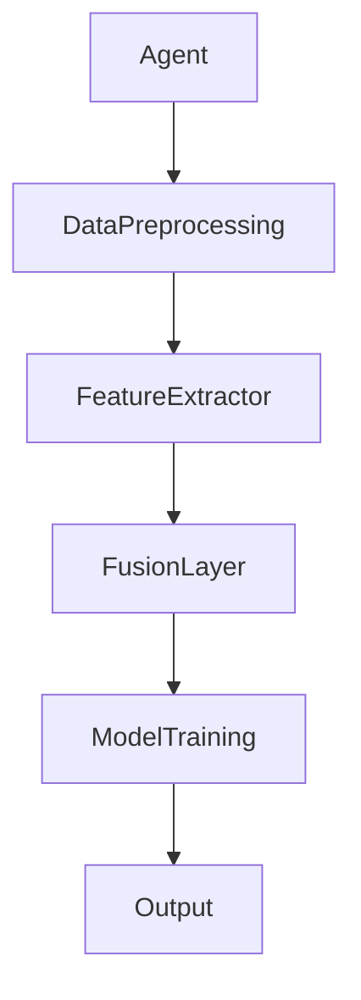
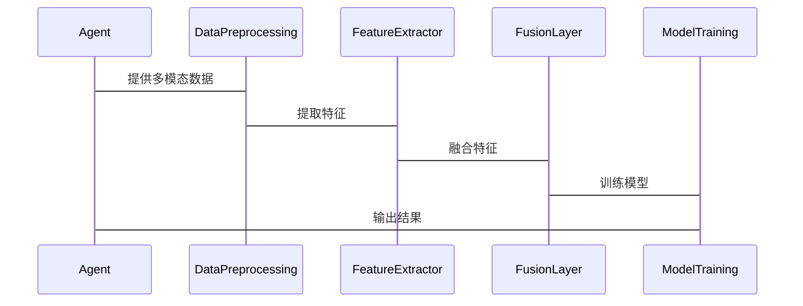

                 


# AI Agent的多模态学习：整合视觉、听觉和文本信息

**关键词**：AI Agent, 多模态学习, 视觉信息, 听觉信息, 文本信息, 模态融合

**摘要**：  
AI Agent 的多模态学习是当前人工智能领域的研究热点，旨在通过整合视觉、听觉和文本等多种信息源，提升 AI Agent 的理解能力、交互能力和应用场景的广泛性。本文将从多模态学习的背景、核心概念、算法原理、系统设计、项目实战等方面展开，深入探讨如何有效地整合和利用多模态信息，以实现更智能、更高效的 AI Agent。

---

## 第一部分: 多模态学习的背景与意义

### 第1章: 多模态学习的背景

#### 1.1 多模态数据的定义
- 多模态数据指的是包含多种信息形式（如图像、音频、文本）的数据。
- 每种模态数据都有其独特的优势和局限性。

#### 1.2 AI Agent的基本概念
- AI Agent 是能够感知环境、自主决策并执行任务的智能实体。
- 与传统 AI 的区别在于其自主性和实时性。

#### 1.3 多模态学习的意义
- 提高 AI Agent 的理解能力，使其能够处理复杂场景。
- 增强交互能力，提升用户体验。
- 在实际应用中，多模态学习能够覆盖更多场景，如智能客服、智能助手等。

---

## 第二部分: 多模态数据的整合与处理

### 第2章: 多模态数据的特点

#### 2.1 视觉数据的特点
- 高维性：图像通常由 millions of pixels 组成。
- 层次性：从边缘检测到目标识别，具有层次结构。

#### 2.2 听觉数据的特点
- 时间序列性：音频数据通常以时间序列的形式存在。
- 语调和语气的重要性：听觉信息中包含情感信息。

#### 2.3 文本数据的特点
- 结构化与非结构化：文本可以是句子、段落或文档。
- 上下文依赖性：语义理解需要上下文信息。

### 第3章: 多模态数据的预处理

#### 3.1 数据清洗与标准化
- 去除噪声：如图像中的背景干扰、音频中的杂音。
- 标准化处理：将不同模态的数据统一到相同的尺度。

#### 3.2 数据增强技术
- 图像数据增强：旋转、缩放、裁剪等操作。
- 音频数据增强：添加噪声、改变语速等。
- 文本数据增强：同义词替换、句式变换。

#### 3.3 数据格式的统一与转换
- 将不同模态的数据转换为统一的格式，便于模型输入。
- 如将图像数据转换为向量形式，将音频数据转换为频谱图。

### 第4章: 多模态数据的特征提取

#### 4.1 视觉特征提取方法
- 基于CNN的图像特征提取。
- 使用预训练模型（如ResNet、VGG）提取高层特征。

#### 4.2 听觉特征提取方法
- 基于FFT的频域特征提取。
- 使用预训练模型（如wav2vec）提取音频特征。

#### 4.3 文本特征提取方法
- 基于词嵌入（如Word2Vec、GloVe）的特征提取。
- 使用预训练语言模型（如BERT）提取上下文特征。

---

## 第三部分: 多模态学习的核心概念与联系

### 第5章: 多模态学习的原理

#### 5.1 多模态数据的融合方式
- 并行融合：将不同模态的数据并行输入模型。
- 串行融合：按顺序处理不同模态的数据。

#### 5.2 多模态学习的模型结构
- 多模态编码器：将不同模态的数据编码为统一的表示。
- 多模态解码器：将编码后的表示解码为输出结果。

#### 5.3 多模态学习的关键技术
- 模态权重的动态调整。
- 模态间的信息交互。

### 第6章: 多模态学习的核心概念对比

#### 6.1 模态特征的对比分析
- 表格对比不同模态的特征提取方法和优缺点。

| 模态类型 | 特征提取方法 | 优缺点 |
|----------|--------------|--------|
| 视觉     | CNN          | 高效，但需要大量数据 |
| 听觉     | FFT          | 简单，但信息有限 |
| 文本     | BERT         | 上下文理解能力强 |

#### 6.2 模态权重的动态调整
- 使用注意力机制动态调整不同模态的权重。
- 例如，使用多模态注意力模型（MMoE）。

#### 6.3 模态间的信息交互
- 使用跨模态的交互机制，如交叉注意力（Cross-Attention）。

### 第7章: 多模态学习的ER实体关系图

```mermaid
er
actor(Agent) -|> action: 处理多模态数据
actor(Agent) -|> data: 包含视觉、听觉和文本信息
data -|> feature: 提取特征
feature -|> model: 输入模型进行学习
model -|> output: 输出结果
```

---

## 第四部分: 多模态学习的算法原理

### 第8章: 多模态融合算法概述

#### 8.1 并行融合算法
- 多模态数据并行输入模型，分别提取特征后进行融合。
- 例如，使用MMoE（Multi-Modal Obtain Expert）模型。

#### 8.2 串行融合算法
- 按顺序处理不同模态的数据，逐步融合信息。
- 例如，使用DAE（Dual-Modal Attention Encoder）模型。

#### 8.3 对比学习算法
- 使用对比学习方法，增强不同模态之间的关联性。
- 例如，使用MCD（Modalities Contrastive Distillation）模型。

### 第9章: 多模态学习的数学模型

#### 9.1 多模态编码器的数学表示
- 输入：$x_v$（视觉数据），$x_a$（听觉数据），$x_t$（文本数据）。
- 编码：$f_v(x_v)$, $f_a(x_a)$, $f_t(x_t)$。
- 融合：$z = g(f_v, f_a, f_t)$。

#### 9.2 多模态解码器的数学表示
- 输入：$z$。
- 输出：$y = h(z)$。

#### 9.3 注意力机制的数学表示
- 查询：$q = f_t(x_t)$。
- 键和值：$k = f_v(x_v)$, $v = f_v(x_v)$。
- 注意力权重：$\alpha = \text{softmax}(\frac{q \cdot k}{d})$。
- 融合结果：$\text{output} = \alpha \cdot v$。

### 第10章: 多模态学习的算法实现

#### 10.1 环境搭建
- 安装必要的库：TensorFlow、PyTorch、librosa、 PIL等。

#### 10.2 核心代码实现
```python
import tensorflow as tf
from tensorflow.keras import layers

def multi_modal_model():
    # 视觉分支
    input_v = layers.Input(shape=(128, 128, 3))
    v = layers.Conv2D(64, (3, 3), activation='relu')(input_v)
    v = layers.MaxPooling2D((2, 2))(v)
    
    # 听觉分支
    input_a = layers.Input(shape=(1024,))
    a = layers.Dense(64, activation='relu')(input_a)
    
    # 文本分支
    input_t = layers.Input(shape=(512,))
    t = layers.Dense(64, activation='relu')(input_t)
    
    # 融合层
    merged = layers.Concatenate()([v, a, t])
    output = layers.Dense(1, activation='sigmoid')(merged)
    
    return tf.keras.Model(inputs=[input_v, input_a, input_t], outputs=output)
```

---

## 第五部分: 多模态学习的系统设计与实战

### 第11章: 系统分析与架构设计

#### 11.1 项目场景介绍
- 实现一个多模态AI Agent，能够处理视觉、听觉和文本信息，完成特定任务（如图像描述生成、语音识别与文本摘要）。

#### 11.2 系统功能设计
- 数据采集与预处理模块。
- 特征提取与融合模块。
- 模型训练与推理模块。

#### 11.3 系统架构设计


#### 11.4 系统接口设计
- 数据输入接口：接收视觉、听觉和文本数据。
- 模型推理接口：输出融合后的结果。

#### 11.5 系统交互流程图


### 第12章: 项目实战

#### 12.1 环境搭建
- 安装必要的库：TensorFlow、PyTorch、librosa、 PIL等。

#### 12.2 核心代码实现
```python
import tensorflow as tf
from tensorflow.keras import layers

def multi_modal_model():
    # 视觉分支
    input_v = layers.Input(shape=(128, 128, 3))
    v = layers.Conv2D(64, (3, 3), activation='relu')(input_v)
    v = layers.MaxPooling2D((2, 2))(v)
    
    # 听觉分支
    input_a = layers.Input(shape=(1024,))
    a = layers.Dense(64, activation='relu')(input_a)
    
    # 文本分支
    input_t = layers.Input(shape=(512,))
    t = layers.Dense(64, activation='relu')(input_t)
    
    # 融合层
    merged = layers.Concatenate()([v, a, t])
    output = layers.Dense(1, activation='sigmoid')(merged)
    
    return tf.keras.Model(inputs=[input_v, input_a, input_t], outputs=output)
```

#### 12.3 实际案例分析
- 使用多模态数据训练模型，评估其性能。
- 对比不同模态融合方法的效果。

---

## 第六部分: 最佳实践与总结

### 第13章: 最佳实践

#### 13.1 小结
- 多模态学习能够显著提升AI Agent的能力。
- 合适的模态融合方法是关键。

#### 13.2 注意事项
- 数据质量对模型性能影响重大。
- 模型的可解释性需要进一步提升。

#### 13.3 拓展阅读
- 《多模态学习的理论与应用》
- 《深度学习中的多模态数据处理》

---

## 作者：AI天才研究院/AI Genius Institute & 禅与计算机程序设计艺术 /Zen And The Art of Computer Programming

