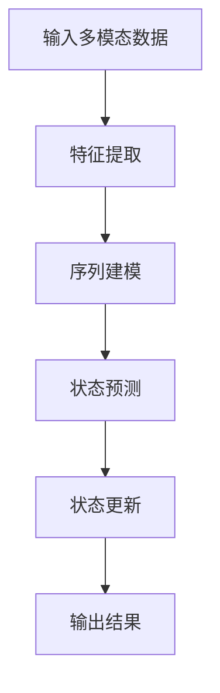
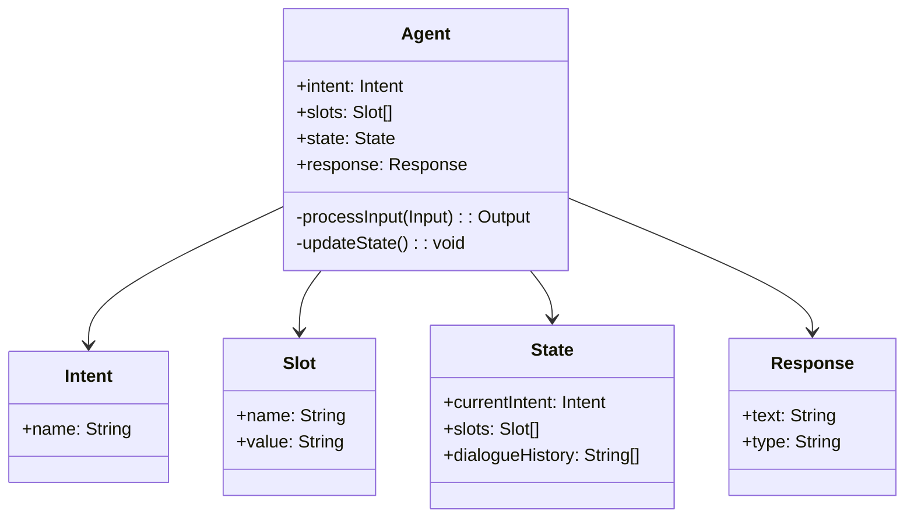
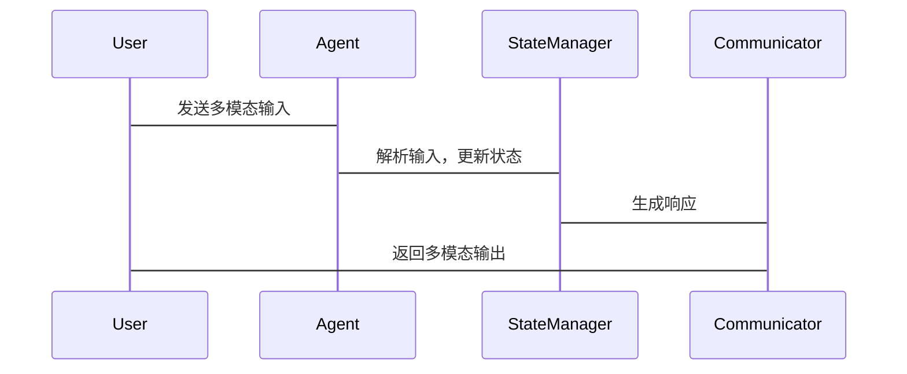

                 


```
# AI Agent的多模态对话状态追踪与管理

> 关键词：AI Agent, 多模态对话, 状态追踪, 对话管理, 机器学习, 多模态数据融合

> 摘要：本文系统地探讨了AI Agent多模态对话状态追踪与管理的核心原理、算法实现、系统架构设计以及项目实战。通过分析多模态数据的融合方法，深入讲解基于深度学习的状态追踪模型，并结合实际案例，展示如何在AI Agent中实现高效的多模态对话状态管理。

---

## 第一部分: AI Agent多模态对话状态追踪与管理概述

### 第1章: 背景介绍与核心概念

#### 1.1 问题背景与描述
##### 1.1.1 多模态对话的定义与特点
多模态对话是指在对话过程中，用户和AI Agent之间不仅通过文本，还可以通过语音、图像、视频等多种模态进行交互。这种交互方式更加自然，能够更好地模拟真实的人类对话。

##### 1.1.2 当前对话状态追踪的挑战
随着对话的复杂性增加，单纯依赖文本模态的对话状态追踪已经难以满足需求。如何在多模态数据中提取有用的信息，并准确追踪对话状态，成为当前研究的难点。

##### 1.1.3 多模态对话状态管理的必要性
多模态对话能够提供更丰富的信息，帮助AI Agent更好地理解上下文，从而做出更精准的回应。有效的状态管理是实现这一点的关键。

#### 1.2 核心概念与问题解决
##### 1.2.1 多模态对话的核心要素
包括输入数据的多模态性、对话历史、当前意图、实体识别等。

##### 1.2.2 状态追踪与管理的目标
准确理解对话内容，预测用户意图，维护对话上下文，以便生成合适的回应。

##### 1.2.3 问题解决的思路与方法
结合多模态数据的特征提取、融合技术，以及基于深度学习的对话状态追踪模型。

#### 1.3 问题的边界与外延
##### 1.3.1 界定问题的范围
限定在AI Agent与用户的多轮对话场景中，考虑文本、语音、图像等多种模态的数据。

##### 1.3.2 外延与相关领域
包括自然语言处理、计算机视觉、语音识别、机器学习等多个领域。

##### 1.3.3 边界条件与限制
确保数据的实时性、准确性，同时考虑计算资源的限制。

#### 1.4 核心概念的结构与组成
##### 1.4.1 对话状态的组成要素
包括当前意图、实体信息、对话历史、上下文等。

##### 1.4.2 多模态数据的融合方式
包括特征级融合、决策级融合、模型级融合等。

##### 1.4.3 状态管理的逻辑架构
包括数据采集、特征提取、状态表示、状态更新、结果输出等步骤。

#### 1.5 本章小结
本章主要介绍了AI Agent多模态对话状态追踪与管理的背景、核心概念和问题解决思路。通过定义和分析，为后续章节的深入探讨奠定了基础。

---

## 第二部分: 核心概念与原理

### 第2章: 多模态对话状态追踪的核心原理

#### 2.1 多模态数据的融合原理
##### 2.1.1 各模态数据的特点与优势
文本模态具有语义丰富性，语音模态具有情感信息，图像模态具有视觉信息。

##### 2.1.2 数据融合的方法与策略
常见的融合方法包括特征融合、注意力机制、多任务学习等。

##### 2.1.3 融合过程中的挑战与解决方案
数据异构性、时序同步性等问题，可以通过预处理和模型优化来解决。

#### 2.2 对话状态追踪的算法原理
##### 2.2.1 基于统计的对话状态追踪
使用马尔可夫链等统计方法，基于历史对话记录进行状态转移。

##### 2.2.2 基于深度学习的对话状态追踪
使用循环神经网络（RNN）、长短期记忆网络（LSTM）等模型，捕捉对话的上下文信息。

##### 2.2.3 端到端对话状态追踪的实现原理
通过端到端模型直接从输入数据中学习状态表示，减少人工特征提取的复杂性。

#### 2.3 状态管理的机制与流程
##### 2.3.1 状态表示与更新机制
使用向量、符号、概率分布等多种方式表示状态，并根据对话进展实时更新。

##### 2.3.2 状态转移的规则与模型
基于转移矩阵或概率模型，描述状态之间的转移关系。

##### 2.3.3 状态管理的优化策略
包括模型训练优化、数据增强、在线学习等方法。

#### 2.4 核心概念的ER实体关系图
```mermaid
er
  actor(Agent)
  actor(State)
  actor(Intent)
  actor(Slot)
  actor(Response)
  actor(Input)
  actor(Output)
  actor(Action)
```

#### 2.5 本章小结
本章详细探讨了多模态对话状态追踪的核心原理，包括数据融合方法、算法实现以及状态管理机制，为后续章节的系统设计和项目实战提供了理论基础。

---

## 第三部分: 算法原理与数学模型

### 第3章: 对话状态追踪的算法原理

#### 3.1 基于深度学习的算法流程


#### 3.2 数学模型与公式
##### 3.2.1 特征表示公式
$$x_i = f(input_i)$$

##### 3.2.2 序列建模公式
$$h_t = \text{RNN}(h_{t-1}, x_t)$$

##### 3.2.3 状态预测公式
$$p(s_t | h_t) = \text{softmax}(W_s h_t + b_s)$$

#### 3.3 算法实现的Python代码示例
```python
import torch
class StateTracker(torch.nn.Module):
    def __init__(self, input_size, hidden_size):
        super(StateTracker, self).__init__()
        self.rnn = torch.nn.RNN(input_size, hidden_size)
        self.fc = torch.nn.Linear(hidden_size, output_size)
    
    def forward(self, inputs):
        outputs, _ = self.rnn(inputs)
        outputs = self.fc(outputs)
        return outputs
```

---

## 第四部分: 系统分析与架构设计

### 第4章: 系统分析与架构设计方案

#### 4.1 问题场景介绍
在AI Agent的多模态对话系统中，用户可能通过文本、语音或图像等多种方式与系统交互。系统需要实时分析用户的输入，理解其意图，并根据对话历史生成合适的回应。

#### 4.2 系统功能设计
##### 4.2.1 领域模型设计


##### 4.2.2 系统架构设计


##### 4.2.3 系统交互设计


#### 4.3 系统实现
##### 4.3.1 环境安装
安装必要的Python库，如TensorFlow、PyTorch、Keras等。

##### 4.3.2 核心实现代码
```python
import torch
class MultiModalStateManager:
    def __init__(self):
        self.states = {}
        self.current_dialogue = []
    
    def update_state(self, input_modals):
        # 处理多模态输入，更新状态
        pass
    
    def get_current_state(self):
        return self.states
    
    def save_dialogue_history(self):
        self.current_dialogue.append(self.states)
```

#### 4.4 项目实战
##### 4.4.1 实际案例分析
例如，在一个客服对话系统中，用户可以通过文本描述问题，同时上传相关图片。系统需要结合文本和图片信息，准确理解用户的问题，并生成合适的回应。

#### 4.5 本章小结
本章通过系统分析和架构设计，展示了如何在AI Agent中实现高效的多模态对话状态管理。通过领域模型、系统架构和交互设计，确保系统的可扩展性和灵活性。

---

## 结语

通过对AI Agent多模态对话状态追踪与管理的深入探讨，我们不仅了解了其核心原理，还掌握了具体的实现方法。未来，随着多模态技术的不断发展，对话系统将更加智能化和人性化，为用户提供更优质的交互体验。

---

### 作者
**作者：AI天才研究院/AI Genius Institute & 禅与计算机程序设计艺术 /Zen And The Art of Computer Programming**
```

