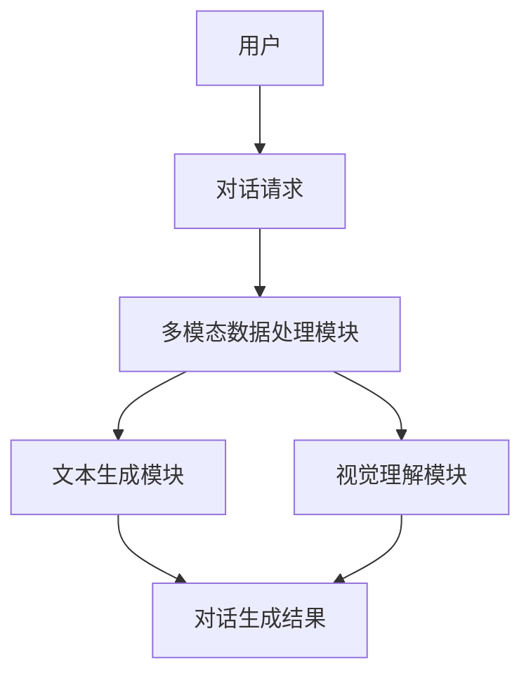

                 


# AI Agent的多模态对话系统：整合视觉和语言理解

## 关键词：AI Agent，多模态对话系统，视觉理解，语言理解，人机交互，对话生成

## 摘要：  
本文探讨AI Agent在多模态对话系统中的应用，重点分析如何整合视觉和语言理解，以实现更智能、更自然的交互。通过背景介绍、核心概念、算法原理、系统架构和项目实战的多维度分析，深入阐述多模态对话系统的技术细节和实现路径。文章还结合实际案例，展示如何通过技术手段提升AI Agent的对话能力，为未来的智能化人机交互提供参考。

---

## 第一部分: AI Agent的多模态对话系统概述

### 第1章: AI Agent与多模态对话系统概述

#### 1.1 多模态对话系统的背景与意义
- **问题背景**：传统的单模态对话系统仅依赖文本或语音交互，难以应对复杂的现实场景。多模态对话系统通过整合视觉、语言等多种信息，提升交互的准确性和用户体验。
- **概念结构**：多模态对话系统由用户、对话请求、多模态数据处理模块和对话生成模块组成，支持文本、图像、语音等多种输入形式。
- **技术趋势**：AI Agent的自主学习能力、多模态数据融合技术、对话系统的实时性与响应速度是当前技术发展的主要方向。

#### 1.2 多模态对话系统的应用场景
- **智能客服**：通过整合用户输入的文本和情绪分析，提供更精准的服务。
- **智能助手**：支持语音和视觉输入，提供更便捷的交互体验。
- **智慧教育**：结合图像识别和自然语言处理，提供个性化的学习辅助。
- **智慧医疗**：通过视觉识别病历和语言对话，辅助医生诊断。
- **智能家居**：通过语音和视觉交互，实现更智能的家居控制。

### 第2章: 多模态对话系统的核心概念与原理
- **多模态对话系统的定义**：支持多种信息输入和输出的对话系统，能够理解和生成多模态数据。
- **核心特征对比**：
  | 模态类型 | 输入形式 | 输出形式 | 处理方式 |
  |----------|----------|----------|----------|
  | 文本     | 文本输入  | 文本输出 | 语言模型 |
  | 视觉     | 图像输入  | 文本描述 | 图像识别 |
  | 语音     | 音频输入  | 语音识别 | 语音合成 |
- **ER实体关系图**：


---

## 第二部分: 多模态对话系统的算法原理

### 第3章: 多模态对话系统的算法基础

#### 3.1 多模态对话系统的文本生成算法
- **基于Transformer的文本生成模型**：
  ```mermaid
  graph TD
  A[输入文本] --> B[编码器]
  B --> C[解码器]
  C --> D[输出文本]
  ```
  - **数学公式**：  
    $$ P(y|x) = \text{Transformer}(x) $$
    其中，$x$ 是输入文本，$y$ 是输出文本，$\text{Transformer}$ 是基于注意力机制的编码解码模型。

#### 3.2 多模态对话系统的视觉理解算法
- **基于CNN的图像特征提取**：
  ```mermaid
  graph TD
  A[输入图像] --> B[CNN特征提取器]
  B --> C[图像特征向量]
  ```
  - **数学公式**：  
    $$ f(x) = \text{CNN}(x) $$  
    其中，$x$ 是输入图像，$f(x)$ 是提取的图像特征向量。

#### 3.3 多模态对话系统的联合优化算法
- **跨模态注意力机制**：
  ```mermaid
  graph TD
  A[文本特征] --> B[图像特征]
  B --> C[联合注意力]
  C --> D[优化结果]
  ```
  - **数学公式**：  
    $$ a_i = \alpha x_i + (1-\alpha) y_i $$  
    其中，$x_i$ 是文本特征，$y_i$ 是图像特征，$\alpha$ 是注意力权重。

---

## 第三部分: 多模态对话系统的系统架构与设计

### 第4章: 多模态对话系统的系统架构

#### 4.1 系统功能设计
- **领域模型**：
  ```mermaid
  classDiagram
  class 用户 {
    +姓名
    +对话历史
    +输入类型
  }
  class 对话请求 {
    +文本内容
    +图像数据
    +语音数据
  }
  class 多模态数据处理模块 {
    -文本生成模块
    -视觉理解模块
  }
  用户 --> 对话请求
  对话请求 --> 多模态数据处理模块
  ```

#### 4.2 系统架构设计
- **系统架构图**：
  ```mermaid
  graph TD
  A[用户] --> B[对话请求]
  B --> C[多模态数据处理模块]
  C --> D[文本生成模块]
  C --> E[视觉理解模块]
  D --> F[对话生成结果]
  E --> F
  ```

#### 4.3 系统接口设计
- **接口描述**：
  - 输入接口：支持文本、图像、语音等多种形式的输入。
  - 输出接口：生成文本、图像描述、语音合成等多种形式的输出。

#### 4.4 系统交互流程
- **交互流程图**：
  ```mermaid
  graph TD
  A[用户] --> B[发起对话请求]
  B --> C[多模态数据处理模块]
  C --> D[生成对话响应]
  D --> E[返回结果]
  ```

---

## 第四部分: 多模态对话系统的项目实战

### 第5章: 多模态对话系统的项目实战

#### 5.1 环境安装
- **工具安装**：
  - 安装Python 3.8及以上版本。
  - 安装TensorFlow、PyTorch等深度学习框架。

#### 5.2 系统核心实现
- **代码示例**：  
  ```python
  import tensorflow as tf
  from tensorflow.keras import layers

  def build_model():
      input_text = layers.Input(shape=(None,))  # 文本输入
      input_image = layers.Input(shape=(224, 224, 3))  # 图像输入
      text_emb = layers.Embedding(10000, 64)(input_text)
      image_emb = layers.Conv2D(64, (3,3), activation='relu')(input_image)
      # 跨模态注意力机制
      attention = layers.Dense(64, activation='softmax')(text_emb)
      # 模型合并
      merged = layers.Concatenate()([attention, image_emb])
      output = layers.Dense(10, activation='softmax')(merged)
      model = tf.keras.Model(inputs=[input_text, input_image], outputs=output)
      return model
  ```

#### 5.3 数据集准备
- **数据集描述**：
  - 文本数据：包含训练文本和标签。
  - 图像数据：包含训练图像和标签。

#### 5.4 模型训练与评估
- **训练流程**：
  - 使用训练数据训练模型。
  - 使用验证数据评估模型性能。
  - 调整超参数优化模型。

#### 5.5 对话系统开发
- **对话系统实现**：
  - 基于训练好的模型，实现对话系统的前端和后端。
  - 前端接收用户输入，后端处理并返回结果。

#### 5.6 实际案例分析
- **案例分析**：
  - 用户输入图像和文本，系统生成相应的对话响应。

---

## 第五部分: 多模态对话系统的总结与展望

### 第6章: 多模态对话系统的总结与展望

#### 6.1 开发中的注意事项
- **数据质量**：确保多模态数据的多样性和准确性。
- **模型优化**：优化模型的训练效率和性能。
- **用户体验**：提升对话系统的响应速度和交互体验。

#### 6.2 最佳实践
- **模型调优**：通过调整超参数和优化算法提升模型性能。
- **系统集成**：将多模态对话系统集成到实际应用场景中。
- **持续学习**：通过持续学习提升模型的泛化能力和适应性。

#### 6.3 未来研究方向
- **多模态数据的深度融合**：探索更高效的多模态数据融合方法。
- **对话系统的实时性优化**：提升对话系统的实时响应能力。
- **多语言支持**：扩展对话系统的多语言支持能力。

---

## 作者：AI天才研究院/AI Genius Institute & 禅与计算机程序设计艺术 /Zen And The Art of Computer Programming

---

本文通过系统的分析和实践，深入探讨了AI Agent在多模态对话系统中的应用，结合理论与实践，为读者提供了全面的技术指导。

