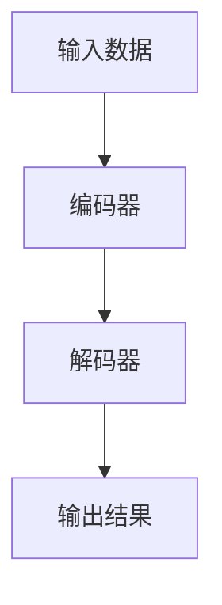
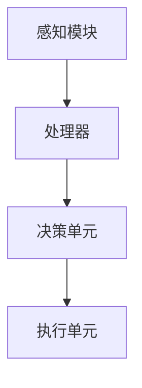

                 


# AI Agent的多模态情境感知与反应系统

## 关键词：AI Agent, 多模态情境感知, 反应系统, 多模态数据融合, 人工智能代理, 情境理解

## 摘要：  
本文深入探讨AI Agent的多模态情境感知与反应系统，分析其核心概念、算法原理、系统架构及实际应用。通过详细讲解多模态数据融合、情境理解、反应决策等关键环节，结合数学模型和实际案例，为读者提供全面的技术指南。

---

## 第一部分: AI Agent的多模态情境感知与反应系统概述

### 第1章: AI Agent的基本概念与背景

#### 1.1 AI Agent的核心概念  
AI Agent（人工智能代理）是指能够感知环境、自主决策并执行任务的智能实体。它具备感知能力、决策能力、学习能力和交互能力，广泛应用于自动驾驶、智能助手、机器人等领域。

#### 1.2 多模态情境感知的背景与重要性  
随着技术进步，AI Agent需要处理多种数据类型（如图像、语音、文本）以全面理解环境。多模态情境感知通过融合多种数据源，提升AI Agent的感知精度和决策能力，使其在复杂场景中表现更佳。

---

## 第2章: 多模态数据处理与融合

### 2.1 多模态数据的获取与预处理  
多模态数据包括视觉、听觉、文本等多种类型。数据预处理步骤包括归一化、降噪和特征提取，为后续融合奠定基础。

### 2.2 多模态数据融合技术  
融合方法包括基于特征的加权平均和基于模型的注意力机制。例如，加权平均法公式：  
$$ y = \sum_{i=1}^{n} w_i x_i $$  
其中，$w_i$为权重，$x_i$为输入特征。

---

## 第3章: 多模态情境理解与反应机制

### 3.1 情境理解算法  
利用深度学习模型（如Transformer）进行序列建模，捕捉多模态数据间的关联。模型结构如下：  


### 3.2 反应决策机制  
基于融合后的数据，AI Agent通过决策网络生成反应策略。例如，使用DQN算法进行强化学习，优化决策过程。

---

## 第4章: 系统架构与实现

### 4.1 系统架构设计  
系统由感知模块、处理器、决策单元和执行单元组成。架构图如下：  


### 4.2 项目实战  
#### 4.2.1 开发环境安装  
安装必要的库：  
```bash
pip install numpy torch matplotlib
```

#### 4.2.2 核心代码实现  
实现多模态融合：  
```python
import torch

class MultiModalFuser(torch.nn.Module):
    def __init__(self, input_dims):
        super().__init__()
        self.weights = torch.nn.Parameter(torch.randn(input_dims))
    
    def forward(self, inputs):
        return torch.sum(inputs * self.weights.unsqueeze(0), dim=-1)
```

---

## 第5章: 最佳实践与总结

### 5.1 最佳实践  
- 数据预处理：确保数据质量和一致性。  
- 模型优化：通过调参和数据增强提升性能。  
- 系统测试：在真实场景中验证系统的稳定性和准确性。

### 5.2 小结  
本文详细探讨了AI Agent的多模态情境感知与反应系统，从概念到实现，为读者提供了全面的技术指南。

### 5.3 注意事项  
- 多模态数据融合需考虑数据异质性。  
- 系统设计应注重实时性和可扩展性。

### 5.4 拓展阅读  
推荐阅读《Deep Learning》和《Reinforcement Learning》相关书籍，深入理解模型原理。

---

## 作者：AI天才研究院 & 禅与计算机程序设计艺术

---

通过本文，读者能够全面理解AI Agent的多模态情境感知与反应系统的原理和实现方法，为实际应用提供理论支持和技术指导。

