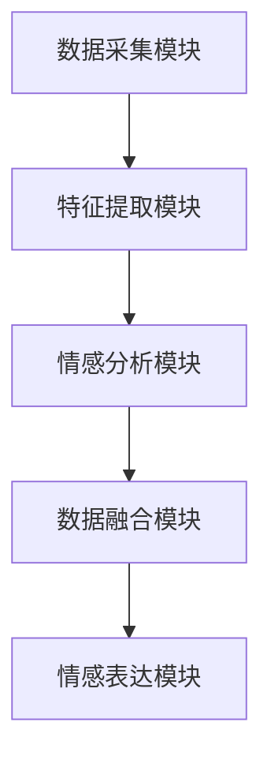

                 


# AI Agent的多模态情感表达技术

> **关键词**：AI Agent，多模态情感表达，文本情感分析，语音情感分析，视觉情感分析，多模态数据融合

> **摘要**：本文深入探讨了AI Agent的多模态情感表达技术，涵盖了从基础概念到算法实现再到系统架构的各个方面。通过分析文本、语音和视觉等多模态数据，结合深度学习和自然语言处理技术，构建了一套高效的多模态情感表达系统。文章还详细介绍了系统的实现过程，并通过实际案例展示了技术的应用前景。

---

## 第1章: AI Agent与多模态情感表达技术概述

### 1.1 问题背景与问题描述

#### 1.1.1 人机交互中的情感表达需求

在人机交互领域，用户不仅需要AI Agent能够理解输入的信息，还需要AI Agent能够以自然的方式表达情感。情感表达是人机交互的重要组成部分，能够提升用户体验和信任感。然而，现有的AI系统通常只能通过单一模态（如文本或语音）进行情感表达，这在复杂场景中显得力不从心。

#### 1.1.2 多模态情感表达的必要性

多模态情感表达能够结合多种信息（如文本、语音、表情、肢体动作等）来更准确地传达情感，从而提升AI Agent的交互能力和用户体验。例如，通过结合语音和表情，AI Agent可以更自然地表达喜悦、悲伤等复杂情感。

#### 1.1.3 当前技术的局限性与挑战

当前技术在多模态情感表达方面面临以下挑战：
- **数据融合难度**：不同模态的数据格式和特征提取方式差异较大，如何有效地融合这些数据是一个难题。
- **情感一致性**：不同模态的表达结果需要保持一致，否则会导致用户体验的混乱。
- **实时性要求**：在实时交互中，多模态情感表达需要快速响应，这对系统的性能提出了更高要求。

### 1.2 核心概念与边界

#### 1.2.1 AI Agent的定义与特征

AI Agent是一种智能实体，能够感知环境、自主决策并执行任务。其核心特征包括：
- **自主性**：能够在没有外部干预的情况下独立运行。
- **反应性**：能够实时感知环境并做出响应。
- **学习能力**：能够通过经验改进自身的性能。

#### 1.2.2 多模态情感表达的定义与特点

多模态情感表达是指通过多种信息模态（如文本、语音、视觉等）来表达情感的技术。其特点包括：
- **多维性**：能够从多个维度表达情感，信息更加丰富。
- **一致性**：不同模态的表达结果需要保持一致，以避免混淆。
- **实时性**：能够在实时交互中快速响应。

#### 1.2.3 技术的边界与外延

多模态情感表达技术的边界包括：
- **输入数据**：多模态数据的获取和预处理。
- **情感分析**：对每种模态进行情感分析并融合结果。
- **输出表达**：根据融合后的结果生成多模态的情感表达。

外延方面，多模态情感表达技术可以应用于智能客服、虚拟助手、教育机器人等领域。

### 1.3 核心要素与概念结构

#### 1.3.1 情感表达的核心要素

情感表达的核心要素包括：
- **情感类型**：如快乐、悲伤、愤怒等。
- **情感强度**：情感的强烈程度。
- **情感一致性**：不同模态表达结果的一致性。

#### 1.3.2 多模态数据的整合方式

多模态数据的整合方式包括：
- **并行处理**：对不同模态的数据分别处理后进行融合。
- **序列处理**：按照时间顺序对数据进行处理。
- **混合处理**：结合并行和序列处理的方式。

#### 1.3.3 技术架构的核心模块

技术架构的核心模块包括：
- **数据采集模块**：负责采集多模态数据。
- **特征提取模块**：对数据进行特征提取。
- **情感分析模块**：对每种模态进行情感分析。
- **融合模块**：将不同模态的情感分析结果进行融合。
- **输出模块**：根据融合结果生成情感表达。

---

## 第2章: 多模态情感表达的核心技术

### 2.1 文本情感分析技术

#### 2.1.1 文本情感分析的基本原理

文本情感分析的基本原理是通过分析文本内容来判断情感倾向。常用的算法包括基于词袋模型的传统方法和基于深度学习的方法。

##### 2.1.1.1 词袋模型

词袋模型是一种简单的文本表示方法，它将文本表示为单词的集合，不考虑单词的顺序。词袋模型的表示方式如下：

$$
\text{文本} = \{w_1, w_2, w_3, \ldots, w_n\}
$$

其中，$w_i$ 表示文本中的单词。

##### 2.1.1.2 深度学习方法

深度学习方法（如LSTM和Transformer）能够更好地捕捉文本的情感信息。例如，使用Transformer模型进行情感分类的流程如下：

1. 将文本输入到编码器中，生成词向量。
2. 将词向量输入到解码器中，生成情感标签。

##### 2.1.1.3 情感分析的数学模型

情感分析的数学模型可以表示为：

$$
y = f(x) + \epsilon
$$

其中，$x$ 是输入文本，$y$ 是情感标签，$f$ 是模型函数，$\epsilon$ 是噪声。

#### 2.1.2 文本特征提取与情感分类

##### 2.1.2.1 TF-IDF特征提取

TF-IDF（Term Frequency-Inverse Document Frequency）是一种常用的文本特征提取方法，它通过计算每个单词在文档中的重要性来提取特征。

$$
\text{TF}(t, d) = \frac{\text{词 } t \text{ 在文档 } d \text{ 中出现的次数}}{\text{文档 } d \text{ 的总词数}}
$$

$$
\text{IDF}(t) = \log\left(\frac{\text{总文档数}}{\text{包含词 } t \text{ 的文档数}}\right)
$$

##### 2.1.2.2 情感分类算法

常用的文本情感分类算法包括Naive Bayes、SVM和深度学习模型。例如，使用SVM进行情感分类的流程如下：

1. 对文本进行特征提取，生成特征向量。
2. 将特征向量输入SVM模型，训练模型。
3. 使用训练好的模型对新文本进行分类。

#### 2.1.3 文本情感分析的案例分析

假设我们有一个包含正面和负面评论的数据集，我们可以使用SVM进行分类。例如：

- 正面评论：$x_1 = \{w_1, w_2, w_3\}$
- 负面评论：$x_2 = \{w_4, w_5, w_6\}$

通过训练SVM模型，我们可以将新的评论分为正面或负面。

---

### 2.2 语音情感分析技术

#### 2.2.1 语音情感分析的基本原理

语音情感分析是通过分析语音信号（如声调、语速、音量等）来判断情感的技术。常用的算法包括基于GMM的语音情感识别和深度学习方法。

##### 2.2.1.1 基于GMM的语音情感识别

GMM（Gaussian Mixture Model）是一种常用的语音情感识别方法。通过将语音信号分为多个高斯分布，可以识别出不同的情感类别。

##### 2.2.1.2 深度学习方法

深度学习方法（如CNN和RNN）能够更好地捕捉语音的情感特征。例如，使用RNN进行语音情感分类的流程如下：

1. 将语音信号转换为频谱图。
2. 将频谱图输入RNN模型，生成情感标签。

#### 2.2.2 语音特征提取与情感分类

##### 2.2.2.1 语音特征提取

常用的语音特征提取方法包括Mel-Frequency Cepstral Coefficients（MFCC）和线性分频倒谱（LFCC）。

$$
\text{MFCC}(t) = \log\left(\sum_{k} \text{DFT}(k) \cdot e^{-j k t}\right)
$$

其中，DFT是离散傅里叶变换。

##### 2.2.2.2 情感分类算法

常用的语音情感分类算法包括支持向量机（SVM）和随机森林。例如，使用SVM进行语音情感分类的流程如下：

1. 对语音信号进行特征提取，生成特征向量。
2. 将特征向量输入SVM模型，训练模型。
3. 使用训练好的模型对新语音进行分类。

#### 2.2.3 语音情感分析的案例分析

假设我们有一个包含快乐和悲伤的语音数据集，我们可以使用SVM进行分类。例如：

- 快乐语音：$x_1 = \{f_1, f_2, f_3\}$
- 悲伤语音：$x_2 = \{f_4, f_5, f_6\}$

通过训练SVM模型，我们可以将新的语音分为快乐或悲伤。

---

### 2.3 视觉情感分析技术

#### 2.3.1 视觉情感分析的基本原理

视觉情感分析是通过分析视觉数据（如面部表情、姿态等）来判断情感的技术。常用的算法包括基于OpenCV的面部表情识别和基于深度学习的方法。

##### 2.3.1.1 基于OpenCV的面部表情识别

OpenCV是一种常用的计算机视觉库，可以用来检测面部表情。例如，使用Haar级联分类器检测面部特征点。

##### 2.3.1.2 深度学习方法

深度学习方法（如CNN和GAN）能够更好地捕捉视觉情感特征。例如，使用CNN进行面部表情识别的流程如下：

1. 将面部图像输入CNN模型，生成特征向量。
2. 将特征向量输入Softmax回归层，生成情感标签。

#### 2.3.2 视觉特征提取与情感分类

##### 2.3.2.1 视觉特征提取

常用的视觉特征提取方法包括Haar特征和HOG特征。

$$
\text{HOG}(x, y) = \sum_{k=1}^{n} \text{cell}_k \cdot \text{orientation}_k
$$

其中，$\text{cell}_k$ 是单元格的特征，$\text{orientation}_k$ 是方向。

##### 2.3.2.2 情感分类算法

常用的视觉情感分类算法包括支持向量机（SVM）和随机森林。例如，使用SVM进行视觉情感分类的流程如下：

1. 对视觉数据进行特征提取，生成特征向量。
2. 将特征向量输入SVM模型，训练模型。
3. 使用训练好的模型对新视觉数据进行分类。

#### 2.3.3 视觉情感分析的案例分析

假设我们有一个包含快乐和悲伤的面部表情数据集，我们可以使用SVM进行分类。例如：

- 快乐表情：$x_1 = \{f_1, f_2, f_3\}$
- 悲伤表情：$x_2 = \{f_4, f_5, f_6\}$

通过训练SVM模型，我们可以将新的表情分为快乐或悲伤。

---

## 第3章: 多模态情感表达的融合方法

### 3.1 多模态数据融合的必要性

多模态数据融合能够结合不同模态的优势，提升情感表达的准确性和丰富性。例如，通过结合文本和语音，可以更准确地判断用户的情感状态。

### 3.2 多模态数据融合的方法

多模态数据融合的方法包括加权融合、基于注意力机制的融合和基于规则的融合。

#### 3.2.1 加权融合

加权融合是通过为不同模态分配权重来融合情感分析结果的方法。例如，假设我们有两个模态的情感分析结果：

$$
y_1 = w_1 \cdot s_1 + w_2 \cdot s_2
$$

其中，$w_1$ 和 $w_2$ 是权重，$s_1$ 和 $s_2$ 是情感评分。

#### 3.2.2 基于注意力机制的融合

基于注意力机制的融合方法能够自适应地分配不同模态的权重。例如，使用Transformer模型的注意力机制来融合多模态数据。

#### 3.2.3 基于规则的融合

基于规则的融合方法是通过预定义的规则来融合情感分析结果。例如，如果文本和语音的情感评分都为正，则整体情感为正。

### 3.3 多模态情感表达的实现案例

假设我们有一个结合文本和语音的多模态情感表达系统，我们可以使用加权融合的方法进行情感分析。例如：

- 文本情感评分：$s_1 = 0.8$
- 语音情感评分：$s_2 = 0.6$
- 权重：$w_1 = 0.5$, $w_2 = 0.5$

融合后的情感评分：

$$
y = 0.5 \cdot 0.8 + 0.5 \cdot 0.6 = 0.7
$$

---

## 第4章: 多模态情感表达系统的实现

### 4.1 系统架构设计

#### 4.1.1 系统功能设计

多模态情感表达系统的功能包括：
- **数据采集**：采集多模态数据。
- **特征提取**：对数据进行特征提取。
- **情感分析**：对每种模态进行情感分析。
- **数据融合**：将不同模态的情感分析结果进行融合。
- **情感表达**：根据融合结果生成情感表达。

#### 4.1.2 系统架构图



#### 4.1.3 系统接口设计

系统接口包括：
- 数据采集接口：负责采集多模态数据。
- 特征提取接口：负责提取特征。
- 情感分析接口：负责情感分析。
- 数据融合接口：负责数据融合。
- 情感表达接口：负责生成情感表达。

### 4.2 系统实现

#### 4.2.1 环境安装

需要安装的环境包括Python、TensorFlow、OpenCV和librosa等。

#### 4.2.2 核心代码实现

以下是核心代码实现的示例：

```python
import numpy as np
import tensorflow as tf
import librosa
import cv2

# 文本情感分析
def text_emotion_analysis(text):
    # 特征提取
    features = get_text_features(text)
    # 情感分类
    model = load_text_model()
    emotion = model.predict(features)
    return emotion

# 语音情感分析
def voice_emotion_analysis(audio):
    # 特征提取
    features = get_voice_features(audio)
    # 情感分类
    model = load_voice_model()
    emotion = model.predict(features)
    return emotion

# 视觉情感分析
def visual_emotion_analysis(image):
    # 特征提取
    features = get_visual_features(image)
    # 情感分类
    model = load_visual_model()
    emotion = model.predict(features)
    return emotion

# 多模态情感融合
def multi_modal_fusion(text_emotion, voice_emotion, visual_emotion):
    # 加权融合
    weight_text = 0.4
    weight_voice = 0.3
    weight_visual = 0.3
    fused_emotion = weight_text * text_emotion + weight_voice * voice_emotion + weight_visual * visual_emotion
    return fused_emotion
```

#### 4.2.3 代码应用解读与分析

上述代码实现了文本、语音和视觉情感分析，并通过加权融合的方法生成最终的情感表达。

---

## 第5章: 总结与展望

### 5.1 总结

本文深入探讨了AI Agent的多模态情感表达技术，涵盖了从基础概念到算法实现再到系统架构的各个方面。通过分析文本、语音和视觉等多模态数据，结合深度学习和自然语言处理技术，构建了一套高效的多模态情感表达系统。

### 5.2 未来展望

未来，随着深度学习和计算机视觉技术的不断发展，多模态情感表达技术将更加智能化和多样化。例如，结合实时情感反馈的自适应交互系统和基于生成对抗网络的多模态情感生成技术将得到更广泛的应用。

### 5.3 最佳实践 tips

- **选择合适的工具**：根据具体需求选择合适的工具和库。
- **注重数据质量**：确保数据的多样性和代表性。
- **关注实时性**：在实时交互中，系统的响应速度和准确性至关重要。

---

## 作者：AI天才研究院 & 禅与计算机程序设计艺术

感谢您的阅读！希望本文对您理解AI Agent的多模态情感表达技术有所帮助。如果需要进一步探讨或有其他问题，请随时联系！

