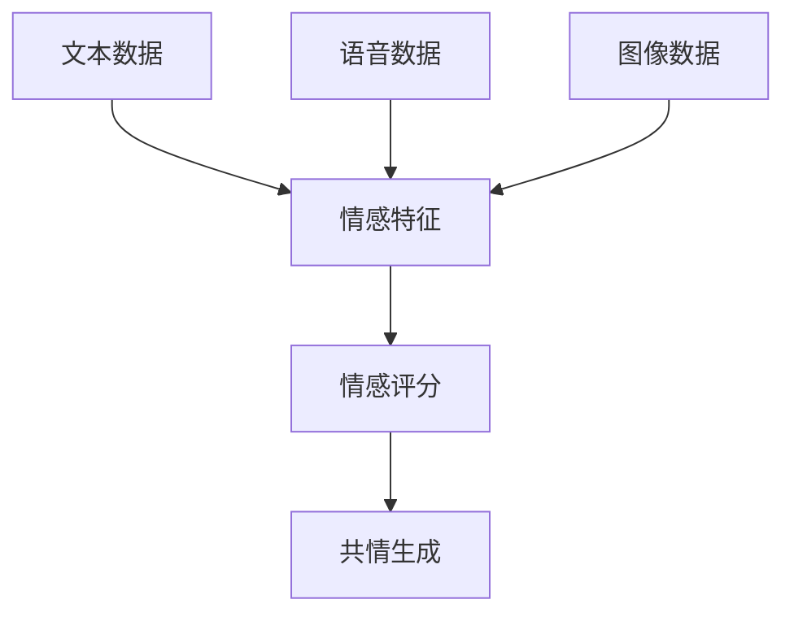
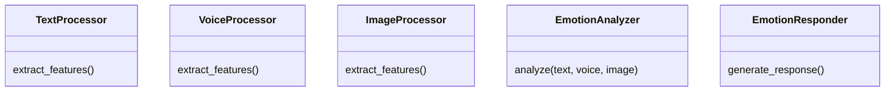

                 


# AI Agent的多模态情感计算与共情能力

## 关键词：
- AI Agent
- 多模态情感计算
- 共情能力
- 深度学习
- 多模态数据融合

## 摘要：
本文探讨AI Agent在多模态情感计算中的应用，重点分析如何通过文本、语音、图像等多种模态数据，构建具备共情能力的AI系统。文章从背景、核心概念、算法原理、系统架构到项目实战，全面解析实现过程，最后总结经验和未来方向。

---

## 第1章 多模态情感计算的背景与意义

### 1.1 情感计算的定义与背景

#### 1.1.1 情感计算的定义
情感计算（Affective Computing）是研究如何通过计算手段理解和模拟人类情感的学科。它涉及识别、分析和回应人类的情感状态。

#### 1.1.2 情感计算的研究现状
情感计算近年来发展迅速，已在语音识别、图像处理等领域取得显著成果。然而，单一模态的数据难以全面捕捉人类情感。

#### 1.1.3 多模态情感计算的必要性
人类情感表达复杂，单一模态无法满足需求。多模态数据融合能够更全面地理解情感。

### 1.2 共情能力的定义与特点

#### 1.2.1 共情能力的定义
共情能力是理解并回应他人情感状态的能力，分为认知共情和情感共情两种类型。

#### 1.2.2 共情能力的核心特征
- **情感识别**：准确识别他人的情感状态。
- **情感共鸣**：站在他人角度思考和感受。
- **情感回应**：通过语言或行为表达共情。

#### 1.2.3 共情能力在人机交互中的作用
提升人机交互的自然性和流畅性，增强用户体验。

### 1.3 AI Agent与情感计算的结合

#### 1.3.1 AI Agent的基本概念
AI Agent是具有自主决策和交互能力的智能体，广泛应用于客服、教育等领域。

#### 1.3.2 情感计算在AI Agent中的应用
- 情感识别：分析用户输入中的情感倾向。
- 情感分析：基于多模态数据生成情感评分。
- 共情生成：生成符合情感需求的回应。

#### 1.3.3 共情能力对AI Agent的提升作用
增强用户体验，提高交互的智能性和人性化。

---

## 第2章 多模态情感计算的核心概念与联系

### 2.1 多模态数据的定义与特点

#### 2.1.1 文本数据的特点
- 结构化：包含情感关键词和句式特征。
- 丰富性：情感表达多样，但受限于文本本身。

#### 2.1.2 语音数据的特点
- 非结构化：包含语调、语速、停顿等信息。
- 表达丰富：情感通过声音特征传递。

#### 2.1.3 图像数据的特点
- 直观：视觉信息直接反映情感。
- 复杂性：涉及面部表情和场景分析。

### 2.2 多模态情感计算的原理

#### 2.2.1 多模态数据的融合方法
- **特征级融合**：提取各模态特征后进行融合。
- **决策级融合**：分别处理各模态，最后综合结果。

#### 2.2.2 情感计算的模型构建
- 使用深度学习模型（如LSTM、Transformer）进行特征提取和情感分类。

#### 2.2.3 共情能力的生成机制
- 基于情感分析结果生成相应的回应。

### 2.3 多模态情感计算的实体关系图



---

## 第3章 情感计算与共情生成的算法原理

### 3.1 情感计算的算法实现

#### 3.1.1 情感分类模型
- 使用LSTM进行文本情感分类：
  ```python
  model = Sequential()
  model.add(Embedding(max_words, 128, input_length=max_len))
  model.add(LSTM(64))
  model.add(Dense(1, activation='sigmoid'))
  ```

#### 3.1.2 情感评分模型
- 使用线性回归模型预测情感评分：
  $$ \text{score} = w_1x_1 + w_2x_2 + \dots + w_nx_n + b $$

### 3.2 共情生成的算法实现

#### 3.2.1 基于情感分析的生成模型
- 使用Transformer生成共情回应：
  ```python
  def generate_response(text):
      # 输入情感分析
      # 生成共情回应
      return response
  ```

#### 3.2.2 情感记忆机制
- 使用注意力机制记忆情感上下文：
  $$ \alpha_i = \frac{e_i}{\sum_j e_j} $$
  其中，$e_i$ 是第i个情感特征的权重。

---

## 第4章 系统分析与架构设计

### 4.1 系统功能设计

#### 4.1.1 领域模型


#### 4.1.2 系统架构


---

## 第5章 项目实战：构建具备共情能力的AI Agent

### 5.1 环境安装

```bash
pip install numpy tensorflow transformers librosa
```

### 5.2 核心代码实现

#### 情感分析模块
```python
def process_text(text):
    # 文本预处理
    # 情感分析
    return score
```

#### 共情生成模块
```python
def generate_response(score):
    # 基于情感评分生成回应
    return response
```

### 5.3 案例分析与解读
- **案例1**：用户输入“我今天心情不好”，系统分析情感并生成共情回应。

---

## 第6章 最佳实践与总结

### 6.1 小结
本文详细介绍了AI Agent的多模态情感计算与共情能力，从理论到实践，系统阐述了实现方法。

### 6.2 注意事项
- 数据隐私保护
- 模型泛化能力

### 6.3 拓展阅读
- 深度学习在情感计算中的应用
- 多模态数据融合技术

---

## 作者：AI天才研究院 & 禅与计算机程序设计艺术

---

通过以上目录，文章将系统地介绍AI Agent的多模态情感计算与共情能力，帮助读者深入理解相关技术原理和实现方法。

