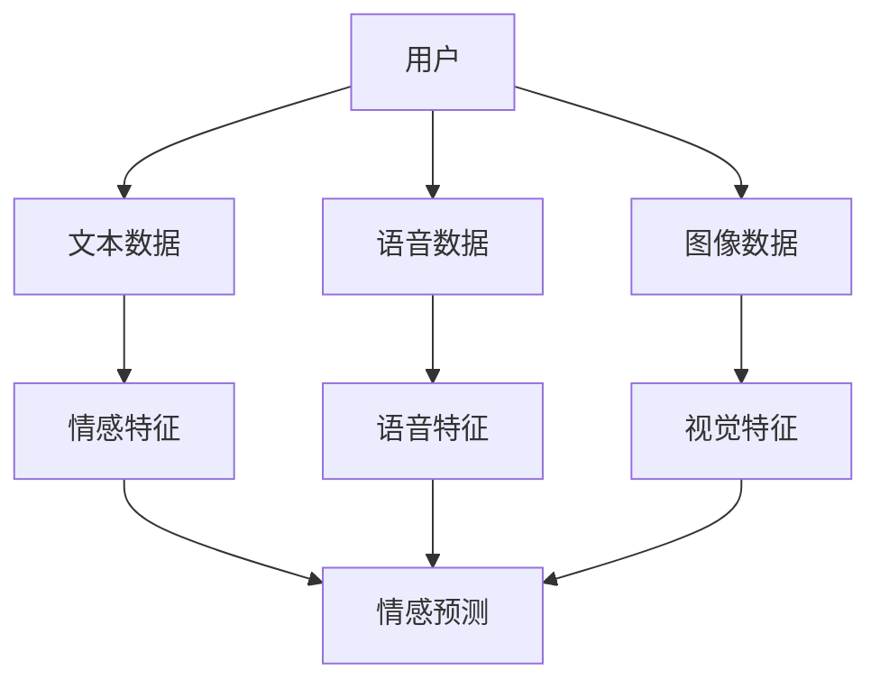
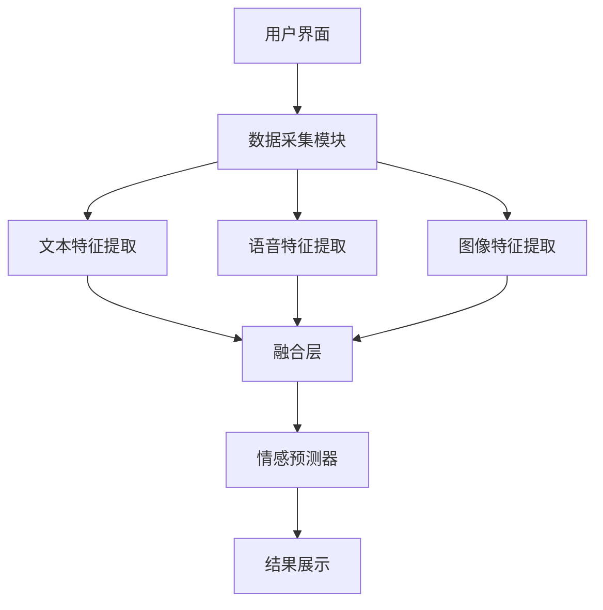
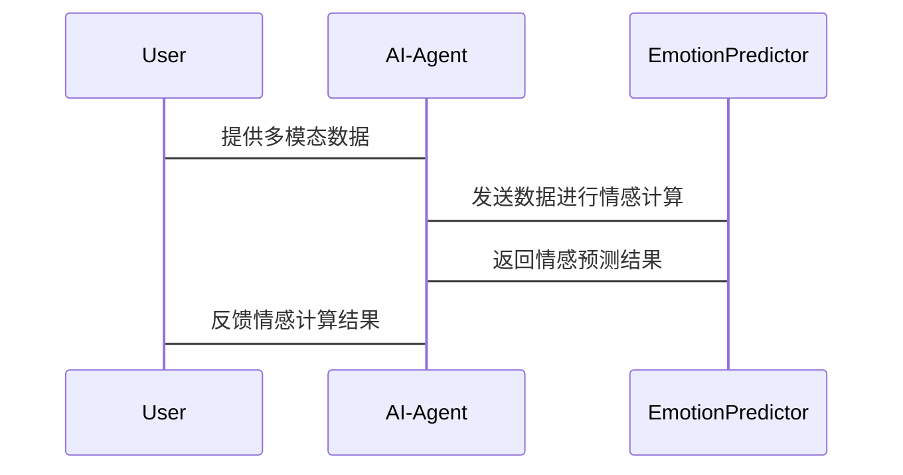

                 


# AI Agent的多模态情感计算技术

## 关键词：AI Agent, 多模态情感计算, 情感分析, 人机交互, 多模态数据融合, 深度学习, 图神经网络

## 摘要：  
本文深入探讨了AI Agent在多模态情感计算技术中的应用，从理论基础到算法实现，从系统架构到项目实战，全面解析了多模态情感计算的核心概念、算法原理、系统设计与实现方案。文章通过详细的技术分析和丰富的案例解读，揭示了多模态情感计算在人机交互中的重要意义与实际应用价值。

---

# 第一部分: AI Agent与多模态情感计算的背景介绍

## 第1章: AI Agent的基本概念与应用

### 1.1 AI Agent的定义与特点
- **定义**：AI Agent（人工智能代理）是指能够感知环境、自主决策并执行任务的智能实体。
- **特点**：
  1. 智能性：基于感知和学习做出决策。
  2. 自主性：无需外部干预即可运行。
  3. 反应性：能够实时感知并响应环境变化。
  4. 交互性：具备与人类或其他系统进行交互的能力。

### 1.2 AI Agent的核心功能模块
1. **感知模块**：负责收集和处理环境数据（如语音、图像、文本等）。
2. **决策模块**：基于感知数据进行分析和推理，制定行动策略。
3. **执行模块**：根据决策结果执行具体操作。
4. **学习模块**：通过反馈优化自身行为。

### 1.3 AI Agent的典型应用领域
1. **智能家居**：通过语音助手实现设备控制。
2. **智能客服**：提供自动化的问题解答和用户支持。
3. **自动驾驶**：通过多模态传感器数据实现智能驾驶决策。
4. **虚拟助手**：帮助用户完成日程管理、信息查询等任务。

---

## 第2章: 多模态情感计算的背景与意义

### 2.1 情感计算的基本概念
- **定义**：情感计算是指对人类情感、情绪和意图的识别、理解和计算。
- **目标**：通过分析多模态数据（如文本、语音、图像）来推断人类的情感状态。

### 2.2 多模态数据的引入及其优势
1. **多模态数据的定义**：
   - 文本：包括自然语言文本和情感分析数据。
   - 语音：包括语音信号和声学特征。
   - 图像/视频：包括视觉特征和情感微表情。
2. **优势**：
   - 提高情感识别的准确性和鲁棒性。
   - 实现更自然、更贴近人类交互的人机交互体验。

### 2.3 多模态情感计算在人机交互中的应用前景
1. **情感对话系统**：通过多模态数据实现更自然的情感交流。
2. **个性化推荐**：基于用户情感状态提供更精准的服务。
3. **心理健康辅助**：通过情感分析帮助识别用户的心理状态。

---

## 第3章: 多模态情感计算的核心概念与联系

### 3.1 多模态数据的特征分析
| 数据类型 | 特征 | 示例 |
|----------|------|------|
| 文本      | 情感倾向、关键词 | "我非常满意"（积极情感） |
| 语音      | 音调、语速、停顿 | 高音调通常表示兴奋 |
| 图像      | 面部表情、姿态 | 微笑表示愉悦 |

### 3.2 多模态数据的融合方式
1. **早期融合**：在数据预处理阶段进行特征融合。
2. **晚期融合**：在特征提取或决策阶段进行数据融合。
3. **深度融合**：通过深度学习模型（如图神经网络）实现多模态数据的联合表示。

### 3.3 多模态情感计算的ER实体关系图


---

## 第4章: 多模态情感计算的算法原理

### 4.1 情感计算的算法流程
1. **数据采集与预处理**：
   - 文本：分词、去除停用词。
   - 语音：提取声学特征（梅尔频谱）。
   - 图像：提取面部表情特征。
2. **特征提取与表示**：
   - 文本：词嵌入（如Word2Vec、BERT）。
   - 语音：MFCC特征提取。
   - 图像：使用CNN提取视觉特征。
3. **情感预测与结果输出**：
   - 使用深度学习模型（如LSTM、Transformer）进行情感分类。

### 4.2 多模态数据融合算法
1. **基于注意力机制的多模态融合**：
   ```python
   import tensorflow as tf

   class Attention(tf.keras.layers.Layer):
       def __init__(self, **kwargs):
           super(Attention, self).__init__(**kwargs)

       def call(self, inputs):
           # inputs: [text_embedding, audio_embedding, image_embedding]
           text, audio, image = inputs
           features = tf.keras.layers.concatenate([text, audio, image])
           attention_weights = tf.keras.layers.Dense(3, activation='softmax')(features)
           return tf.keras.layers.Dot(axes=-1)([features, attention_weights])
   ```
2. **多模态数据的对齐与匹配**：
   - 使用交叉注意机制（Cross-attention）实现模态间信息对齐。

### 4.3 情感计算的数学模型与公式
1. **情感计算的损失函数**：
   $$ L = -\sum_{i=1}^{n} y_i \log(p_i) + (1 - y_i) \log(1 - p_i) $$
2. **多模态融合的权重分配公式**：
   $$ w_i = \frac{e^{a_i}}{\sum_{j=1}^{m} e^{a_j}} $$

---

## 第5章: 多模态情感计算的系统架构设计

### 5.1 系统功能设计
1. **数据采集模块**：负责采集多模态数据（文本、语音、图像）。
2. **特征提取模块**：对多模态数据进行特征提取和表示。
3. **情感计算模块**：基于多模态特征进行情感预测。
4. **结果输出模块**：将情感计算结果反馈给用户或系统。

### 5.2 系统架构设计


### 5.3 系统交互设计


---

## 第6章: 项目实战与案例分析

### 6.1 环境安装与配置
```bash
pip install tensorflow==2.5.0
pip install numpy==1.21.0
pip install matplotlib==3.5.0
pip install pydub==0.25.1
pip install librosa==0.8.1
pip install transformers==4.12.0
```

### 6.2 核心代码实现
1. **文本特征提取**：
   ```python
   from transformers import BertTokenizer, BertModel

   tokenizer = BertTokenizer.from_pretrained('bert-base-uncased')
   model = BertModel.from_pretrained('bert-base-uncased')

   def get_text_embedding(text):
       inputs = tokenizer(text, return_tensors='np')
       outputs = model(**inputs)
       return outputs.last_hidden_state.numpy()[0]
   ```

2. **语音特征提取**：
   ```python
   import librosa

   def get_audio_embedding(audio_path):
       audio, sr = librosa.load(audio_path, sr=16000)
       mfccs = librosa.feature.mfcc(y=audio, sr=sr, n_mfcc=13)
       return mfccs.T
   ```

3. **图像特征提取**：
   ```python
   import cv2

   def get_image_embedding(image_path):
       img = cv2.imread(image_path)
       img = cv2.resize(img, (224, 224))
       img = img / 255.0
       return img
   ```

4. **多模态融合与情感预测**：
   ```python
   import tensorflow as tf
   from tensorflow.keras import layers

   def build_model():
       text_input = layers.Input(shape=(768,))
       audio_input = layers.Input(shape=(13,))
       image_input = layers.Input(shape=(224, 224, 3))

       text_dense = layers.Dense(64, activation='relu')(text_input)
       audio_dense = layers.Dense(64, activation='relu')(audio_input)
       image_dense = layers.Dense(64, activation='relu')(image_input)

       merged = layers.concatenate([text_dense, audio_dense, image_dense])
       merged_dense = layers.Dense(64, activation='relu')(merged)
       output = layers.Dense(1, activation='sigmoid')(merged_dense)

       model = tf.keras.Model(inputs=[text_input, audio_input, image_input], outputs=output)
       model.compile(optimizer='adam', loss='binary_crossentropy', metrics=['accuracy'])
       return model
   ```

### 6.3 案例分析与结果解读
1. **案例背景**：基于社交媒体评论的多模态情感分析。
2. **数据来源**：社交媒体平台上的用户评论（文本、语音、表情图片）。
3. **模型训练**：使用上述代码实现的多模态情感计算模型。
4. **结果展示**：模型预测用户的评论情感（正面、中性、负面）。

---

## 第7章: 最佳实践与小结

### 7.1 最佳实践
1. **数据多样性**：确保训练数据涵盖多种情感状态和多模态特征。
2. **模型可解释性**：在复杂场景中，增加模型的可解释性（如可视化注意力权重）。
3. **实时性优化**：针对实时应用，优化模型的推理速度。

### 7.2 注意事项
1. 多模态数据的采集与预处理需要特别注意数据的质量和一致性。
2. 模型的泛化能力需要通过交叉验证和数据增强来提升。
3. 在实际应用中，需要考虑隐私保护和数据安全问题。

### 7.3 拓展阅读
1.《Deep Learning for Multimodal Data Analysis》
2.《Affect Computing in Human-Computer Interaction》
3.《Neural Networks for NLP and Computer Vision》

---

## 作者：AI天才研究院/AI Genius Institute & 禅与计算机程序设计艺术 /Zen And The Art of Computer Programming

