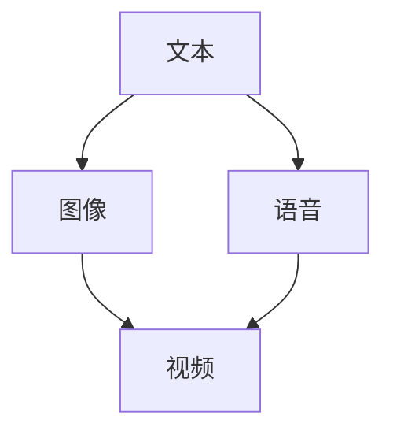
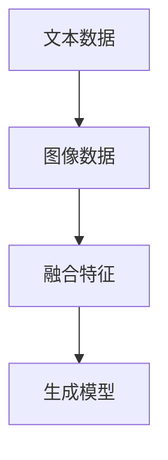
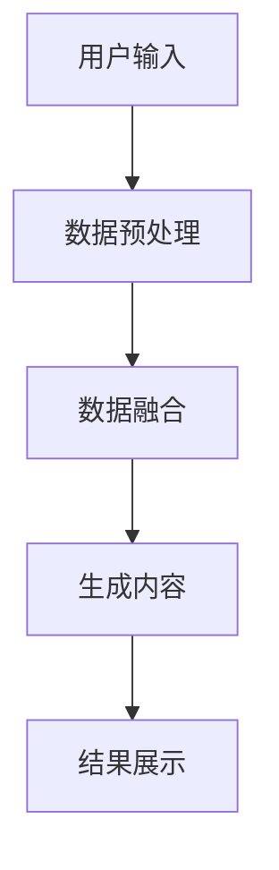
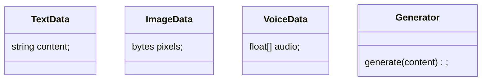
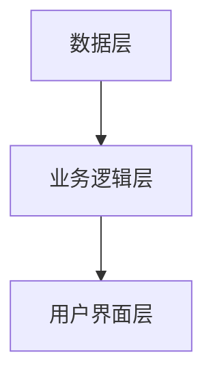
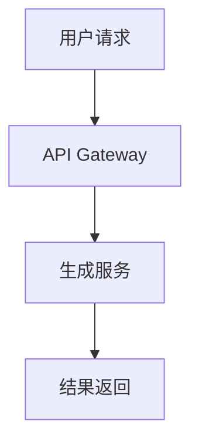

                 


# AI Agent的多模态生成：创造跨媒体内容

**关键词**：AI Agent、多模态生成、跨媒体内容、生成模型、多模态数据融合、系统架构设计、项目实战

**摘要**：本文将详细介绍AI Agent在多模态生成中的应用，探讨跨媒体内容的创造过程。通过背景介绍、核心概念、算法原理、系统设计和项目实战等部分，深入剖析多模态生成的技术细节，结合实际案例分析，为读者提供全面的知识和实践指导。

---

## 第一部分: AI Agent的多模态生成概述

### 第1章: AI Agent与多模态生成的背景介绍

#### 1.1 AI Agent的基本概念

##### 1.1.1 AI Agent的定义与特点
AI Agent（人工智能代理）是指能够感知环境、执行任务并做出决策的智能实体。其特点包括自主性、反应性、目标导向和社会能力。

##### 1.1.2 多模态生成的定义与特点
多模态生成是指利用多种数据模态（如文本、图像、语音等）进行内容生成的技术。其特点包括多样性、融合性和交互性。

##### 1.1.3 AI Agent与多模态生成的关系
AI Agent通过多模态生成技术，能够更高效地处理和生成跨媒体内容，提升用户体验和任务执行能力。

#### 1.2 多模态生成的背景与应用

##### 1.2.1 多模态生成的背景介绍
随着AI技术的发展，多模态生成技术在多个领域得到广泛应用，如图像生成、文本生成和语音合成等。

##### 1.2.2 多模态生成的主要应用场景
- 跨媒體内容生成：如图像生成文本、语音合成视频。
- 智能客服：通过多模态交互提升用户体验。
- 教育领域：生成个性化学习内容。

##### 1.2.3 多模态生成的挑战与机遇
挑战包括数据融合的难度、模型复杂性和计算资源需求；机遇则在于技术进步带来的新可能性。

### 第2章: 多模态生成的核心概念与联系

#### 2.1 核心概念原理

##### 2.1.1 多模态数据的融合机制
多模态数据融合通过将不同模态的数据进行联合分析，提取共同特征，生成更丰富的信息。

##### 2.1.2 AI Agent的生成模型原理
生成模型通过学习数据分布，生成新的数据实例。常用模型包括GAN和Transformer架构。

##### 2.1.3 多模态生成的数学模型
多模态生成模型通常采用联合概率分布，通过条件生成模型实现跨模态生成。

#### 2.2 多模态生成的核心要素对比

##### 2.2.1 不同模态数据的特征对比
| 模态类型 | 特征 |
|----------|------|
| 文本      | 结构化、语义丰富 |
| 图像      | 高维、视觉特征明显 |
| 语音      | 时序性、情感特征 |

##### 2.2.2 各种生成模型的优缺点对比
| 模型类型   | 优点                          | 缺点                          |
|------------|-------------------------------|-------------------------------|
| GAN        | 高质量生成                   | 训练不稳定                     |
| Transformer | 并行处理能力强               | 对长序列处理效果有限           |

##### 2.2.3 多模态生成的实体关系图


### 第3章: 多模态生成的算法原理

#### 3.1 多模态融合算法

##### 3.1.1 多模态数据融合的流程图


##### 3.1.2 多模态融合算法的Python代码实现
```python
import numpy as np
def fuse_modalities(text, image):
    # 文本向量和图像向量融合
    text_vec = text.numpy()
    image_vec = image.numpy()
    fused = np.concatenate([text_vec, image_vec], axis=-1)
    return fused
```

##### 3.1.3 多模态融合算法的数学模型
$$p(x) = \prod_{i=1}^{n} p(x_i | x_{<i})$$

#### 3.2 多模态生成模型

##### 3.2.1 基于Transformer的生成模型
Transformer模型通过自注意力机制捕捉全局依赖关系。

##### 3.2.2 多模态生成模型的数学公式
$$P(y|x) = \text{softmax}(Wx + b)$$

##### 3.2.3 多模态生成模型的代码实现
```python
import torch
class Generator(torch.nn.Module):
    def __init__(self):
        super(Generator, self).__init__()
        self.transformer = TransformerEncoder(...)
```

### 第4章: 多模态生成的系统分析与架构设计

#### 4.1 项目背景与目标

##### 4.1.1 项目背景介绍
本项目旨在开发一个多模态生成系统，支持文本、图像和语音等多种模态内容生成。

##### 4.1.2 项目目标与范围
目标是实现跨媒体内容生成，范围包括文本生成图像和语音合成视频。

##### 4.1.3 项目的关键需求
- 支持多种模态数据输入
- 高效生成算法
- 易用的用户界面

#### 4.2 系统功能设计

##### 4.2.1 系统功能模块划分
- 数据输入模块
- 数据融合模块
- 生成模块
- 结果展示模块

##### 4.2.2 系统功能流程图


##### 4.2.3 系统功能的领域模型类图


#### 4.3 系统架构设计

##### 4.3.1 系统架构的分层设计
- 数据层
- 业务逻辑层
- 用户界面层

##### 4.3.2 系统架构的组件交互图


##### 4.3.3 系统架构的部署方案
- 前端：React或Vue.js
- 后端：Python Flask或Django
- 数据存储：MySQL或MongoDB

##### 4.3.4 系统接口设计
- 接口1：POST /generate
- 接口2：GET /result

##### 4.3.5 系统交互流程图


### 第5章: 多模态生成的项目实战

#### 5.1 环境搭建与配置

##### 5.1.1 开发环境的安装与配置
- 安装Python 3.8+
- 安装TensorFlow、Keras、PyTorch

##### 5.1.2 依赖库的安装与管理
```bash
pip install numpy matplotlib torch
```

##### 5.1.3 环境配置的注意事项
- 确保GPU支持
- 安装必要的开发工具

#### 5.2 系统核心功能实现

##### 5.2.1 多模态数据的预处理代码
```python
def preprocess(text, image):
    # 文本预处理
    text_vec = text_processor(text)
    # 图像预处理
    image_vec = image_processor(image)
    return text_vec, image_vec
```

##### 5.2.2 多模态生成模型的训练代码
```python
def train(generator, discriminator, optimizer_G, optimizer_D):
    for epoch in epochs:
        for batch in data_loader:
            # 训练判别器
            optimizer_D.zero_grad()
            loss_D.backward()
            optimizer_D.step()
            # 训练生成器
            optimizer_G.zero_grad()
            loss_G.backward()
            optimizer_G.step()
```

##### 5.2.3 模型推理与结果展示代码
```python
def generate(generator, input_modality):
    with torch.no_grad():
        output = generator(input_modality)
    return output
```

#### 5.3 项目案例分析与实现

##### 5.3.1 案例背景与需求分析
案例：生成一段视频，结合文本描述和图像内容。

##### 5.3.2 案例实现的详细步骤
1. 数据预处理
2. 模型训练
3. 模型推理
4. 结果展示

##### 5.3.3 代码实现与分析
- 文本生成图像
- 图像生成视频
- 最终结果展示

---

## 第二部分: 总结与展望

### 第6章: 总结与展望

#### 6.1 本章总结
多模态生成技术在AI Agent中的应用前景广阔，能够实现跨媒体内容的高效生成。

#### 6.2 未来展望
未来，多模态生成技术将更加智能化，生成内容更加多样化和个性化。

---

## 第三部分: 最佳实践与注意事项

### 第7章: 最佳实践 tips

#### 7.1 小结
多模态生成技术是AI Agent实现跨媒体内容创造的核心技术。

#### 7.2 注意事项
- 数据质量影响生成效果
- 模型选择需根据具体需求
- 系统架构设计需考虑扩展性

#### 7.3 拓展阅读
推荐阅读相关书籍和论文，深入学习多模态生成技术。

---

## 附录

### 附录A: 术语表
- AI Agent：人工智能代理
- 多模态生成：多模态数据生成

### 附录B: 工具与库
- Python：编程语言
- TensorFlow：深度学习框架

### 附录C: 进一步阅读

#### C.1 推荐书籍
- 《生成式人工智能：原理与应用》

#### C.2 推荐论文
- "Generating Multimodal Data with AI Agents"

---

**作者：AI天才研究院/AI Genius Institute & 禅与计算机程序设计艺术 /Zen And The Art of Computer Programming**

