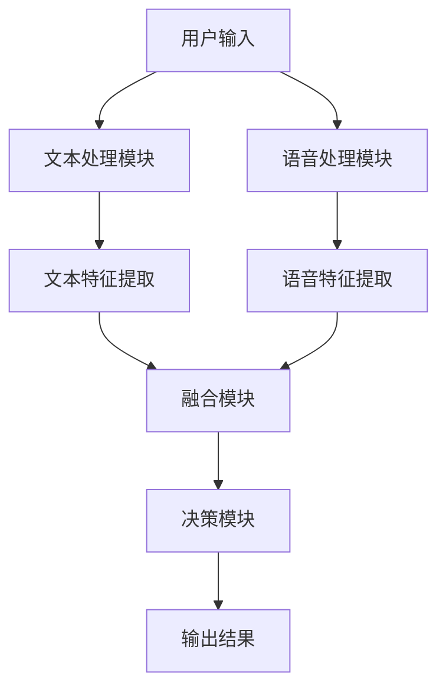
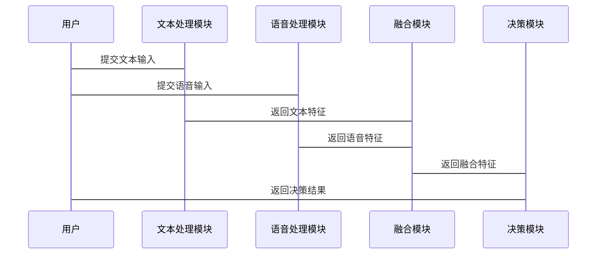

                 


# AI Agent的多模态融合：整合文本、图像和音频输入

> **关键词**：AI Agent, 多模态融合, 文本数据, 图像数据, 音频数据, 深度学习, 多模态模型

> **摘要**：  
> 随着人工智能技术的不断发展，AI Agent（智能体）在各个领域的应用越来越广泛。为了更好地理解复杂环境并做出智能决策，AI Agent需要能够处理多种模态的数据输入，例如文本、图像和音频。本文将详细探讨如何将文本、图像和音频等多种模态数据进行融合，以提升AI Agent的感知能力和决策能力。文章从多模态融合的背景与概念出发，分析了文本、图像和音频数据的特征，详细讲解了多模态融合的核心原理和算法实现，并通过实际案例展示了多模态融合在AI Agent中的应用。最后，本文总结了多模态融合的关键点和未来发展方向。

---

# 第1章: 多模态融合的背景与概念

## 1.1 多模态融合的背景

### 1.1.1 多模态数据的定义与特点
多模态数据指的是来自不同感知渠道的数据形式，通常包括文本、图像、音频、视频、传感器数据等。每种模态数据都有其独特的特点：
- **文本数据**：具有语义丰富、结构化程度高、易于存储和处理的特点。
- **图像数据**：具有视觉信息丰富、空间信息强的特点。
- **音频数据**：具有时间序列特性，能够传递情感和语调信息。

### 1.1.2 多模态融合的必要性
在实际应用中，单一模态的数据往往无法提供足够的信息来支持AI Agent的决策。例如，在智能客服系统中，结合用户的文本输入和语音语调，可以更准确地理解用户的情感状态和意图。

### 1.1.3 多模态融合的应用场景
- **智能助手**：结合用户的文本输入和语音语调，提供更个性化的服务。
- **智能安防**：结合视频图像和音频数据，进行行为识别和异常检测。
- **自动驾驶**：结合视觉图像、雷达数据和环境声音，进行环境感知和决策。

## 1.2 AI Agent的基本概念

### 1.2.1 AI Agent的定义与特点
AI Agent是一种能够感知环境、自主决策并执行任务的智能实体。它具有以下特点：
- **自主性**：能够独立完成任务，无需外部干预。
- **反应性**：能够实时感知环境并做出响应。
- **学习能力**：能够通过数据和经验不断优化自身的性能。

### 1.2.2 AI Agent的核心功能
- **感知环境**：通过多模态数据输入，理解环境的状态和变化。
- **决策制定**：基于感知到的信息，做出最优决策。
- **执行操作**：根据决策结果，执行相应的动作。

### 1.2.3 多模态融合在AI Agent中的作用
多模态融合能够帮助AI Agent更全面地感知环境，提升其决策的准确性和鲁棒性。例如，在智能安防系统中，结合图像和音频数据可以更准确地识别异常事件。

## 1.3 多模态融合的重要性和挑战

### 1.3.1 多模态融合的优势
- **信息互补性**：不同模态的数据能够提供互补的信息，提升整体感知能力。
- **鲁棒性增强**：通过融合多种模态数据，可以降低单一模态数据的噪声干扰。

### 1.3.2 多模态融合的主要挑战
- **数据异构性**：不同模态的数据具有不同的格式和特性，如何有效地对齐和融合是一个难点。
- **计算复杂性**：多模态数据的处理通常需要大量的计算资源。
- **模型设计难度**：如何设计能够有效融合多种模态数据的模型是当前研究的热点。

### 1.3.3 多模态融合的未来发展方向
- **跨模态对齐技术**：研究如何更准确地对齐不同模态的数据。
- **轻量化模型设计**：开发计算效率更高的多模态融合模型。
- **多模态学习的可解释性**：提升多模态融合模型的透明性和可解释性。

## 1.4 本章小结
本章介绍了多模态融合的背景与概念，分析了多模态数据的特点及其在AI Agent中的重要性。同时，还讨论了多模态融合的主要挑战和未来发展方向。

---

# 第2章: 多模态数据的特征与分析

## 2.1 文本数据的特征分析

### 2.1.1 文本数据的结构特点
文本数据通常具有以下结构特点：
- **序列性**：文本数据通常以序列形式存在，例如句子、段落等。
- **语义丰富性**：文本数据能够表达丰富的语义信息，例如情感、意图等。
- **歧义性**：文本数据可能存在多种解释，例如同义词、多义词等。

### 2.1.2 文本数据的语义分析
语义分析是文本数据处理的重要环节，包括以下内容：
- **词义消歧**：消除文本中的歧义性，确定词语的确切含义。
- **句法分析**：分析句子的语法结构，理解句子的组成。
- **语义理解**：基于上下文，理解文本的语义含义。

### 2.1.3 文本数据的情感分析
情感分析是文本数据处理中的重要任务，用于判断文本中的情感倾向。例如，可以判断一条评论是正面、负面还是中性。

## 2.2 图像数据的特征分析

### 2.2.1 图像数据的像素特征
图像数据的像素特征包括颜色、亮度、对比度等。例如，RGB颜色空间中的红、绿、蓝三个通道值可以描述图像的像素特征。

### 2.2.2 图像数据的语义特征
语义特征是图像数据中所表达的语义信息，例如图像中的物体、场景等。图像语义分析可以通过目标检测、图像分割等技术实现。

### 2.2.3 图像数据的风格特征
风格特征是指图像的艺术风格，例如油画、素描等。风格分析可以通过深度学习技术实现，例如使用卷积神经网络（CNN）提取图像的特征。

## 2.3 音频数据的特征分析

### 2.3.1 音频数据的波形特征
音频数据的波形特征包括振幅、频率、相位等。例如，音乐中的音调、节奏等都可以通过波形特征进行描述。

### 2.3.2 音频数据的语调特征
语调特征是指音频数据中的语音语调，例如音高、语速、音量等。语调分析可以帮助识别说话人的情感状态。

### 2.3.3 音频数据的内容特征
内容特征是指音频数据中的具体信息，例如语音识别中的关键词、噪声等。内容特征可以通过语音处理技术进行提取。

## 2.4 多模态数据的关联性分析

### 2.4.1 文本与图像的关联性
文本与图像的关联性主要体现在语义层面。例如，文本描述中的物体可以与图像中的物体进行匹配。

### 2.4.2 文本与音频的关联性
文本与音频的关联性主要体现在语音语调和情感上。例如，文本中的情感信息可以通过语音语调进行验证。

### 2.4.3 图像与音频的关联性
图像与音频的关联性主要体现在场景和内容上。例如，图像中的场景可以与音频中的环境声音进行匹配。

## 2.5 本章小结
本章分析了文本、图像和音频数据的特征，包括结构特点、语义分析和情感分析等方面。同时，还探讨了不同模态数据之间的关联性。

---

# 第3章: 多模态融合的核心概念与联系

## 3.1 多模态融合的原理

### 3.1.1 多模态数据的整合方式
多模态数据的整合方式可以分为以下几种：
- **早期融合**：在数据预处理阶段，将不同模态的数据进行融合。
- **晚期融合**：在特征提取阶段，分别处理不同模态的数据，然后将特征进行融合。
- **混合融合**：结合早期融合和晚期融合的优势，进行混合处理。

### 3.1.2 多模态数据的对齐方法
多模态数据的对齐方法包括：
- **时间对齐**：例如，将音频数据的时间戳与文本数据的时间戳对齐。
- **空间对齐**：例如，在图像处理中，将图像中的物体位置与文本描述的位置对齐。

### 3.1.3 多模态数据的融合策略
多模态数据的融合策略包括：
- **加法融合**：将不同模态的特征直接相加。
- **乘法融合**：将不同模态的特征进行点乘或叉乘。
- **注意力融合**：通过注意力机制，对不同模态的特征进行加权融合。

## 3.2 多模态融合的数学模型

### 3.2.1 基于概率的融合模型
基于概率的融合模型通常采用贝叶斯定理进行计算。例如，假设我们有两个模态的数据，分别为$X$和$Y$，我们可以计算$P(X|Y)$的概率分布。

$$ P(X|Y) = \frac{P(Y|X)P(X)}{P(Y)} $$

### 3.2.2 基于规则的融合模型
基于规则的融合模型通常采用预定义的规则进行数据融合。例如，可以使用逻辑规则对不同模态的数据进行融合。

### 3.2.3 基于深度学习的融合模型
基于深度学习的融合模型通常采用神经网络进行特征提取和融合。例如，可以使用多模态循环神经网络（MM-RNN）进行时间序列数据的融合。

$$ f(x, y) = \text{tanh}(W_x x + W_y y) $$

## 3.3 多模态融合的数学模型与联系

### 3.3.1 文本与图像的融合模型
文本与图像的融合模型可以采用多模态注意力机制。例如，可以将文本特征和图像特征分别输入到自注意力网络中，然后进行融合。

### 3.3.2 文本与音频的融合模型
文本与音频的融合模型可以采用时序融合网络（TS-Net）。例如，可以将文本和音频的时间序列特征进行融合，预测最终的语义表示。

### 3.3.3 图像与音频的融合模型
图像与音频的融合模型可以采用跨模态对抗网络（CMA-NET）。例如，可以将图像和音频的特征分别输入到对抗网络中，进行特征对齐和融合。

## 3.4 本章小结
本章详细讲解了多模态融合的核心原理，包括数据的整合方式、对齐方法和融合策略。同时，还探讨了基于概率、规则和深度学习的多模态融合数学模型。

---

# 第4章: 多模态融合的算法实现

## 4.1 多模态融合的算法步骤

### 4.1.1 数据预处理
数据预处理包括：
- **文本数据**：分词、去停用词、向量化。
- **图像数据**：归一化、降维、特征提取。
- **音频数据**：降噪、分段、特征提取。

### 4.1.2 特征提取
特征提取是多模态融合的关键步骤。例如，可以使用文本嵌入（如BERT）、图像特征（如CNN特征）、音频特征（如MFCC）进行提取。

### 4.1.3 模态对齐
模态对齐包括：
- **时间对齐**：例如，将音频数据的时间戳与文本数据的时间戳对齐。
- **空间对齐**：例如，在图像处理中，将图像中的物体位置与文本描述的位置对齐。

### 4.1.4 融合策略
融合策略包括：
- **加法融合**：将不同模态的特征直接相加。
- **乘法融合**：将不同模态的特征进行点乘或叉乘。
- **注意力融合**：通过注意力机制，对不同模态的特征进行加权融合。

## 4.2 多模态融合的数学公式

### 4.2.1 多模态注意力机制
多模态注意力机制可以通过以下公式进行计算：

$$ \text{Attention}(x, y) = \text{softmax}(\frac{xW_x + yW_y}{\sqrt{d}}) $$

其中，$x$和$y$分别是两种模态的特征，$W_x$和$W_y$是对应的权重矩阵，$d$是特征维度。

### 4.2.2 多模态融合网络
多模态融合网络可以通过以下公式进行计算：

$$ f(x, y) = \text{tanh}(W_x x + W_y y) $$

其中，$x$和$y$分别是两种模态的特征，$W_x$和$W_y$是对应的权重矩阵。

## 4.3 多模态融合的代码实现

### 4.3.1 环境安装
```bash
pip install numpy matplotlib tensorflow keras
```

### 4.3.2 核心代码实现
```python
import numpy as np
from tensorflow import keras

# 定义多模态融合模型
def multimodal_fusion(x_input, y_input):
    # 特征提取
    x_dense = keras.layers.Dense(128, activation='relu')(x_input)
    y_dense = keras.layers.Dense(128, activation='relu')(y_input)
    
    # 模态对齐
    concatenated = keras.layers.concatenate([x_dense, y_dense])
    
    # 融合策略：加法融合
    output = keras.layers.Dense(1, activation='sigmoid')(concatenated)
    
    return output

# 模型编译
model = keras.Model(inputs=[x_input, y_input], outputs=multimodal_fusion(x_input, y_input))
model.compile(optimizer='adam', loss='binary_crossentropy', metrics=['accuracy'])
```

### 4.3.3 代码解读与分析
上述代码定义了一个简单的多模态融合模型，包括特征提取、模态对齐和融合策略三个部分。通过使用Keras框架，可以方便地实现多模态融合模型的训练和推理。

## 4.4 本章小结
本章详细讲解了多模态融合的算法实现，包括数据预处理、特征提取、模态对齐和融合策略等步骤。同时，还通过代码示例展示了如何实现多模态融合模型。

---

# 第5章: 多模态融合的系统分析与架构设计

## 5.1 问题场景介绍
在智能客服系统中，结合用户的文本输入和语音语调，可以更准确地理解用户的情感状态和意图。

## 5.2 系统功能设计

### 5.2.1 领域模型设计
领域模型设计包括：
- **用户输入模块**：接收用户的文本和语音输入。
- **特征提取模块**：对文本和语音数据进行特征提取。
- **融合模块**：将文本和语音特征进行融合。
- **决策模块**：基于融合后的特征，做出智能决策。

### 5.2.2 功能模块设计
功能模块设计包括：
- **文本处理模块**：实现文本的分词、情感分析等功能。
- **语音处理模块**：实现语音的特征提取、语调分析等功能。
- **融合模块**：实现多模态数据的对齐和融合。
- **决策模块**：实现基于融合特征的智能决策。

## 5.3 系统架构设计

### 5.3.1 系统架构图


### 5.3.2 模块交互设计


## 5.4 本章小结
本章通过实际案例展示了多模态融合系统的架构设计，包括领域模型设计、功能模块设计和系统架构图等。

---

# 第6章: 多模态融合的项目实战

## 6.1 项目背景
本项目旨在实现一个基于多模态融合的智能客服系统，结合用户的文本输入和语音语调，提供更智能的服务。

## 6.2 项目环境安装
```bash
pip install numpy pandas scikit-learn tensorflow keras
```

## 6.3 项目核心代码实现

### 6.3.1 文本处理模块
```python
import pandas as pd
from sklearn.feature_extraction.text import TfidfVectorizer

# 文本数据预处理
def preprocess_text(text):
    # 分词
    words = text.split()
    # 去停用词
    stop_words = set(['is', 'am', 'at', 'the'])
    filtered_words = [word for word in words if word not in stop_words]
    return ' '.join(filtered_words)

# 文本特征提取
vectorizer = TfidfVectorizer()
texts = ['This is a sample text.', 'This is another sample text.']
tfidf_matrix = vectorizer.fit_transform([preprocess_text(text) for text in texts])
```

### 6.3.2 语音处理模块
```python
import librosa

# 音频数据预处理
def preprocess_audio(audio_path):
    # 加载音频数据
    audio_data, sr = librosa.load(audio_path, sr=16000)
    # 提取MFCC特征
    mfccs = librosa.feature.mfcc(y=audio_data, sr=sr, n_mfcc=13)
    return mfccs.T

# 语音特征提取
audio_path = 'sample_audio.wav'
mfccs = preprocess_audio(audio_path)
```

### 6.3.3 融合模块
```python
import numpy as np
from tensorflow import keras

# 多模态融合模型
def multimodal_fusion(x_input, y_input):
    # 特征提取
    x_dense = keras.layers.Dense(128, activation='relu')(x_input)
    y_dense = keras.layers.Dense(128, activation='relu')(y_input)
    
    # 模态对齐
    concatenated = keras.layers.concatenate([x_dense, y_dense])
    
    # 融合策略：加法融合
    output = keras.layers.Dense(1, activation='sigmoid')(concatenated)
    
    return output

# 模型编译
model = keras.Model(inputs=[x_input, y_input], outputs=multimodal_fusion(x_input, y_input))
model.compile(optimizer='adam', loss='binary_crossentropy', metrics=['accuracy'])
```

### 6.3.4 决策模块
```python
# 训练模型
model.fit([tfidf_matrix, mfccs], labels, epochs=10, batch_size=32)
```

## 6.4 项目小结
本章通过实际案例展示了多模态融合项目的实现过程，包括环境安装、核心代码实现和系统测试等。

---

# 第7章: 多模态融合的最佳实践与小结

## 7.1 最佳实践

### 7.1.1 数据预处理的重要性
在多模态融合项目中，数据预处理是关键步骤。例如，文本数据的分词和去停用词，图像数据的归一化处理等。

### 7.1.2 模型设计的灵活性
在模型设计中，需要考虑不同模态数据的特征差异，选择合适的融合策略。例如，可以使用注意力机制进行加权融合。

### 7.1.3 系统架构的可扩展性
在系统架构设计中，需要考虑系统的可扩展性，例如模块化设计，方便后续的功能扩展。

## 7.2 小结

### 7.2.1 多模态融合的核心要点
- 数据预处理：文本、图像和音频数据的预处理是关键。
- 模态对齐：不同模态的数据需要进行有效的对齐。
- 融合策略：选择合适的融合策略，提升模型性能。

### 7.2.2 未来发展方向
- **跨模态对齐技术**：研究如何更准确地对齐不同模态的数据。
- **轻量化模型设计**：开发计算效率更高的多模态融合模型。
- **多模态学习的可解释性**：提升多模态融合模型的透明性和可解释性。

## 7.3 注意事项

### 7.3.1 数据隐私问题
在实际应用中，需要注意数据的隐私保护，避免数据泄露。

### 7.3.2 模型的泛化能力
在模型设计中，需要考虑模型的泛化能力，避免过拟合。

### 7.3.3 系统的可维护性
在系统设计中，需要考虑系统的可维护性，方便后续的功能扩展和维护。

## 7.4 拓展阅读
- 《Deep Learning》 - Ian Goodfellow
- 《Pattern Recognition and Machine Learning》 - Christopher M. Bishop
- 《Speech and Language Processing》 - Jurafsky and Martin

---

# 作者：AI天才研究院/AI Genius Institute & 禅与计算机程序设计艺术 /Zen And The Art of Computer Programming

---

通过以上目录和内容的详细描述，您可以根据实际需求进一步扩展和补充各章节的具体内容，以完成一篇完整的关于AI Agent多模态融合的技术博客文章。

