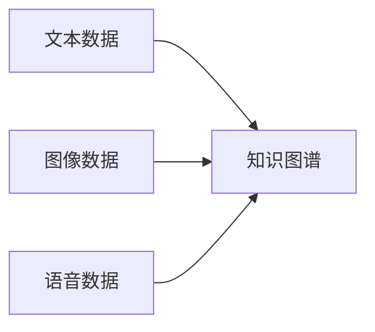
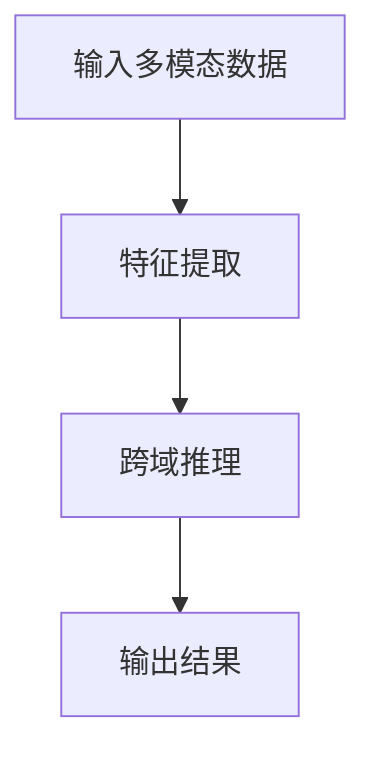
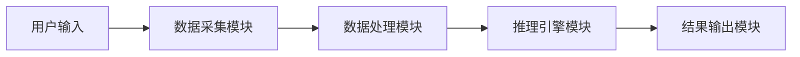
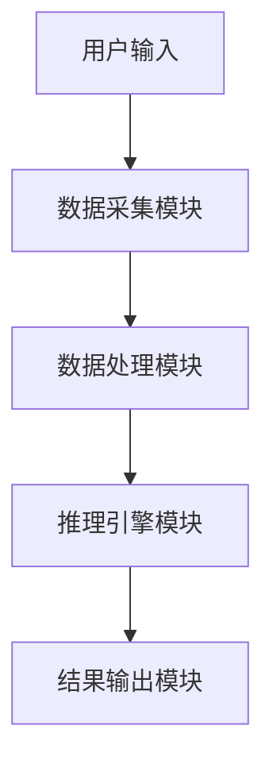

                 


---

# AI Agent的多模态跨域推理技术

> **关键词**：AI Agent，多模态推理，跨域推理，知识图谱，系统架构，算法原理

> **摘要**：  
> 本文深入探讨了AI Agent在多模态跨域推理技术中的应用，从核心概念、算法原理到系统架构，再到实际项目实战，全面解析了该技术的实现与应用。通过理论与实践相结合的方式，帮助读者理解如何构建一个能够处理多模态数据并进行跨域推理的AI Agent系统。

---

## 第1章: AI Agent与多模态跨域推理概述

### 1.1 AI Agent的基本概念

#### 1.1.1 什么是AI Agent
AI Agent（人工智能代理）是一种能够感知环境、自主决策并执行任务的智能体。它可以理解为一个软件程序或实体，具备以下核心特征：
- **自主性**：能够在没有外部干预的情况下独立运行。
- **反应性**：能够感知环境并实时做出响应。
- **目标导向**：通过设定目标来驱动行为。
- **学习能力**：能够通过经验改进自身的性能。

#### 1.1.2 AI Agent的核心特征
AI Agent的核心特征包括：
1. **感知能力**：通过传感器或其他输入方式获取环境信息。
2. **推理能力**：基于获取的信息进行逻辑推理或模式识别。
3. **决策能力**：根据推理结果做出最优决策。
4. **执行能力**：通过执行机构或其他输出方式实现决策。

#### 1.1.3 多模态跨域推理的定义与特点
多模态跨域推理是指AI Agent能够同时处理多种类型的数据（如文本、图像、语音等），并能够在不同领域或数据源之间进行推理的技术。其特点包括：
- **多模态性**：能够处理多种类型的数据，实现信息的全面感知。
- **跨域性**：能够在不同领域或数据源之间进行推理，突破单一数据源的限制。
- **智能化**：通过融合多模态数据，实现更智能的决策和推理。

### 1.2 多模态跨域推理的背景与意义

#### 1.2.1 当前AI技术的发展趋势
随着AI技术的快速发展，AI Agent的应用场景越来越广泛。从智能助手到自动驾驶，从智能客服到机器人，AI Agent正在渗透到各个领域。然而，单一模态的数据处理能力已经无法满足复杂场景的需求，多模态跨域推理技术应运而生。

#### 1.2.2 多模态数据的融合挑战
多模态数据的融合面临以下挑战：
1. **数据异构性**：不同模态的数据格式和特征空间差异较大。
2. **信息冗余**：多模态数据可能存在信息冗余，如何有效提取关键信息是难点。
3. **计算复杂性**：多模态数据的处理需要更高的计算资源和算法优化。

#### 1.2.3 跨域推理的重要性与应用场景
跨域推理的重要性在于：
1. **提升决策的准确性**：通过融合多模态数据，能够提高决策的准确性和可靠性。
2. **扩展应用场景**：跨域推理使得AI Agent能够处理更复杂、更多样化的任务。
3. **实现智能化升级**：通过跨域推理，AI Agent能够更好地理解和应对复杂场景。

### 1.3 本章小结
本章从AI Agent的基本概念出发，详细介绍了多模态跨域推理的定义、特点以及其在当前AI技术中的重要性。通过分析多模态数据融合的挑战和跨域推理的应用场景，为后续章节的深入探讨奠定了基础。

---

## 第2章: 多模态数据与跨域推理的基本原理

### 2.1 多模态数据的特征分析

#### 2.1.1 文本、图像、语音等多模态数据的特征
- **文本数据**：具有语义信息丰富、结构化程度高等特点，但难以直接处理非结构化信息。
- **图像数据**：具有视觉信息丰富、数据量大等特点，但难以直接提取语义信息。
- **语音数据**：能够捕捉语言的情感和语调信息，但处理复杂性强。

#### 2.1.2 多模态数据的融合方式
多模态数据的融合方式包括：
1. **早期融合**：在数据预处理阶段将不同模态的数据进行融合。
2. **晚期融合**：在特征提取或推理阶段将不同模态的数据进行融合。
3. **混合融合**：结合早期和晚期融合的优点，灵活调整融合方式。

### 2.2 跨域推理的数学模型

#### 2.2.1 跨域推理的基本数学公式
跨域推理的数学模型可以表示为：
$$p(y|x) = \prod_{i=1}^{n} p(y|x_i)$$
其中，$y$ 是目标输出，$x_i$ 是不同模态的输入数据。

#### 2.2.2 跨域推理的图模型表示
跨域推理可以通过图模型进行表示，如下所示：


### 2.3 多模态跨域推理的实体关系图

#### 2.3.1 实体关系图
多模态跨域推理的实体关系图如下所示：


### 2.4 本章小结
本章详细分析了多模态数据的特征及其融合方式，并通过数学公式和图模型的方式，阐述了跨域推理的基本原理。这些内容为后续章节的算法实现奠定了理论基础。

---

## 第3章: 多模态跨域推理算法的核心原理

### 3.1 多模态数据的预处理与融合

#### 3.1.1 数据预处理方法
- **文本数据**：去除停用词、分词、词干提取等。
- **图像数据**：归一化、特征提取、降维等。
- **语音数据**：降噪、分段、特征提取等。

#### 3.1.2 多模态数据融合的主流算法
- **基于概率的融合算法**：如朴素贝叶斯、马尔可夫链等。
- **基于深度学习的融合算法**：如多模态卷积神经网络、多模态循环神经网络等。

### 3.2 跨域推理的算法流程

#### 3.2.1 算法流程图


### 3.3 跨域推理的数学模型与公式

#### 3.3.1 跨域推理的基本公式
跨域推理的数学模型可以表示为：
$$p(y|x) = \prod_{i=1}^{n} p(y|x_i)$$
其中，$x_i$ 是不同模态的输入数据，$y$ 是目标输出。

#### 3.3.2 基于图模型的推理公式
基于图模型的推理公式可以表示为：
$$z = \sum_{i=1}^{n} \alpha_i x_i$$
其中，$\alpha_i$ 是权重系数，$x_i$ 是不同模态的输入数据。

### 3.4 本章小结
本章详细探讨了多模态跨域推理算法的核心原理，包括数据预处理与融合方法、算法流程以及数学模型的推导。通过这些内容，读者可以更好地理解跨域推理技术的实现过程。

---

## 第4章: 多模态跨域推理的系统架构设计

### 4.1 系统功能模块划分

#### 4.1.1 数据采集模块
- **功能**：从多种数据源采集文本、图像、语音等多模态数据。
- **实现**：通过API或传感器接口获取数据。

#### 4.1.2 数据处理模块
- **功能**：对采集到的多模态数据进行预处理和融合。
- **实现**：使用数据清洗、特征提取等技术。

#### 4.1.3 推理引擎模块
- **功能**：基于预处理后的数据，进行跨域推理并输出结果。
- **实现**：采用深度学习模型或图模型进行推理。

#### 4.1.4 结果输出模块
- **功能**：将推理结果输出给用户或调用方。
- **实现**：通过API或可视化界面输出结果。

### 4.2 系统架构设计

#### 4.2.1 系统架构图


### 4.3 系统接口设计

#### 4.3.1 输入接口
- **输入接口1**：接收文本数据。
- **输入接口2**：接收图像数据。
- **输入接口3**：接收语音数据。

#### 4.3.2 输出接口
- **输出接口1**：输出推理结果。
- **输出接口2**：输出推理过程。

#### 4.3.3 调用接口
- **调用接口1**：API调用接口。
- **调用接口2**：命令行调用接口。

### 4.4 系统交互流程

#### 4.4.1 系统交互流程图


### 4.5 本章小结
本章详细设计了多模态跨域推理系统的架构，包括功能模块划分、系统架构图、接口设计以及交互流程。这些内容为后续的项目实现提供了清晰的指导。

---

## 第5章: 多模态跨域推理技术的项目实战

### 5.1 项目背景与目标

#### 5.1.1 项目背景
本项目旨在实现一个能够处理多模态数据并进行跨域推理的AI Agent系统。

#### 5.1.2 项目目标
- 实现多模态数据的采集与预处理。
- 构建跨域推理模型并进行训练。
- 实现系统集成与测试。

### 5.2 系统核心实现

#### 5.2.1 环境安装
- **Python版本**：3.8+
- **依赖库安装**：`numpy`, `pandas`, `scikit-learn`, `tensorflow`

#### 5.2.2 核心代码实现

##### 5.2.2.1 数据预处理代码
```python
import numpy as np
import pandas as pd

def preprocess_data(data):
    # 文本数据预处理
    text_data = data['text'].apply(clean_text)
    # 图像数据预处理
    image_data = data['image'].apply(extract_features)
    # 语音数据预处理
    audio_data = data['audio'].apply(extract_features)
    return text_data, image_data, audio_data

def clean_text(text):
    # 文本清洗代码
    pass

def extract_features(data):
    # 特征提取代码
    pass
```

##### 5.2.2.2 推理引擎代码
```python
import tensorflow as tf
from tensorflow import keras

def build_model():
    # 文本分支
    text_input = keras.Input(shape=(...,))
    text_branch = keras.layers.Dense(64, activation='relu')(text_input)
    # 图像分支
    image_input = keras.Input(shape=(...,))
    image_branch = keras.layers.Dense(64, activation='relu')(image_input)
    # 语音分支
    audio_input = keras.Input(shape=(...,))
    audio_branch = keras.layers.Dense(64, activation='relu')(audio_input)
    # 合并分支
    merged = keras.layers.concatenate([text_branch, image_branch, audio_branch])
    output = keras.layers.Dense(1, activation='sigmoid')(merged)
    model = keras.Model(inputs=[text_input, image_input, audio_input], outputs=output)
    return model

model = build_model()
model.compile(optimizer='adam', loss='binary_crossentropy', metrics=['accuracy'])
model.summary()
```

##### 5.2.2.3 推理流程代码
```python
def inference(model, input_data):
    # 数据预处理
    text, image, audio = preprocess_data(input_data)
    # 模型推理
    prediction = model.predict([text, image, audio])
    return prediction
```

### 5.3 项目测试与优化

#### 5.3.1 系统测试
- **单元测试**：测试各个功能模块的正确性。
- **集成测试**：测试系统整体的运行情况。

#### 5.3.2 性能优化
- **数据优化**：优化数据预处理和特征提取的效率。
- **算法优化**：优化模型的训练和推理效率。

### 5.4 本章小结
本章通过一个实际项目，详细展示了多模态跨域推理技术的实现过程，包括环境安装、核心代码实现以及项目测试与优化。通过这些内容，读者可以更好地理解如何将理论应用于实际。

---

## 第6章: 多模态跨域推理技术的挑战与未来

### 6.1 当前技术的局限性

#### 6.1.1 数据异构性问题
不同模态的数据格式和特征空间差异较大，如何有效融合是一个挑战。

#### 6.1.2 计算复杂性问题
多模态数据的处理需要更高的计算资源和算法优化。

#### 6.1.3 模型可解释性问题
跨域推理模型的可解释性较差，难以满足实际应用的需求。

### 6.2 未来的发展方向

#### 6.2.1 更高效的融合算法
研究更高效的多模态数据融合算法，降低计算复杂性。

#### 6.2.2 更智能的推理模型
开发更智能的推理模型，提高跨域推理的准确性和可靠性。

#### 6.2.3 更广泛的应用场景
将多模态跨域推理技术应用于更多领域，如医疗、教育、金融等。

### 6.3 本章小结
本章总结了当前多模态跨域推理技术的局限性，并展望了未来的发展方向。通过不断的优化和创新，该技术将更好地服务于实际应用。

---

## 作者：AI天才研究院 & 禅与计算机程序设计艺术

---

以上是《AI Agent的多模态跨域推理技术》的技术博客文章的完整目录大纲和详细内容。

