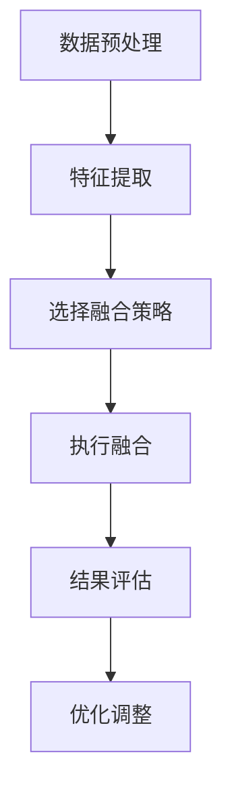

                 


# 第2章: 多源信息融合的原理与方法

## 2.4 多源信息融合的流程与步骤

### 2.4.1 数据预处理
在进行多源信息融合之前，首先需要对各个信息源的数据进行预处理。预处理的主要目的是清洗数据，确保数据的完整性和一致性。以下是一些常见的数据预处理步骤：

#### 1. 数据清洗
- **去除噪声数据**：识别并剔除数据中的噪声或异常值。
- **填补缺失值**：使用均值、中位数或其他方法填补缺失数据。
- **标准化数据**：将数据转换到相同的尺度，避免特征之间的量纲差异。

#### 2. 数据转换
- **特征提取**：从原始数据中提取有用的特征，例如从文本中提取关键词，从图像中提取边缘信息。
- **数据格式转换**：将数据转换为适合后续处理的格式，如将文本数据转换为向量表示。

### 2.4.2 特征提取
特征提取是多源信息融合的重要步骤，目的是从原始数据中提取能够反映数据本质特征的信息。常见的特征提取方法包括：

#### 1. 文本特征提取
- 使用TF-IDF（Term Frequency-Inverse Document Frequency）提取关键词。
- 使用词嵌入技术（如Word2Vec、GloVe）生成词向量。

#### 2. 图像特征提取
- 使用CNN（卷积神经网络）提取图像的低级和高级特征。
- 使用区域卷积神经网络（R-CNN）提取目标区域的特征。

#### 3. 时间序列特征提取
- 使用滑动窗口法提取时序数据的局部特征。
- 使用小波变换提取信号的时频特征。

### 2.4.3 融合策略的选择与优化
在多源信息融合过程中，选择合适的融合策略至关重要。以下是几种常见的融合策略及其适用场景：

#### 1. 基于统计的方法
- **加权平均法**：根据各个信息源的可信度赋予不同的权重，计算加权平均值。
- **投票法**：适用于分类任务，多个信息源对同一问题进行投票，最终结果由多数决定。

#### 2. 基于知识的方法
- **知识图谱融合**：利用知识图谱中的语义关系进行信息融合，例如使用图嵌入技术将实体关系表示为向量。
- **规则融合**：根据领域知识制定融合规则，例如在医疗领域，结合医学指南制定融合规则。

#### 3. 基于学习的方法
- **深度学习融合**：使用神经网络模型（如DNN、RNN、CNN）对多源数据进行联合训练，学习数据的深层特征。
- **注意力机制**：在融合过程中，根据信息源的重要性动态分配注意力权重。

### 2.4.4 信息融合的流程
以下是多源信息融合的一般流程：

1. **数据预处理**：清洗、转换数据，确保数据一致性。
2. **特征提取**：从原始数据中提取有用的特征。
3. **选择融合策略**：根据数据类型和应用场景选择合适的融合方法。
4. **执行融合**：将提取的特征按照选择的策略进行融合。
5. **结果评估**：对融合结果进行评估，确保融合的有效性。

### 2.4.5 融合过程中的冲突处理
在多源信息融合过程中，可能会出现信息冲突，例如不同信息源提供的数据不一致。以下是处理冲突的几种方法：

#### 1. 加权融合
根据信息源的可信度对数据进行加权，优先选择高可信度的信息源。

#### 2. 约束融合
利用领域知识或先验约束条件对冲突信息进行调整，例如在医疗诊断中，优先考虑权威医学指南的结果。

#### 3. 学习融合
使用机器学习模型（如加法模型、乘法模型）对冲突信息进行建模，学习最优的融合方式。

### 2.4.6 融合结果的评估
对融合结果进行评估是确保融合效果的重要步骤。常用的评估方法包括：

#### 1. 定量评估
- **准确率**：计算融合结果与真实值的匹配程度。
- **F1分数**：综合考虑精确率和召回率。
- **均方误差（MSE）**：衡量预测值与真实值的差距。

#### 2. 定性评估
- **可解释性**：评估融合结果是否具有合理的解释。
- **鲁棒性**：评估融合结果在面对数据噪声或缺失时的稳定性。

### 2.4.7 多源信息融合的流程图



### 2.4.8 Python代码实现

以下是一个简单的多源信息融合的Python代码示例：

```python
import numpy as np
from sklearn.preprocessing import StandardScaler
from sklearn.ensemble import VotingClassifier
from sklearn.metrics import accuracy_score

# 示例数据
X1 = np.random.randn(100, 2)
X2 = np.random.randn(100, 2) + 2
y = np.random.randint(2, size=100)

# 数据预处理
scaler = StandardScaler()
X1_normalized = scaler.fit_transform(X1)
X2_normalized = scaler.fit_transform(X2)

# 特征提取
features1 = X1_normalized
features2 = X2_normalized

# 选择融合策略
# 使用投票分类器融合两个分类器的结果
from sklearn.svm import SVC
from sklearn.tree import DecisionTreeClassifier

clf1 = SVC()
clf2 = DecisionTreeClassifier()

# 训练分类器
clf1.fit(features1, y)
clf2.fit(features2, y)

# 执行融合
voting_clf = VotingClassifier([('clf1', clf1), ('clf2', clf2)])
voting_clf.fit(np.concatenate([features1, features2], axis=1), y)

# 结果评估
y_pred = voting_clf.predict(np.concatenate([features1, features2], axis=1))
print("Accuracy:", accuracy_score(y, y_pred))
```

### 2.4.9 总结
多源信息融合的流程是一个系统化的过程，需要在数据预处理、特征提取、融合策略选择和结果评估等环节进行精心设计。选择合适的融合方法可以显著提高融合效果，同时需要结合领域知识和实际应用场景进行优化。

---

通过以上步骤，我们可以清晰地看到多源信息融合的流程和每个步骤的具体实现方法。接下来，我们可以将这些理论应用到实际的项目中，通过代码实现和案例分析来进一步验证和优化我们的方法。

