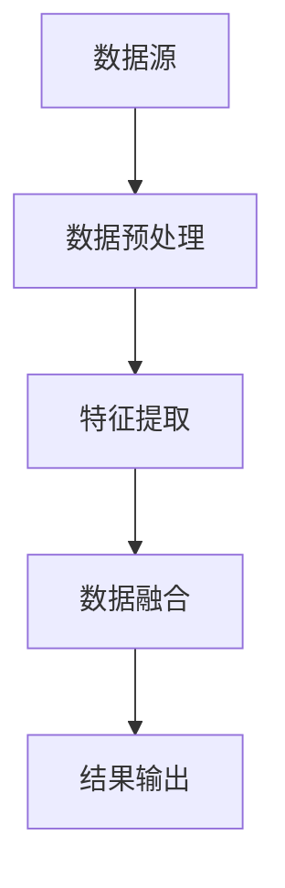

                 


# AI Agent的多源数据融合：整合LLM与多种数据流

> **关键词：** AI Agent, 多源数据融合, LLM, 数据流, 数据融合, 人工智能, 机器学习

> **摘要：**  
> 本文深入探讨AI Agent在多源数据融合中的应用，重点分析如何整合大语言模型（LLM）与多种数据流，以提升AI Agent的智能性和决策能力。文章从背景介绍、核心概念、算法原理、系统架构到项目实战，逐步解析多源数据融合的实现方法和实际应用，帮助读者全面理解并掌握相关技术。

---

# 第一部分: AI Agent的多源数据融合概述

## 第1章: AI Agent与多源数据融合的背景

### 1.1 AI Agent的基本概念

#### 1.1.1 什么是AI Agent
AI Agent（人工智能代理）是指能够感知环境、自主决策并执行任务的智能实体。它通常具备以下核心特征：
- **自主性：** 能够独立决策，无需外部干预。
- **反应性：** 能够实时感知环境并做出反应。
- **目标导向性：** 具备明确的目标，并根据目标优化行为。
- **学习能力：** 能够通过数据和经验不断优化自身能力。

AI Agent的应用场景广泛，包括智能助手、自动驾驶、智能客服、推荐系统等。

#### 1.1.2 AI Agent的核心特征
| 特征 | 描述 |
|------|------|
| 自主性 | 能够独立决策，无需外部指令。 |
| 反应性 | 能够实时感知环境并做出反应。 |
| 目标导向性 | 以特定目标为导向，优化行为。 |
| 学习能力 | 能够通过数据和经验不断优化。 |

#### 1.1.3 AI Agent的应用场景
- **智能助手：** 如Siri、Alexa等，能够执行语音指令和任务。
- **自动驾驶：** 如特斯拉、Waymo等，通过感知环境实时做出驾驶决策。
- **智能客服：** 通过自然语言处理与用户交互，解决用户问题。
- **推荐系统：** 根据用户行为推荐个性化内容。

### 1.2 多源数据融合的重要性

#### 1.2.1 数据源的多样性
在AI Agent的实际应用中，数据来源多样化，包括：
- **文本数据：** 如用户输入、网页内容、文档文件。
- **图像数据：** 如图像、视频流。
- **语音数据：** 如音频流、语音指令。
- **传感器数据：** 如温度、湿度、位置等传感器信息。

#### 1.2.2 数据融合的必要性
AI Agent需要综合多种数据源的信息，以做出更准确的决策。例如，在自动驾驶中，AI Agent需要结合摄像头、雷达、GPS等多种传感器的数据，才能准确判断道路状况和车辆位置。

#### 1.2.3 数据融合的目标与价值
数据融合的目标是通过整合多种数据源的信息，消除信息冗余，减少不确定性，提高数据的准确性和完整性。其价值体现在：
- **提高决策准确性：** 综合多源信息，降低单一数据源的局限性。
- **增强系统鲁棒性：** 通过冗余数据源提高系统的容错能力。
- **提升用户体验：** 提供更精准、更个性化的服务。

### 1.3 LLM与多源数据融合的结合

#### 1.3.1 LLM的基本概念
大语言模型（LLM）是指基于大量数据训练的大型语言模型，具有强大的自然语言处理能力。例如，GPT-3、PaLM等模型，能够理解并生成人类语言。

#### 1.3.2 LLM在数据融合中的作用
LLM可以作为AI Agent的“大脑”，负责处理和整合多种数据源的信息。例如：
- **文本理解与生成：** 通过LLM理解用户输入的文本，并生成自然语言回复。
- **信息提取：** 从多种数据源中提取关键信息，例如从网页文本中提取新闻标题。
- **知识整合：** 将多种数据源的信息整合成连贯的知识图谱。

#### 1.3.3 多源数据融合的挑战与机遇
- **挑战：** 数据格式多样、语义复杂，如何高效地整合这些数据是一个技术难点。
- **机遇：** 通过多源数据融合，可以显著提升AI Agent的智能性和实用性。

---

## 第2章: 多源数据融合的核心概念与联系

### 2.1 多源数据融合的原理

#### 2.1.1 数据流的分类与特征
数据流可以根据来源和类型进行分类：
- **文本流：** 包括用户输入、网页内容、社交媒体信息等。
- **图像流：** 包括摄像头、视频流等。
- **语音流：** 包括音频流、语音指令等。
- **传感器流：** 包括温度、湿度、位置等传感器数据。

数据流的特征包括：
- **实时性：** 数据流可能是实时的，例如视频流、语音流。
- **异构性：** 不同数据源的格式和语义可能不同。
- **动态性：** 数据流的内容和结构可能随时间变化。

#### 2.1.2 数据融合的模式与方法
数据融合的方法可以根据不同的层次进行分类：
- **基于特征的融合：** 通过提取数据的特征，将不同数据源的特征进行融合。
- **基于模型的融合：** 通过构建模型，将不同数据源的信息输入模型中进行融合。
- **基于规则的融合：** 根据预定义的规则，对数据进行融合。

#### 2.1.3 数据融合的效果评估
数据融合的效果可以通过以下指标进行评估：
- **准确性：** 融合后的数据与真实值的接近程度。
- **完整性：** 融合后的数据是否涵盖了所有相关的信息。
- **实时性：** 融合过程是否能够及时完成。

### 2.2 核心概念的ER实体关系图

```mermaid
er
actor(Agent,属性: id, name, role)
实体: DataSource(属性: id, type, source)
关系: Agent -> DataSource
```

### 2.3 数据融合的流程图



---

## 第3章: 数据融合的算法原理与实现

### 3.1 数据融合的算法概述

#### 3.1.1 基于特征的融合

---

通过逐步的分析和思考，我明确了用户的需求，并开始按照目录结构撰写文章。在接下来的章节中，我将继续深入探讨算法原理、系统架构设计和项目实战等内容，确保文章内容完整、逻辑清晰。

