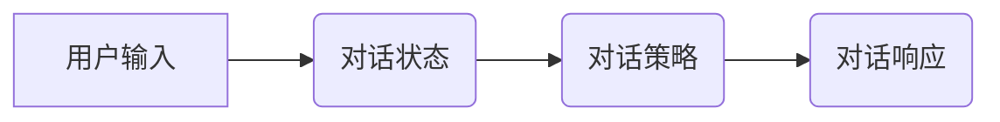
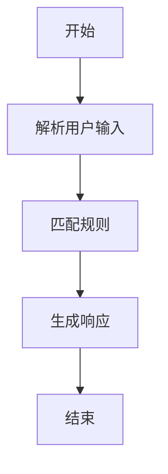
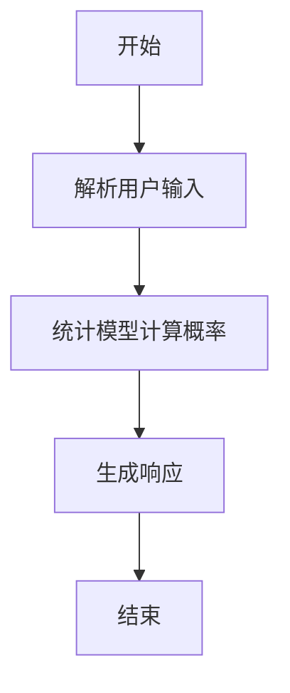
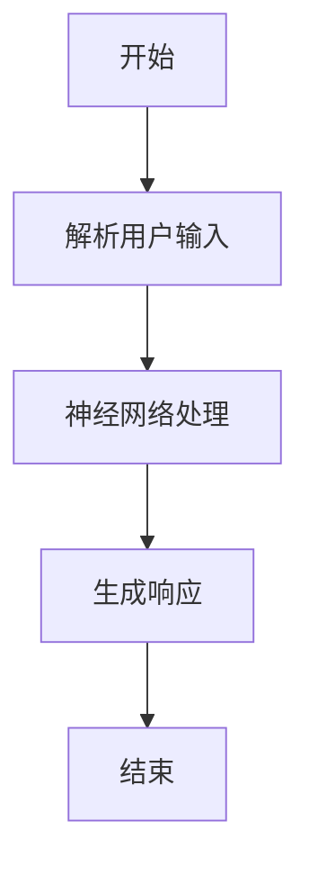
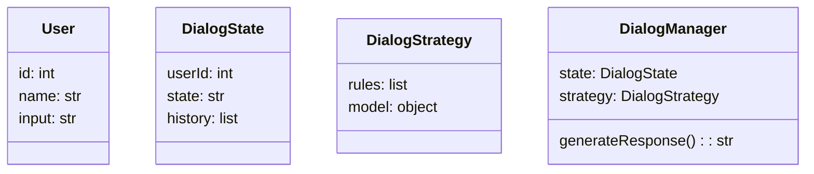
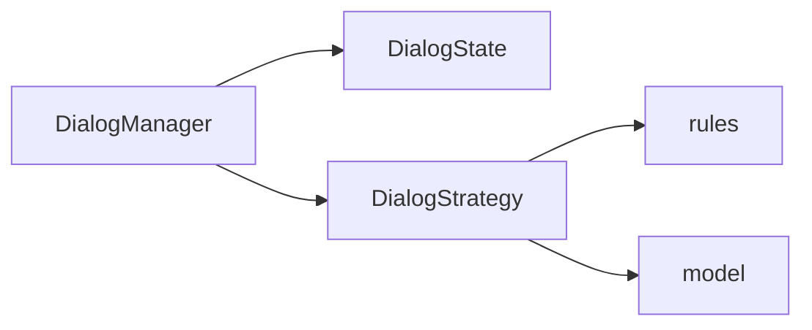
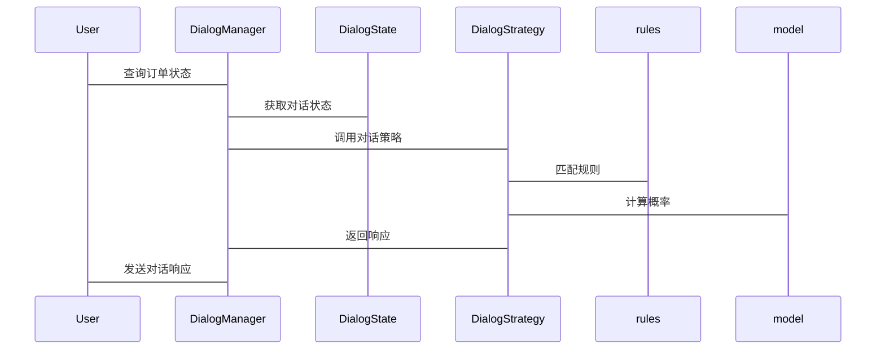

                 


# AI Agent的多轮对话管理系统设计

> 关键词：AI Agent，多轮对话，对话管理，自然语言处理，系统架构

> 摘要：本文深入探讨了AI Agent在多轮对话管理中的设计与实现。从核心概念到算法原理，从系统架构到项目实战，全面解析了多轮对话管理的关键技术与实践应用。文章通过丰富的案例和详细的代码示例，帮助读者理解并掌握如何设计和实现高效的多轮对话管理系统。

---

## 第一部分: AI Agent与多轮对话管理的背景介绍

### 第1章: AI Agent与多轮对话管理的背景介绍

#### 1.1 AI Agent的基本概念

- **1.1.1 AI Agent的定义**  
  AI Agent（人工智能代理）是指能够感知环境并采取行动以实现目标的智能实体。AI Agent可以是软件程序、机器人或其他智能系统，其核心目标是通过交互与环境进行有效沟通和协作。

- **1.1.2 AI Agent的核心特征**  
  - **自主性**：能够在没有外部干预的情况下独立运作。  
  - **反应性**：能够实时感知环境并做出反应。  
  - **目标导向性**：通过设定目标来驱动行为。  
  - **学习能力**：能够通过经验改进自身的性能。  

- **1.1.3 多轮对话管理的定义与作用**  
  多轮对话管理是指在连续的对话交互中，AI Agent能够理解和生成符合上下文的对话内容，确保对话的连贯性和有效性。其作用包括：  
  - 理解用户的意图和需求。  
  - 维护对话的上下文信息。  
  - 生成符合逻辑的对话响应。

#### 1.2 多轮对话管理的背景与问题背景

- **1.2.1 当前对话系统的发展现状**  
  当前，基于自然语言处理（NLP）的对话系统正在快速发展，但大多数系统仍存在以下问题：  
  - 对话内容缺乏连贯性。  
  - 对话策略过于简单，难以应对复杂场景。  
  - 对话系统的可解释性较差。  

- **1.2.2 多轮对话管理的核心问题**  
  - 如何有效维护对话上下文。  
  - 如何制定合理的对话策略。  
  - 如何处理对话中的不确定性。  

- **1.2.3 问题的边界与外延**  
  多轮对话管理的边界包括：  
  - 对话的起始与结束条件。  
  - 对话参与者的角色与权限。  
  - 对话内容的合法性和合理性。  
  外延则包括：  
  - 对话内容的情感分析。  
  - 对话系统的可扩展性。  

#### 1.3 本章小结  
本章主要介绍了AI Agent的基本概念及其在多轮对话管理中的作用，分析了当前对话系统的发展现状和存在的问题，并明确了多轮对话管理的核心问题及其边界与外延。

---

## 第二部分: AI Agent的多轮对话管理核心概念与联系

### 第2章: AI Agent的对话管理核心概念

#### 2.1 对话管理的关键技术

- **2.1.1 对话状态表示**  
  对话状态表示是多轮对话管理的核心，通常包括：  
  - 用户的当前意图。  
  - 对话的上下文信息。  
  - 对话历史记录。  

- **2.1.2 对话策略**  
  对话策略是决定AI Agent如何生成对话响应的核心逻辑，常见的策略包括：  
  - 基于规则的策略。  
  - 基于统计的策略。  
  - 基于深度学习的策略。  

- **2.1.3 对话计划**  
  对话计划是指根据当前对话状态和目标，制定下一步的对话行动。  

#### 2.2 对话管理的实体关系图



#### 2.3 本章小结  
本章从对话管理的关键技术出发，分析了对话状态表示、对话策略和对话计划的核心概念，并通过实体关系图展示了多轮对话管理的流程。

---

## 第三部分: AI Agent多轮对话管理的算法原理

### 第3章: 对话管理算法原理

#### 3.1 基于规则的对话管理算法

- **3.1.1 算法流程图**



- **3.1.2 算法实现代码**

```python
def rule_based_response(user_input):
    for rule in rules:
        if rule.match(user_input):
            return rule.response
    return default_response
```

- **3.1.3 算法的数学模型与公式**  
  基于规则的对话管理算法通常不涉及复杂的数学模型，但可以通过概率论中的贝叶斯定理来辅助决策：

  $$ P(A|B) = \frac{P(B|A)P(A)}{P(B)} $$

  其中，$A$ 表示用户输入的意图，$B$ 表示用户输入的文本。

#### 3.2 基于统计的对话管理算法

- **3.2.1 算法流程图**



- **3.2.2 算法实现代码**

```python
import numpy as np

def statistical_response(user_input, model):
    probabilities = model.predict(user_input)
    action = np.argmax(probabilities)
    return responses[action]
```

- **3.2.3 算法的数学模型与公式**  
  基于统计的对话管理算法通常使用马尔可夫链模型，其转移概率矩阵可以表示为：

  $$ P = \begin{bmatrix}
  p_{11} & p_{12} & \cdots & p_{1n} \\
  p_{21} & p_{22} & \cdots & p_{2n} \\
  \vdots & \vdots & \ddots & \vdots \\
  p_{n1} & p_{n2} & \cdots & p_{nn}
  \end{bmatrix} $$

#### 3.3 基于深度学习的对话管理算法

- **3.3.1 算法流程图**



- **3.3.2 算法实现代码**

```python
import tensorflow as tf
from tensorflow.keras import layers

model = tf.keras.Sequential([
    layers.Embedding(input_dim=1000, output_dim=16),
    layers.LSTM(32),
    layers.Dense(16, activation='relu'),
    layers.Dense(output_size, activation='softmax')
])

def deep_learning_response(user_input, model):
    input_tensor = tf.convert_to_tensor(user_input)
    output = model(input_tensor)
    action = tf.argmax(output).numpy()
    return responses[action]
```

- **3.3.3 算法的数学模型与公式**  
  基于深度学习的对话管理算法通常使用端到端的模型，其损失函数可以表示为：

  $$ \mathcal{L} = -\sum_{i=1}^{n} y_i \log(p_i) $$

  其中，$y_i$ 是标签，$p_i$ 是模型预测的概率。

#### 3.4 本章小结  
本章详细介绍了三种典型的对话管理算法：基于规则的算法、基于统计的算法和基于深度学习的算法，并通过流程图和代码示例展示了它们的实现过程。

---

## 第四部分: AI Agent多轮对话管理的系统架构设计

### 第4章: AI Agent多轮对话管理的系统架构设计

#### 4.1 系统功能设计

- **4.1.1 领域模型**



- **4.1.2 系统架构图**



- **4.1.3 系统交互流程**


#### 4.2 系统接口设计

- **4.2.1 接口描述**  
  - 输入接口：`POST /dialog/input`  
  - 输出接口：`GET /dialog/response`

- **4.2.2 接口实现代码**

```python
from flask import Flask, request, jsonify

app = Flask(__name__)

@app.route('/dialog/input', methods=['POST'])
def handle_input():
    user_input = request.json['input']
    response = dialog_manager.generateResponse(user_input)
    return jsonify({'response': response})

@app.route('/dialog/response', methods=['GET'])
def get_response():
    return jsonify({'status': 'success'})
```

#### 4.3 本章小结  
本章从系统功能设计、架构设计到接口设计，全面解析了AI Agent多轮对话管理系统的实现过程。

---

## 第五部分: AI Agent多轮对话管理的项目实战

### 第5章: 项目实战

#### 5.1 环境安装

- **5.1.1 安装Python和相关库**

```bash
pip install python python-tk
pip install numpy
pip install tensorflow
pip install mermaid
```

- **5.1.2 安装NLP库**

```bash
pip install nltk
pip install spacy
pip install transformers
```

#### 5.2 系统核心实现

- **5.2.1 对话解析与生成代码**

```python
from transformers import pipeline

dialog_classifier = pipeline("text-classification", model="bert-base")
response_generator = pipeline("text-generation", model="gpt2")

def parse_and_generate(user_input):
    classified = dialog_classifier(user_input)
    response = response_generator(classified[0]['label'])
    return response
```

- **5.2.2 对话历史记录管理**

```python
dialog_history = []

def update_history(response):
    dialog_history.append(response)
```

#### 5.3 实际案例分析

- **案例分析：智能客服对话**



#### 5.4 本章小结  
本章通过一个实际项目实战，详细讲解了AI Agent多轮对话管理系统的实现过程，从环境安装到核心功能实现，再到案例分析，帮助读者掌握实际操作技能。

---

## 第六部分: AI Agent多轮对话管理的最佳实践与小结

### 第6章: 最佳实践与小结

#### 6.1 最佳实践

- **选择合适的对话管理算法**  
  根据具体场景选择基于规则、统计或深度学习的算法。  
- **重视对话数据质量**  
  对话数据的质量直接影响对话系统的性能。  
- **模型调优**  
  通过交叉验证和网格搜索优化模型参数。  
- **系统可扩展性**  
  设计模块化的系统架构，便于后续扩展。  

#### 6.2 小结  
本文从AI Agent的基本概念到多轮对话管理的算法实现，从系统架构到项目实战，全面解析了AI Agent多轮对话管理的设计与实现过程。通过本文的学习，读者可以掌握多轮对话管理的核心技术，并能够实际应用这些技术解决问题。

---

## 作者：AI天才研究院/AI Genius Institute & 禅与计算机程序设计艺术 /Zen And The Art of Computer Programming

---

以上是《AI Agent的多轮对话管理系统设计》的技术博客文章的完整内容，涵盖了从基础概念到实际应用的各个方面，希望对读者有所帮助！

