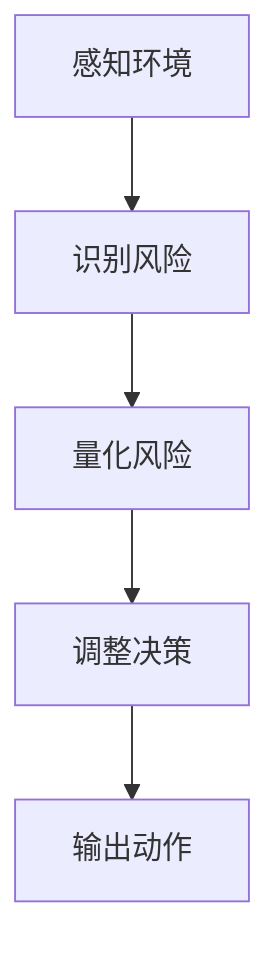
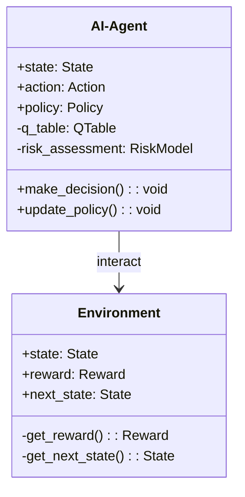

                 


# AI Agent的实时决策与风险评估系统

> **关键词**: AI Agent, 实时决策, 风险评估, 强化学习, 系统架构, 案例分析

> **摘要**:  
> 本文深入探讨了AI Agent在实时决策与风险评估系统中的核心原理与实现方法。通过分析AI Agent的实时决策机制和风险评估方法，结合强化学习算法和系统架构设计，展示了如何构建高效可靠的AI决策系统。文章从问题背景、核心概念、算法原理到系统实现，层层递进，提供了一个全面的技术解决方案。

---

## 引言

AI Agent（人工智能代理）作为连接人工智能与现实应用的桥梁，近年来在多个领域得到了广泛应用。无论是自动驾驶、智能助手还是机器人控制，AI Agent都需要在动态变化的环境中做出实时决策，并对潜在风险进行有效评估。本文将从实时决策与风险评估的双重角度，系统性地分析AI Agent的设计与实现。

---

## 第一部分: AI Agent的实时决策与风险评估概述

### 1.1 AI Agent的基本概念与背景

AI Agent是一种能够感知环境、自主决策并执行任务的智能实体。它通过感知输入信息，结合内部知识库和决策逻辑，输出执行指令。实时决策是AI Agent的核心能力，要求在极短时间内完成信息处理并做出最优选择。

#### AI Agent的定义与特点

- **定义**: AI Agent是一种具有自主性、反应性、目标导向和社交能力的智能实体。
- **特点**:
  - **自主性**: 能够独立执行任务，无需外部干预。
  - **反应性**: 能够实时感知环境变化并做出响应。
  - **目标导向**: 以特定目标为导向，优化决策过程。
  - **学习能力**: 通过数据反馈不断优化决策模型。

#### 问题背景与问题描述

AI Agent在实时决策中面临的主要挑战包括:
- **信息不完备**: 决策时可能无法获得全部信息。
- **环境动态变化**: 决策结果可能因环境变化而失效。
- **风险不确定性**: 需要平衡决策收益与潜在风险。

#### 问题解决与系统架构

为解决上述问题，本文提出以下解决方案:
- **实时决策机制**: 建立基于强化学习的实时决策模型。
- **风险评估系统**: 构建概率论驱动的风险评估框架。
- **系统架构**: 设计模块化、可扩展的系统架构，确保各模块高效协同。

---

## 第二部分: AI Agent的实时决策机制

### 2.1 实时决策的核心原理

实时决策是AI Agent在动态环境中做出快速、准确决策的能力。其实时性要求决策系统在极短时间内完成信息处理和动作选择。

#### 基于状态的实时决策模型

- **状态空间**: 表示系统可能处于的所有状态，每个状态对应特定的决策逻辑。
- **动作选择机制**: 根据当前状态和预设规则，选择最优动作。
- **奖励函数**: 用于评估决策的优劣，指导模型优化。

#### 基于强化学习的实时决策算法

强化学习（Reinforcement Learning, RL）是一种通过试错优化决策模型的方法。其核心要素包括:
- **状态(S)**: 系统当前所处的状态。
- **动作(A)**: 系统可以执行的动作。
- **奖励(R)**: 执行动作后获得的反馈，用于指导决策。

#### 算法实现

以下是一个基于Q-learning的实时决策算法实现示例:

```python
import numpy as np

class QLearningAgent:
    def __init__(self, state_space_size, action_space_size, learning_rate=0.1, gamma=0.9):
        self.state_space_size = state_space_size
        self.action_space_size = action_space_size
        self.learning_rate = learning_rate
        self.gamma = gamma
        self.q_table = np.zeros((state_space_size, action_space_size))
    
    def get_action(self, state):
        return np.argmax(self.q_table[state])
    
    def update_q_table(self, state, action, reward, next_state):
        current_q = self.q_table[state][action]
        next_max_q = np.max(self.q_table[next_state])
        self.q_table[state][action] = current_q + self.learning_rate * (reward + self.gamma * next_max_q - current_q)
```

---

## 第三部分: AI Agent的风险评估方法

### 3.1 风险评估的核心原理

风险评估是AI Agent确保决策可靠性的关键环节。通过量化决策可能带来的风险，AI Agent可以在复杂环境中做出更稳健的选择。

#### 基于概率论的风险评估模型

- **概率分布**: 描述各风险事件发生的可能性。
- **风险概率计算**: 通过贝叶斯网络等方法，计算特定风险事件的发生概率。

#### 风险评估的实现步骤

1. **风险识别**: 确定可能影响决策的风险因素。
2. **风险量化**: 通过概率模型量化各风险的影响程度。
3. **风险控制**: 根据风险评估结果，调整决策策略。

#### 案例分析

假设AI Agent需要在交通场景中做出决策，如下图所示:



---

## 第四部分: 系统架构与实现

### 4.1 系统架构设计

系统整体架构如下:



### 4.2 实际项目实现

#### 环境安装

```bash
pip install numpy scikit-learn matplotlib
```

#### 核心代码实现

```python
def risk_assessment(risk_factors):
    importances = [0.4, 0.3, 0.2, 0.1]
    return sum(risk_factors[i] * importances[i] for i in range(len(risk_factors)))

def real_time_decision(agent, environment):
    state = environment.get_state()
    action = agent.get_action(state)
    reward = environment.get_reward(action)
    next_state = environment.get_next_state()
    agent.update_policy(state, action, reward, next_state)
```

#### 案例分析

假设AI Agent在股票交易中的应用:

- **环境**: 股票价格、市场波动等。
- **决策**: 买入、卖出或持有。
- **风险评估**: 计算市场崩盘的概率，并调整交易策略。

---

## 第五部分: 总结与展望

### 5.1 总结

本文系统性地探讨了AI Agent的实时决策与风险评估系统。通过强化学习算法和概率论模型，构建了一个高效可靠的决策系统。

### 5.2 展望

未来的研究方向包括:
- **多Agent协作**: 提升AI Agent在复杂环境中的协作能力。
- **边缘计算结合**: 利用边缘计算优化实时决策的响应速度。
- **动态风险评估**: 实时更新风险模型，适应动态环境的变化。

---

**作者**: AI天才研究院/AI Genius Institute  
**联系方式**: [禅与计算机程序设计艺术](https://example.com)  
**文章链接**: [AI Agent的实时决策与风险评估系统](https://example.com/real-time-decision-system)  

---

通过本文的详细分析，读者可以深入了解AI Agent的实时决策与风险评估系统的实现方法，并在实际应用中灵活运用这些技术。

