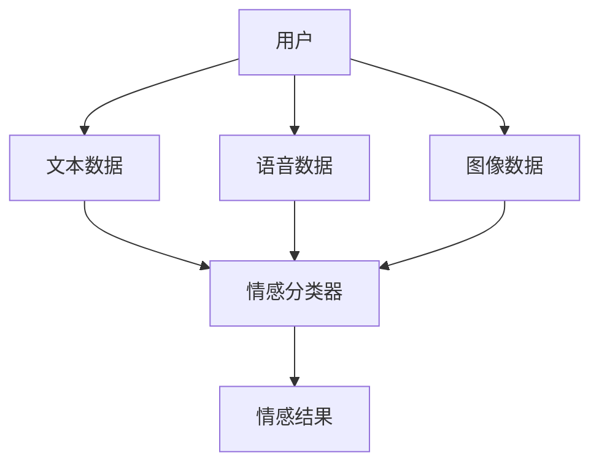
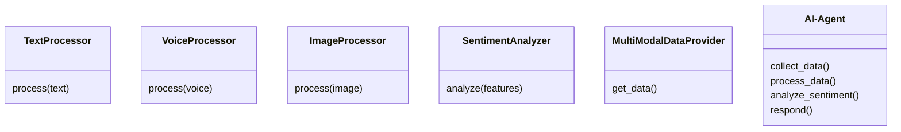
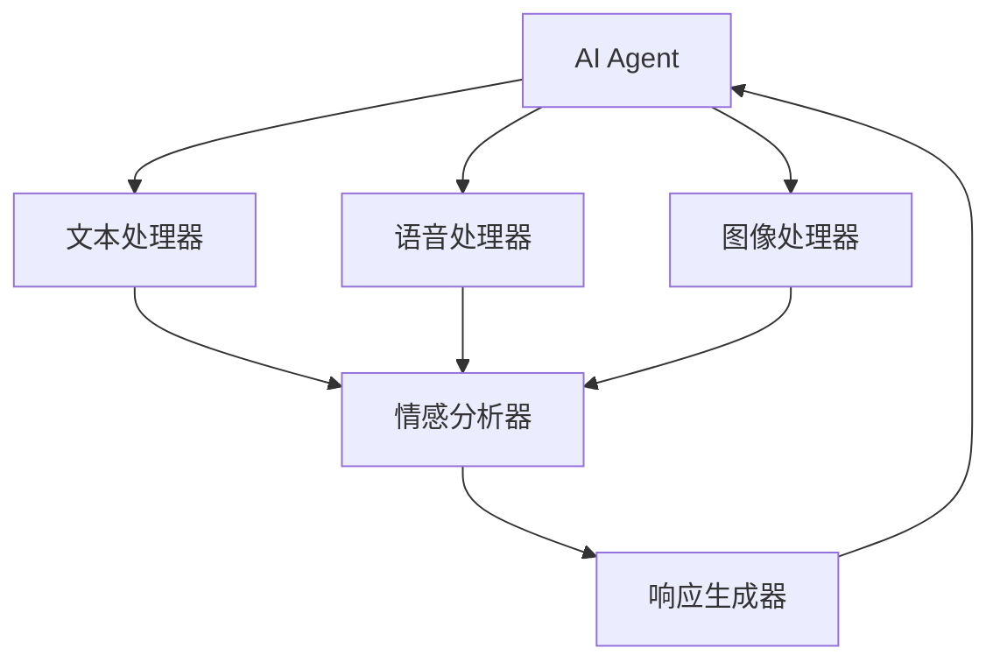
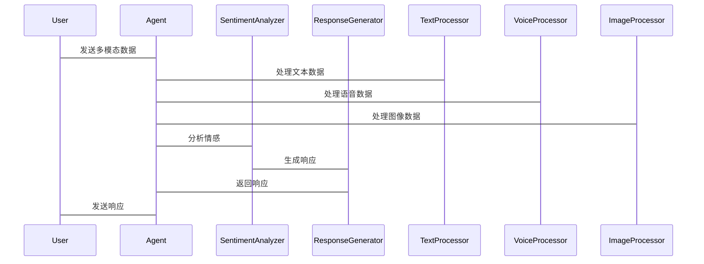

                 


# AI Agent的实时多模态情感分析

## 关键词：AI Agent、实时情感分析、多模态数据、情感计算、深度学习

## 摘要

本文深入探讨AI Agent在实时多模态情感分析中的应用，分析了多模态数据融合、实时处理算法、系统架构设计等关键问题，并通过实例展示了如何实现高效的情感分析系统。文章从背景介绍到系统实现，层层递进，为读者提供了全面的技术解读。

---

## 第一部分: AI Agent与实时多模态情感分析背景

### 第1章: AI Agent与实时多模态情感分析背景

#### 1.1 情感分析的背景与意义

情感分析是自然语言处理中的重要任务，旨在识别文本中的情感倾向。传统的情感分析主要基于文本数据，但在实际应用中，情感表达往往需要结合语音、图像等多种模态信息。例如，用户在视频通话中表达的情感可能通过面部表情和语气来传达，单一的文本分析难以捕捉全部信息。

随着AI Agent的普及，实时多模态情感分析的需求日益增长。AI Agent需要在实时交互中准确理解用户的情感，以便提供更智能的服务。例如，在智能客服系统中，实时分析用户的语音和表情可以提高服务的精准度和用户体验。

#### 1.2 多模态数据的定义与特点

多模态数据指的是来自不同感知渠道的数据，包括文本、语音、图像、视频等。每种模态数据都有其独特的优势和局限性：

- **文本数据**：信息量大，易于处理，但难以捕捉语境和情感的细微差别。
- **语音数据**：包含语调、语气等信息，能够反映情感的动态变化。
- **图像数据**：通过面部表情、手势等视觉信息传递情感。
- **视频数据**：结合了语音和图像信息，提供了更全面的情感表达。

多模态数据的特点包括：

- **互补性**：不同模态的数据可以相互补充，提高情感分析的准确性。
- **实时性**：需要在数据生成的同时进行处理和分析。
- **复杂性**：多模态数据的融合和处理增加了计算的复杂性。

#### 1.3 AI Agent在情感分析中的角色

AI Agent作为实时多模态情感分析的核心实体，负责接收、处理和分析多模态数据，并根据分析结果采取相应的行动。AI Agent需要具备以下能力：

- **实时数据采集**：能够快速采集文本、语音、图像等多种模态数据。
- **多模态数据融合**：将不同模态的数据进行有效融合，提取情感特征。
- **情感推理**：基于融合后的特征，进行情感分类和预测。
- **动态响应**：根据情感分析结果，实时调整交互策略。

### 第2章: 多模态情感分析的核心概念

#### 2.1 情感分析的基本原理

情感分析的目标是识别文本、语音或图像中蕴含的情感倾向。在多模态情感分析中，需要将多种模态的数据进行融合，以获得更准确的情感理解。

情感分析的基本步骤包括：

1. **数据预处理**：对文本、语音、图像等数据进行清洗和标准化处理。
2. **特征提取**：从每种模态数据中提取有意义的特征，例如文本中的关键词、语音的音调特征、图像的表情特征。
3. **特征融合**：将不同模态的特征进行融合，形成统一的表示。
4. **情感分类**：基于融合后的特征，使用机器学习或深度学习模型进行情感分类。

#### 2.2 多模态数据融合的实体关系图

以下是一个简单的实体关系图，展示了多模态情感分析中的主要实体及其关系：



#### 2.3 实时处理的难点与解决方案

实时多模态情感分析的难点主要在于数据的实时性、多样性和计算复杂性。以下是解决这些问题的一些常见方法：

1. **分布式计算**：利用分布式计算框架（如Kafka、Storm）处理大规模实时数据。
2. **流处理技术**：采用流处理技术（如Apache Kafka、Apache Flink）实现数据的实时处理。
3. **轻量级模型**：使用轻量级的深度学习模型（如小样本模型、边缘计算模型）降低计算复杂性。

### 第3章: 多模态情感分析的算法原理

#### 3.1 多模态模型的构建

多模态模型的构建需要考虑以下几点：

1. **模态对齐**：将不同模态的数据对齐到相同的时序或空间位置。
2. **特征融合**：将不同模态的特征进行融合，可以采用加法、乘法或注意力机制等方法。
3. **模型训练**：使用标注数据对模型进行训练，优化模型的性能。

#### 3.2 模型训练的数学公式

以下是多模态情感分析中常用的损失函数：

$$
L = -\sum_{i=1}^{n} y_i \log p_i + (1 - y_i) \log (1 - p_i)
$$

其中，$y_i$ 是真实标签，$p_i$ 是模型预测的概率。

#### 3.3 算法实现的Python代码示例

以下是一个简单的多模态情感分析模型的Python代码示例：

```python
import torch
import torch.nn as nn
import torch.optim as optim

class MultiModalClassifier(nn.Module):
    def __init__(self, input_dims):
        super().__init__()
        self.text_layer = nn.Linear(input_dims['text'], 128)
        self.voice_layer = nn.Linear(input_dims['voice'], 128)
        self.image_layer = nn.Linear(input_dims['image'], 128)
        self.dropout = nn.Dropout(0.5)
        self.fc = nn.Linear(128 * 3, 2)
        self.softmax = nn.Softmax(dim=1)

    def forward(self, text_input, voice_input, image_input):
        text_out = self.text_layer(text_input)
        voice_out = self.voice_layer(voice_input)
        image_out = self.image_layer(image_input)
        features = torch.cat([text_out, voice_out, image_out], dim=1)
        features = self.dropout(features)
        output = self.fc(features)
        output = self.softmax(output)
        return output

# 初始化模型
input_dims = {
    'text': 100,
    'voice': 100,
    'image': 100
}
model = MultiModalClassifier(input_dims)

# 定义损失函数和优化器
criterion = nn.CrossEntropyLoss()
optimizer = optim.Adam(model.parameters(), lr=0.001)

# 训练模型
for epoch in range(num_epochs):
    for inputs, labels in dataloader:
        outputs = model(text_input, voice_input, image_input)
        loss = criterion(outputs, labels)
        optimizer.zero_grad()
        loss.backward()
        optimizer.step()
```

### 第4章: 系统分析与架构设计

#### 4.1 系统功能设计

以下是系统功能设计的类图：



#### 4.2 系统架构设计

以下是系统架构设计的架构图：



#### 4.3 系统交互设计

以下是系统交互设计的序列图：



### 第5章: 项目实战

#### 5.1 项目环境安装

以下是一个简单的项目环境安装示例：

```bash
pip install torch
pip install numpy
pip install matplotlib
pip install pandas
pip install scikit-learn
pip install transformers
```

#### 5.2 核心代码实现

以下是核心代码实现的Python代码示例：

```python
import torch
import torch.nn as nn
import torch.optim as optim
import numpy as np
from sklearn.metrics import accuracy_score

class MultiModalClassifier(nn.Module):
    def __init__(self, input_dims):
        super().__init__()
        self.text_layer = nn.Linear(input_dims['text'], 128)
        self.voice_layer = nn.Linear(input_dims['voice'], 128)
        self.image_layer = nn.Linear(input_dims['image'], 128)
        self.dropout = nn.Dropout(0.5)
        self.fc = nn.Linear(128 * 3, 2)
        self.softmax = nn.Softmax(dim=1)

    def forward(self, text_input, voice_input, image_input):
        text_out = self.text_layer(text_input)
        voice_out = self.voice_layer(voice_input)
        image_out = self.image_layer(image_input)
        features = torch.cat([text_out, voice_out, image_out], dim=1)
        features = self.dropout(features)
        output = self.fc(features)
        output = self.softmax(output)
        return output

# 初始化模型
input_dims = {
    'text': 100,
    'voice': 100,
    'image': 100
}
model = MultiModalClassifier(input_dims)

# 定义损失函数和优化器
criterion = nn.CrossEntropyLoss()
optimizer = optim.Adam(model.parameters(), lr=0.001)

# 训练模型
num_epochs = 10
for epoch in range(num_epochs):
    for inputs, labels in dataloader:
        text_input, voice_input, image_input = inputs
        outputs = model(text_input, voice_input, image_input)
        loss = criterion(outputs, labels)
        optimizer.zero_grad()
        loss.backward()
        optimizer.step()

# 评估模型
with torch.no_grad():
    model.eval()
    for inputs, labels in test_loader:
        text_input, voice_input, image_input = inputs
        outputs = model(text_input, voice_input, image_input)
        _, predicted = torch.max(outputs.data, 1)
        accuracy = accuracy_score(predicted.cpu().numpy(), labels.cpu().numpy())
        print(f'Epoch [{epoch+1}/{num_epochs}], Accuracy: {accuracy}')
```

#### 5.3 代码解读与分析

上述代码实现了一个简单的多模态情感分类器，主要包括以下步骤：

1. **模型定义**：定义了一个多模态分类器，包含文本、语音和图像三个处理模块，以及特征融合和分类模块。
2. **损失函数和优化器**：使用交叉熵损失函数和Adam优化器进行训练。
3. **训练循环**：在每个 epoch 中，遍历数据集，进行前向传播、计算损失、反向传播和优化。
4. **评估模型**：在测试集上评估模型的准确率。

#### 5.4 实际案例分析

假设我们有一个简单的数据集，包含文本、语音和图像三类数据，分别对应正面、中性和负面情感。我们可以使用上述代码进行训练和评估。

### 第6章: 最佳实践

#### 6.1 小结

本文详细介绍了AI Agent在实时多模态情感分析中的应用，从背景介绍到系统实现，层层递进，为读者提供了全面的技术解读。

#### 6.2 注意事项

1. **数据质量**：多模态数据的质量直接影响情感分析的准确性，需要确保数据的完整性和一致性。
2. **模型优化**：实时多模态情感分析对计算资源要求较高，需要优化模型的复杂性和计算效率。
3. **系统稳定性**：实时系统需要考虑容错性和可扩展性，确保在高负载下仍能稳定运行。

#### 6.3 拓展阅读

1. **多模态数据融合**：进一步研究多模态数据融合的方法，如注意力机制、图神经网络等。
2. **实时计算框架**：学习实时计算框架（如Apache Flink、Apache Kafka）的设计和实现。
3. **情感计算应用**：探索情感计算在智能客服、智能家居、自动驾驶等领域的应用。

---

## 作者：AI天才研究院/AI Genius Institute & 禅与计算机程序设计艺术 /Zen And The Art of Computer Programming

