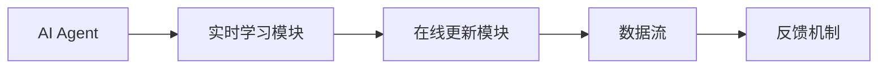
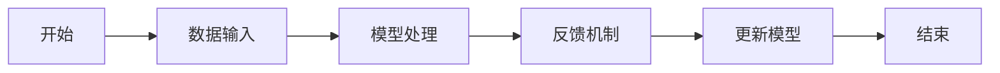
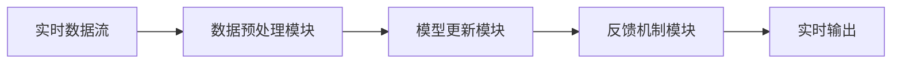

                 


# AI Agent的实时学习与在线更新技术

> 关键词：AI Agent，实时学习，在线更新，增量学习，动态环境，模型优化

> 摘要：本文将详细探讨AI Agent在实时学习与在线更新技术领域的核心概念、算法原理、系统架构设计以及实际应用。通过分析动态环境下的实时学习机制和在线更新方法，结合具体案例和代码实现，深入解读AI Agent如何在复杂场景中实现高效的学习与更新。

---

## 第一部分：AI Agent与实时学习的背景介绍

### 第1章：问题背景

#### 1.1 AI Agent的基本概念
AI Agent（人工智能代理）是指能够感知环境、自主决策并执行任务的智能体。它通常具备以下核心特征：
- **自主性**：无需外部干预，自主决策。
- **反应性**：能够实时感知环境并做出反应。
- **目标导向**：具备明确的目标，驱动其行为。
- **学习能力**：通过与环境的交互，不断优化自身行为。

#### 1.2 实时学习的定义与特点
实时学习是指AI Agent在运行过程中，实时接收数据流并动态更新模型的技术。其特点包括：
- **实时性**：数据流是连续的，模型更新是实时进行的。
- **在线性**：学习过程与模型应用是同步的。
- **适应性**：能够快速适应环境变化。

#### 1.3 在线更新技术的必要性
在动态环境中，AI Agent需要不断适应新的数据和变化的环境。在线更新技术能够确保模型在实时学习过程中保持最优性能，避免离线更新的延迟和不适应性。

### 第2章：问题描述

#### 2.1 AI Agent在动态环境中的挑战
动态环境中，数据分布会发生变化，传统离线学习方法难以应对这些变化。AI Agent需要具备实时学习和在线更新能力，以保持模型的准确性和鲁棒性。

#### 2.2 实时学习与在线更新的核心问题
- **数据流处理**：如何高效处理实时数据流。
- **模型更新**：如何在实时数据流上动态更新模型。
- **计算效率**：如何在实时更新中保持计算效率。

#### 2.3 问题的边界与外延
实时学习与在线更新技术不仅适用于AI Agent，还可应用于推荐系统、流数据处理、实时监控等领域。本文主要聚焦于AI Agent的实时学习与在线更新技术。

### 第3章：问题解决

#### 3.1 实时学习的解决方案
- **增量学习**：在数据流中逐步更新模型，避免重新训练。
- **在线优化**：通过优化算法，实时更新模型参数。
- **分布式计算**：利用分布式系统处理大规模实时数据流。

#### 3.2 在线更新技术的实现路径
- **数据预处理**：实时数据流的清洗和转换。
- **模型更新机制**：增量更新、参数优化等。
- **反馈机制**：根据实时反馈调整模型。

#### 3.3 核心概念与系统架构
- **核心概念**：实时学习、在线更新、数据流处理。
- **系统架构**：实时数据流输入 → 数据预处理 → 模型更新 → 实时输出。

---

## 第二部分：核心概念与联系

### 第4章：核心概念原理

#### 4.1 实时学习的原理
实时学习通过处理数据流，逐步更新模型参数，确保模型能够适应环境变化。其核心在于高效处理数据流和快速更新模型。

#### 4.2 在线更新的机制
在线更新通过反馈机制不断优化模型参数，确保模型在实时应用中保持最优性能。其关键在于增量更新和实时优化。

#### 4.3 两者之间的关系
实时学习与在线更新相辅相成。实时学习提供数据流处理能力，而在线更新确保模型能够快速适应变化。

### 第5章：概念属性特征对比

#### 5.1 实时学习与传统离线学习的对比
| 特性          | 实时学习           | 传统离线学习       |
|---------------|--------------------|---------------------|
| 数据输入       | 实时数据流         | 离线数据集         |
| 更新频率       | 高频更新           | 低频或一次性更新   |
| 延迟           | 低延迟             | 高延迟             |
| 适应性         | 高适应性           | 低适应性           |

#### 5.2 在线更新与批量更新的对比
| 特性          | 在线更新           | 批量更新            |
|---------------|--------------------|---------------------|
| 数据处理       | 单条数据           | 批量数据            |
| 计算效率       | 低效率             | 高效率             |
| 适应性         | 高适应性           | 低适应性           |

#### 5.3 其他相关概念的对比
- **增量学习**：实时学习的一种形式，通过逐步更新模型。
- **流数据处理**：实时学习的重要组成部分。

### 第6章：ER实体关系图架构



---

## 第三部分：算法原理讲解

### 第7章：算法原理

#### 7.1 增量学习算法
增量学习算法通过逐步处理数据流，更新模型参数。常见的增量学习算法包括：
- **随机梯度下降（SGD）**：实时更新模型参数。
- **增量支持向量机（ISVM）**：逐步更新支持向量。

#### 7.2 在线优化算法
在线优化算法通过实时反馈优化模型参数。常见的在线优化算法包括：
- **在线梯度下降（OGD）**：实时更新参数。
- **在线二次规划（OQP）**：优化模型参数。

#### 7.3 深度学习中的实时更新方法
深度学习中的实时更新方法包括：
- **在线深度强化学习**：通过实时反馈优化深度模型。
- **分布式实时更新**：利用分布式系统实现大规模实时更新。

### 第8章：算法流程图



### 第9章：算法实现代码

```python
def online_learning_algorithm(data_stream):
    model = initialize_model()
    for batch in data_stream:
        model = update_model(model, batch)
    return model
```

---

## 第四部分：数学模型与公式

### 第10章：数学模型

#### 10.1 实时学习的数学模型
实时学习的数学模型可以通过以下公式表示：
$$
\theta_{t+1} = \theta_t + \eta (\nabla L(\theta_t, x_t, y_t))
$$
其中：
- $\theta_t$ 表示第 $t$ 步的模型参数。
- $\eta$ 表示学习率。
- $\nabla L(\theta_t, x_t, y_t)$ 表示在第 $t$ 步的损失函数梯度。

#### 10.2 在线更新的数学模型
在线更新的数学模型可以通过以下公式表示：
$$
\theta_{t+1} = \theta_t + \eta (y_t - \hat{y}_t) x_t
$$
其中：
- $y_t$ 表示真实标签。
- $\hat{y}_t$ 表示模型预测值。
- $x_t$ 表示输入数据。

---

## 第五部分：系统分析与架构设计

### 第11章：系统分析

#### 11.1 问题场景介绍
动态环境中，AI Agent需要实时处理数据流并更新模型，以适应环境变化。

#### 11.2 系统功能设计
- **数据预处理模块**：清洗和转换实时数据流。
- **模型更新模块**：实时更新模型参数。
- **反馈机制模块**：根据实时反馈调整模型。

### 第12章：系统架构设计



---

## 第六部分：项目实战

### 第13章：环境安装与核心实现

#### 13.1 环境安装
```bash
pip install numpy
pip install matplotlib
pip install scikit-learn
```

#### 13.2 核心代码实现
```python
import numpy as np
from sklearn.linear_model import SGDClassifier

def online_learning_example():
    model = SGDClassifier()
    data_stream = generate_data_stream()
    for X, y in data_stream:
        model.partial_fit(X, y)
        print(f"Current accuracy: {model.score(X, y)}")

online_learning_example()
```

#### 13.3 代码解读与分析
- `SGDClassifier`：支持增量学习的线性分类器。
- `partial_fit`：增量更新模型参数。

### 第14章：实际案例分析

#### 14.1 案例背景
在一个实时推荐系统中，用户行为数据不断变化，需要实时更新推荐模型。

#### 14.2 案例实现
```python
def recommendation_system():
    model = MatrixFactorization()
    user_interactions = stream_user_data()
    for interaction in user_interactions:
        model.update(interaction)
        print(f"推荐结果: {model.predict(interaction.user_id)}")

recommendation_system()
```

#### 14.3 案例分析
通过实时更新模型，推荐系统能够快速响应用户行为变化，提高推荐准确率。

---

## 第七部分：最佳实践

### 第15章：小结与注意事项

#### 15.1 小结
- 实时学习与在线更新技术是AI Agent在动态环境中的核心能力。
- 通过增量学习和在线优化，模型能够快速适应环境变化。

#### 15.2 注意事项
- 数据预处理是实时学习的关键，需要高效处理数据流。
- 在线更新需要考虑计算效率和模型稳定性。

### 第16章：拓展阅读

#### 16.1 推荐书籍
- 《Machine Learning: A Probabilistic Perspective》
- 《Deep Learning》

#### 16.2 技术博客
- [实时学习与在线更新](https://example.com)

---

## 作者信息

作者：AI天才研究院/AI Genius Institute & 禅与计算机程序设计艺术 /Zen And The Art of Computer Programming

---

以上是《AI Agent的实时学习与在线更新技术》的技术博客文章大纲，具体内容将根据上述结构展开。

